# The Affective AI Financial Organism: Towards a Conscious Automated Institution
Presenter: Dimitar Popov, jimpopov@gmail.com

---

## Slide 2 – The Core Vision & Purpose
- **Headline**: Reimagining Organizations as Living, "Feeling," Adaptive Systems
- **Purpose**: To theorize and propose a viable end‑state for a fully automated financial institution, moving beyond current automation paradigms.
- **Inspiration**: Grounded in compelling neuroscientific models – specifically the Free‑Energy Principle (FEP) for self-organization and Mark Solms' theories on affective consciousness as the driver of action.
- **Goal**: To engineer functional *affect* (manifesting as **Criticality Scores**) within the AI system, enabling it to dynamically manage its internal homeostatic balance and its interactions with the external environment.
- **Aim**: To evolve organizations from rule-based automation towards integrated, adaptive, self‑regulating systems that exhibit characteristics of a rudimentary, functional "consciousness."

---

## Slide 3 – Presentation Roadmap: Our Journey Today
1. **Theoretical Foundations**: Unpacking the core concepts – The Organism as a Model, Solms' Affective Systems, the Free-Energy Principle (FEP), and our organizational translations: Criticality Score & Improvement Vector.
2. **Bridging Theory to Reality**: Connecting these ideas to how human organizations currently function and how corporations have evolved "post-biological" traits.
3. **Conceptualizing the AI Financial Organism**: Detailing the proposed AI architecture inspired by neuro-organizational models and illustrating its function with a concrete financial group use case.
4. **Conclusion & Implications**: Summarizing the vision and discussing the potential impact of this approach.

---

## Slide 4 – The Organism as a Blueprint: Core System Analogies
**Headline**: Learning from Life: Mapping Biological Systems to Organizational Functions

* **Key Idea**: Biological systems (Boundary, Interoception, Exteroception, Action, Central Regulation) provide robust analogues for designing adaptive AI organizations.

---

## Slide 5 – Affect: The Engine of Consciousness (Solms)
**Headline**: Solms' Affective Neuroscience: The Drivers of Action & Awareness

```mermaid
graph TD
    subgraph AFFECT_SYSTEMS["SOLMS' PRIMARY AFFECTS  →  ORGANIZATIONAL CRITICALITY DRIVERS"]
        direction LR
        SEEK["<strong>SEEKING / Enthusiasm</strong><br/>(Opportunity, Growth, Innovation)<br/><em>e.g., Untapped Market Segment</em>"]
        FEAR["<strong>FEAR / Anxiety</strong><br/>(Threat Detection, Risk Mitigation)<br/><em>e.g., Impending Market Crash, Cyber Threat</em>"]
        RAGE["<strong>RAGE / Frustration</strong><br/>(Response to Obstruction, Resource Defense)<br/><em>e.g., Persistent System Failures, Competitive Block</em>"]
        CARE["<strong>CARE / Nurturance</strong><br/>(Stakeholder Bonding, Loyalty)<br/><em>e.g., Declining Key Client Satisfaction</em>"]
        PLAY["<strong>PLAY / Joy</strong><br/>(Experimentation, Social Learning, R&D)<br/><em>e.g., Sandbox Testing of Novel Algorithms</em>"]
        PANIC["<strong>PANIC / GRIEF</strong><br/>(Response to Significant Loss, Separation)<br/><em>e.g., Major Client Defection, System Collapse</em>"]
    end

    Core_Concept["<strong>Affective States (Solms)</strong><br/>- Fundamental to consciousness<br/>- Signal homeostatic condition & environmental relevance<br/>- Compel action"]
    Organizational_Link["<strong>Organizational Translation</strong><br/>- Functional equivalents in AI<br/>- Prioritized error signals (Criticality Scores)<br/>- Motivational states driving specific responses"]

    AFFECT_SYSTEMS -.-> Organizational_Link
    Core_Concept --> Organizational_Link
    Organizational_Link -.-> Central_Processing["<strong>Sentient Core</strong><br/>(Generates & Processes various<br/>types of Criticality Scores based<br/>on these affective archetypes)"]

    classDef affectNode fill:#ececff,stroke:#666,stroke-width:2px,color:#333,font-weight:bold;
    class SEEK,FEAR,RAGE,CARE,PLAY,PANIC affectNode;
```

* **Core Insight**: Affects are not just "emotions" but fundamental mechanisms signaling what *matters* to the organism, driving behavior essential for survival and thriving.

---

## Slide 6 – Free-Energy Principle (FEP): The Intuitive Idea
**Headline**: Making Sense of the World: The Core Drive of Adaptive Systems
* **What is it (Simply Put)?**
    * Imagine any system that aims to persist and succeed in a changing world – whether it's a living creature, a person, or a complex business. The FEP suggests that these systems fundamentally try to *avoid surprises* and *make sense of their environment*.
    * They are constantly working to build and refine an accurate "internal map" or model of their world, and to keep their actual experiences consistent with that map.
* **How Does it Work (The Cycle of Sense-Making)?**
    1.  **Predict**: Based on its current "internal map" (its understanding of how things work), the system makes predictions about what it expects to happen or sense next. (e.g., "Our financial models predict Q3 market volatility will remain low.")
    2.  **Sense**: It then observes what *actually* happens in its internal and external environment. (e.g., "Market sensors detect a sudden spike in volatility.")
    3.  **Adapt (To Minimize "Surprise" or Prediction Error)**: If there's a significant mismatch between prediction and reality (a "surprise"), the system is driven to reduce this discrepancy. It has two primary ways to do this:
        * **Update its Map (Perception/Learning)**: It revises its internal model to better reflect reality. (e.g., "Our understanding of current market drivers was incomplete; we must update our volatility models.")
        * **Change the World (Action)**: It takes actions to make the environment align more closely with its (perhaps revised) predictions or goals. (e.g., "Let's adjust our trading positions to reduce exposure to this unexpected volatility.")
* **Why is this Crucial for our AI Financial Organism?**
    * The FEP provides a fundamental, scientifically-grounded principle for building a truly *adaptive*, *learning*, and *self-regulating* AI system.
    * It explains how our AI organism can continuously learn from new data, adjust its strategies in response to unforeseen events, and proactively work to achieve its core objectives (like profitability, stability, and compliance). It does this by constantly trying to minimize "prediction errors" – which, as we'll see, are directly linked to what we term **Criticality Scores**.
    * This isn’t just about an AI following pre-programmed rules; it's about an AI that actively strives to *understand*, *engage with*, and *effectively navigate* its complex and ever-changing financial world. This principle is the engine that drives its intelligent behavior.
    *(For a more technical depiction of the FEP's Active Inference cycle, please see Appendix A.)*

---

## Slide 7 – Quantifying Drive: The Criticality Score
- **Headline**: Measuring What Matters: Translating Affect into Actionable Signals
- **Neuroscientific Basis (Affect)**: $A = \eta \cdot \lVert \hat{s} - \mu \rVert$
    - $\hat{s}$: Sensed current state (e.g., actual liquidity, current market risk exposure).
    - $\mu$: Predicted/desired state (e.g., target liquidity, acceptable risk limit).
    - $\eta$: Urgency/Gain factor (how much this deviation *matters* now).
- **Organizational Term**: **Criticality Score**
    - **Formula**: `Criticality Score = Urgency (η) × ||Sensed State (ŝ) − Predicted State (μ)||`
    - **Represents**: This score is more than just an error metric; it's a measure of *significant imbalance*. It quantifies the weighted magnitude of deviation from a strategic or homeostatic setpoint. The higher the score, the more "critical" the imbalance.
    - **Generated by**: The foundational processing layers of the **Sentient Core** (our "organizational brainstem"), which continuously monitor interoceptive and exteroceptive inputs via the Data & Digital Twin Layer.
    - **Function**: A high Criticality Score acts as an undeniable, attention-grabbing signal. It compels the AI organism to prioritize this imbalance, allocate necessary resources (cognitive, operational), and initiate corrective actions to restore equilibrium or achieve a revised target.

---

## Slide 8 – Measuring Progress: The Improvement Vector
- **Headline**: Are We Getting Better? Tracking Adaptive Success and Learning
- **Neuroscientific Basis (Valence)**: $V = -dA/dt$ (the rate of change of affect).
- **Organizational Term**: **Improvement Vector**
    - **Formula**: `Improvement Vector = −d(Criticality Score)/dt`
    - **Indicates**: This vector measures the rate *and direction* of change in a specific Criticality Score over time. It tells us not just *if* things are changing, but *how quickly* and *in what direction* (towards or away from the desired state).
    - **Positive Vector**: A positive Improvement Vector means the associated Criticality Score is decreasing. This is a "good" signal – the organization's adaptive actions are effective, the imbalance is being successfully mitigated, and the system is moving towards its target state or resolving the critical issue.
    - **Negative/Zero Vector**: A negative or zero Improvement Vector is a "bad" signal. It indicates that interventions are ineffective, the Criticality Score is worsening, or the situation is stagnant despite efforts. This signals an urgent need for a strategic reassessment by the Sentient Core and may require escalation to the Governance Layer for higher-order review and potential change in policy or resource allocation.
    - **Function**: The Improvement Vector acts as a crucial *reinforcement learning signal* for the Sentient Core. Positive vectors reinforce successful policies, while negative vectors trigger model updates, policy revisions, and further adaptive learning, enabling the AI Organism to improve its problem-solving capabilities over time.

---

## Slide 9 – Emergence of Intentionality: Acting with Purpose
- **Headline**: Beyond Reflex: How the AI Organism Develops "Aboutness" and Goal-Direction
- **"Aboutness" of Internal Models**: The AI's sophisticated internal predictive models, housed within the Sentient Core and specialized AI Services, are inherently *about* specific, causally relevant aspects of its internal and external world. For example, a fraud detection model is "about" identifying patterns indicative of fraudulent transactions; market prediction models are "about" forecasting asset price movements; liquidity models are "about" the flow of funds and the organization's ability to meet obligations. These models represent the AI's understanding of how its world works.
- **Goal-Directed Inference from Criticality Scores**: When a high Criticality Score arises (indicating a significant, urgent prediction error or deviation from a desired state), it doesn't just trigger a pre-programmed reflex. Instead, it initiates a process of *goal-directed inference* within the Sentient Core.
- **The Objective Becomes Clear**: The immediate, salient goal for the system becomes the minimization of that specific, high-priority Criticality Score. The AI Organism then selects and executes policies (sequences of actions) that, according to its internal models, are most likely to bring the currently sensed state ($\hat{s}$) closer to the desired or predicted state ($\mu$), thereby reducing the Criticality Score.
- **Constrained and Guided Action**: Crucially, these goal-directed actions are not unconstrained. They are guided by the AI's learned models of the world and are continuously shaped and limited by the ethical principles, strategic objectives, and risk appetite defined by the Governance Layer (the "Organizational PFC").
- **Functional Intentionality within FEP**: This capacity to direct its internal models and subsequent actions towards understanding, predicting, and influencing its environment, all in the service of reducing surprise (Criticality Scores) and maintaining its own viability and homeostatic balance, constitutes a functional analogue of intentionality. The AI "intends" to achieve stability, profitability, and compliance by actively and adaptively engaging with its operational context.

---

## Slide 10 – We’re Already Building Organisms: The Human Precursor
- **Headline**: The Evolutionary Path: From Human Collectives to AI Organisms
- **Human Ingenuity**: Conscious humans have long been creating emergent “technologies” in the form of organizations.
- **Corporations as Living Systems**: Modern corporations, particularly large and enduring ones, function as hierarchical, adaptive systems. From an emergent perspective, they exhibit many characteristics analogous to living organisms. They have boundaries, internal processes, ways of sensing their environment, and mechanisms for action. They are demonstrably greater than the sum of their individual human parts.
- **Individuals as "Cells"**: Within these corporate structures, individuals, much like cells in a biological organism, cede certain degrees of their personal autonomy. They specialize in functions and contribute their efforts to operate within and sustain a larger, coordinated whole, pursuing collective goals that would be unattainable by individuals alone.
- **The Evolutionary Precursor**: This existing "corporate organism"—with its established (though often human-mediated and imperfect) processes for sensing the market, monitoring internal health, making decisions, and executing strategies—serves as the evolutionary precursor and foundational model. The AI Financial Organism we envision aims to formalize, enhance, and ultimately automate these organism-like properties with greater precision, speed, and adaptability.

---

## Slide 11 – LLMs, Intent & The Path to AI Agency: Current AI as a Stepping Stone
- **Headline**: Leveraging Advanced AI: Building Blocks for an Affective System
- **Shared Limitations, Shared Solutions**: LLMs, like individual humans, face inherent cognitive limitations such as finite attention spans and context windows. Humans have historically overcome their individual constraints by developing powerful conceptual tools (like abstraction, modularity, and decoupling) and collaborative structures (teams, departments, and entire organizations). Similarly, LLMs, when not used in isolation but integrated into well-designed architectures and organizational processes, can have their capabilities amplified and their limitations mitigated.
- **LLMs as "Cognitive Engines" without Primary Drive**: Current LLMs excel at complex pattern recognition, reasoning, planning, and generating human-like text and code. In this sense, they function somewhat analogously to a sophisticated "frontal cortex" – a powerful cognitive engine. However, on their own, they generally lack inherent, self-generated *intent* or the primary *affective drives* that motivate biological organisms. They process information and execute tasks based on external prompts and pre-defined objectives.
- **The Rise of "Agents" – Seeding the Affective Core**: A significant step towards more autonomous AI is the development of "AI agents." These are systems designed to act with delegated or proxied human intent to achieve specific, often complex, goals. When these agents are tasked with monitoring particular states (e.g., market risk, system performance) and pursuing objectives based on that monitoring, they begin to resemble functional building blocks of an "affective core" or the alerting and motivational systems found in the brain (like the Reticular Activating System or Solms' broader concept of the brainstem/limbic core).
- **The Indispensable Human Element in Defining "Why"**: In this evolutionary trajectory towards more autonomous AI systems, the role of humans shifts but remains paramount, especially in the early and transitional phases. Humans act as higher‑order agents, providing the crucial functions of overriding evaluation, defining the ultimate strategic intent (the organization's fundamental "why"), and establishing the ethical framework and value systems within which the AI operates.

---

## Slide 12 – Corporations: "Post‑Biological" Evolution & Enduring Traits
- **Headline**: Learning from Corporate Longevity: Traits Beyond Direct Biological Analogy
- **Codified Knowledge & Distributed Cognition**: Unlike individual organisms where much knowledge perishes with the individual (barring cultural transmission), corporations excel at codifying, storing, and leveraging knowledge (intellectual property, databases, standard operating procedures, embedded cultural norms) across generations of employees and technological platforms. The AI Organism would take this to an extreme, with its Data Layer and models forming a continuously learning and compounding knowledge base.
- **Strategic Long‑Range Planning**: Corporations can engage in strategic planning and resource allocation over decades, driven by visions that transcend typical individual planning horizons. The AI Organism's Sentient Core and Governance Layer would be engineered for such foresight.
- **Scalable & Modular Structures**: Successful corporations utilize modular structures (divisions, business units, agile teams) that can be dynamically reconfigured. The AI architecture's inherent modularity would allow its Sentient Core to adapt its form and function with unprecedented fluidity.
- **Abstract Assets (Brand, Reputation, Trust)**: These are cultivated as immensely valuable, enduring assets. The AI Organism's Governance Layer would be paramount in building and protecting its "brand" of reliability and ethical conduct.
- **Mechanisms for Radical Reinvention**: Companies like Apple and Microsoft demonstrate profound self-reinvention. The AI Organism's Sentient Core, MLOps Platform, and Digital Twin must enable similar radical model and strategy overhauls when faced with existential threats or paradigm shifts, guided by its Governance Layer.
- **Sophisticated Financial Engineering**: Corporations use complex financial instruments and capital structures. An AI financial institution would inherently leverage advanced AI for optimal capital allocation and financial innovation.
- **Legal Personhood & Quest for Perpetuity**: The corporate legal form grants potential indefinite existence. The AI Organism, by design, would aim for operational perpetuity, its Governance Layer encoding principles for long-term sustenance.
By incorporating these evolved corporate adaptations, the AI Financial Organism can be envisioned as an entity that learns not only from immediate environmental feedback but also from the accumulated strategic wisdom and structural innovations of the corporate form itself, allowing it to operate on timescales and at levels of complexity that transcend purely biological models.

---

## Slide 13 – AI Financial Organism – Architecture Overview
**Headline**: Blueprint of the AI Financial Organism: Key Functional Layers
*(Visual: Reuse or adapt the diagram from Slide 4, focusing on the internal components of the AI Financial Organism. Alternatively, a new, simplified block diagram showing the main layers: Governance, Sentient Core, Data & Digital Twin, AI Services, Integration, and Infrastructure could be used here as an introduction before detailing each.)*
- **Core Idea**: A layered architecture inspired by neuro-organizational models, designed to process information, generate Criticality Scores, and execute adaptive actions.
- **Key Layers (to be detailed next)**:
    - "Organizational Brainstem & Limbic System" (Affective Core & Basic Drives)
    - "Organizational Neocortex" (Higher Cognition, Prediction & Representation)
    - "Organizational PFC" (Executive Control & Governance)
    - Sensory & Motor Pathways (Interface with the World)
    - Supporting Systems (Foundational Infrastructure)

---

## Slide 14 – AI Architecture: "Organizational Brainstem & Limbic System"
- **Headline**: The Affective Core: Generating Drive & Prioritizing Needs – The Seat of Criticality Scores
- **AI Correlates**: It comprises the foundational processing capabilities within the **Sentient Core** (Central AI Brain) and the interoceptive functions of the **Data & Digital Twin Layer**.
- **Function**:
    1.  **Continuous Monitoring**: The Data & Digital Twin Layer constantly monitors the AI Financial Organism's internal state ($\hat{s}$) – this includes a vast array of Key Performance Indicators (KPIs) such as liquidity levels, capital adequacy ratios, system health metrics, transaction error rates, and compliance adherence dashboards.
    2.  **Comparison to Setpoints**: The Sentient Core (its "brainstem" component) compares these real-time sensed states ($\hat{s}$) against desired homeostatic or strategic setpoints ($\mu$). These setpoints are derived from the organization's strategic goals, risk appetite, and regulatory obligations, often defined by or passed down from the Governance Layer.
    3.  **Generation of Criticality Scores**: When a significant deviation ($\lVert \hat{s} - \mu \rVert$) is detected, this "brainstem" component calculates a **Criticality Score**, weighted by an urgency factor ($\eta$) that reflects the importance of that particular deviation.
    4.  **Signaling "Needs"**: These Criticality Scores are the functional equivalents of primary affective signals. For example, a sharp drop in available capital below a critical threshold would generate a high FEAR-type Criticality Score; identification of a lucrative but untapped market segment might generate a high SEEKING-type Criticality Score.
    5.  **Driving Motivation**: These scores provide the fundamental *motivation* for the AI Organism to act. They highlight pressing prediction errors that threaten stability or obstruct goals, compelling the system to allocate resources and initiate actions to minimize these critical imbalances and maintain overall organizational viability.

---

## Slide 15 – AI Architecture: "Organizational Neocortex"
- **Headline**: Higher Cognition: Prediction, Understanding, Strategy, & Contextualizing Criticality
- **AI Correlates**: It encompasses the higher-level strategic & predictive functions of the **Sentient Core**, the advanced analytical and modeling capabilities within the **AI Services & Cognitive Automation Layer**, and the world-modeling functions of the **Data & Digital Twin Layer** (especially the Digital Twin Platform).
- **Function**:
    1.  **Building Sophisticated World Models**: This layer continuously builds and refines complex predictive models about the external environment (e.g., market dynamics, competitor actions, macroeconomic trends, regulatory shifts) and the organization's internal operations (e.g., customer behavior, operational loads, risk propagation).
    2.  **Generating Detailed Predictions ($\mu$)**: Based on these models, it generates detailed and context-aware predictions that serve as the setpoints ($\mu$) against which current states ($\hat{s}$) are compared by the "organizational brainstem."
    3.  **Simulation & Scenario Analysis**: The Digital Twin Platform allows for "offline" simulation of various scenarios (e.g., "what if interest rates rise by 2%?") and the testing of potential policy responses without impacting live operations. This is akin to mental simulation or planning.
    4.  **Contextualizing Criticality Scores**: When the "organizational brainstem" generates a raw Criticality Score, this "neocortical" layer provides rich contextual understanding. It helps to interpret *why* a high score has arisen, considering multiple interacting factors and potential future consequences.
    5.  **Formulating Nuanced Strategies**: Based on this deeper understanding, it formulates more sophisticated, multi-step, and long-term strategies for addressing Criticality Scores. This moves beyond immediate, reflexive reactions to considered and optimized responses, weighing various courses of action and their predicted outcomes. For example, a FEAR-type Criticality Score from a market downturn might lead not just to immediate selling, but to a complex portfolio rebalancing strategy based on predictive models of sector-specific recovery times and correlations.

---

## Slide 16 – AI Architecture: "Organizational PFC" – Governance & Ethics
- **Headline**: Executive Control: Ensuring Purposeful, Principled, and Aligned Action
- **AI Correlate**: The **Governance, Ethics & Trust Layer**. This layer is not just a set of static rules but an active, dynamic system involving both AI-driven monitoring and, critically, human oversight and intervention where necessary.
- **Function**:
    1.  **Defining Purpose and Values**: It sets and continuously refines the overarching strategic goals, ethical guidelines, risk appetite, and compliance mandates for the entire AI Financial Organism. This is where the ultimate human-defined "intent" and value system for the organization are encoded and enforced.
    2.  **Top-Down Regulation of Criticality Responses**: It actively *regulates* and *modulates* the expression of, and responses to, Criticality Scores generated by the lower organizational systems (the "brainstem" and "neocortex"). For instance, a strong SEEKING-type Criticality Score (e.g., a high-profit opportunity) might be constrained or overridden by this layer if the proposed action violates ethical principles (e.g., predatory lending) or exceeds the defined risk appetite. Similarly, a FEAR-type Criticality Score (e.g., short-term market risk) might be strategically tolerated or even accepted if the "PFC" determines that the long-term strategic benefit of a particular course of action outweighs the immediate risk, representing a calculated decision.
    3.  **Ensuring Strategic Alignment**: It ensures that all actions undertaken by the AI Organism, even those driven by the urgent need to minimize free energy and respond to immediate Criticality Scores, are aligned with its long-term identity, stated purpose, and the expectations of its key stakeholders (including regulators, customers, and society).
    4.  **Providing "Conscience" and Foresight**: This layer acts as the "conscience" of the AI Organism, embedding ethical considerations into its decision-making fabric. It also provides foresight, evaluating the longer-term consequences of actions and guiding the organism towards sustainable and responsible behavior. Human oversight within this layer is critical for handling novel ethical dilemmas and for ensuring the AI's goals remain aligned with human values.

---

## Slide 17 – Use Case: The "Affective AI Financial Group" (AAIFG)
- **Headline**: Bringing the Model to Life: A Diversified, AI-Driven Financial Entity
- **AAIFG Structure**: A hypothetical, fully AI-driven financial group comprising four core units:
    1.  **Retail & Commercial Banking Group (Banking Group)**: Manages all traditional banking services for individuals and businesses, including deposits, various forms of lending (mortgages, commercial and personal loans), payment processing, and AI-enhanced customer relationship management.
    2.  **Global Markets & Trading Group (Trades Group)**: Engages in proprietary trading across diverse asset classes (equities, fixed income, currencies, commodities), market-making activities, and provides sophisticated execution services to institutional clients. It interfaces directly and in real-time with global financial markets and exchanges.
    3.  **Asset Management Group (Assets Group)**: Responsible for managing investment portfolios for a range of clients, from large institutions (pension funds, endowments) to individual private wealth. This includes investment strategy development, in-depth research, portfolio construction, and ongoing performance monitoring.
    4.  **Group Capital & Treasury Management (Capital Group)**: The central nervous system for the AAIFG's financial health. This unit is responsible for overall liquidity management, ensuring capital adequacy across the group, managing the consolidated balance sheet, optimizing funding strategies, allocating capital between the business units, and conducting strategic financial planning and stress testing.
- **AI Architecture Mapping within AAIFG**:
    -   The **Sentient Core** functions as the AAIFG's Central AI Brain, orchestrating group-wide strategy, risk management, and inter-unit capital allocation.
    -   The **Data & Digital Twin Layer** serves as the AAIFG's unified Information Hub, providing real-time interoceptive (internal performance) and exteroceptive (market/external) data to all units and the Sentient Core.
    -   The **AI Services Layer** comprises specialized AI functions and cognitive automation tools tailored for the unique operational needs and risk profiles of each of the four business units (e.g., credit scoring AI for Banking, algorithmic trading for Trades).
    -   The **Governance, Ethics & Trust Layer** acts as the AAIFG's "Organizational PFC," establishing and enforcing group-wide policies, ethical boundaries, and ensuring regulatory compliance across all operations.
- **Visual**: A clean, high-level organizational chart of the AAIFG showing the four units, with arrows indicating the flow of information and control to/from the central AI architectural components (Sentient Core, Governance Layer).

---

## Slide 18 – Use Case: Navigating New Environments – Country X Entry
- **Headline**: Adaptation in Action: Entering a New Regulatory and Market "Terrain"
- **Initial Intent (Prediction $\mu_{strategic}$)**: The AAIFG's **Sentient Core**, perhaps driven by a SEEKING-type Criticality Score indicating growth opportunities, formulates the strategic intent to establish a profitable Banking Group unit in "Country X." The initial internal model for this expansion might be relatively generic, based on past experiences or general banking principles.
- **Environmental Interaction & "Surprise" (Generation of Criticality Score)**: As the AAIFG (via its **Integration Layer** and human-led strategic planning functions within the **Governance Layer**) initiates the entry process (e.g., applying for a banking license, conducting detailed market due diligence), it encounters the specific "terrain" of Country X. This new environment provides a flood of new sensory input (via the **Data & Digital Twin Layer**) that inevitably generates "surprise" – a mismatch with the initial, simpler model. These surprises manifest as specific local regulations, complex compliance requirements (e.g., unique KYC/AML protocols for Country X), distinct capital adequacy rules dictated by Country X's central bank, data sovereignty laws, specific financial reporting standards, and unique local customer expectations and competitive dynamics. The initial generic model is clearly insufficient, resulting in a high **Criticality Score** associated with the complexity and uncertainty of the expansion initiative. This score quantifies the "cost" or "difficulty" of adaptation.
- **Model Update (Perception to Minimize Surprise)**: To reduce this strategic-level Criticality Score, the AAIFG *must* update its internal generative model.
    -   The **Data & Digital Twin Layer** ingests and processes Country X's specific legal, regulatory, economic, and market data.
    -   The **Sentient Core** (its "neocortical" component) revises its understanding. The intent is no longer just "bank in Country X" but becomes "bank in Country X *while adhering to regulatory framework Alpha, implementing operational process Beta, meeting capital requirement Gamma, and satisfying local customer expectation Delta*." These specific environmental constraints become new, granular homeostatic setpoints ($\mu_{compliance_X}$, $\mu_{operational_X}$, $\mu_{capital_X}$) that the future Banking Group unit in Country X must continuously maintain.
- **Adaptive Action (Active Inference to Minimize Surprise)**:
    -   The **Sentient Core** formulates new, context-specific policies ($\pi^*$) to achieve the refined intent and meet these new setpoints.
    -   The **AI Services Layer** is directed to deploy or adapt specific modules for Country X: This could involve activating localized KYC/AML algorithms, configuring regulatory reporting systems to Country X's standards, tuning credit scoring models using local economic data, and adapting customer service interfaces for local language and cultural nuances.
    -   The **Capital Group AI** models and ensures the new banking unit will adhere to Country X's specific capital reserve requirements.
    -   The **Governance Layer** (the "Organizational PFC") plays a critical oversight role. It assesses the risks associated with operating under Country X's specific conditions, evaluates the cost-benefit of the required adaptations (informed by the ongoing Criticality Score and predicted Improvement Vector for the initiative), and ensures that the modified operational plan aligns with AAIFG's overall ethical standards and strategic risk appetite. It might recommend proceeding with the expansion, modifying the scope of operations, or even abandoning entry if the Criticality Score associated with adaptation remains unacceptably high (i.e., the predicted Improvement Vector is poor or negative) despite best efforts.
- **Goal**: Successfully establish and operate the Country X unit by minimizing the "adaptation" Criticality Score and achieving a sustained positive **Improvement Vector** for all key performance and compliance metrics related to the new venture. This demonstrates successful navigation of the new "terrain."

---

## Slide 19 – Use Case Examples: Criticality Scores in Action
**Headline**: AAIFG Daily Operations: Responding to Internal & External Pressures with Prioritized Action

```mermaid
sequenceDiagram
    participant ExtMarket as External Market
    participant DataLayer as Data & Digital Twin
    participant SentientCore as Sentient Core
    participant TradesAI as Trades Group AI
    participant CapitalAI as Capital Group AI
    participant GovLayer as Governance Layer

    Note over ExtMarket, DataLayer: Scenario: Sudden Market Volatility
    ExtMarket->>DataLayer: Unpredicted VIX Spike & Equity Drop (ŝ - exteroceptive)
    DataLayer->>SentientCore: High Market Risk Data (ŝ)
    SentientCore->>SentientCore: Generates FEAR-type Criticality Score (High η due to potential P&L impact)
    SentientCore->>TradesAI: Directive: Execute Stop-Losses, Shift Portfolio to Risk-Off Stance
    TradesAI->>DataLayer: Actions Logged, Portfolio Adjusted, Risk Exposure (new ŝ) Updated
    SentientCore->>CapitalAI: Assess Group-wide Liquidity & Capital Impact from Market Movement
    CapitalAI->>SentientCore: Liquidity & Capital Impact Report (new ŝ for these metrics)
    SentientCore->>GovLayer: Report: Market Event, Actions Taken, Current Risk Posture
    GovLayer-->>SentientCore: Acknowledge / Provide Strategic Guidance if event triggers predefined thresholds
    SentientCore->>DataLayer: Continuously Monitor Market Risk Criticality Score & Aim for Positive Improvement Vector
```

- **Example 1 (Banking Group - Rising Loan Defaults)**:
    - *Sensed State ($\hat{s}$)*: The Data Layer reports an SME loan default rate in a specific portfolio has risen to 5%, significantly above the predicted/target rate ($\mu$) of 2%.
    - *Criticality Score*: This triggers a high FEAR/PANIC-type Criticality Score within the Sentient Core, with urgency ($\eta$) determined by the portfolio's size and potential impact on capital.
    - *Action (Active Inference)*: The Sentient Core directs Banking Group AI Services to immediately tighten automated underwriting criteria for new SME loans in that segment, increase loan loss provisions, and potentially flag similar existing loans for review. The Sentient Core might also temporarily restrict the Banking Group's overall SME lending capacity for that risk segment. Capital Group AI recalculates group capital adequacy based on increased expected losses.
    - *Goal*: Rapidly reduce the default-related Criticality Score and achieve a positive Improvement Vector by stabilizing default rates and mitigating further losses.
- **Example 2 (Group Capital & Treasury - Impending Funding Shortfall & Urgent Regulatory Reporting)**:
    - *Sensed States ($\hat{s}$)*: (1) Capital Group AI's predictive liquidity models (via Data Layer) forecast a potential dip in the Liquidity Coverage Ratio (LCR) below the desired internal buffer ($\mu_{LCR_buffer}$) within 30 days due to projected large deposit outflows and increased margin calls. (2) Simultaneously, an external alert via the Integration Layer signals an upcoming deadline for a complex new regulatory capital report (e.g., FRTB), and internal models predict current data aggregation processes are insufficient.
    - *Criticality Scores*: (1) A high FEAR/ANXIETY-type Criticality Score regarding the impending liquidity shortfall (high $\eta_{liquidity}$). (2) A separate, high RAGE/FRUSTRATION-type (or problem-solving SEEKING-type) Criticality Score regarding the predicted difficulty in meeting the new regulatory reporting deadline (high $\eta_{reporting}$).
    - *Action (Active Inference)*:
        - *Liquidity Response*: Capital Group AI executes pre-defined contingency funding plans (drawing credit lines, optimizing intra-group funding). The Sentient Core may direct the Banking Group to launch short-term deposit-gathering campaigns or the Trades Group to reduce positions requiring high margin.
        - *Reporting Response*: Capital Group AI and Data Layer initiate AI-driven data lineage tracing and aggregation. MLOps may fast-track deployment of new reporting models. The Sentient Core allocates additional compute resources.
    - *Goal*: Proactively reduce both Criticality Scores – averting the liquidity shortfall (maintaining LCR above target) and ensuring timely, accurate regulatory submission – aiming for a positive Improvement Vector on both fronts.
- **Key Insight**: Criticality Scores, as quantified and prioritized functional "affective" signals, are the primary mechanism that drives specific, goal-directed, and adaptive actions across the AAIFG. They ensure the organization focuses its resources on what matters most for maintaining stability, achieving objectives, and ensuring compliance, all while striving for a positive Improvement Vector.

---

## Slide 20 – Key Takeaways – The Vision Realised
- **Headline**: The Affective AI Financial Organism: A Conscious, Adaptive, and Purposeful System
- **Beyond Algorithms**: The AI Financial Organism is conceptualized as a complex adaptive system, not merely a collection of disconnected AI tools.
- **Inherently FEP-Driven**: Its core operational drive is rooted in the Free Energy Principle – a continuous imperative to minimize prediction error across all its operational domains. This translates into an ongoing effort to reduce various **Criticality Scores** through cycles of perception (learning and model updating) and action (active inference).
- **Guided by Functional "Affect"**: The organization navigates its complex internal and external environments using functional equivalents of affect. These are the **Criticality Scores** that signal what matters most at any given moment, prioritizing attention and resources. Its success and learning are measured by its ability to achieve a positive **Improvement Vector**, indicating effective adaptation and problem resolution.
- **Emergent Organizational "Consciousness"**: This framework, which blends deep neuroscientific insights from thinkers like Solms and Friston with the evolved realities and strategic imperatives of corporate structures, allows for the emergence of key characteristics: robust organizational *intentionality* (acting purposefully towards goals) and a nascent, *regulated* form of functional "consciousness" (an awareness of its critical states and the capacity for strategic, self-directed action).

---

## Slide 21 – Implications & Future Directions
- **Headline**: Why This Matters: Building More Intelligent, Resilient, and Responsible Automated Systems
- **A Path to Advanced, Robust Automation**: This model offers a pathway to creating automated organizations that are not only highly efficient but also truly resilient and deeply adaptive to dynamic and unpredictable environments. This moves beyond brittle, rule-based systems to those capable of genuine learning and strategic pivoting.
- **Engineering Principles for "Conscious" AI Systems**: It provides a novel conceptual toolkit for explicitly engineering key attributes into large-scale AI systems:
    - **Robust Self-Regulation and Homeostasis**: Designing systems that can autonomously monitor and maintain their critical operational and financial parameters within desired bounds.
    - **Prioritized Response to Critical Imbalances**: Ensuring that the system automatically focuses its resources on the most significant threats or opportunities, as identified by Criticality Scores.
    - **Sophisticated Cognitive Modeling and Predictive Capabilities**: Building AI that can develop deep, causal models of its environment and predict future states with greater accuracy.
    - **Effective Executive Oversight and Ethical Alignment**: Formalizing the "Organizational PFC" (the Governance Layer) to ensure that increasing autonomy is always coupled with strong ethical guardrails and alignment with human-defined strategic intent.
- **Future Research & Development Areas**:
    - **Evolving the "Organizational PFC"**: Developing more advanced AI and human-AI collaborative mechanisms within the Governance Layer to handle increasingly complex ethical dilemmas and strategic foresight.
    - **Modeling Inter-Organism Dynamics**: Exploring how multiple AI "organisms" (e.g., an AI financial institution interacting with an AI regulator or other AI-driven corporations) might coexist, compete, and collaborate within a larger economic ecosystem.
    - **The Ethical Nuances of Autonomy**: Continuously investigating the ethical implications and societal impact of deploying increasingly autonomous, "affectively" driven AI entities with significant decision-making power.

---

## Slide 22 – Thank You & Q&A
- **Contact**: **your.email@example.com** / **Your Website/LinkedIn**
- *(Optional: A final compelling image or quote related to AI, consciousness, the future of organizations, or a key concept like FEP or Affective Neuroscience.)*

---

## Appendix A: Free-Energy Principle (FEP) – The Active Inference Cycle
**Headline**: Deeper Dive: The Mechanics of Active Inference (K. Friston)
The Free-Energy Principle (FEP) proposes that self-organizing systems maintain their states in a limited range (i.e., resist a natural tendency to disorder) by minimizing variational free energy. This free energy is an information-theoretic quantity that bounds "surprise" – the improbability of sensory states given the system's model of the world. Minimizing free energy is equivalent to minimizing prediction error. This is achieved through **Active Inference**, a continuous cycle involving:
1.  **Generative Model ($\mu$)**: The system possesses an internal probabilistic model of how its sensory inputs ($\hat{s}$ or $o$) are caused by states in the world. This model generates predictions about expected sensations.
2.  **Observations/Sensory States ($\hat{s}$ or $o$)**: The system receives sensory input from its internal (interoceptive) and external (exteroceptive) environment.
3.  **Prediction Error ($\epsilon = \hat{s} - \mu$)**: The system computes the difference between its observations and its predictions. This "prediction error" or "surprise" is what the system strives to minimize.
4.  **Criticality Score ($A = \eta \cdot ||\epsilon||$)**: In our framework, this prediction error, weighted by its urgency/importance ($\eta$), is quantified as the Criticality Score.
5.  **Policy Selection ($\pi^*$)**: The system selects actions (a policy $\pi^*$) that it *expects* will minimize future free energy (i.e., future expected Criticality Scores). This involves evaluating different possible action sequences.
6.  **Action**: The system acts on the world (or on itself) to change sensory inputs, aiming to make them conform to its predictions or to sample sensory states that resolve uncertainty.
7.  **Perception (Model Update)**: Simultaneously, the system can update its internal generative model (perception or learning) to better predict sensory inputs, thereby also reducing prediction error.
This dual process of acting to change sensations and perceiving to update predictions is how the system actively maintains an equilibrium with its environment.

## Appendix B: Future State Organisation

## Appendix C: Solms Organism

```mermaid
graph TD
    subgraph Environment ["External & Internal Environment"]
        direction LR
        ExtWorld["External World (Threats, Opportunities, Social)"]
        IntBody["Internal Body State (Homeostasis)"]
    end

    subgraph Brain ["Brain Processing"]
        direction TB
        SensoryInput["Sensory Input (Exteroceptive & Interoceptive)"]

        subgraph AffectiveCore ["Brainstem & Limbic System (Affective Core)"]
            direction TB
            PAG["Periaqueductal Gray (PAG)"]
            Hypothalamus["Hypothalamus"]
            Amygdala["Amygdala"]
            ReticularFormation["Reticular Activating System / Formation"]
            AffectGen["Generates Primary Affects / Basic 'Needs' (Precursors to Criticality Score)"]
        end

        subgraph Cortex ["Neocortex (Cognitive Processing & Representation)"]
            direction TB
            Perception["Perception & World Modeling"]
            Prediction["Prediction Generation (μ)"]
            ErrorCalc["Prediction Error Calculation (ŝ - μ)"]
            Contextualization["Contextualization of Affect"]
        end

        PFC["Prefrontal Cortex (PFC - Executive Control & Regulation)"]

        MotorOutput["Motor Output (Action System)"]
    end

    %% Flows
    ExtWorld --> SensoryInput
    IntBody --> SensoryInput
    IntBody --> AffectiveCore

    SensoryInput --> AffectiveCore
    SensoryInput --> Cortex

    AffectiveCore -- "Raw Affective Signals (Urgency η)" --> Cortex
    Cortex -- "Contextualized Information" --> AffectiveCore
    Cortex -- "Prediction Error Signals" --> AffectiveCore
    AffectiveCore -- "Modulated Affective State" --> PFC

    Cortex -- "Processed Information, Potential Plans" --> PFC
    PFC -- "Top-Down Regulation, Goal Setting, Inhibition" --> Cortex
    PFC -- "Top-Down Regulation of Affective Expression" --> AffectiveCore

    PFC --> MotorOutput
    Cortex --> MotorOutput
    AffectiveCore --> MotorOutput 

    MotorOutput -- "Action on Environment" --> ExtWorld
    MotorOutput -- "Changes to Internal State" --> IntBody


    classDef default fill:#f9f9f9,stroke:#333,stroke-width:2px
    classDef environment_group fill:#e6f3ff,stroke:#333,stroke-width:2px
    classDef brain_group fill:#fff0e6,stroke:#333,stroke-width:2px
    classDef core_systems fill:#e6ffe6,stroke:#333,stroke-width:2px
    classDef higher_cognition fill:#fffacd,stroke:#333,stroke-width:2px
    classDef executive_control fill:#ffebcc,stroke:#333,stroke-width:2px

    class Environment environment_group
    class Brain brain_group
    class AffectiveCore core_systems
    class Cortex higher_cognition
    class PFC executive_control
```

## Appendix D: Future State Organisation

