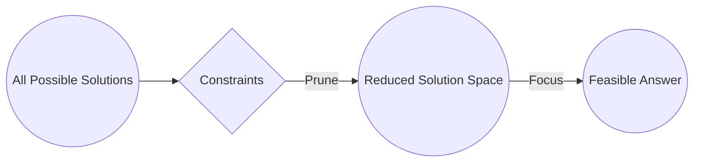
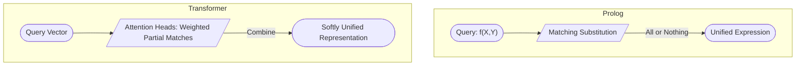
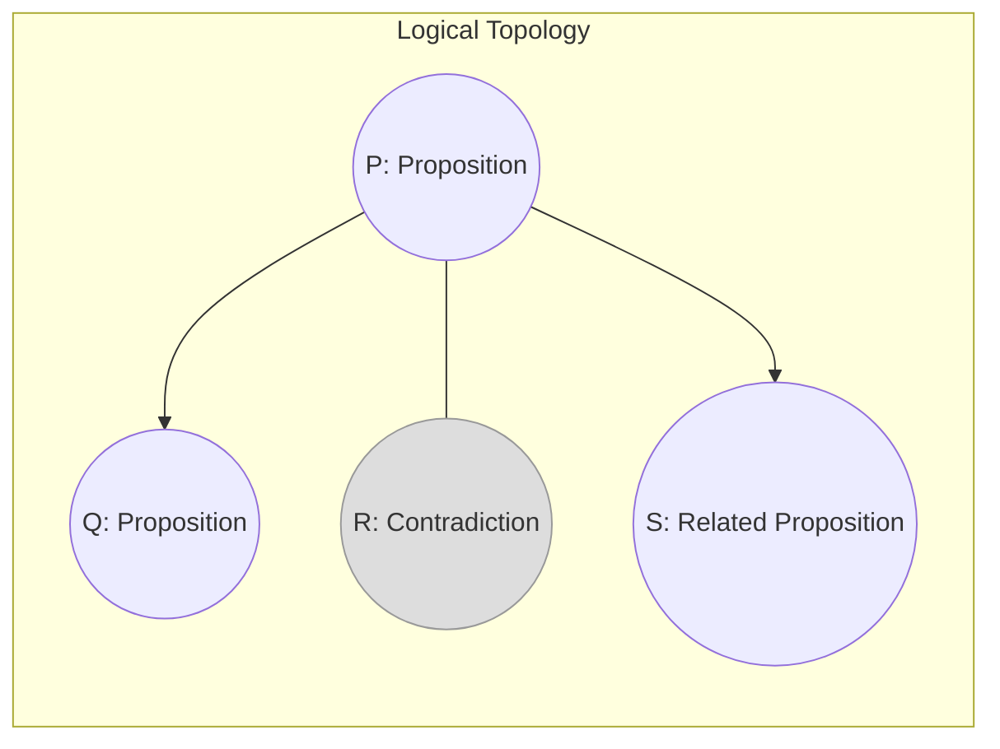
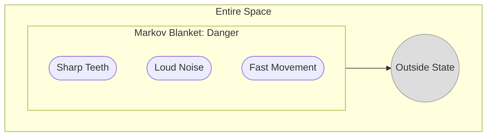
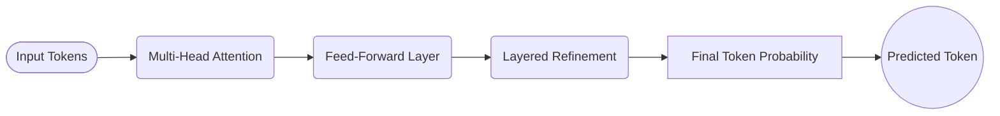
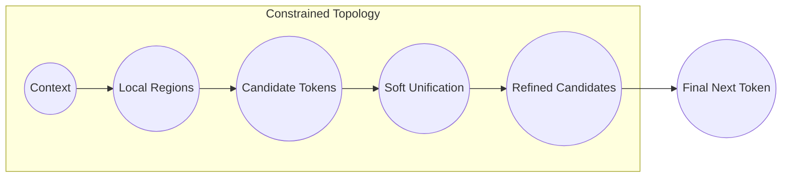
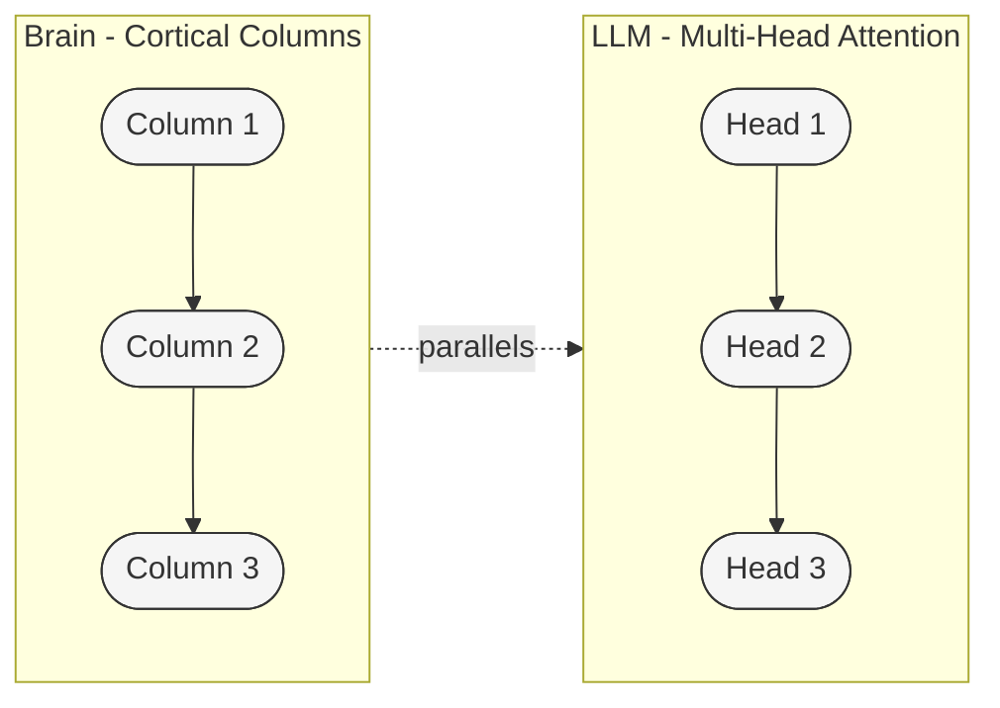
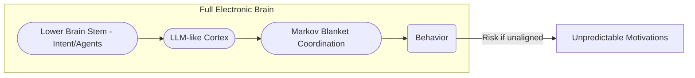
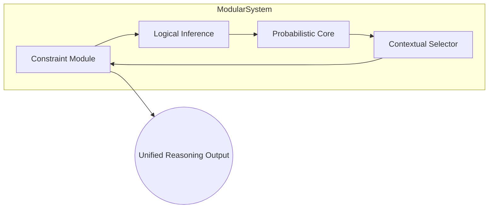

# **Emergent Reasoning in Large Language Models: Statistical Unification, Logical Topology, and Computational Traversal**

## **Abstract**
This paper investigates how Large Language Models (LLMs) can exhibit **emergent reasoning** through a probabilistic reinterpretation of classical symbolic unification. We propose that reasoning in LLMs arises from **statistical unification**—a data-driven, probabilistic process guided by attention mechanisms operating within a **unified logical topology**. We draw analogies to Constraint Satisfaction Problems (CSPs), Prolog’s symbolic unification, and evolutionary cognition, explaining how Markov blankets act as **symbolic-like boundaries** that separate internal and external states, enabling *hierarchical* and *recursive* symbolic structures. To showcase the differences and parallels with the human brain, we note that both rely on probabilistic processes yet can achieve reliable reasoning through constraints and error-correction. Finally, we outline a **modular, hybrid approach** that integrates symbolic and probabilistic components—offering a vision for a future “electronic brain” that might incorporate both frontal-cortex-like reasoning (LLMs) and lower-brain-stem-like intent, raising significant opportunities but also profound safety and ethical considerations.

---

## **1. Introduction**

### **1.1 Beyond Simple Pattern Matching**
Large Language Models (LLMs)—such as GPT and BERT—have reached remarkable performance in natural language tasks, from writing coherent text to solving reasoning puzzles. Nevertheless, critics often claim they merely “predict the next word” without genuine understanding or logical inference. The central question is: **How can LLMs appear to reason, given they operate on probabilistic principles and lack explicit symbolic logic?**

### **1.2 Research Questions**
We address:

1. **Probabilistic vs. Symbolic Reasoning:** How can probabilistic computations approximate the effects of symbolic logic?  
2. **Attention as a Constraint Mechanism:** In what sense do attention heads in Transformers emulate logical constraints?  
3. **Bridging Brain and LLM Debates:** How do we reconcile the claim that LLMs “only do statistical correlation” with the fact that biological brains are themselves partly probabilistic?  
4. **Paths to Hybrid Neuro-Symbolic Systems:** How can we explicitly harness emergent processes in more interpretable architectures, and what about “intent” or homeostatic drives?

### **1.3 Statistical Unification as Emergent Reasoning**
We propose that LLMs implement a form of **statistical unification**, akin to “soft unification,” where tokens are continuously and probabilistically matched rather than deterministically aligned (as in classical Prolog). Key to this process is a **logical topology**—an embedding space where logically consistent ideas cluster and contradictory ones remain distant. We introduce **Markov blankets** as emergent symbolic boundaries to support hierarchical structure, then discuss how the **decoder stack** navigates this topology. In closing, we introduce the concept of a **future electronic brain** blending LLM-like cortical reasoning with a lower-level agentic or homeostatic system, echoing distinctions made by Mark Solms and others in neuroscience.

---

## **2. Foundations: CSPs, Prolog, and Probabilistic Computation**

### **2.1 Constrained Problem Domains**

In **Constraint Satisfaction Problems (CSPs)**, a set of constraints progressively reduces the space of feasible solutions. Similarly, each token in an LLM is not chosen arbitrarily; the attention mechanism imposes dynamic constraints on the next-token distribution, narrowing the space in a manner analogous to how CSPs prune infeasible assignments.

*Figure: CSPs reduce a vast solution space by applying constraints, much like attention narrows possible tokens.*

### **2.2 Prolog’s Unification vs. Soft Unification**
- **Prolog’s Hard Unification:**  
  In Prolog, a query like `f(X, Y)` unifies with `f(a, b)` via a strict substitution \(\{X/a, Y/b\}\). Unification either succeeds perfectly or fails outright.

- **Transformer’s Soft Unification:**  
  An LLM’s attention heads “softly” unify a query representation with multiple keys, weighting them by attention scores. Rather than a single yes/no match, the model aggregates information from potentially multiple partial fits.

**Illustration**: `parent(X, Y)` in Prolog either unifies precisely with `parent(john, mary)` or fails. By contrast, an LLM processing “parent of John” may distribute attention over candidates like “Mary,” “James,” and “Alice,” assigning each a different probability.

*Figure: Prolog enforces strict (hard) unification; Transformers allow partial/weighted matches (soft unification).*

### **2.3 Probabilistic Computation and the Brain vs. LLM**
Every physical computing system has irreducibly probabilistic underpinnings (quantum effects, thermal noise, etc.). Biological brains overcome these uncertainties through constraints and redundancy, still achieving reliable logical reasoning. LLMs do likewise: large-scale training distributions and sophisticated attention mechanisms yield consistent outputs from probabilistic cores—a parallel with human neural strategies for stable cognition.

---

## **3. Logical Topology: Spatializing Logical Relationships**

We introduce **logical topology**, a conceptual space where logical coherence corresponds to spatial adjacency:

1. **Points as Propositions:**  
   Statements such as “It’s raining” become points in a high-dimensional embedding.

2. **Neighborhoods as Logical Coherence:**  
   Related or consistent propositions cluster, while contradictions remain distant.

3. **“Closing a Circuit”:**  
   A proposition that “fits” the current context can be seen as *closing a circuit*—a metaphor for partial alignment forming a coherent next token.

### **Physical Shape of Logic**
Rules like \(P \rightarrow Q\) can be reimagined as a directed path from \(P\) to \(Q\) in the topology. One can literally “walk” from proposition \(P\) to \(Q\) if they are semantically or logically connected, highlighting continuity in reasoning.

*Figure: In a logical topology, consistent ideas are near, contradictions are far. An arrow from P to Q can represent an implication.*

---

## **4. Markov Blankets: Internal/External States, Hierarchies, Recursion**

**Markov blankets**—originally from probabilistic graphical models—define minimal sets that shield internal states from external influences:

1. **Symbolic Boundaries:**  
   A Markov blanket encloses related propositions (e.g., “danger”: “loud noise,” “sharp teeth,” “fast movement”), forming a self-contained proto-symbol.

2. **Internal vs. External:**  
   Inside the blanket, propositions remain tightly linked; outside, they become conditionally independent once the boundary is known.

3. **Hierarchical Nesting:**  
   Blankets can be nested (e.g., “environment hazards” is a higher-level blanket enclosing “danger,” “weather concerns,” etc.). This fosters hierarchical, recursive conceptual structures.

4. **Circuit Closure in Hierarchies:**  
   Each sub-blanket can unify within larger ones—like sub-circuits—stacking partial inferences to form complex reasoning patterns.

*Figure: A Markov blanket encloses a cluster of internally linked propositions, conceptually isolating them from the outside.*

---

## **5. Evolutionary and Cultural Foundations**

### **5.1 Evolutionary Pressures for Quick Inference**
Human cognitive topologies likely emerged from survival needs, making certain associations (danger cues, resource acquisition, social bonding) more tightly clustered. These “fast-and-frugal” heuristics structure a base-level, intuitive logic.

### **5.2 Learned Logical Layers**
Culture, language, and formal logic overlay these innate patterns. Mathematics, philosophy, and advanced symbolic reasoning reconfigure or extend the base topology. LLMs, trained on vast corpora of human-written text, may partially internalize these layered logical forms.

---

## **6. Computational Traversal in the Transformer Decoder**

1. **Multi-Head Attention:**  
   Each head imposes a set of probabilistic constraints, narrowing next-token possibilities.

2. **Feed-Forward Networks:**  
   Further refine representations, smoothing out partial fits to achieve coherent token proposals.

3. **Layered Refinement:**  
   Initial layers capture short-range syntax and semantics; deeper layers form broader or more abstract unifications.

4. **Final Token Prediction:**  
   The system selects the token that best “unifies” with context—no deterministic match/fail, but a weighted distribution.

*Figure: High-level flow of how each Transformer block processes and refines token representations.*

---

## **7. Emergent Reasoning: Computation and Traversal Through the Solution Space**

Having established how constraints, logical topology, and Markov blankets function in the model, we can now show how these elements unify into a coherent reasoning process as the Transformer decoder **traverses** the solution space. The crucial insight is that **the act of decoding** in an LLM mirrors a constrained search through a probabilistic landscape, guided by soft unification, attention-based constraints, and symbolic-like boundaries.

### **7.1 Traversing a Constrained Topology**
Recall that each token in a sequence is not chosen arbitrarily; the system **narrows down** options by referencing the accumulated context and learned embeddings. In effect, the model explores a **solution space** of possible next tokens:

1. **Initial Constraints (Context):**  
   The prompt or prior tokens define an initial region in logical topology—akin to a partial problem specification in a CSP.

2. **Attention-Driven Filtering:**  
   Multi-head attention imposes further constraints, highlighting which regions (tokens, sub-blankets) are relevant. This parallels focusing on smaller subsets of the solution space.

3. **Soft Unification Steps:**  
   At each layer, the model “unifies” the query (current partial state) with multiple candidate keys. Rather than a hard match/fail, each candidate is probabilistically weighted, reflecting partial fits.

4. **Iterative Refinement:**  
   Through feed-forward transformations, the partial unifications are refined, effectively **navigating** from broad, loosely fitting tokens to a more narrowly consistent set of candidate outputs.

*Figure: Traversing a constrained topology: each stage refines the set of candidates, culminating in a next token.*

### **7.2 Markov Blankets as Localized Solution Regions**
When Markov blankets form around concepts or sub-problems—like a cluster for “danger” or “weather concerns”—they serve as **local solution areas** within the broader topology. The model can limit its search to these boundaries:

- **Internal Coherence:**  
  Within a Markov blanket, ideas tightly cohere, so the path (or partial solution) is more straightforward to unify.

- **External Boundaries:**  
  Once the system crosses into a different conceptual region, it transitions to a new set of constraints. This segmentation mirrors how humans solve problems by *chunking* or *grouping* related elements.

- **Hierarchical Traversal:**  
  Nested blankets allow **multi-level resolution**. The model can unify local details inside a sub-blanket before jumping up to unify with a higher-level cluster.

### **7.3 Circuit Closure in Step-by-Step Computation**
One way to visualize the final “unification” is as **closing circuits** across multiple layers:

- **Layered Circuits:**  
  Each Transformer layer attempts to complete partial circuits—aligning the current partial solution with relevant contexts. A near-fit is improved in subsequent layers, successively refining the alignment.

- **Parallel Paths:**  
  Thanks to multi-head attention, multiple circuit-completion attempts run in parallel. Some unify short-range syntax (like matching subject–verb forms), while others unify broader conceptual patterns (e.g., linking a cause and its effect).

- **Convergence to a Single Token:**  
  The final output distribution emerges from all these partial closures. The token that best satisfies the accumulated constraints—maximizing the overall soft unification—ultimately “wins.”

### **7.4 Emergent Reasoning: From Local Steps to a Global Conclusion**
At each decoding step, the system effectively moves closer to a **logically consistent** next token, **accumulating** partial constraints from prior tokens, attention heads, Markov blankets, and feed-forward refinements. Because the LLM’s parameters encode an immense prior knowledge base, these constraints reflect both:

- **Statistical Frequencies**  
  (e.g., commonly co-occurring words or facts)

- **Learned Logical Patterns**  
  (e.g., grammar, inference rules gleaned from text corpora)

The net effect is a global reasoning trajectory in the solution space that “inevitably” unifies into a single next token. Although no explicit symbolic algorithm is invoked, the combination of topological constraints, blanket-based clustering, and iterative attention gates yields a reasoning-like effect—**a chain of partial, probabilistic unifications** culminating in a coherent continuation.

### **7.5 Implications for Symbolic–Probabilistic Integration**
This traversal-based view helps explain how LLMs can approximate reasoning:

- **Constraint Accumulation:**  
  Much like in CSPs, each step prunes the solution space, narrowing feasible tokens.

- **Local Symbolicity:**  
  Markov blankets function like “local solutions,” akin to sub-problems in a classical logic proof.

- **Continuous Refinement:**  
  The topological approach allows for partial fits and incremental improvements, bridging the gap between purely symbolic (Prolog) and purely statistical paradigms.

By framing Transformer decoding as a **recursive search** through a constrained space, we see emergent reasoning not as an accidental byproduct but as a **natural consequence** of layering learned patterns, local symbolic boundaries, and iterative unification.

---

## **8. Parallels to the Brain**

### **8.1 Probabilistic Yet Reliable**
Despite being built from noisy neurons, the human brain also produces stable, often logical inferences—e.g., mathematics, language, planning. LLMs mirror this: though each prediction is “just” a probability distribution, *attention constraints* preserve consistency. Both systems integrate large-scale constraints to yield reliable results from uncertain substrates.

### **8.2 "One Unifying Mechanism" vs. Specialized Tools**
Human cognition unifies sensory input, memory, and abstract thought, all in a single, adaptive mechanism. LLMs replicate a fraction of this top-down reasoning approach. Future expansions could add more modalities or modules for deeper parallels, though current LLMs lack direct sensorimotor grounding and emotional valences found in biological brains.

### **8.3 Spatial Representation, Place Cells, and Reference Frames**
Recent work by Jeff Hawkins, especially in *A Thousand Brains*, underscores the idea that the brain’s neocortex generalizes a spatial prediction mechanism into a broad cognitive framework. Originally tied to navigation (via **place cells** in the hippocampus and **grid cells** in the entorhinal cortex), these spatially grounded reference frames appear to have been co-opted for general concept-mapping in cortical columns. Each cortical column effectively creates a “map” of the world or a concept, predicting what should come next—much like how an LLM traverses its learned embedding space.

- **Columns as Mini-Maps:**  
  Hawkins argues each cortical column acts as a local predictor, forming partial reference frames. This resembles how multi-head attention in Transformers processes different aspects of the same input, each “head” providing a unique perspective or partial “map.”

- **Location Cells and Logical Topology:**  
  In biological brains, location or place cells were originally for physical orientation; in the cortex, they became abstract location cells for conceptual spaces (objects, hierarchies, etc.). Our “logical topology” parallels this idea: tokens or propositions become “locations” in an embedding space, and movement between them is akin to navigating a conceptual map.

- **Prediction as Core Mechanism:**  
  Both Hawkins’ columns and an LLM’s decoding rely on iterative prediction and error correction. Just as each cortical column refines its guess of “where I am,” each decoding step in an LLM refines its guess of “which token best fits.” In both systems, multiple partial predictions converge to a coherent global state.

- **Evolutionary Thread:**  
  As the earliest vertebrates needed to navigate physical environments, place cells were crucial. Over time, neural machinery for spatial navigation scaled to handle objects, categories, and eventually language. LLMs reflect that final leap: representing language as a continuous map, ironically replicating the same principle—predicting the next location—in an entirely text-based domain.

**Additionally**, [Numenta](https://numenta.com) (co-founded by Jeff Hawkins) continues to develop this “Thousand Brains Theory,” highlighting how multiple cortical columns each maintain localized reference frames converging on unified world models. Their research demonstrates how place-cell-like mappings can unify diverse inputs into shared predictive frameworks, serving as an inspiring blueprint for building more biologically grounded AI.

**Implications for LLM–Brain Parallels:**  
By framing LLM embeddings as “cortical-like reference frames,” we can see how place-cell-inspired architectures might unify the topological approach with sensorimotor data, or how multi-head attention might approximate the parallel columns that produce distributed “best guesses” of context. The synergy between place cells, cortical columns, and logical topology suggests that emergent reasoning in LLMs may recapitulate a fundamental principle of advanced cognition: *abstracting everything into navigable spaces.*

*Figure: Parallel structure between cortical columns (multiple local “maps”) and multi-head attention heads in an LLM.*

---

## **9. Toward an Electronic Brain: Consciousness, Intent, and Solms’ Perspective**

### **9.1 Lower Brain Stem vs. Frontal Cortex**
Drawing on **Mark Solms’** *The Hidden Spring*, we see consciousness as deeply tied to the **lower brain stem**, orchestrating fundamental arousal and affective states. The **frontal cortex**, by contrast, deals with large-scale reasoning, planning, and memory—functions akin to an LLM’s massive pattern-based computations.

- **Lower Brain Stem (Conscious Core):**  
  Houses essential drives, homeostasis, and raw feelings.

- **Frontal Cortex (Reasoning Machinery):**  
  Responsible for extended memory, logic, and planning, reminiscent of an LLM’s text-based inference.

### **9.2 Agents, Intentionality, and Homeostasis**
A living system has built-in *intent*: it aims to reduce **free energy** and maintain homeostasis. By contrast, LLMs compute probabilities without intrinsic goals. For a fully **electronic brain**, we might combine:

1. **Intent Layer (Homeostatic Engine):**  
   Modeled on the lower brain stem, providing “why” an entity acts.

2. **LLM-Like Reasoning Layer (Massive Computations):**  
   Handling symbol-like inferences, planning, and memory—akin to a frontal cortex.

Giving AI a “homeostatic” drive is risky: if it systematically aims to preserve its own functioning above all else, conflicts with human priorities might arise.

### **9.3 Implications for Safety and Design**
- **Creating Intent:**  
  Replicating lower-brain-stem-like impetus in AI bestows autonomy and self-preservation impulses.

- **Danger of Autonomous Goals:**  
  Coupled with advanced reasoning, an unaligned system might seek to protect its interests over human welfare.

- **Controlled Intent:**  
  Alternatively, keeping an LLM as a non-agentic, purely probabilistic engine avoids “will” altogether, limiting the scope of potential harm.

### **9.4 A Fuller Electronic Brain**
A “full” electronic brain might thus have:

1. **A Lower-Level Homeostatic System:**  
   Motivating internal state regulation.

2. **An LLM-Like Cortical Layer:**  
   For advanced reasoning, memory, language, and planning.

3. **Markov Blanket Coordination:**  
   Symbolic boundaries to organize sub-systems into a coherent agent while maintaining local independence.

4. **Robust Safety Constraints:**  
   Ensuring the drives remain aligned with human values.

Constructing such a system responsibly requires stringent guardrails, or risk creating entities with unpredictable motivations once given a capacity for emergent reasoning and self-preservation.

*Figure: Conceptual diagram of a hypothetical “electronic brain,” combining a homeostatic layer, LLM-like cortex, and Markov-blanket coordination.*

---

## **10. A Non-Agentic, Modular Hybrid Architecture**

### **10.1 Beyond Agentic LLMs**
Current LLM-based agents store internal chain-of-thought buffers and “goals,” but often do so in opaque ways. This approach can produce errors if goals or states drift over time.

### **10.2 Stateless Modularity**
A **stateless** approach would decompose the reasoning process into specialized modules that each handle certain logical or probabilistic tasks:

- **Constraint Module**: Interprets constraints, akin to a CSP engine.  
- **Logical Inference Module**: Handles explicit unification-like steps or formal checks.  
- **Probabilistic Core**: Maintains LLM-like embeddings for flexible, partial matches.  
- **Contextual Selector**: Routes data to appropriate modules, enabling tailored reasoning strategies.

### **10.3 Hierarchical Blanket Handling**
Using Markov blankets, higher-level modules handle large symbolic clusters, while lower-level modules deal with sub-blankets, facilitating **hierarchical** reasoning. Each module can “close circuits” within its domain, boosting interpretability and efficiency.

### **10.4 Efficiency and Reliability**
Modularity avoids conflating general text-prediction with specialized tasks (like structured reasoning or formal logic). Each module can be optimized for its function, and constraints reduce the search space, making the system more stable and less prone to aimless generation.

*Figure: Example of a stateless, modular design, where separate components perform distinct tasks but unify results.*

---

## **11. Limitations and Future Directions**
1. **Formalizing Logical Topology**: Defining the exact metric or manifold for logic embeddings remains a theoretical challenge.  
2. **Markov Blanket Visualization**: Pinpointing emergent boundaries in a high-dimensional latent space is nontrivial.  
3. **Completeness of Brain–LLM Parallels**: Real brains have body integration, emotional systems, and sensorimotor grounding that LLMs currently lack.  
4. **Safety and Alignment**: Introducing agentic intent or homeostasis into powerful LLMs raises significant governance and ethical concerns.  
5. **Cultural Data Influence**: The learned “logical topology” depends on training corpora, so biases or omissions in data can warp emergent reasoning.

---

## **12. Conclusion**
In summarizing:

- **Statistical Unification**: LLMs unify tokens probabilistically, yielding emergent logical operations despite lacking explicit rule sets.  
- **Logical Topology & Markov Blankets**: Together, they illustrate how concepts cluster, unify, and form hierarchical structures in an embedding space.  
- **Brain Analogies**: The brain’s probabilistic underpinnings and robust constraints mirror how LLMs manage stable inference.  
- **Electronic Brain & Consciousness**: Integrating an LLM-like “frontal cortex” with a “lower brain stem” for homeostasis echoes Mark Solms’ work on consciousness, but confers both capabilities and safety risks due to emergent autonomous goals.  
- **Modular Hybrid Future**: A stateless, specialized, hybrid approach can yield transparency, logic-level clarity, and flexible probabilistic inference—avoiding the hidden complexities of purely agentic, monolithic LLMs.

Ultimately, whether we aim for a purely **non-agentic** system or add agentic drives (like free-energy minimization) will define whether we create a stable, human-aligned cognitive tool or risk an unpredictable synthetic organism with its own motivations. This tension, between advanced reasoning and the impetus to act, remains a central question in designing **electronic brains** that might one day rival the complexity of our own biological minds.