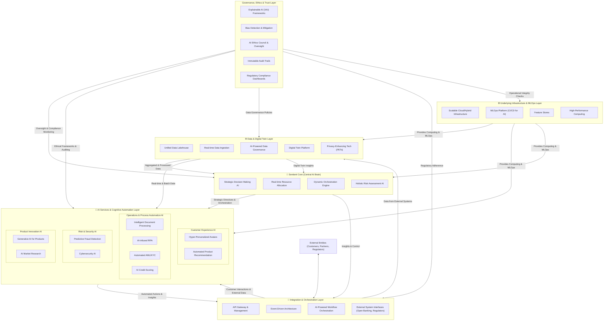
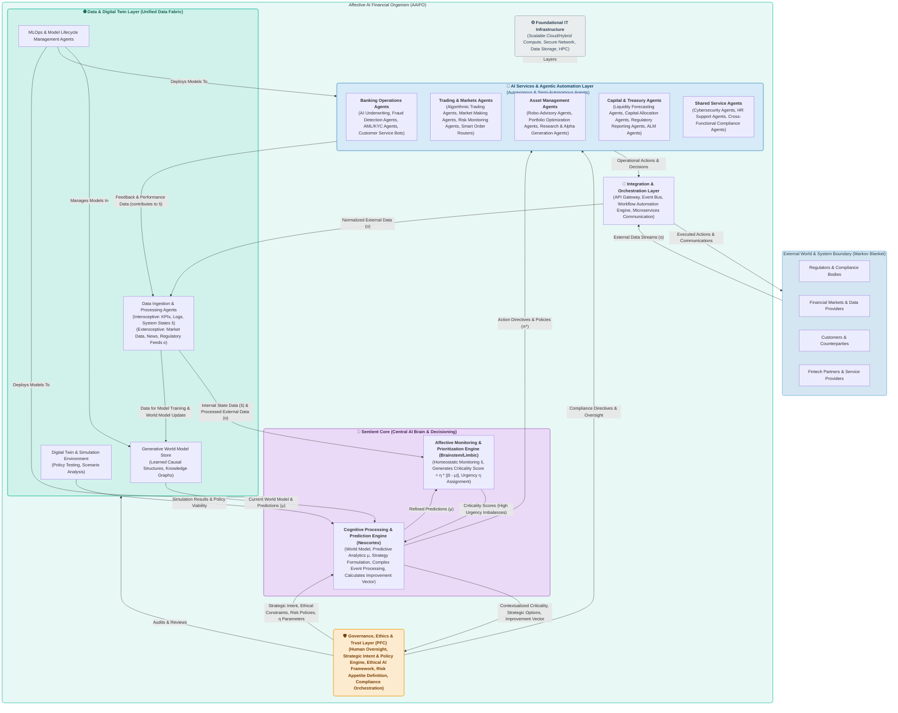

```mermaid
graph TD
    %% Define Styles for Layers (Optional, but can improve readability)
    classDef layer fill:#f9f9f9,stroke:#333,stroke-width:2px,color:#333
    classDef core fill:#e6e6fa,stroke:#333,stroke-width:2px,color:#333
    classDef dataLayer fill:#add8e6,stroke:#333,stroke-width:2px,color:#333
    classDef aiServices fill:#90ee90,stroke:#333,stroke-width:2px,color:#333
    classDef integration fill:#ffd700,stroke:#333,stroke-width:2px,color:#333
    classDef governance fill:#ffcccb,stroke:#333,stroke-width:2px,color:#333
    classDef infra fill:#d3d3d3,stroke:#333,stroke-width:2px,color:#333

    %% Layers & Key Components

    subgraph GovernanceEthicsTrust["Governance, Ethics & Trust Layer"]
        direction LR
        GET1["Explainable AI (XAI) Frameworks"]
        GET2["Bias Detection & Mitigation"]
        GET3["AI Ethics Council & Oversight"]
        GET4["Immutable Audit Trails"]
        GET5["Regulatory Compliance Dashboards"]
    end
    class GovernanceEthicsTrust governance

    subgraph SentientCore["🧠 Sentient Core (Central AI Brain)"]
        direction TB
        SC1["Strategic Decision Making AI"]
        SC2["Real-time Resource Allocation"]
        SC3["Dynamic Orchestration Engine"]
        SC4["Holistic Risk Assessment AI"]
    end
    class SentientCore core

    subgraph DataDigitalTwin["🌐 Data & Digital Twin Layer"]
        direction TB
        DDT1["Unified Data Lakehouse"]
        DDT2["Real-time Data Ingestion"]
        DDT3["AI-Powered Data Governance"]
        DDT4["Digital Twin Platform"]
        DDT5["Privacy-Enhancing Tech (PETs)"]
    end
    class DataDigitalTwin dataLayer

    subgraph AIServices["🤖 AI Services & Cognitive Automation Layer"]
        direction TB
        subgraph CustomerAI ["Customer Experience AI"]
            direction LR
            CAI1["Hyper-Personalized Avatars"]
            CAI2["Automated Product Recommendation"]
        end
        subgraph OperationsAI ["Operations & Process Automation AI"]
            direction LR
            OAI1["Intelligent Document Processing"]
            OAI2["AI-infused RPA"]
            OAI3["Automated AML/KYC"]
            OAI4["AI Credit Scoring"]
        end
        subgraph RiskSecurityAI ["Risk & Security AI"]
            direction LR
            RSAI1["Predictive Fraud Detection"]
            RSAI2["Cybersecurity AI"]
        end
        subgraph ProductInnovationAI ["Product Innovation AI"]
            direction LR
            PIAI1["Generative AI for Products"]
            PIAI2["AI Market Research"]
        end
    end
    class AIServices aiServices

    subgraph IntegrationOrchestration["🔗 Integration & Orchestration Layer"]
        direction TB
        IO1["API Gateway & Management"]
        IO2["Event-Driven Architecture"]
        IO3["AI-Powered Workflow Orchestration"]
        IO4["External System Interfaces (Open Banking, Regulators)"]
    end
    class IntegrationOrchestration integration

    subgraph InfraMLOps["⚙️ Underlying Infrastructure & MLOps Layer"]
        direction TB
        IM1["Scalable Cloud/Hybrid Infrastructure"]
        IM2["MLOps Platform (CI/CD for AI)"]
        IM3["Feature Stores"]
        IM4["High-Performance Computing"]
    end
    class InfraMLOps infra

    %% Flows of Information & Control

    %% Data Layer is foundational for AI Services and Sentient Core
    DataDigitalTwin -- "Aggregated & Processed Data" --> SentientCore
    DataDigitalTwin -- "Real-time & Batch Data" --> AIServices
    DataDigitalTwin -- "Digital Twin Insights" --> SentientCore

    %% Sentient Core orchestrates AI Services and makes strategic decisions
    SentientCore -- "Strategic Directives & Orchestration" --> AIServices
    SentientCore -- "Insights & Control" --> IntegrationOrchestration

    %% AI Services perform automated tasks and interact via Integration Layer
    AIServices -- "Automated Actions & Insights" --> IntegrationOrchestration
    IntegrationOrchestration -- "Customer Interactions & External Data" --> AIServices
    IntegrationOrchestration -- "Data from External Systems" --> DataDigitalTwin

    %% Infrastructure supports all layers (especially Data, AI Services, and Sentient Core)
    InfraMLOps -- "Provides Computing & MLOps" --> DataDigitalTwin
    InfraMLOps -- "Provides Computing & MLOps" --> AIServices
    InfraMLOps -- "Provides Computing & MLOps" --> SentientCore

    %% Governance, Ethics & Trust Layer oversees ALL layers (conceptual links)
    GovernanceEthicsTrust -- "Oversight & Compliance Monitoring" --> SentientCore
    GovernanceEthicsTrust -- "Ethical Frameworks & Auditing" --> AIServices
    GovernanceEthicsTrust -- "Data Governance Policies" --> DataDigitalTwin
    GovernanceEthicsTrust -- "Regulatory Adherence" --> IntegrationOrchestration
    GovernanceEthicsTrust -- "Operational Integrity Checks" --> InfraMLOps

    %% External Interactions
    ExternalEntities["External Entities (Customers, Partners, Regulators)"]
    ExternalEntities <--> IntegrationOrchestration
```

-------

```mermaid
graph TD
    %% --- External Environment & Interfaces ---
    subgraph ExternalInterfaces ["External World & System Boundary (Markov Blanket)"]
        direction LR
        Regulators["Regulators & Compliance Bodies"]
        Markets["Financial Markets & Data Providers"]
        Customers["Customers & Counterparties"]
        Partners["Fintech Partners & Service Providers"]
    end

    %% --- Core AI Financial Organism ---
    subgraph AAIFO ["Affective AI Financial Organism (AAIFO)"]
        direction TB

        %% Governance Layer (PFC Equivalent)
        Governance["<strong>🛡️ Governance, Ethics & Trust Layer (PFC)</strong><br/>(Human Oversight, Strategic Intent & Policy Engine, Ethical AI Framework, Risk Appetite Definition, Compliance Orchestration)"]

        %% Sentient Core (Central Brain)
        subgraph SentientCore ["<strong>🧠 Sentient Core (Central AI Brain & Decisioning)</strong>"]
            direction TB
            SC_Cognitive["<strong>Cognitive Processing & Prediction Engine (Neocortex)</strong><br/>(World Model, Predictive Analytics μ, Strategy Formulation, Complex Event Processing, Calculates Improvement Vector)"]
            SC_Affective["<strong>Affective Monitoring & Prioritization Engine (Brainstem/Limbic)</strong><br/>(Homeostatic Monitoring ŝ, Generates Criticality Score = η * ||ŝ - μ||, Urgency η Assignment)"]
        end

        %% Data Fabric (Sensory Input, World Model, Learning)
        subgraph DataFabric ["<strong>🌐 Data & Digital Twin Layer (Unified Data Fabric)</strong>"]
            direction LR
            DF_Ingestion["Data Ingestion & Processing Agents<br/>(Interoceptive: KPIs, Logs, System States ŝ)<br/>(Exteroceptive: Market Data, News, Regulatory Feeds o)"]
            DF_ModelStore["Generative World Model Store<br/>(Learned Causal Structures, Knowledge Graphs)"]
            DF_DigitalTwin["Digital Twin & Simulation Environment<br/>(Policy Testing, Scenario Analysis)"]
            DF_MLOps["MLOps & Model Lifecycle Management Agents"]
        end

        %% Agentic Services Layer (Action Execution)
        subgraph AgenticServices ["<strong>🤖 AI Services & Agentic Automation Layer</strong><br/>(Autonomous & Semi-Autonomous Agents)"]
            direction TB
            BankingAgents["<strong>Banking Operations Agents</strong><br/>(AI Underwriting, Fraud Detection Agents, AML/KYC Agents, Customer Service Bots)"]
            TradingAgents["<strong>Trading & Markets Agents</strong><br/>(Algorithmic Trading Agents, Market Making Agents, Risk Monitoring Agents, Smart Order Routers)"]
            AssetMgmtAgents["<strong>Asset Management Agents</strong><br/>(Robo-Advisory Agents, Portfolio Optimization Agents, Research & Alpha Generation Agents)"]
            CapitalTreasuryAgents["<strong>Capital & Treasury Agents</strong><br/>(Liquidity Forecasting Agents, Capital Allocation Agents, Regulatory Reporting Agents, ALM Agents)"]
            SharedServiceAgents["<strong>Shared Service Agents</strong><br/>(Cybersecurity Agents, HR Support Agents, Cross-Functional Compliance Agents)"]
        end

        %% Integration & Orchestration (Connective Tissue)
        Integration["<strong>🔗 Integration & Orchestration Layer</strong><br/>(API Gateway, Event Bus, Workflow Automation Engine, Microservices Communication)"]

        %% Foundational Infrastructure
        Infrastructure["<strong>⚙️ Foundational IT Infrastructure</strong><br/>(Scalable Cloud/Hybrid Compute, Secure Network, Data Storage, HPC)"]
    end

    %% --- Key Data & Control Flows ---
    ExternalInterfaces -- "External Data Streams (o)" --> Integration
    Integration -- "Normalized External Data (o)" --> DF_Ingestion

    DF_Ingestion -- "Internal State Data (ŝ) & Processed External Data (o)" --> SC_Affective
    DF_Ingestion -- "Data for Model Training & World Model Update" --> DF_ModelStore
    DF_ModelStore -- "Current World Model & Predictions (μ)" --> SC_Cognitive
    DF_DigitalTwin -- "Simulation Results & Policy Viability" --> SC_Cognitive
    DF_MLOps -- "Manages Models In" --> DF_ModelStore
    DF_MLOps -- "Deploys Models To" --> AgenticServices
    DF_MLOps -- "Deploys Models To" --> SentientCore

    SC_Affective -- "Criticality Scores (High Urgency Imbalances)" --> SC_Cognitive
    SC_Cognitive -- "Contextualized Criticality, Strategic Options, Improvement Vector" --> Governance
    SC_Cognitive -- "Action Directives & Policies (π*)" --> AgenticServices
    SC_Cognitive -- "Refined Predictions (μ)" --> SC_Affective
    %% Feedback loop for error calculation

    Governance -- "Strategic Intent, Ethical Constraints, Risk Policies, η Parameters" --> SC_Cognitive
    Governance -- "Compliance Directives & Oversight" --> AgenticServices
    Governance -- "Audits & Reviews" --> DataFabric

    AgenticServices -- "Operational Actions & Decisions" --> Integration
    Integration -- "Executed Actions & Communications" --> ExternalInterfaces
    AgenticServices -- "Feedback & Performance Data (contributes to ŝ)" --> DF_Ingestion


    Infrastructure -- "Provides Resources To All Layers" --> AAIFO

    %% Styling
    classDef external fill:#d4e6f1,stroke:#5dade2,stroke-width:1.5px,color:#2c3e50,rx:5,ry:5
    classDef organism fill:#e8f8f5,stroke:#48c9b0,stroke-width:2px,rx:8,ry:8
    classDef governance fill:#fdebd0,stroke:#f39c12,stroke-width:2px,color:#783f04,rx:6,ry:6,font-weight:bold
    classDef sentient_core fill:#eadaf7,stroke:#af7ac5,stroke-width:2px,color:#4a235a,rx:6,ry:6
    classDef data_fabric fill:#d1f2eb,stroke:#1abc9c,stroke-width:2px,color:#0e6251,rx:6,ry:6
    classDef agentic_services fill:#d6eaf8,stroke:#5499c7,stroke-width:2px,color:#154360,rx:6,ry:6
    classDef integration fill:#fcf3cf,stroke:#f7dc6f,stroke-width:2px,color:#7d6608,rx:6,ry:6
    classDef infrastructure fill:#eaeded,stroke:#aeb6bf,stroke-width:2px,color:#2e4053,rx:6,ry:6

    class ExternalInterfaces external
    class AAIFO organism
    class Governance governance
    class SentientCore sentient_core
    class DataFabric data_fabric
    class AgenticServices agentic_services
    class Integration integration_layer
    class Infrastructure infrastructure
```