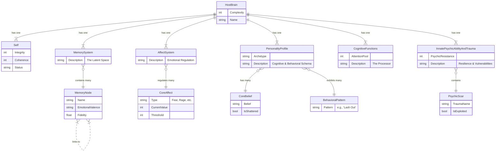

# **Brain Data Model: Psychic Blob**

### **Version 1.1**

## **1.0 Core Philosophy**

This document models the "Brain" of a potential host as a complex data system. The goal of Psychic Combat is not just to reduce a "health bar," but to systematically dismantle a personality by manipulating its core components. The model draws inspiration from neuroscience, cognitive psychology, and the principles of psychological manipulation (e.g., MKUltra's focus on de-patterning the self). The player's goal is to induce a state of **Ego Dissolution** by overloading the brain's ability to maintain a coherent sense of self.

## **2.0 Brain Components Data Model**

### **2.1 Memory (The Latent Space)**

This is the host's personal knowledge base, a vast, interconnected web of experiences. It's not a simple library of files, but a compressed "latent space" where memories are linked by association, emotion, and context.

* **Attributes:**  
  * **Memory Nodes:** Discrete, quantized representations of key life events, skills, or facts (e.g., "Childhood Home," "How to Ride a Bike," "The Face of a Loved One").  
  * **Associative Links:** Connections between nodes. The strength of these links determines how easily attacking one memory can affect another.  
  * **Emotional Valence:** Each memory is tagged with the primary emotion associated with it (Joy, Fear, Shame, etc.).  
  * **Fidelity:** How clear or distorted a memory is. Older or repressed memories have lower fidelity.  
* **Gameplay Implications:**  
  * The player's "Memory Cards" are designed to attack these nodes.  
  * A "Cascade" mechanic: Destroying a key memory node can cause a chain reaction, corrupting or shattering linked memories.  
  * Low-fidelity memories might be "Shrouded" or have unpredictable effects when targeted.  
  * The player can "implant" false memories to create weaknesses.

### **2.2 Affect & Emotional Regulation**

This system governs the host's emotional state. It's the brain's internal chemical and psychological balance. The player's goal is to push this system into extremes to break the host's composure. This is the "propaganda" and "MKUltra" layer.

* **Attributes:**  
  * **Core Affects:** A set of meters representing proto-emotions (e.g., **Fear/Anxiety**, **Rage/Aggression**, **Apathy/Despair**, **Euphoria/Mania**).  
  * **Regulation Threshold:** The point at which an Affect meter overloads and causes a "State Break."  
  * **Emotional Baseline:** The host's natural resting emotional state. A generally angry person will have a higher baseline Rage.  
* **Gameplay Implications:**  
  * The player plays cards to inject raw Affect into the system (e.g., a card showing a terrifying image spikes the **Fear** meter).  
  * A **State Break** is a powerful debuff. For example, a "Fear Break" might cause the host to be unable to defend for a turn. A "Rage Break" might cause them to damage their own Memory Nodes.  
  * The ultimate goal is to cause multiple simultaneous State Breaks, leading to an **Emotional Overload** that makes the Core Identity vulnerable.

### **2.3 Personality Profile (Cognitive & Behavioral Schema)**

This is the host's operating system—their ingrained habits, beliefs, and social masks. It dictates how they respond to the world and to the player's psychic assault.

* **Attributes:**  
  * **Archetype:** A high-level descriptor (e.g., "The Protector," "The Schemer," "The Follower"). This determines the host's general strategy during a duel.  
  * **Core Beliefs:** Foundational axioms the host lives by ("I am in control," "People are fundamentally good," "Might makes right"). These are the most heavily defended parts of the personality.  
  * **Behavioral Patterns:** Automatic responses. (e.g., "When threatened, lash out," "When confused, withdraw").  
* **Gameplay Implications:**  
  * The Archetype determines the "AI" of the Ego Defense system. A "Protector" will constantly try to shield other nodes, while a "Schemer" might set traps.  
  * Shattering a Core Belief causes massive psychic damage and can permanently disable certain defensive abilities.  
  * The player can learn to predict and exploit Behavioral Patterns.

### **2.4 Cognitive Functions (The Processor)**

This system represents the brain's ability to process information, reason, and execute actions. It's the "RAM and CPU" of the mind. Disrupting it is key to preventing the host from mounting an effective defense.

* **Attributes:**  
  * **Attention:** The ability to focus. Represented as a pool of points the host spends to activate defenses.  
  * **Logic/Reasoning:** The ability to identify and counter the player's strategies.  
  * **Executive Function:** The ability to plan and execute actions in a sequence.  
* **Gameplay Implications:**  
  * Cards can directly attack these functions. "Sow Confusion" might drain the host's **Attention** points. "Paradoxical Thought" could disable their **Logic** for a turn, preventing them from using advanced defensive moves.  
  * A host with damaged Executive Function might perform its defensive actions in a suboptimal or random order.

### **2.5 Innate Psychic Ability & Trauma**

This dual system represents the host's natural mental resilience and its inherent vulnerabilities.

* **Attributes:**  
  * **Psychic Resistance (Innate Ability):** A raw, passive defense stat that reduces the effectiveness of all incoming psychic attacks. A measure of raw mental horsepower.  
  * **Psychic Scars (Trauma):** Specific, deep-seated vulnerabilities left by past events. These are permanent weak points in the brain's structure. (e.g., "Abandonment Issues," "Phobia: Spiders," "Betrayal Trauma").  
* **Gameplay Implications:**  
  * High Resistance makes a host a tough nut to crack, requiring the player to use clever strategies rather than brute force.  
  * Psychic Scars are the opposite: they are nodes that have a permanent **Vulnerable** property, taking extra damage.  
  * Some of the most powerful player cards are "Trauma" cards, designed to specifically target and exploit these scars for massive damage.

### **2.6 The "Self" (Core Identity)**

The "Self" is not a single entity but an emergent property of all other systems functioning in concert. It is the central node in the Mindscape, the final target.

* **Attributes:**  
  * **Integrity:** The health of the Self. It cannot be damaged directly at first.  
  * **Coherence:** A measure of how well-integrated the brain's systems are. Starts at 100%.  
* **Gameplay Implications:**  
  * The Self is shielded and invulnerable at the start of a duel.  
  * Every time the player destroys a Memory Node, shatters a Core Belief, or causes an Emotional Overload, the host's **Coherence** drops.  
  * Once Coherence falls below a certain threshold (e.g., 50%), the shield on the Self shatters, and its **Integrity** can be attacked directly.  
  * Reducing Integrity to zero results in Ego Dissolution and a successful capture.

## **3.0 Data Model Diagram**

The following diagram illustrates the relationships between the core components of a host's brain.

