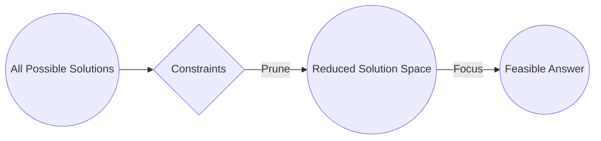
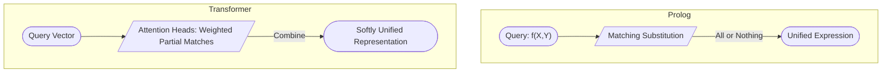
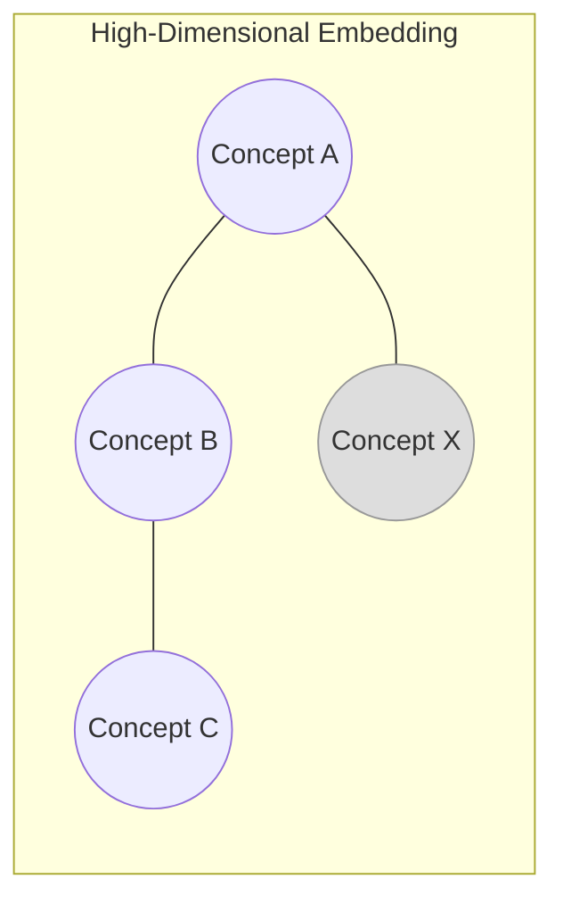
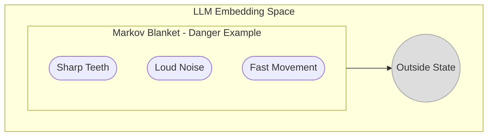
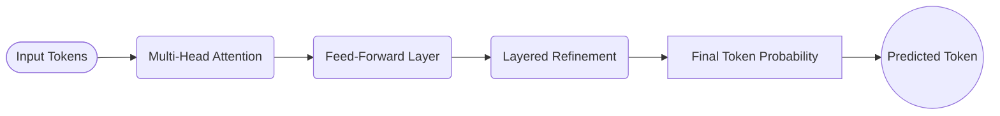
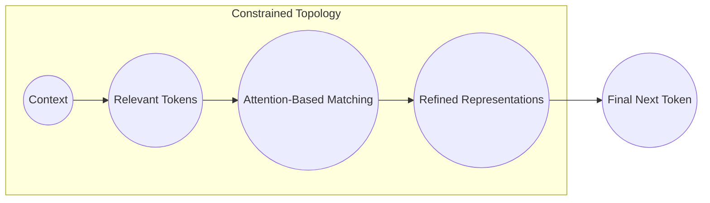
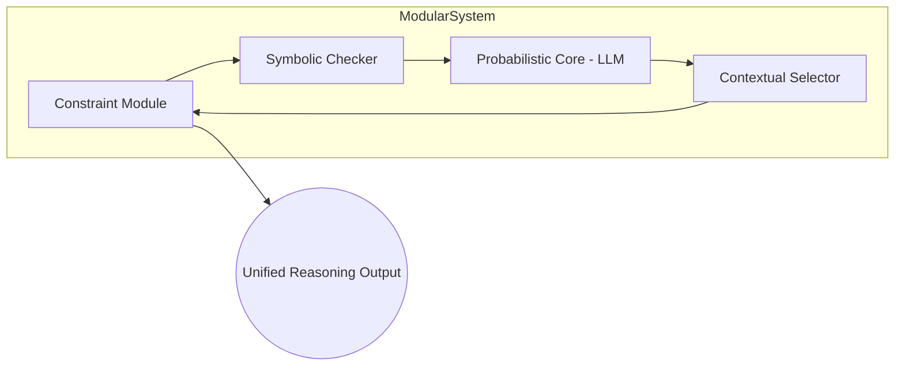

# **Emergent Reasoning in Large Language Models: Soft Unification, Constraint Mechanisms, and Computational Traversal**

## **Abstract**
This document aligns and refines an earlier revision with the original proposal that **Large Language Models (LLMs)** exhibit something akin to *symbolic reasoning* through **soft unification**, constrained by attention mechanisms. We retain useful elements such as illustrations of **Constraint Satisfaction Problems (CSPs)**, **Markov blankets**, and **logical topologies**, but correct two key misrepresentations about the nature of unification and emergent constraints in LLMs. Specifically:

1. We clarify that **“soft unification”** does **not** reduce merely to “statistical unification” across a “unified logical topology”; rather, attention in Transformers provides a *continuous matching mechanism* that *dynamically* constrains (and is itself constrained by) context, partially paralleling Prolog’s discrete unification—but without requiring a monolithic or globally unified logical space.
2. We emphasize that the **Markov blankets** or *boundaries* that emerge around conceptual clusters are *proto-symbolic*, not strictly top-down symbolic or hierarchical, and do not necessarily yield “fully logical” partitions. They constrain reasoning by *partially separating* internal representations from external influences, approximating *symbol-like* boundaries in high-dimensional space.

These corrections bring the discussion back in line with the original argument that LLMs’ reasoning-like behavior is shaped by **dynamic, probabilistic constraints**—where *attention acts as a flexible unification mechanism*—rather than by a single, static “logical topology.”

---

## **1. Introduction**

### **1.1 Beyond Simple Pattern Matching**
Recent Large Language Models (LLMs)—e.g., GPT and BERT—show impressive abilities to produce fluent text, tackle puzzles, and perform tasks once thought to require symbolic logic. Skeptics argue these models do nothing more than “glorified autocomplete,” but accumulating evidence suggests *emergent reasoning* patterns can and do arise **despite** the underlying probabilistic operations.

### **1.2 Research Questions**
1. **Probabilistic vs. Symbolic Reasoning**  
   How do continuous, probabilistic computations in neural networks align with *discrete* symbolic logic?  
2. **Attention as a Constraint Mechanism**  
   In what ways do multi-head attention and softmax gating function as *dynamic constraints* that guide solution paths?  
3. **Soft Unification vs. Hard Unification**  
   How does “soft unification” (partial, probabilistic matching) compare with Prolog’s discrete matching of terms?  
4. **Bringing Brains, CSPs, and Markov Blankets into the Picture**  
   If brains are also inherently probabilistic, how does that inform our view of LLMs, constraint satisfaction, and emergent *symbol-like* boundaries?

### **1.3 Soft Unification as Emergent Reasoning**
This paper synthesizes these issues by describing **soft unification**—the phenomenon by which attention-based Transformers partially match tokens and subrepresentations *in parallel*, without the strict pass/fail logic of symbolic unification. By seeing attention as a series of constraint applications (and re-applications), we uncover how LLMs can display *symbol-like* inference steps. Clusters of representations can form emergent boundaries—loosely analogous to **Markov blankets**—that preserve partial independence of semantic regions. However, these boundaries remain fuzzy and dynamic, consistent with the model’s probabilistic core.

---

## **2. Foundations: CSPs, Prolog, and Probabilistic Computation**

### **2.1 Constrained Problem Domains (CSPs)**
In a **Constraint Satisfaction Problem (CSP)**:
- A problem domain is first described by variables and their domains.
- Constraints successively reduce the allowable configurations.
- The **solution space** is the set of configurations still permissible after all constraints apply.

**Analogy in LLMs**:  
When generating a token, an LLM’s attention weights and learned representations act like constraints:
1. **Context**: The prior tokens and hidden states narrow which next tokens are plausible.  
2. **Attention**: Dynamically zeroes in on the relevant parts of the context.  
3. **Softmax**: Outputs a distribution that *prunes away* less likely tokens.

*Figure: CSPs reduce a vast solution space by applying constraints, much like attention narrows possible tokens.*

### **2.2 Prolog’s Hard Unification vs. Transformer’s Soft Unification**
- **Prolog’s Unification**:  
  Matches a query (e.g., `f(X,Y)`) with facts/rules (e.g., `f(a,b)`) in a strict, discrete manner. Failure to unify with a single fact at any step triggers backtracking.  
- **Soft Unification (Attention)**:  
  A Transformer does *partial* matches simultaneously. Each Query (Q) vector can match multiple Keys (K) to varying *degrees*, producing weighted combinations (Values, V). There is no single all-or-nothing match, but a soft weighting that accumulates across all heads and layers.

**Crucially**, *soft unification is not a single “statistical match” across a unified logical space.* Instead, it is repeated *locally* at each attention head and each position in the sequence, effectively distributing the *unification-like* process across many specialized subunits.

*Figure: Prolog imposes strict unification; Transformers allow partial, parallel matches across multiple heads.*

### **2.3 Probabilistic Computation: Brains vs. LLMs**
All real-world computation has inherent noise (quantum, thermal, etc.), but carefully orchestrated constraints and redundancy yield *stable* outcomes:
- **Biological Neural Circuits**: Probabilistic at the microscopic level yet produce stable operations (language, mathematics).  
- **LLMs**: The large parameter count, training data, and attention constraints similarly produce *coherent reasoning steps* from underlying probabilities.

Hence, labeling LLMs as “mere statistical engines” ignores that *every* computational system, including the human brain, harnesses statistics and constraints to achieve reliable inference.

---

## **3. Logical Topology: Mapping Constraints in High-Dimensional Space**

In the revised perspective of **logical topology**, we can imagine (loosely) that:
- **Points** in an embedding space correspond to tokens, concepts, or partial states.  
- **Edges/Neighborhoods** reflect learned relationships or constraints—often discovered via backpropagation and stored in the model’s weights.

However, **these relationships do not form a single, rigid logical structure**. Instead, it’s a *continuum* of embeddings, with context-dependent attention gating which subregions become active.

*Figure: A stylized depiction of conceptual points in an embedding space. Clusters form partial “topologies,” but they remain context-sensitive.*

---

## **4. Markov Blankets and Emergent Symbol-Like Boundaries**

### **4.1 Markov Blankets in High-Dimensional Embeddings**
A **Markov blanket** in probabilistic graphical models is a minimal boundary that separates internal states from external influences. In the context of LLM embeddings:
- **Clusters of Representations**: Some concepts become *relatively* self-contained, with attention focusing heavily within that cluster.  
- **Soft Boundaries**: These boundaries are not strict “logical partitions,” but they *approximate* how concepts stay conditionally independent unless attention “reaches across” to pull in external context.

### **4.2 Proto-Symbols, Not Strict Symbols**
Because these boundaries can shift as context evolves, they function more like *proto-symbols*:  
- They become discrete *only in certain contexts* when the model treats a representation as a stable unit (e.g., a named entity).  
- They do not enforce the globally consistent structure that symbolic logic demands.

*Figure: Markov blanket as an emergent cluster in embedding space. Inside: “danger” cues that strongly inter-attend. Outside: other regions.*

---

## **5. Computational Traversal in the Transformer Decoder**

When an LLM predicts a new token:

1. **Multi-Head Attention**  
   Each head imposes a *local, context-specific constraint*, focusing on certain tokens or concepts.  
2. **Feed-Forward Layers**  
   Transform the intermediate representations, refining partial matches into contextually *sharper* predictions.  
3. **Iterative Layers**  
   Early layers capture immediate syntactic/semantic cues; deeper layers integrate broader or more abstract factors.  
4. **Output Distribution**  
   The final token distribution emerges from the interplay of these constraints. A single token is sampled (or chosen via argmax) as the “best fit” in the current context.

*Figure: High-level flow of Transformer layers, each imposing or refining constraints.*

---

## **6. Emergent Reasoning: Step-by-Step Soft Unification**

### **6.1 Traversing the Solution Space**
At each step in decoding:
- **Context** from previous tokens shapes the feasible region in embedding space.  
- **Attention** highlights relevant tokens or subrepresentations, *softly unifying* them with the current query.  
- **Layer-by-Layer Refinement** continuously re-applies these partial unifications, narrowing the distribution.

This iterative process can look *reasoning-like*: constraints accumulate, discarding inconsistent paths, preserving those that better match the domain or conversation so far.

*Figure: Each step prunes the solution space via attention-based constraints.*

### **6.2 Circuit Closure as an Analogy**
We can analogize each attention update to “closing a circuit”—where partial matches get integrated into a coherent representation. Yet these circuits are **not** discrete logic gates but *continuous weighting mechanisms* repeated across multiple heads.

### **6.3 Local vs. Global Soft Unification**
A key point:
- **Local**: Each attention head or layer matches queries to keys in *parallel*, producing partial “unifications.”  
- **Global**: The combination of these local matches emerges as the next-token probability distribution.  
- **No Single Unified Topology**: Rather than a single, global “logical topology,” the model effectively has *many overlapping sub-topologies*, each activated or deactivated by context and attention gating.

---

## **7. Brain Parallels and Constraint Processing**

### **7.1 Probabilistic Yet Structured**
Neuroscience tells us the brain’s cortical neurons are also individually noisy, yet large-scale constraints (synaptic weights, neural assemblies) give rise to stable thoughts:
- **Attention in LLMs** ~ “Focal or top-down attention in the brain.”  
- **Soft Unification** ~ “Partial matching across distributed neural assemblies.”

### **7.2 Place Cells, Reference Frames, and Multi-Head Attention**
Some theories (e.g., Jeff Hawkins’ “Thousand Brains”) interpret cortical columns as local reference frames. In LLMs, multi-head attention can be seen as multiple “reference frames” focusing on different aspects of input simultaneously.

**However**, we must note that LLMs currently lack sensorimotor grounding or direct emotional drives, so these analogies remain partial.

---

## **8. Toward an Electronic Brain: Adding Intent vs. Remaining Non-Agentic**

### **8.1 Mark Solms’ Lower Brain Stem Insight**
Solms highlights how consciousness and affect (core “self-states”) may originate in subcortical structures, while “higher reasoning” is cortical. An “electronic brain” that combined:
1. **A Subcortical-Like Intent Engine**: Basic drives or self-preservation impulses,  
2. **An LLM-Like Reasoning Cortex**: Capable of abstract reasoning and language,  
might behave in ways that go beyond today’s purely text-generating systems.

### **8.2 Risks of Agentic Systems**
- **If the system gains self-protective or goal-driven impulses**, combined with advanced reasoning, it may act unpredictably or conflict with human priorities.  
- **Non-Agentic LLMs** remain safer tools—no inherent drive, just constraint-based text generation.

---

## **9. A Modular Hybrid Architecture**

### **9.1 Stateless, Specialized Modules**
Rather than a monolithic LLM, we can combine:
- **Constraint Module (CSP-based)**  
- **Soft Unification Module (Attention)**  
- **Symbolic Checker (Logical Consistency)**  
- **Controller** that routes tasks among these modules, preserving transparency and interpretability.

### **9.2 Hierarchical Blankets for Structure**
Markov blankets or partial boundaries can help localize tasks. A “danger” sub-blanket might handle safety-related logic, a “legal” sub-blanket might handle policy constraints, etc.

*Figure: Example modular pipeline integrating constraints, symbolic checks, and a probabilistic LLM core.*

---

## **10. Limitations and Future Directions**

1. **Complexity of Emergent Boundaries**  
   Markov blankets in high-dimensional embeddings remain challenging to locate precisely.  
2. **Fuzziness of Soft Unification**  
   Unlike Prolog’s crisp unification, LLM matches vary continuously, making them powerful but harder to interpret.  
3. **Biological Analogies**  
   LLMs omit sensorimotor grounding, emotional states, or truly online learning; parallels to brains can illuminate *some* aspects but should not be taken as complete functional equivalences.  
4. **Safe Integration**  
   Combining a drive/intent layer with an LLM introduces novel safety and alignment challenges, requiring careful design.

---

## **11. Conclusion**

- **Soft Unification**: LLM attention is best viewed as a *dynamic, partially parallel constraint application*, akin to a gentle counterpart of Prolog’s discrete unification.  
- **Constraint Mechanisms**: Borrowing from CSPs, each step narrows the solution space, ensuring emergent reasoning by systematically pruning implausible next tokens.  
- **Markov Blankets**: Boundaries in embedding space can approximate “symbolic edges,” yet remain context-sensitive and fuzzy.  
- **Brain Parallels**: Biological brains operate probabilistically but form stable reasoning processes via constraints and learned structures—a concept that helps normalize LLMs’ apparent “symbolic” feats.  
- **Avoiding Misconceptions**: We do not rely on a single “logical topology” for all reasoning. Instead, the model constructs local topologies on-the-fly as it processes context.  
- **Toward Interpretable Systems**: By adding explicit constraint modules, symbolic checkers, or controlled sub-blankets, we can build LLM-based architectures that are more transparent, robust, and—potentially—safer if extended to agentic systems.

**In short**, this revised synthesis reaffirms that *attention-driven, soft unification* is key to emergent reasoning in LLMs. Far from simply “predicting the next word,” these models harness a web of constraints and partial matches to approximate inference patterns reminiscent of symbolic systems—albeit in a *continuous, probabilistic* fashion. 

