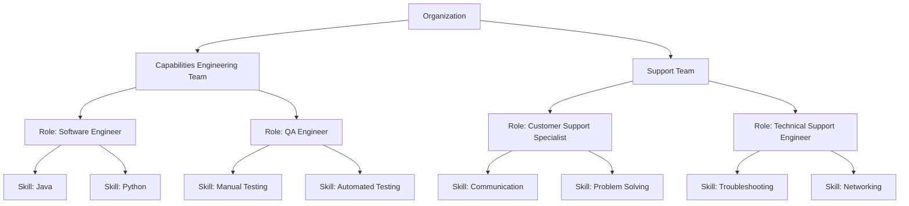

# C4H Domain Model

## Introduction

This document outlines the design of the *c4h* (coder for hire) framework. The framework is divided into four sections:
1. **Key Concepts:** 
2. **Agent Framework:** 
3. **C4H Programming Team:** 
4. **Roadmap:** 

## Key Background Concepts

### What are LLMs

- **Definition:**  
  Large Language Models (LLMs) are deep neural networks trained on extensive text corpora using transformer architectures.

<svg width="400" height="400" xmlns="http://www.w3.org/2000/svg">
  
  <!-- Four circles arranged to maximize the central overlap -->
  <circle cx="170" cy="170" r="80" class="venn" fill="red" stroke="black" />
  <circle cx="230" cy="170" r="80" class="venn" fill="green" stroke="black" />
  <circle cx="230" cy="230" r="80" class="venn" fill="blue" stroke="black" />
  <circle cx="170" cy="230" r="80" class="venn" fill="orange" stroke="black" />
  
  <!-- Central label for the overlapping region -->
  <text x="200" y="205" text-anchor="middle" font-size="16" fill="black">
     90%
  </text>
</svg>

- **Core Mechanisms:**  
  - **Self-Attention:** Captures dependencies across long sequences to model context.
  - **Token Prediction:** Computes probabilities over a vocabulary to generate subsequent tokens.
  - **Contextual Embeddings:** Represents words in continuous vector spaces to capture semantic relationships.

- **Application in C4H:**  
  LLMs drive code generation, analysis, and natural language interfaces by translating contextual prompts into code snippets, debugging steps, or documentation.

### What are Agents

- **Definition:**  
  Agents are autonomous software modules designed to perform specific tasks based on inputs and internal rules.

- **Characteristics:**  
  - **Autonomy:** Execute tasks independently without continuous human intervention.
  - **Interactivity:** Communicate with other agents or systems through predefined protocols.
  - **Adaptability:** Modify behavior in response to feedback and changing operational conditions.

- **Application in C4H:**  
  Agents are structured into teams that mirror corporate hierarchies. Each agent is assigned a role defined by specific skills, enabling the system to modularly generate, validate, and optimize code.

### Two Types of Coding Paradigms

Programming in c4h leverages two distinct computation paradigms to address different aspects of code processing.

#### Deterministic vs Probabilistic Computation

- **Deterministic Computation:**  
  - **Definition:** Operations yield the same output for a given input by following fixed, unambiguous rules.
  - **Characteristics:**  
    - Predictable and reproducible outcomes.
    - Common in static analysis, formal verification, and rule-based systems.
  - **Application in C4H:**  
    Used for code validation, static analysis, and error detection, ensuring consistency and reliability in outcomes.

- **Probabilistic Computation:**  
  - **Definition:** Operations produce outputs based on statistical models, introducing variability even with identical inputs.
  - **Characteristics:**  
    - Outputs derived from probability distributions.
    - Suitable for handling uncertainty and ambiguity.
  - **Application in C4H:**  
    Underpins LLM-based code generation and adaptive learning modules, enabling flexible handling of incomplete or noisy data.

## Agent Framework
### Organisation

We will structure Agents around teams & roles in a coporations.

We are interested in the following aspects of an coporate style organisation
1. Hierachichy of *responsibility*.
2. Teams deliver *capabilities*.
3. The capabilities that a team delivers is made up by *roles*.
4. Each role has *skills* which enable it to do work.

To summarise:-
A Team has responsibility and capability.
A Team is composed of Roles, each Role having multiple Skills needed to fulfill its Role.

#### Managing Complexity

We use structure to manage the conceptual complexity.
1. Seperate teams around a singular capability.
2. Seperate agents around a specific set of skills.

This allows:-
1. Reusable teams across similar problem domains, e.g. Once we have an Engineering or Support team i can use it solve many similar kinds of problems.
1. We can reassemble teams around the roles I need.
1. We can build new roles from the skills we have implemented.

#### The Attention Mechanism

Why do we need to manage complexity with LLMs?

People have created coporate structures to manage complexity because they need to manage the set of *points* or *variables* required to think of and solve problems.

LLMs have similar constraints,
- the volume of data they can consider over
- the number of variables that will be incorporated into the solution

So we will use similar mechanisms for managing complexity with LLMs as with people.

This allows people to reason over and understand how they are configuring Agents and their capabilities.

Note though as LLMs evolve they will be able to reorganise themselves  far more efficiently than what people need to understand and will start to resemble highly efficient organic structures.

## c4h Programming Team

## What's Next?
