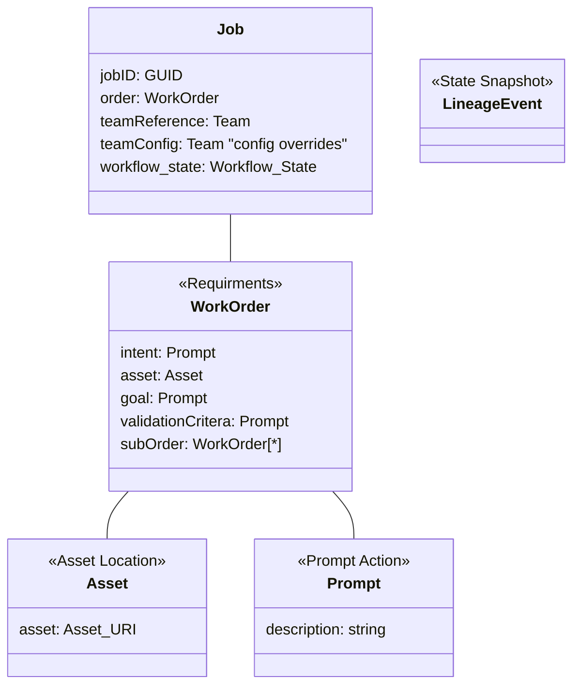

# C4H Project Domain Model

```mermaid
classDiagram

   class Asset {
      <<Asset Location>>
      asset: Asset_URI
    }

   class WorkOrder {
      <<Requirments>>
      intent: Prompt
      asset: Asset
      goal: Prompt
      validationCritera: Prompt
      subOrder: WorkOrder[*]
   }

   class Prompt {
      <<Prompt Action>>
      description: string
   }

   class Job {
      jobID: GUID
      order: WorkOrder
      teamReference: Team
      teamConfig: Team "config overrides"

      workflow_state: Workflow_State

   }

   class LineageEvent {
      <<State Snapshot>>
   }

    %% Relationships

   WorkOrder -- Asset
   WorkOrder -- Prompt
   Job -- WorkOrder

```