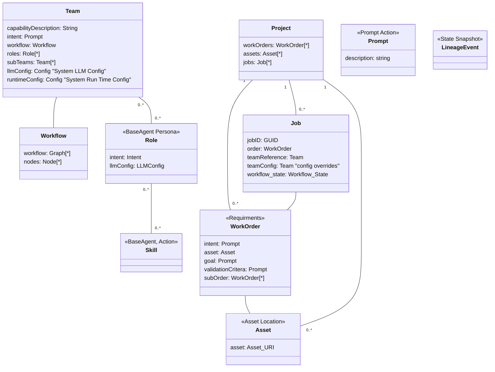

# C4H Project Domain Model
Describing the representational meta model over the Teams, Projects, WorkOrders, Jobs

## Use case

1. Project Picker 
    a. Create a new Project
    b. Open an existing Project
    c. Delete a Project (projects setting the state to deleted and not visible no actual deletion happens)

2. Picked Project Context
    a. LLM Chat window, 

