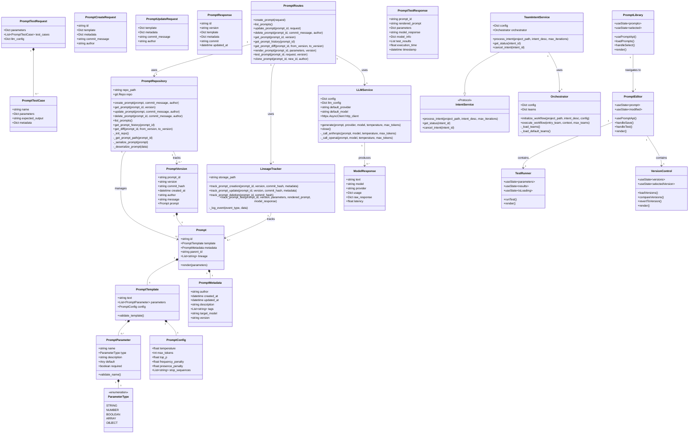

```mermaid
classDiagram
    %% Core Prompt Models
    class Prompt {
        +string id
        +PromptTemplate template
        +PromptMetadata metadata
        +string parent_id
        +List~string~ lineage
        +render(parameters)
    }
    
    class PromptTemplate {
        +string text
        +List~PromptParameter~ parameters
        +PromptConfig config
        +validate_template()
    }
    
    class PromptParameter {
        +string name
        +ParameterType type
        +string description
        +Any default
        +boolean required
        +validate_name()
    }
    
    class PromptMetadata {
        +string author
        +datetime created_at
        +datetime updated_at
        +string description
        +List~string~ tags
        +string target_model
        +string version
    }
    
    class PromptConfig {
        +float temperature
        +int max_tokens
        +float top_p
        +float frequency_penalty
        +float presence_penalty
        +List~string~ stop_sequences
    }
    
    class PromptVersion {
        +string prompt_id
        +string version
        +string commit_hash
        +datetime created_at
        +string author
        +string message
        +Prompt prompt
    }
    
    class PromptTestCase {
        +string name
        +Dict parameters
        +string expected_output
        +Dict metadata
    }
    
    %% Enum
    class ParameterType {
        <<enumeration>>
        STRING
        NUMBER
        BOOLEAN
        ARRAY
        OBJECT
    }
    
    %% Backend Services
    class PromptRepository {
        +string repo_path
        +git.Repo repo
        +create_prompt(prompt, commit_message, author)
        +get_prompt(prompt_id, version)
        +update_prompt(prompt, commit_message, author)
        +delete_prompt(prompt_id, commit_message, author)
        +list_prompts()
        +get_prompt_history(prompt_id)
        +get_diff(prompt_id, from_version, to_version)
        -_init_repo()
        -_get_prompt_path(prompt_id)
        -_serialize_prompt(prompt)
        -_deserialize_prompt(data)
    }
    
    class LineageTracker {
        +string storage_path
        +track_prompt_creation(prompt_id, version, commit_hash, metadata)
        +track_prompt_update(prompt_id, version, commit_hash, metadata)
        +track_prompt_deletion(prompt_id, commit_hash)
        +track_prompt_test(prompt_id, version, parameters, rendered_prompt, model_response)
        -_log_event(event_type, data)
    }
    
    class LLMService {
        +Dict config
        +Dict llm_config
        +string default_provider
        +string default_model
        +httpx.AsyncClient http_client
        +generate(prompt, provider, model, temperature, max_tokens)
        +close()
        -_call_anthropic(prompt, model, temperature, max_tokens)
        -_call_openai(prompt, model, temperature, max_tokens)
    }
    
    class ModelResponse {
        +string text
        +string model
        +string provider
        +Dict usage
        +Dict raw_response
        +float latency
    }
    
    %% API Models and Routes
    class PromptRoutes {
        +create_prompt(request)
        +list_prompts()
        +update_prompt(prompt_id, request)
        +delete_prompt(prompt_id, commit_message, author)
        +get_prompt(prompt_id, version)
        +get_prompt_history(prompt_id)
        +get_prompt_diff(prompt_id, from_version, to_version)
        +render_prompt(prompt_id, parameters, version)
        +test_prompt(prompt_id, request, version)
        +clone_prompt(prompt_id, new_id, author)
    }
    
    class PromptCreateRequest {
        +string id
        +Dict template
        +Dict metadata
        +string commit_message
        +string author
    }
    
    class PromptUpdateRequest {
        +Dict template
        +Dict metadata
        +string commit_message
        +string author
    }
    
    class PromptResponse {
        +string id
        +string version
        +Dict template
        +Dict metadata
        +string commit
        +datetime updated_at
    }
    
    class PromptTestRequest {
        +Dict parameters
        +List~PromptTestCase~ test_cases
        +Dict llm_config
    }
    
    class PromptTestResponse {
        +string prompt_id
        +string rendered_prompt
        +Dict parameters
        +string model_response
        +Dict model_info
        +List test_results
        +float execution_time
        +datetime timestamp
    }
    
    %% From c4h_services - Inferred
    class IntentService {
        <<Protocol>>
        +process_intent(project_path, intent_desc, max_iterations)
        +get_status(intent_id)
        +cancel_intent(intent_id)
    }
    
    class TeamIntentService {
        +Dict config
        +Orchestrator orchestrator
        +process_intent(project_path, intent_desc, max_iterations)
        +get_status(intent_id)
        +cancel_intent(intent_id)
    }
    
    class Orchestrator {
        +Dict config
        +Dict teams
        +initialize_workflow(project_path, intent_desc, config)
        +execute_workflow(entry_team, context, max_teams)
        -_load_teams()
        -_load_default_teams()
    }
    
    %% Frontend Inferred Components
    class PromptLibrary {
        +usePromptApi()
        +useState~prompts~
        +useState~selected~
        +loadPrompts()
        +handleSelect()
        +render()
    }
    
    class PromptEditor {
        +usePromptApi()
        +useState~prompt~
        +useState~modified~
        +handleSave()
        +handleTest()
        +render()
    }
    
    class TestRunner {
        +useState~parameters~
        +useState~results~
        +useState~isLoading~
        +runTest()
        +render()
    }
    
    class VersionControl {
        +useState~versions~
        +useState~selectedVersion~
        +loadVersions()
        +compareVersions()
        +revertToVersion()
        +render()
    }
    
    %% Relationships
    Prompt "1" *-- "1" PromptTemplate
    Prompt "1" *-- "1" PromptMetadata
    PromptTemplate "1" *-- "0..*" PromptParameter
    PromptTemplate "1" *-- "1" PromptConfig
    PromptParameter "1" *-- "1" ParameterType
    PromptVersion "1" *-- "1" Prompt
    
    PromptRepository "1" --> "0..*" Prompt : manages
    PromptRepository "1" --> "0..*" PromptVersion : tracks
    
    LineageTracker "1" --> "0..*" Prompt : tracks
    
    LLMService "1" --> "0..*" ModelResponse : produces
    
    PromptRoutes "1" --> "1" PromptRepository : uses
    PromptRoutes "1" --> "1" LineageTracker : uses
    PromptRoutes "1" --> "1" LLMService : uses
    
    PromptTestRequest "1" *-- "0..*" PromptTestCase
    
    TeamIntentService --|> IntentService
    TeamIntentService "1" --> "1" Orchestrator : uses
    
    PromptLibrary "1" --> "1" PromptEditor : navigates to
    PromptEditor "1" --> "1" TestRunner : contains
    PromptEditor "1" --> "1" VersionControl : contains
```