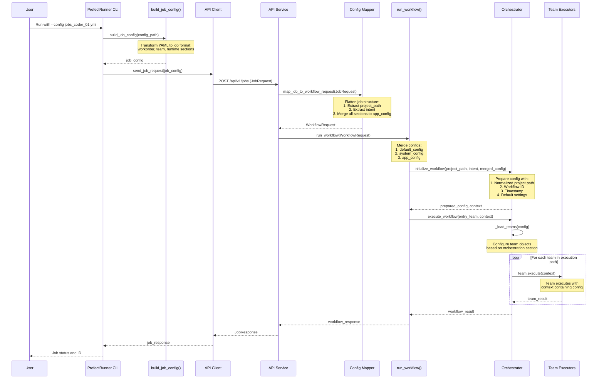

```mermaid
sequenceDiagram
    participant User
    participant CLI as PrefectRunner CLI
    participant JobBuilder as build_job_config()
    participant APIClient as API Client
    participant APIService as API Service
    participant Mapper as Config Mapper
    participant WorkflowExecutor as run_workflow()
    participant Orchestrator as Orchestrator
    participant Teams as Team Executors
    
    User->>CLI: Run with --config jobs_coder_01.yml
    CLI->>JobBuilder: build_job_config(config_path)
    
    Note over JobBuilder: Transform YAML to job format:<br>workorder, team, runtime sections
    
    JobBuilder-->>CLI: job_config
    CLI->>APIClient: send_job_request(job_config)
    
    APIClient->>APIService: POST /api/v1/jobs (JobRequest)
    
    APIService->>Mapper: map_job_to_workflow_request(JobRequest)
    Note over Mapper: Flatten job structure:<br>1. Extract project_path<br>2. Extract intent<br>3. Merge all sections to app_config
    
    Mapper-->>APIService: WorkflowRequest
    APIService->>WorkflowExecutor: run_workflow(WorkflowRequest)
    
    Note over WorkflowExecutor: Merge configs:<br>1. default_config<br>2. system_config<br>3. app_config
    
    WorkflowExecutor->>Orchestrator: initialize_workflow(project_path, intent, merged_config)
    
    Note over Orchestrator: Prepare config with:<br>1. Normalized project path<br>2. Workflow ID<br>3. Timestamp<br>4. Default settings
    
    Orchestrator-->>WorkflowExecutor: prepared_config, context
    
    WorkflowExecutor->>Orchestrator: execute_workflow(entry_team, context)
    
    Orchestrator->>Orchestrator: _load_teams(config)
    Note over Orchestrator: Configure team objects<br>based on orchestration section
    
    loop For each team in execution path
        Orchestrator->>Teams: team.execute(context)
        Note over Teams: Team executes with<br>context containing config
        Teams-->>Orchestrator: team_result
    end
    
    Orchestrator-->>WorkflowExecutor: workflow_result
    WorkflowExecutor-->>APIService: workflow_response
    
    APIService-->>APIClient: JobResponse
    APIClient-->>CLI: job_response
    CLI-->>User: Job status and ID
```