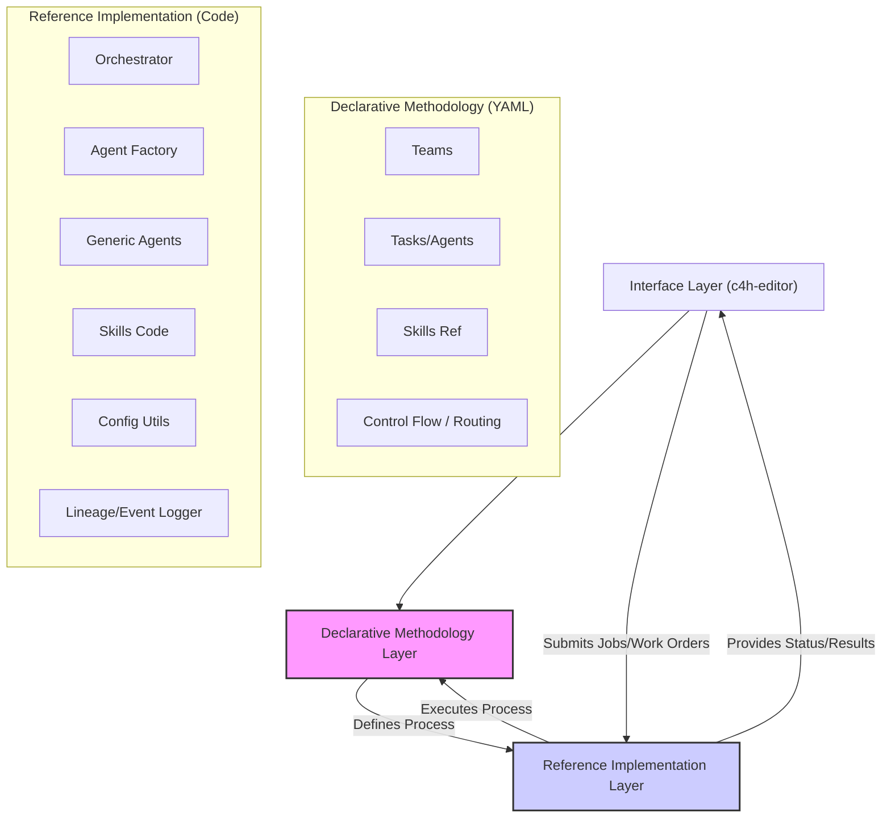
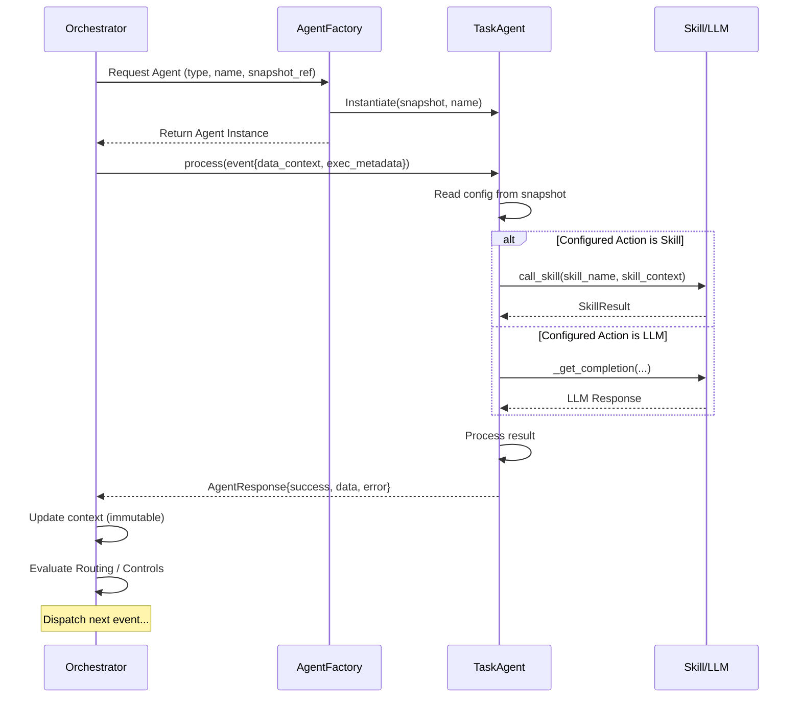
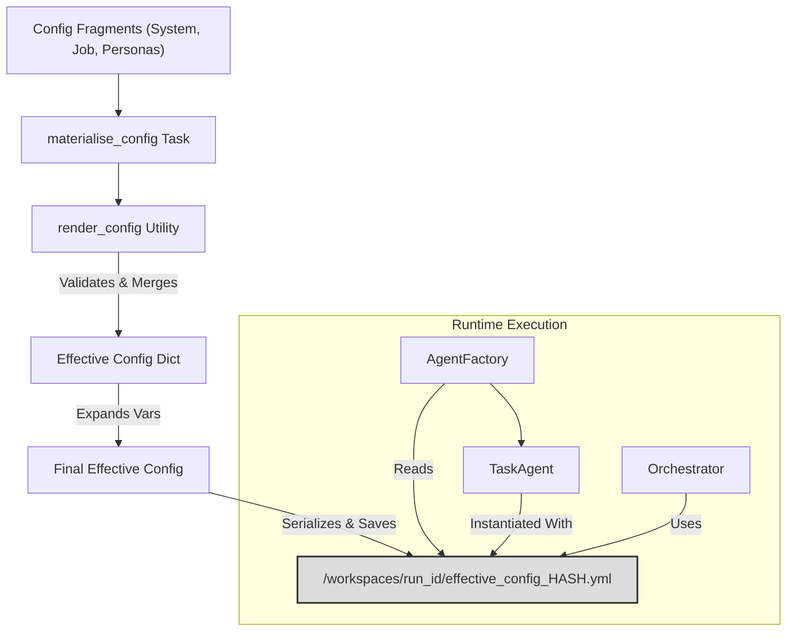

**Title: C4H: A Declarative Methodology for Deterministic AI System Building in Regulated Environments**

**Abstract:**

The proliferation of Large Language Models (LLMs) presents opportunities for automating complex tasks but introduces challenges in building reliable, predictable systems due to inherent non-determinism. This paper explores the philosophy and design of the C4H Agent System, positioning it not merely as another framework, but as a distinct **methodology** for constructing complex AI-driven systems. C4H employs a declarative, team-based approach inspired by organizational structures, separating process definition (the *what*) from execution mechanics (the *how*). Core principles include stateless agents, immutable configuration snapshots, skill-based capability decomposition, and totality in component interactions. We argue that this methodology facilitates process-level determinism, traceability, and reproducibility even when utilizing non-deterministic components like LLMs. This structured approach, prioritizing visibility and control, makes the C4H methodology particularly suitable for building and managing AI systems in regulated environments requiring high levels of assurance and auditability.

**1. Introduction: The Challenge of Reliable AI Systems**

Developing sophisticated applications leveraging LLMs and autonomous agents introduces significant architectural challenges. While capable, the probabilistic nature of LLMs makes achieving predictable, reliable, and auditable system behavior difficult. This is particularly problematic in regulated industries (e.g., finance, healthcare, critical software development) where traceability, reproducibility, and assurance are paramount.

Generic AI frameworks often provide toolkits and abstractions for building agentic applications but may lack an opinionated structure for managing complexity and ensuring process integrity. This paper introduces the C4H Agent System, not just as a specific implementation, but as a **declarative methodology** designed to address these challenges. C4H proposes a reasoning framework for decomposing complex tasks, orchestrating AI agents and skills, and achieving process-level predictability, drawing inspiration from established organizational principles. We will explore this philosophy, its core tenets, and its differentiation as a potential blueprint for building deterministic AI systems suitable for regulated contexts.

**2. The C4H Layered Perspective: Methodology vs. Implementation**

Conceptually, the C4H ecosystem can be viewed in layers:

1.  **Interface/Interaction Layer (e.g., "c4h-editor"):** Handles human interaction, requirements capture, translation into structured "Work Orders," and job management via APIs.
2.  **Declarative Methodology Layer:** The core philosophy, defining *how* work is structured and orchestrated using declarative definitions (typically YAML). This layer emphasizes a specific way of reasoning about process decomposition.
3.  **Reference Implementation Layer:** The concrete codebase (Python agents, skills, Prefect-based orchestrator, configuration utilities) that executes the processes defined by the declarative layer.

While the reference implementation demonstrates feasibility, the enduring value proposition of C4H lies in its **declarative methodology** layer. This methodology provides the stable abstraction, assuming the underlying tools and technologies (LLMs, libraries, orchestrators) will evolve over time.

The conceptual layers can be visualized as:

**3. Core Philosophy: Declarative Orchestration & Organizational Modeling**

C4H's methodology is founded on two pillars:

* **Declarative Definition:** Similar to how SQL declares the desired data outcome separate from the query execution plan, or how Spark code defines a logical DAG separate from the physical execution, C4H workflows are defined declaratively (primarily in YAML). This configuration specifies the teams involved, the tasks they perform, the agents assigned (via type and configuration/persona), and the control flow (routing, loops, parallelism) connecting them. This separates the *process logic* from the *execution code*.
* **Organizational Modeling:** The system decomposes work using an analogy to functional organizations:
    * **Teams:** Represent distinct stages, functions, or areas of responsibility within the workflow (e.g., Discovery, Solution Design, Coding, Assurance).
    * **Agents (e.g., `TaskAgent`):** Act as roles or actors within a team, executing specific tasks. Their behavior is not hardcoded but dynamically configured via personas loaded from immutable snapshots.
    * **Skills:** Represent specific, reusable capabilities or tools (e.g., file system interaction, code merging, data extraction) utilized by agents.
    * **Orchestrator:** Acts like a project manager or workflow system, directing tasks to the right teams based on the overall plan (the declarative config) and results.

This approach deliberately simplifies the *orchestration layer* (the YAML definition) by pushing domain-specific or task-specific complexity into the configuration of the Agents or the implementation of the Skills. It avoids monolithic workflow definitions by promoting modularity and clear responsibilities, mirroring effective organizational structures.

**4. Achieving Determinism and Reproducibility with Imperfect Components**

A key challenge with AI systems is managing the inherent non-determinism of LLMs. C4H does not eliminate this at the component level but seeks to establish **process-level determinism and reproducibility** through its architecture:

* **Immutable Effective Configuration Snapshots:** This is arguably the most critical element. Before a workflow run, all configuration fragments (system, environment, job, personas) are merged, validated, and persisted as a single, immutable snapshot. Every component (Orchestrator, Factory, Agents) uses *only* this snapshot for the duration of the run. This ensures that the configuration context is identical if the run is repeated, drastically reducing variability.
* **Declarative & Explicit Control Flow:** Defining the workflow path, routing conditions, loops, and parallel structures in the configuration makes the *intended* execution path predictable and repeatable.
* **Stateless Agents:** Agents do not retain state between invocations within a workflow run. All necessary information is passed via the event context (`data_context`, `execution_metadata`), relying on the orchestrator for state progression, which further enhances predictability.
* **Totality & Structured Responses:** By requiring agents and skills to return predictable `AgentResponse` or `SkillResult` objects and handle expected errors internally (Totality), the system avoids unpredictable exceptions disrupting the control flow, making error handling more deterministic.

While the output of an LLM call within an agent might still vary slightly between identical runs (unless strict sampling parameters are enforced), the *orchestration process itself* – the sequence of steps taken, the configuration applied at each step, and the evaluation of routing rules – is designed to be highly deterministic and reproducible thanks to these principles. The "organisational model" (Teams/Agents/Skills) provides the structure within which these mechanisms operate, ensuring clear handoffs and responsibilities, further contributing to a controlled process despite the nature of the underlying LLM units. It manages the *orchestration* deterministically.

The interaction during a workflow step can be visualized as:

**5. The Reference Implementation: Embodying the Principles**

The C4H codebase serves as a reference implementation that materializes this philosophy. It prioritizes:

* **Minimalism:** Agent logic is kept lean, focusing on interpreting configuration and dispatching to LLMs or Skills.
* **Functional Principles:** Emphasis on statelessness and immutability where practical.
* **Modularity & Low Coupling:** Clear separation between the orchestrator (Prefect flows), factory, generic agents, skills, configuration management, and lineage services. Standardized interfaces (`AgentResponse`, Skill contracts) reduce inter-component dependencies.

**6. Differentiation and Suitability for Regulated Environments**

Unlike general-purpose AI frameworks or toolkits (like LangChain) which provide building blocks for *any* application, C4H embodies a specific **methodology** tailored for building complex, intent-driven systems, particularly in the software domain. Its value lies in the **structured reasoning framework** it imposes.

This structure makes the C4H methodology well-suited for **regulated industries** due to its inherent focus on:

* **Auditability & Traceability:** The combination of configuration snapshots (showing exactly what config was used), detailed structured logging, lineage tracking (`BaseLineage`), and especially the planned orchestrator-driven event sourcing provides a comprehensive audit trail necessary for compliance.
* **Reproducibility:** The configuration snapshot is the key enabler here. A specific run can, in principle, be re-executed identically from an orchestration perspective by using its snapshot.
* **Process Visibility & Validation:** Declarative YAML workflows are more easily reviewed, validated against requirements, and version-controlled than complex imperative code. Schema validation adds a layer of structural correctness.
* **Change Management:** Changes to the process are explicitly managed through changes to the configuration files, which can be tracked and approved.
* **Assurance:** The modular design allows for dedicated "Assurance" or validation steps/skills to be inserted into the workflow at critical points if needed.

The configuration snapshot process is central to this:

**7. Conclusion**

C4H presents a methodology focused on building deterministic and auditable AI systems by applying organizational principles to agent orchestration. It separates the declarative definition of a process from its execution, pushes complexity into configurable components (agents/skills), and leverages immutable configuration snapshots to ensure reproducibility and traceability. While the underlying tools and LLMs will undoubtedly evolve, the C4H reasoning framework – defining complex work through teams, roles, capabilities, and declarative control flow – offers a potentially stable and robust approach, particularly valuable for developing and managing AI systems in regulated environments where assurance is paramount. It is a framework for thinking about and building software, designed for a future where AI components are integrated into controlled, verifiable processes.
