# The C4H AI-Intent-Driven SDLC Architecture

The C4H system facilitates an AI-augmented Software Development Lifecycle (SDLC) that begins with a high-level "Intent" and aims to produce tangible "Assets" (code, documents, configurations, etc.). This process is a blend of structured, "Team Processes" (which are more deterministic and guided) and agile, "Iterative Processes" (often powered by advanced LLMs or tools like the Claude Code CLI).

## Phase 0: Intent Definition & Work Order Creation (The "What")

**SDLC Equivalence**: Requirements Gathering, Project Initiation, Task Definition.

### C4H Process:

1. A user or external system defines an "Intent" – a high-level goal for what needs to be created or modified (e.g., "Refactor the authentication module for better security," "Add a new logging feature," "Generate API documentation for X service"). [8, 9]
2. This intent is captured and structured into "Requirements," including completion criteria, constraints (technical, security, organizational norms), and cultural considerations (coding standards). [6] This often happens through tools like the "Visual Prompt Studio / C4h_Editor." [11]
3. These structured requirements are formulated into one or more "Work Orders," the primary input for the C4H system. A Work Order includes:
   - `intent.description`: The detailed specification of the task. [3340]
   - `project.path`: The target codebase or project context. [3336]
   - `llm_config` (optional overrides): Specifies which LLMs/personas/skills to use for different parts of this specific Work Order. [3353]

**Key C4H Components**: User Interface (Editor), Work Order specification (`WorkOrder_Design_Guide.md`), API for job submission (`Config & Jobs Service API` [11]).

 

### Diagrams for Phase 0:

#### Simplified Process Flow:

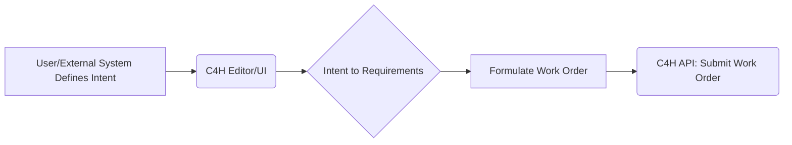

#### Conceptual Class Diagram for Work Order:

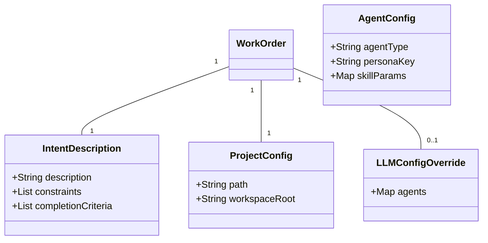

 

## Phase 1: Discovery & Contextual Understanding (The "Where and Current State")

**SDLC Equivalence**: Analysis, System Understanding, Impact Assessment (Initial).

### C4H Team Process ("Discovery Team"):

1. The C4H Orchestrator routes the Work Order to the "Discovery Team." [140, 2558]
2. This team's agent(s) use tools (e.g., CommandLineRunner executing tartxt.py or the "Claude Code" CLI) to scan the codebase and relevant documents.
   - A `GenericSkillAgent` (or similar) is invoked.
   - Its persona configures it to use a tool like the `CommandLineRunner` skill. [2231, 2232]
   - This skill might execute:
     - `tartxt.py`: To scan the codebase defined in `project.path` and `tartxt_config.input_paths` (including external design documents), generating a "codebase understanding model." [140, 3372, 3373, 3391]
     - **"Claude Code" CLI**: For more advanced, agentic discovery, the CLI could be invoked to analyze the codebase, identify relevant files, understand dependencies, and output a structured analysis. Claude Code's ability to "explore your codebase as needed" makes it powerful here.
3. The "Claude Code" CLI, if used here, performs its own "Iterative Process" to analyze the codebase agentically.

**Output**: A structured "Codebase Understanding Model" (e.g., project scan results).

**Key C4H Components**: Orchestrator, Discovery Agent (often a `GenericSkillAgent`), `CommandLineRunner` skill, `tartxt.py` or `claude-code` CLI, `system_config.yml` (for team/agent definitions), Personas (for discovery tools).

### Diagrams for Discovery Team:

#### Sequence Diagram (Illustrative - using CommandLineRunner):

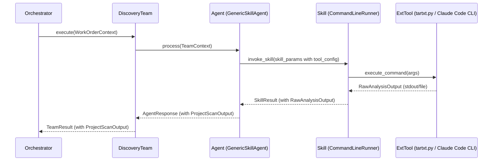

#### Class Diagram (Conceptual):

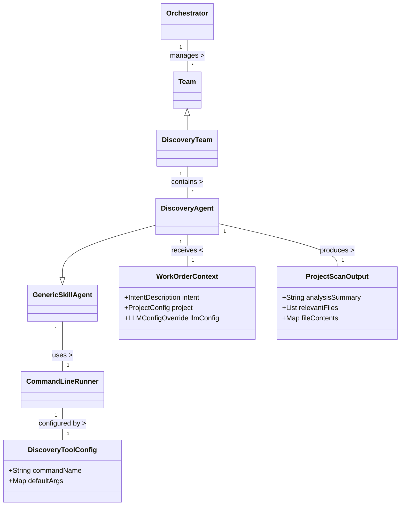

#### State Diagram (State of "Project Analysis" Data):

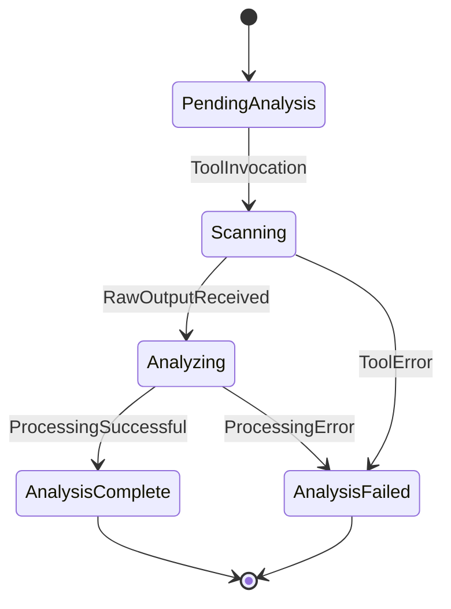

 

## Phase 2: Solution Design (The "How")

**SDLC Equivalence**: System Design, Architectural Design, Detailed Design, Planning.

### C4H Team Process ("Solution Design Team"):

1. The Orchestrator routes the Work Order (intent) and Discovery output to this team. [141]
2. An agent (typically GenericLLMAgent) uses a powerful LLM (API-based like Claude 3.x, or potentially the "Claude Code" CLI if prompted for design generation). [400]
3. The LLM performs an "Iterative Process" internally, reasoning about the inputs to generate a detailed solution plan:
   - Internally reasons, plans, and may even "self-critique" or "simulate sub-tasks" to arrive at a comprehensive solution design.
   - It generates a structured output, often a list of changes/diffs in a specific format (e.g., `===CHANGE_BEGIN===...===CHANGE_END===` blocks). [118, 119, 2225]
4. Multiple LLMs can be invoked in parallel (via separate C4H jobs) for comparative solution generation.

**Output**: A detailed Solution Design Document (e.g., structured text with diffs or file modification instructions).

**Key C4H Components**: Orchestrator, Solution Designer Agent (`GenericLLMAgent`), various LLM APIs (via `LiteLLM`) or "Claude Code" CLI, Personas (for solution design, prompt engineering is critical here).

### Diagrams for Solution Design Team:

#### Sequence Diagram (Illustrative - using GenericLLMAgent with API-based LLM):

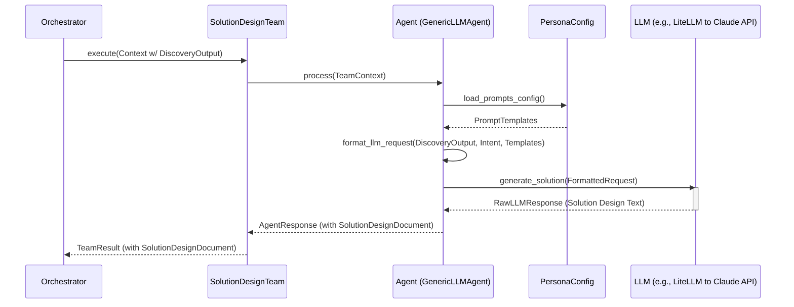

#### Class Diagram (Conceptual):

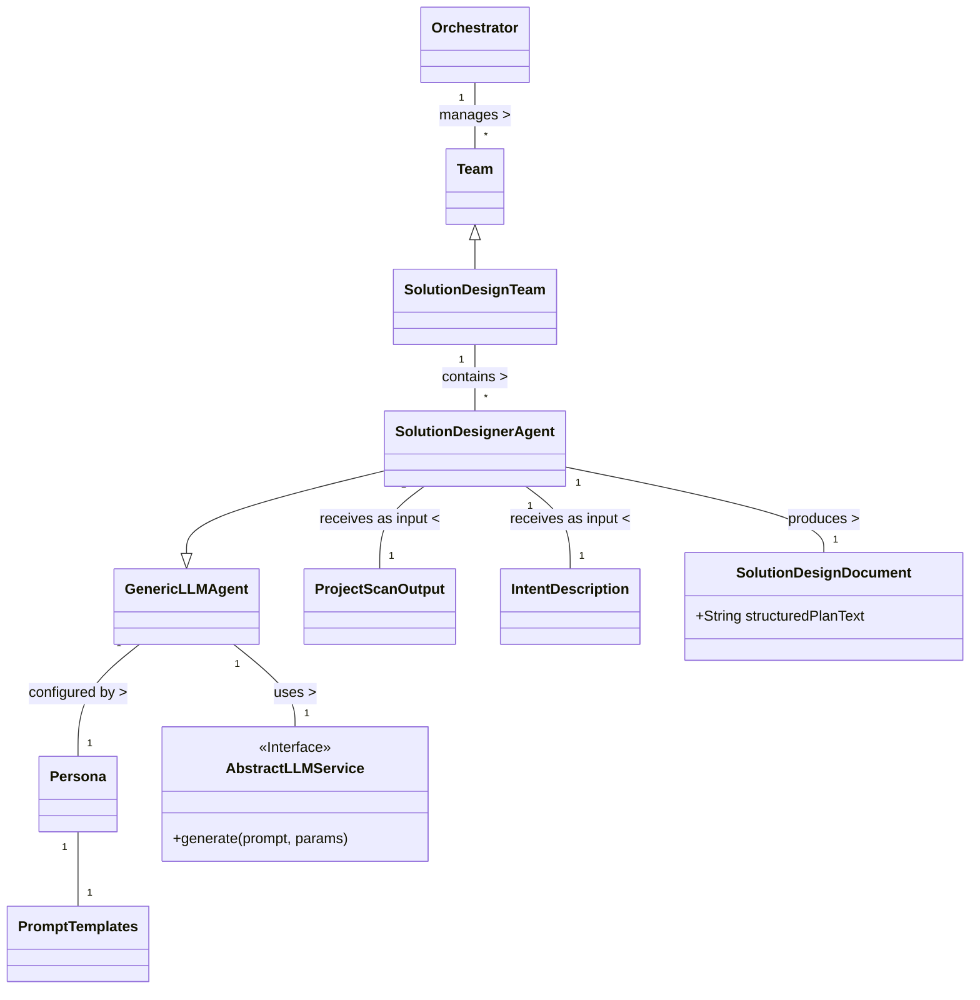

#### State Diagram (State of "Solution Design Document"):

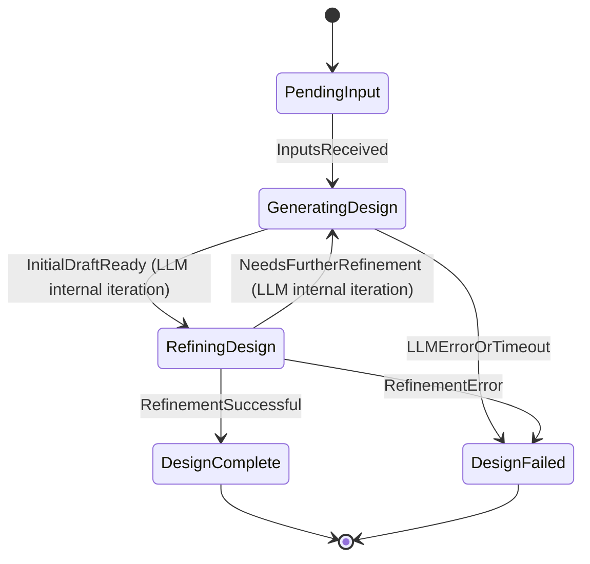

## Phase 3: Asset Generation/Implementation (The "Doing")

**SDLC Equivalence**: Coding, Implementation, Unit Development.

### C4H Team Process ("Coder Team"):

1. The Orchestrator routes the selected Solution Design Document to this team. [142]
2. A GenericSkillAgent is configured to use the CommandLineRunner skill, which in turn executes the "Claude Code" CLI.
3. The Coder agent prepares the *entire Solution Design Document* (the string of diffs/changes) and passes it to the "Claude Code" CLI.
4. The "Claude Code" CLI then performs its own "Iterative Process" to understand and apply all specified changes agentically across the codebase, using its internal tools:
   - Understand and apply each specified change across the codebase.
   - Leverage its context awareness of the project.
   - Use its built-in tools (file editing, bash commands, git operations) to modify files, potentially run linters/tests, and even commit changes if instructed.
   - It "fulfills the entire instruction" by managing the application of the full set of changes agentically.
   - This replaces the older C4H model where `SemanticIterator` and `AssetManager` would process each diff individually within a C4H-managed loop. [128, 129, 130, 131, 2237]

**Output**: Modified code files. Status reports from the "Claude Code" CLI.

**Key C4H Components**: Orchestrator, Coder Agent (`GenericSkillAgent`), `CommandLineRunner` skill, "Claude Code" CLI tool, Personas (for the Coder agent, configuring how it calls `CommandLineRunner`).

### Diagrams for Coder Team (using Claude Code CLI):

#### Sequence Diagram:

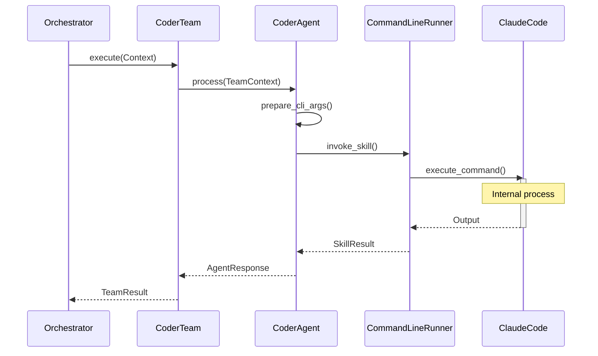

#### Class Diagram (Conceptual):

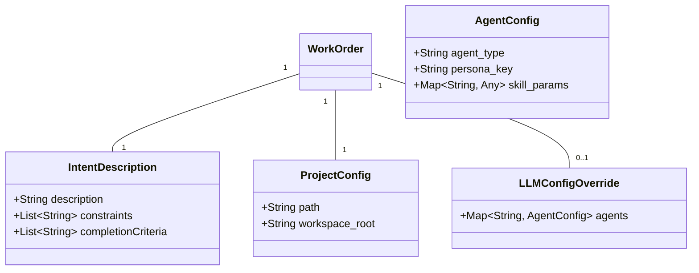

#### State Diagram (State of "Code Implementation via Claude Code CLI"):

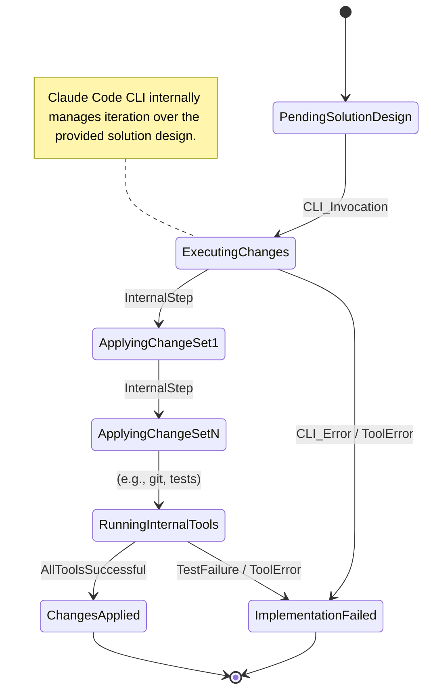

## Phase 4: Assurance & Completion (The "Checking & Done")

**SDLC Equivalence**: Testing (Unit, Integration, System), QA, Deployment, Release.

### C4H Process ("Assurance Team"):

1. The Orchestrator routes the modified code/context to this team. [3317]
2. Agents in this team might:
   - Run automated tests (e.g., a GenericSkillAgent using CommandLineRunner to execute test scripts).
   - Use an LLM (e.g., GenericLLMAgent) for code review against standards or the original intent.
   - Invoke "Claude Code" CLI for specific validation tasks if it has such capabilities.
3. Human-in-the-loop review can be integrated.
4. If issues are found, the workflow might loop back to Solution Design or Coder.

**Output**: Validated and completed "Asset."

**Key C4H Components**: Orchestrator, potentially dedicated Assurance Agents/Skills, testing frameworks, LLMs for review, `OpenLineageEvents` for audit trails. [11, 12]

### Diagrams for Assurance Team:

#### Sequence Diagram (Illustrative - mix of test execution and LLM review):

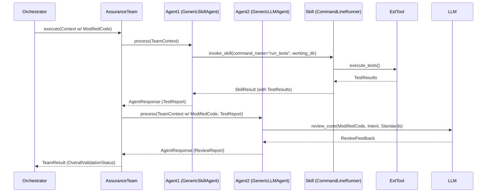

#### Class Diagram (Conceptual):

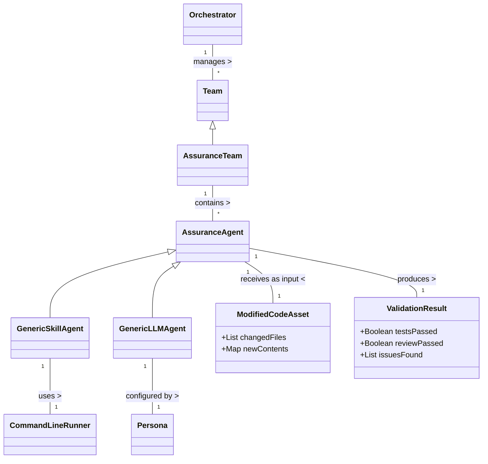

#### State Diagram (State of "Asset Validation"):

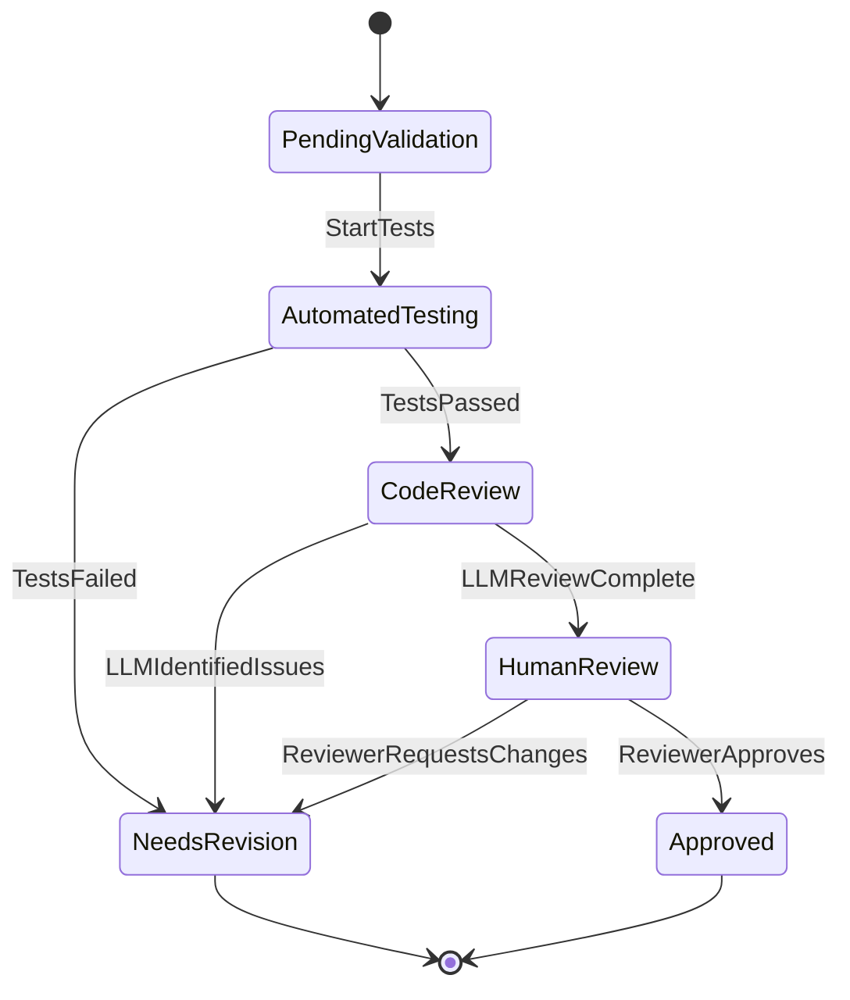

This detailed breakdown with diagrams provides a clear picture of how the C4H system orchestrates an intent-driven SDLC, effectively blending structured team processes with the dynamic, iterative capabilities of advanced AI tools like the Claude Code CLI.

 

## The Universal Pipeline Aspect

* **Intent as Starting Point:** The entire SDLC process, as managed by C4H, always starts from a defined "Intent." [8]
* **Composable Personas/Teams:** Different "personas" (configurations for agents) and "teams" (sequences of agent tasks) are plugged into the relevant SDLC phases.
* **Static + Dynamic Workflows:**
    * The overall sequence of C4H Teams (Discovery -> Solution Design -> Coder -> Assurance) provides a **static, guided workflow.**
    * Within each team, individual agents, especially when leveraging powerful tools like the "Claude Code" CLI or advanced API-based LLMs, can execute highly **dynamic and iterative sub-processes** to achieve their specific goals. This is the "Iterative Process" within the "Team Process" as per your page 8 diagram. [17, 18]
* **Configuration is Key:** The behavior of each phase and the tools used (e.g., which LLM, which CLI tool and how it's called) are all controlled via C4H's hierarchical configuration system (Work Orders, Personas, System Config). [3205]

This C4H model, therefore, provides a flexible framework to integrate various AI tools and methodologies into a formalized, intent-driven SDLC. The introduction of a powerful CLI tool like "Claude Code" primarily enhances the capabilities of the "Iterative Process" components within the established "Team Process" structure.

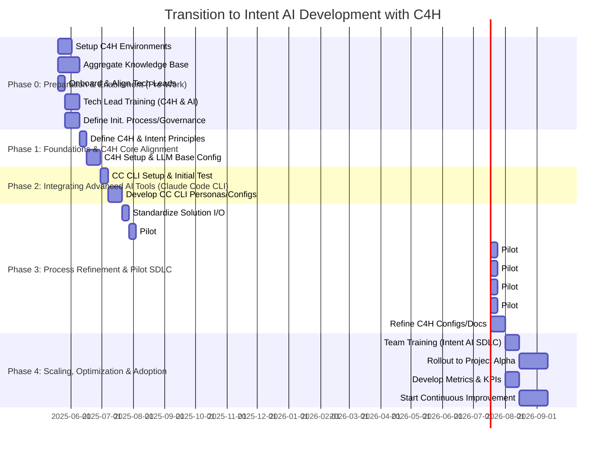
