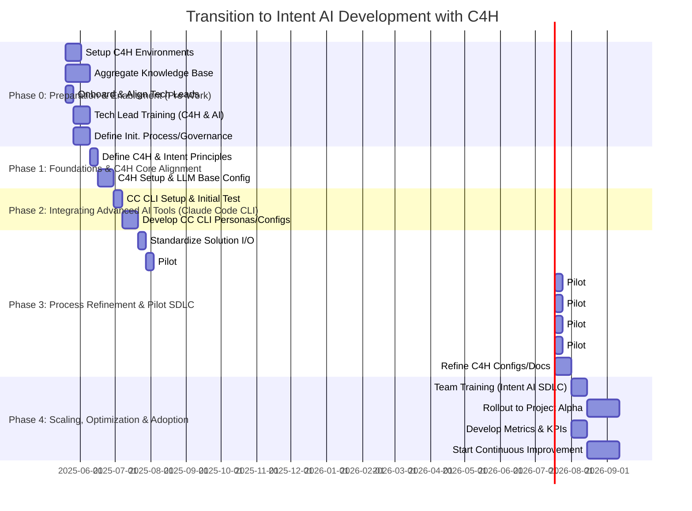

```mermaid
%%{init: {'gantt': {'taskFontSize': 10, 'taskMargin': 2}}}%%
gantt
    dateFormat  YYYY-MM-DD
    title Transition to Intent AI Development with C4H

    section Phase 0: Preparation & Enablement (Pre-Work)
    Setup C4H Environments        :P0T1, 2025-05-19, 2w
    Aggregate Knowledge Base      :P0T2, 2025-05-19, 3w
    Onboard & Align Tech Leads    :P0T3, 2025-05-19, 1w
    Tech Lead Training (C4H & AI) :P0T4, after P0T3, 2w
    Define Init. Process/Governance :P0T5, after P0T3, 2w

    section Phase 1: Foundations & C4H Core Alignment
    Define C4H & Intent Principles  :P1T1, after P0T5, 1w
    C4H Setup & LLM Base Config   :P1T2, after P1T1, 2w

    section Phase 2: Integrating Advanced AI Tools (Claude Code CLI)
    CC CLI Setup & Initial Test   :P2T1, after P1T2, 1w
    Develop CC CLI Personas/Configs :P2T2, after P2T1, 2w

    section Phase 3: Process Refinement & Pilot SDLC
    Standardize Solution I/O       :P3T1, after P2T2, 1w
    Pilot: Intent & Work Order     :P3S1, after P3T1, 1w
    Pilot: Discovery Phase         :P3S2, after P3S1, 1w
    Pilot: Solution Design (Multi-LLM) :P3S3, after P3S2, 1w
    Pilot: Coder (CC CLI)          :P3S4, after P3S3, 1w
    Pilot: Assurance Phase         :P3S5, after P3S4, 1w
    Refine C4H Configs/Docs        :P3T2, after P3S5, 2w

    section Phase 4: Scaling, Optimization & Adoption
    Team Training (Intent AI SDLC) :P4T1, after P3T2, 2w
    Rollout to Project Alpha       :P4T2, after P4T1, 4w
    Develop Metrics & KPIs         :P4T3, after P3T2, 2w
    Start Continuous Improvement   :P4T4, after P4T1, 4w

```
