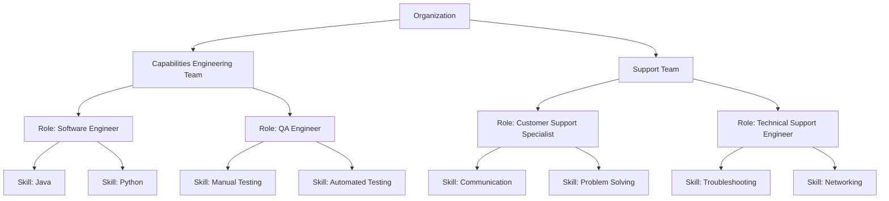

# C4H Framework Documentation

## Introduction

The C4H (Coder for Hire) Framework is a software development architecture that uses Large Language Models (LLMs) through structured agent-based systems. It provides tools and patterns for code refactoring, analysis, and generation tasks.

The framework combines software engineering principles with LLM capabilities by organizing autonomous agents into teams and roles based on corporate structures. This organization provides a practical model for managing complex programming tasks.

Key Features:
- Agent architecture based on team structures
- Standardized interfaces for agent collaboration
- Configurable deployment options
- Project-aware operations for context management
- LLM provider abstraction layer
- Built-in backup and safety systems

## Key Background Concepts

### Large Language Models (LLMs)

Large Language Models (LLMs) are deep neural networks trained on text corpora using transformer architectures. They provide the core text processing capabilities in the C4H framework.

#### Core LLM Concepts

**Prompting Mechanism:**
LLMs process input prompts to generate responses based on training data. Each prompt element acts as a constraint on possible responses, illustrated by the overlapping circles in the diagram above. Each circle represents a constraint, with the overlapping region showing the increased probability of desired outputs.

<svg width="400" height="400" xmlns="http://www.w3.org/2000/svg">
  <style>
    .venn { fill-opacity: 0.2; stroke-width: 2; }
    text { font-family: sans-serif; }
  </style>
  <!-- Four circles arranged to maximize the central overlap -->
  <circle cx="170" cy="170" r="80" class="venn" fill="red" stroke="black" />
  <circle cx="230" cy="170" r="80" class="venn" fill="green" stroke="black" />
  <circle cx="230" cy="230" r="80" class="venn" fill="blue" stroke="black" />
  <circle cx="170" cy="230" r="80" class="venn" fill="orange" stroke="black" />
  
  <!-- Central label for the overlapping region -->
  <text x="200" y="205" text-anchor="middle" font-size="16" fill="black">
     90%
  </text>

**Technical Components:**
- **Self-Attention:** Processes dependencies in sequences
- **Contextual Embeddings:** Maps semantic relationships
- **Token Generation:** Outputs text through probability selection

**Value:**
Understanding LLM behavior through the constraint model enables better prompt design and more predictable outcomes. This knowledge directly impacts how we structure agent prompts and manage complex tasks.

### Agent-Based Systems

The framework uses specialized software components (agents) that work together on complex tasks. Each agent performs specific operations based on defined inputs and rules.

#### Agent Characteristics

- **Autonomy:** Independent task execution
- **Interactivity:** Standard communication protocols
- **Adaptability:** Response to feedback and conditions

#### Role in C4H

Agents connect user requirements to LLM capabilities by:
- Managing prompt construction
- Maintaining operational context
- Coordinating multi-step tasks
- Ensuring output consistency

**Value:**
The agent-based approach allows complex tasks to be broken down into manageable, reusable components. This modularity enables easier testing, maintenance, and adaptation of the system.

### Skills

Skills are the fundamental building blocks of agent capabilities. They represent specific, atomic operations that agents can perform.

#### Core Characteristics
- **Atomic:** Each skill performs one specific operation
- **Reusable:** Skills can be shared across different agents
- **Composable:** Complex operations built from multiple skills
- **Testable:** Clear inputs and outputs for verification

#### Example Skills
- **Semantic Iterator:** Extracts structured information from text
- **Semantic Merge:** Combines code changes safely
- **Path Resolution:** Manages file system operations
- **Format Validation:** Verifies output structures

#### Implementation
```python
class BaseSkill:
    def __init__(self, config: Dict[str, Any] = None):
        self.config = config or {}
        
    async def execute(self, context: Dict[str, Any]) -> SkillResult:
        """Execute the skill's core functionality"""
        raise NotImplementedError()
```

**Value:**
Skills provide a granular way to build agent capabilities. This approach enables:
- Rapid development of new agents through skill composition
- Consistent behavior across similar operations
- Focused testing and validation
- Clear upgrade paths for individual capabilities

### Programming Paradigms

C4H combines two distinct computational approaches:

#### Deterministic Computation
- **Definition:** Operations that yield the same output for a given input by following fixed rules
- **Characteristics:**
  - Predictable and reproducible outcomes
  - Suitable for validation and verification
  - Essential for maintaining code consistency
- **Application in C4H:**
  Used for code validation, static analysis, and error detection

#### Probabilistic Computation
- **Definition:** Operations that produce outputs based on statistical models
- **Characteristics:**
  - Outputs derived from probability distributions
  - Adaptable to uncertainty and ambiguity
  - Enables creative problem-solving
- **Application in C4H:**
  Powers LLM-based code generation and adaptive learning modules

**Value:**
The combination of deterministic and probabilistic approaches allows C4H to leverage the strengths of both traditional programming and LLM capabilities, providing reliable execution while handling uncertainty in requirements and implementation.

## Organizational Structure

### Team-Based Architecture

C4H organizes agents into teams that deliver specific capabilities. Each team consists of roles, and each role is enabled by specific skills.

Key Elements:
1. Teams provide distinct capabilities
2. Roles define specialized functions
3. Skills enable specific operations



### Managing Complexity

The team structure provides several key benefits:
1. Teams separate distinct capabilities
2. Roles define clear responsibilities
3. Skills provide reusable components

This organization enables:
- Reuse of teams across similar problems
- Flexible role composition
- Skill sharing between roles
- Clear responsibility boundaries

### Attention Management

The team structure helps manage LLM attention constraints:
- Breaks large problems into focused components
- Limits context to relevant information
- Enables parallel processing where possible

**Value:**
This organizational approach provides clear boundaries for both human understanding and LLM processing, enabling efficient scaling of complex operations.

## Implementation

### Core Components

#### BaseAgent
```python
class BaseAgent:
    def __init__(self, config: Dict[str, Any] = None):
        self.config = config or {}
        self.logger = self._setup_logging()
        
    async def process(self, context: Dict[str, Any]) -> AgentResponse:
        """Process agent request"""
        try:
            self.logger.info("request_received", context=context)
            result = await self._process_internal(context)
            self.logger.info("request_completed", result=result)
            return result
        except Exception as e:
            self.logger.error("processing_failed", error=str(e))
            return AgentResponse(success=False, error=str(e))
```

#### Project Management
```python
class Project:
    def __init__(self, config: Dict[str, Any]):
        self.paths = ProjectPaths(config)
        self.metadata = ProjectMetadata(config)
        self.config = config

    @classmethod
    def from_config(cls, config_path: str) -> 'Project':
        """Create project from config file"""
        config = load_config(config_path)
        return cls(config)

    def resolve_path(self, path: str) -> Path:
        """Resolve project-relative path"""
        return self.paths.root / path
```

### Specialized Agents

#### Discovery Agent
Analyzes project structure and files:
```python
class DiscoveryAgent(BaseAgent):
    def _process_internal(self, context: Dict[str, Any]) -> AgentResponse:
        project_path = context.get("project_path")
        if not project_path:
            return AgentResponse(success=False, error="No project path provided")
            
        files = self._scan_project(project_path)
        return AgentResponse(
            success=True,
            data={"files": files}
        )
```

#### Solution Designer
Creates refactoring solutions:
```python
class SolutionDesigner(BaseAgent):
    async def _process_internal(self, context: Dict[str, Any]) -> AgentResponse:
        discovery_data = context.get("discovery_data")
        intent = context.get("intent")
        
        solution = await self._design_solution(discovery_data, intent)
        return AgentResponse(
            success=True,
            data={"changes": solution}
        )
```

### Configuration System

#### Provider Configuration
```yaml
providers:
  anthropic:
    api_base: "https://api.anthropic.com"
    default_model: "claude-3-opus-20240229"
    litellm_params:
      retry: true
      max_retries: 3
```

#### Agent Configuration
```yaml
llm_config:
  agents:
    discovery:
      provider: "anthropic"
      model: "claude-3-opus-20240229"
      temperature: 0
      prompts:
        system: "System prompt template"
        analyze: "Analysis prompt template"
```

### Integration Patterns

#### Basic Workflow
```python
async def refactor_code(project_path: str, intent: str):
    # Initialize agents
    discovery = DiscoveryAgent(config)
    designer = SolutionDesigner(config)
    coder = Coder(config)
    
    # Run workflow
    discovery_result = await discovery.process({"project_path": project_path})
    if not discovery_result.success:
        return discovery_result
        
    design_result = await designer.process({
        "discovery_data": discovery_result.data,
        "intent": intent
    })
    if not design_result.success:
        return design_result
        
    implementation_result = await coder.process({
        "changes": design_result.data["changes"]
    })
    return implementation_result
```

#### Error Handling
```python
class AgentError(Exception):
    def __init__(self, message: str, context: Dict[str, Any] = None):
        super().__init__(message)
        self.context = context or {}

def handle_agent_error(error: AgentError) -> AgentResponse:
    """Convert agent error to response"""
    return AgentResponse(
        success=False,
        error=str(error),
        data={"error_context": error.context}
    )
```

## Best Practices

### Configuration Management
1. Use hierarchical configuration
2. Keep secrets in environment variables
3. Validate configurations at startup
4. Use explicit defaults

### Error Handling
1. Log all errors with context
2. Use structured error types
3. Provide clear error messages
4. Maintain error chain information

### Testing
1. Test agent infrastructure separately
2. Mock LLM responses
3. Verify logging and error handling
4. Use integration tests for workflows

### Safety
1. Enable automatic backups
2. Validate all file operations
3. Use atomic changes where possible
4. Maintain audit logs

**Value:**
These practices ensure reliable operation while maintaining system maintainability and safety.

## What's Next

Current development areas:
1. Enhanced skill composition patterns
2. Improved error recovery mechanisms
3. Extended team collaboration patterns
4. Advanced LLM prompt optimization

Future considerations:
1. Dynamic team formation
2. Autonomous skill development
3. Cross-project learning
4. Advanced safety mechanisms