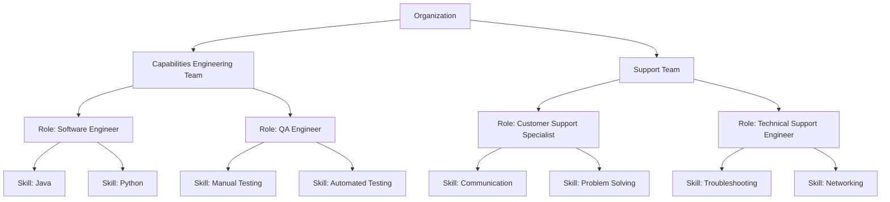
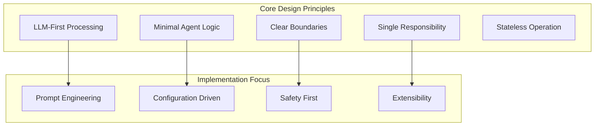
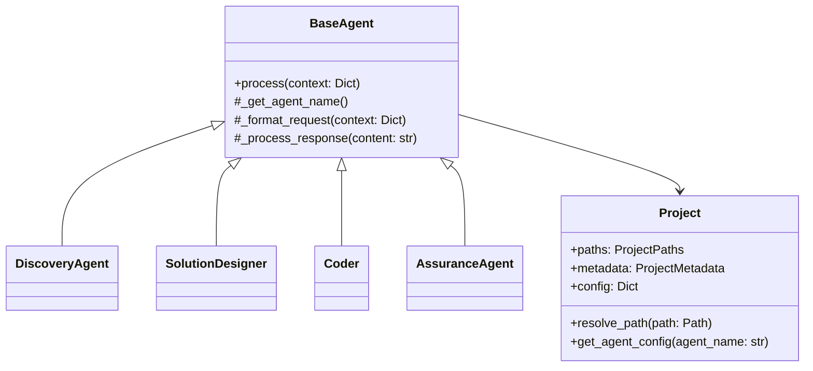
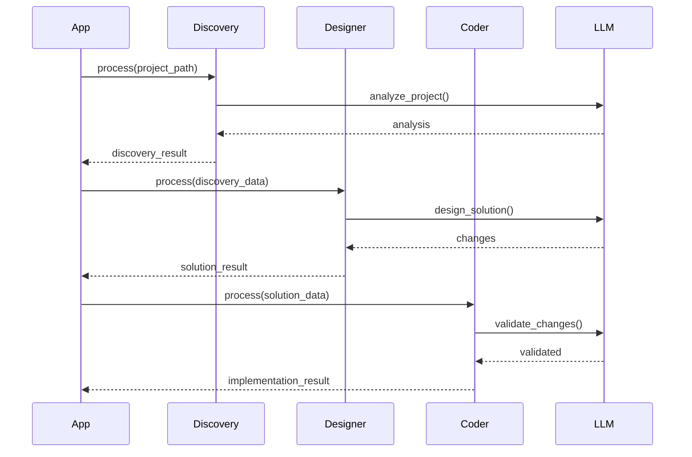

# C4H Domain Model

## Introduction

This document outlines the design of the *c4h* (coder for hire) framework. The framework is divided into four sections:
1. **Key Concepts:** 
2. **Agent Framework:** 
3. **C4H Programming Team:** 
4. **Roadmap:** 

## Key Background Concepts

### What are LLMs

#### Definition 
  Large Language Models (LLMs) are deep neural networks trained on extensive text corpora using transformer architectures.

#### Prompting
  LLMs are driven to take a 'Prompt' and respond to it based upon their vast training data. It does this by predicting the mostly likely next token (set of characters) to respond with.

  Intuitively you can think of Prompting as a query, with each prompt adding more search criteria. The more search criteria the narrower the set of possible responses, the higher the probabability of fiinding what you are after.

- Think of this as a Venn diagram, each circle represents a possible set of valid responses for a prompt, when you compound the prompts you're constraing the possible set of responses to which the LLM can generate.

<svg width="400" height="400" xmlns="http://www.w3.org/2000/svg">
  <style>
    .venn { fill-opacity: 0.2; stroke-width: 2; }
    text { font-family: sans-serif; }
  </style>
  <!-- Four circles arranged to maximize the central overlap -->
  <circle cx="170" cy="170" r="80" class="venn" fill="red" stroke="black" />
  <circle cx="230" cy="170" r="80" class="venn" fill="green" stroke="black" />
  <circle cx="230" cy="230" r="80" class="venn" fill="blue" stroke="black" />
  <circle cx="170" cy="230" r="80" class="venn" fill="orange" stroke="black" />
  
  <!-- Central label for the overlapping region -->
  <text x="200" y="205" text-anchor="middle" font-size="16" fill="black">
     90%
  </text>
</svg>

- **Core Mechanisms:**  
  - **Self-Attention:** Captures dependencies across long sequences to model context.
  - **Token Prediction:** Computes probabilities over a vocabulary to generate subsequent tokens.
  - **Contextual Embeddings:** Represents words in continuous vector spaces to capture semantic relationships.

- **Application in C4H:**  
  LLMs drive code generation, analysis, and natural language interfaces by translating contextual prompts into code snippets, debugging steps, or documentation.

### What are Agents

- **Definition:**  
  Agents are autonomous software modules designed to perform specific tasks based on inputs and internal rules.

  LLMs require a Prompt to drive them, that prompt represents the **intention** of the user. Agents are used to automate that user intenionality by providing configured prompts to trigger actions and responses.

- **Characteristics:**  
  - **Autonomy:** Execute tasks independently without continuous human intervention.
  - **Interactivity:** Communicate with other agents or systems through predefined protocols.
  - **Adaptability:** Modify behavior in response to feedback and changing operational conditions.

- **Application in C4H:**  
  Agents are structured into teams that mirror corporate hierarchies. Each agent is assigned a role defined by specific skills, enabling the system to modularly generate, validate, and optimize code.

### Two Types of Coding Paradigms

Programming in c4h leverages two distinct computation paradigms to address different aspects of code processing.

#### Deterministic vs Probabilistic Computation

- **Deterministic Computation:**  
  - **Definition:** This is traditional code like java or python, it is fully dismabiguated and will run in a deterministic predictable way. The main downside of deterministic computation is it needs to be coded to handle every single situation that arises. This means that any changes will cause deterministic code break, unless it has been coded to handle many situations.
  - **Characteristics:**  
    - Predictable and reproducible outcomes.
    - Runs on traditional computer systems.
  - **Application in C4H:**  
    C4h is written in python including all Agents and Skills.
    As per the Agent design principles 'Reasoning' behavior is passed to the LLM, BUT everything else is coded in python.

- **Probabilistic Computation:**  
  - **Definition:** Operations produce outputs based on statistical models, introducing variability even with identical inputs.
  - **Characteristics:**  
    - Outputs derived from probability distributions.
    - Suitable for handling uncertainty and ambiguity.
  - **Application in C4H:**  
    Underpins LLM-based code generation and adaptive learning modules, enabling flexible handling of incomplete or noisy data.
    As per Agent design principles all Agent reasoning is offloaded to the LLM.


# C4H Agent Framework
### Organisation

We will structure Agents around teams & roles in a coporations.

We are interested in the following aspects of an coporate style organisation
1. Hierachichy of *responsibility*.
2. Teams deliver *capabilities*.
3. The capabilities that a team delivers is made up by *roles*.
4. Each role has *skills* which enable it to do work.

To summarise:-
A Team has responsibility and capability.
A Team is composed of Roles, each Role having multiple Skills needed to fulfill its Role.




#### Managing Complexity

We use structure to manage the conceptual complexity.
1. Seperate teams around a singular capability.
2. Seperate agents around a specific set of skills.

This allows:-
1. Reusable teams across similar problem domains, e.g. Once we have an Engineering or Support team i can use it solve many similar kinds of problems.
1. We can reassemble teams around the roles I need.
1. We can build new roles from the skills we have implemented.

#### The Attention Mechanism

Why do we need to manage complexity with LLMs?

People have created coporate structures to manage complexity because they need to manage the set of *points* or *variables* required to think of and solve problems.

LLMs have similar constraints,
- the volume of data they can consider over
- the number of variables that will be incorporated into the solution

So we will use similar mechanisms for managing complexity with LLMs as with people.

This allows people to reason over and understand how they are configuring Agents and their capabilities.

Note though as LLMs evolve they will be able to reorganise themselves  far more efficiently than what people need to understand and will start to resemble highly efficient organic structures.

# Agent Design Principles

## Overarching Principles

1. **LLM-First Processing**
   - Offload most logic and decision-making to the LLM
   - Use LLM for verification and validation where possible
   - Template Configuration Over Code:
     - Maintain all prompts in configuration files rather than hard-coding
     - Simplifies prompt engineering and updates
   - Agents focus on:
     - Managing intent prompts
     - Processing responses
     - Managing local environment side effects

2. **Minimal Agent Logic**
   - Keep agent code focused on infrastructure concerns
   - Avoid embedding business logic in agents
   - Let LLM handle complex decision trees
   - Only transform data if essential for the agent's infrastructure role

## Implementation Principles

### 1. Single Responsibility
- Each agent has one clear, focused task
- No processing of tasks that belong to other agents
- Pass through data without unnecessary interpretation
- Item-agnostic components:
  - Avoid assumptions about item structure
  - Let caller define what to extract or transform
- Example: Discovery agent handles only file analysis, Solution Designer only creates prompts

### 2. Minimal Processing
- Default to passing data through to LLM
- Only transform data if it's core to the agent's infrastructure role
- Don't duplicate validation or processing done by other agents
- Let LLM handle data interpretation where possible

### 3. Clear Boundaries
- Discovery agent handles file analysis and scoping
- Solution Designer creates optimal prompts
- Semantic Iterator handles response parsing and iteration
- Configuration Inheritance Chain:
  - System-level config flows downward to each agent
  - Agents pass complete config to child components
- Use placeholder variables and clear format requirements
- Each agent trusts other agents' output
- No cross-agent validation

### 4. Logging Over Validation
- Focus on detailed logging for debugging
- Let calling agents handle validation
- Structured Logging & Metrics:
  - Include timestamps and correlation IDs
  - Log key events, inputs, and outputs
  - Provide enough detail to reconstruct actions
- Make agent behavior observable
- Reserve validation for infrastructure concerns only

### 5. Error Handling
- Handle only errors specific to infrastructure tasks
- Pass through errors from external services (like LLM)
- Provide clear error context in logs
- Don't swallow or transform errors unnecessarily
- Let LLM handle business logic errors

### 6. Stateless Operation
- Agents don't maintain state between operations
- Each request is self-contained
- State management happens at orchestration level
- Makes testing and debugging simpler
- Enables clean sequential processing

### 7. Composability
- Agents can be chained together
- Output format matches input format of next agent
- No hidden dependencies between agents
- Clean interfaces between agents
- All assumptions about data structures are explicit in contracts

### 8. Observable Behavior
- Extensive structured logging
- Clear input/output contracts
- Traceable request/response flow
- Debuggable operation
- Include tracing info when needed

### 9. Focused Testing
- Test only the agent's infrastructure responsibility
- Don't test downstream agent behavior
- Mock external services appropriately
- Test logging and error handling
- Don't test LLM decision logic
- Keep agent tests lean and focused on I/O handling

### 10. Forward-Only Flow
- Data flows forward through agent chain
- No backward dependencies
- Each agent adds its specific value
- Clean sequential processing
- Simplifies testing and debugging

## Practical Examples

### Good Agent Design
```python
class SolutionDesigner:
    async def process(self, context: Dict[str, Any]) -> AgentResponse:
        # Log receipt
        self.logger.info("design_request_received", intent=context.get('intent'))
        
        # Pass to LLM for processing
        return await self.llm.process(self._format_request(context))
```

## Benefits
- Simpler codebase
- Easier to maintain
- More flexible and adaptable
- Better separation of concerns
- Clearer responsibility boundaries
- More testable infrastructure
- Leverages LLM capabilities optimally

## Application Guidelines
1. When adding validation, ask "Is this infrastructure or business logic?"
2. When adding processing, ask "Could the LLM handle this?"
3. Keep agent code focused on:
   - Managing I/O
   - Logging
   - Infrastructure error handling
   - Environment interactions
4. Let the LLM handle:
   - Business validation
   - Code analysis
   - Decision making
   - Content transformation

The principles above produce a robust, testable, and adaptable environment for coding tasks, data extraction, and other automation scenarios while maintaining clean, modular, and maintainable agent-based systems.

# C4H Agents Library Documentation

## Table of Contents

1. [Introduction](#introduction)
2. [Design Principles](#design-principles)
3. [Architecture Overview](#architecture-overview)
4. [Core Components](#core-components)
5. [Agents](#agents)
6. [Skills](#skills)
7. [Integration Patterns](#integration-patterns)
8. [Configuration Guide](#configuration-guide)
9. [Best Practices](#best-practices)

## Introduction

The C4H Agents Library provides a framework for LLM-powered code refactoring with a focus on minimal agent logic and LLM-first processing. Built with modularity and extensibility in mind, it supports both standalone usage and integration into larger systems.

Key Features:
- Modular agent architecture
- Standardized interfaces
- Rich configuration system
- Project-aware operations
- LLM provider abstraction
- Built-in backup and safety features

## Summary Agennt Design Principles



1. **LLM-First Processing**
   - Leverage LLM capabilities for complex logic
   - Agent code focused on infrastructure
   - Trust LLM for decision-making

2. **Minimal Agent Logic**
   - Keep agent code infrastructure-focused
   - No business logic in agents
   - Configuration-driven behavior

3. **Clear Boundaries**
   - Each agent has focused responsibility
   - No cross-agent validation
   - Clean separation of concerns

## Architecture Overview



## Core Components

### BaseAgent
Core abstraction providing LLM interaction capabilities:

```python
from c4h_agents.agents.base import BaseAgent, AgentResponse

class CustomAgent(BaseAgent):
    def __init__(self, config: Dict[str, Any] = None):
        super().__init__(config=config)
    
    def _get_agent_name(self) -> str:
        return "custom_agent"
    
    def process(self, context: Dict[str, Any]) -> AgentResponse:
        # Agent-specific logic
        pass
```

Key Features:
- Automatic provider configuration
- Continuation handling
- Metrics tracking
- Standardized logging
- Project context awareness

### Project Model
Handles project structure and paths:

```python
from c4h_agents.core.project import Project, ProjectPaths

project = Project.from_config({
    "project": {
        "path": "/path/to/project",
        "workspace_root": "workspaces"
    }
})
```

Standard Paths:
- root: Project root directory
- workspace: Working files location
- source: Source code directory
- output: Output directory
- config: Configuration location

## Agents

### Discovery Agent
Analyzes project structure and files:

```python
from c4h_agents.agents.discovery import DiscoveryAgent

discovery = DiscoveryAgent(config={...})
result = discovery.process({
    "project_path": "/path/to/project"
})
```

Configuration:
```yaml
llm_config:
  agents:
    discovery:
      tartxt_config:
        script_path: "path/to/tartxt.py"
        input_paths: ["src", "tests"]
        exclusions: ["**/__pycache__/**"]
```

### Solution Designer
Creates refactoring solutions:

```python
from c4h_agents.agents.solution_designer import SolutionDesigner

designer = SolutionDesigner(config={...})
result = designer.process({
    "input_data": {
        "discovery_data": discovery_result.data,
        "intent": intent_description
    }
})
```

Response Format:
```python
{
    "success": bool,
    "data": {
        "changes": [
            {
                "file_path": str,
                "type": "create|modify|delete",
                "content": str,
                "description": str
            }
        ]
    }
}
```

### Coder Agent
Implements code changes with safety:

```python
from c4h_agents.agents.coder import Coder

coder = Coder(config={...})
result = coder.process({
    "input_data": solution_result.data
})
```

Features:
- Automatic backups
- Change validation
- Safe file handling
- Metrics tracking

## Skills

### Semantic Iterator
Extracts structured information:

```python
from c4h_agents.skills.semantic_iterator import SemanticIterator
from c4h_agents.skills.shared.types import ExtractConfig

iterator = SemanticIterator(config={...})
config = ExtractConfig(
    instruction="Extract instruction",
    format="json"
)

for item in iterator.configure(content, config):
    process_item(item)
```

Modes:
- Fast: Bulk extraction
- Slow: Sequential with validation
- Automatic fallback support

### Semantic Merge
Handles code merging:

```python
from c4h_agents.skills.semantic_merge import SemanticMerge

merger = SemanticMerge(config={...})
result = merger.process({
    "file_path": path,
    "original": original_content,
    "content": new_content
})
```

Features:
- Format preservation
- Safety checks
- Diff support
- Backup integration

## Integration Patterns

### Workflow Integration



### Prefect Integration

```python
from prefect import flow
from c4h_agents.agents.discovery import DiscoveryAgent
from c4h_agents.agents.solution_designer import SolutionDesigner
from c4h_agents.agents.coder import Coder

@flow
def refactor_workflow(project_path: Path, config: Dict[str, Any]):
    # Discovery
    discovery = DiscoveryAgent(config=config)
    discovery_result = discovery.process({
        "project_path": project_path
    })
    
    # Solution Design
    designer = SolutionDesigner(config=config)
    solution_result = designer.process({
        "input_data": {
            "discovery_data": discovery_result.data,
            "intent": config.get("intent")
        }
    })
    
    # Implementation
    coder = Coder(config=config)
    return coder.process({
        "input_data": solution_result.data
    })
```

## Configuration Guide

### Provider Configuration
```yaml
providers:
  anthropic:
    api_base: "https://api.anthropic.com"
    default_model: "claude-3-opus-20240229"
    litellm_params:
      retry: true
      max_retries: 3
```

### Agent Configuration
```yaml
llm_config:
  agents:
    agent_name:
      provider: "anthropic"
      model: "claude-3-opus-20240229"
      temperature: 0
      prompts:
        system: "System prompt"
        custom: "Custom prompt template"
```

### Project Configuration
```yaml
project:
  path: "/path/to/project"
  workspace_root: "workspaces"
  source_root: "src"
  output_root: "output"
```

## Best Practices

1. **Safety First**
   - Enable backups
   - Validate changes
   - Handle errors gracefully

2. **Configuration Management**
   - Use hierarchical config
   - Override selectively
   - Keep secrets in environment

3. **Error Handling**
   - Check response success
   - Log operations
   - Maintain context

4. **Project Context**
   - Use Project instance
   - Resolve paths properly
   - Maintain workspace structure

5. **LLM Integration**
   - Follow provider settings
   - Handle continuations
   - Use appropriate temperatures

6. **Agent Design**
   - Keep focused purpose
   - Minimal processing
   - Clear interfaces

---------------------

# Configuration Design Principles

## Overarching Principles

1. **Hierarchical Configuration**
   - All configuration follows a strict hierarchy
   - Base config provides defaults and templates
   - Override config adds or updates leaf nodes
   - Preserve structure during merges
   - Config paths follow consistent patterns (e.g., llm_config.agents.[name])

2. **Smart Merge Behavior**
   - Base config provides foundation
   - Override config can add new nodes
   - Override config can update leaf values
   - Preserve parent node structure
   - Don't break existing config paths

3. **Separation of Responsibilities**
   - config.py owns configuration management
   - BaseAgent provides config access methods
   - Each agent responsible for its own config section
   - No cross-agent config dependencies
   - Config handling isolated from business logic

## Implementation Principles

### 1. Config Location
- Clear hierarchical paths (e.g., llm_config.agents.[name])
- Consistent lookup patterns
- Fail gracefully with empty dict if not found
- Log lookup attempts and results
- Support project-based config overrides

### 2. Config Access
- Agents access only their own config section
- Use BaseAgent methods for config retrieval
- Get agent name for lookups
- Handle missing config gracefully
- Log config access patterns

### 3. Config Processing
- Process config at initialization
- Cache needed values
- Minimal runtime config lookups
- Log config state changes
- Handle config errors gracefully

### 4. Config Validation
- Basic structure validation in config.py
- Type validation where critical
- Log validation failures
- Fail fast on critical config missing
- Allow flexible extension

### 5. Config Resilience
- Handle missing config as critical failure
- Defaults only come from configuration hence merging behavior
- Log configuration issues
- Support runtime updates
- Maintain backward compatibility

## Practical Examples

### 1. Config Hierarchy
```yaml
llm_config:
  agents:
    solution_designer:  # Agent-specific section
      provider: "anthropic"
      model: "claude-3"
      prompts:
        system: "..."
        solution: "..."
      intent:
        description: "..."
```

### 2. Agent Config Access
```python
def _get_agent_config(self) -> Dict[str, Any]:
    """Get agent configuration - fails if not found"""
    agent_name = self._get_agent_name()
    agent_config = locate_config(self.config, agent_name)
    if not agent_config:
        raise ValueError(f"No configuration found for agent: {agent_name}")
    return agent_config
```

### 3. Smart Config Location
```python
def locate_config(config: Dict[str, Any], target_name: str) -> Dict[str, Any]:
    """Locate agent config or return empty dict"""
    try:
        path = ['llm_config', 'agents', target_name]
        result = get_by_path(config, path)
        return result if isinstance(result, dict) else {}
    except Exception as e:
        logger.error("config.locate_failed", error=str(e))
        return {}
```

## Benefits
- Clear configuration ownership
- Predictable config behavior
- Easy to extend and modify
- Resilient to changes
- Maintainable config structure
- Clear debugging paths
- Isolated responsibilities
- Higer level components remain generic
- No bleeding of business logic into higer order components

## Application Guidelines

1. When adding new config:
   - Follow existing hierarchy
   - Add to appropriate section
   - Maintain structure
   - Document the addition
   - Consider backward compatibility

2. When accessing config:
   - Use agent name for lookup
   - Access only owned section
   - Handle missing values
   - Log access patterns
   - Use BaseAgent methods

3. When merging config:
   - Preserve structure
   - Only override leaf nodes
   - Add new nodes as needed
   - Log merge results
   - Maintain hierarchy

4. When debugging config:
   - Check hierarchy path
   - Verify config merge
   - Look for log patterns
   - Validate structure
   - Check access methods