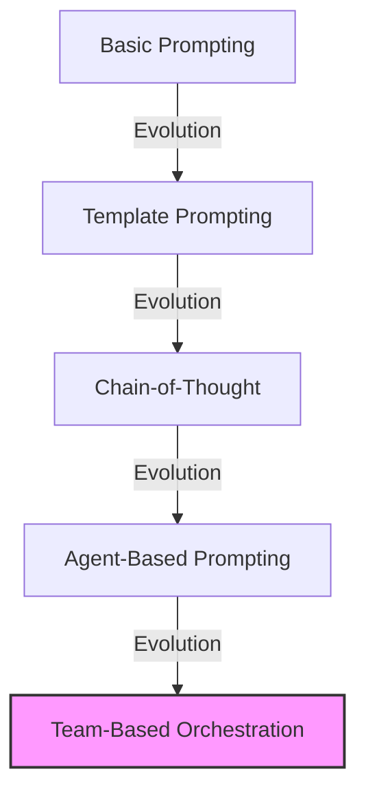
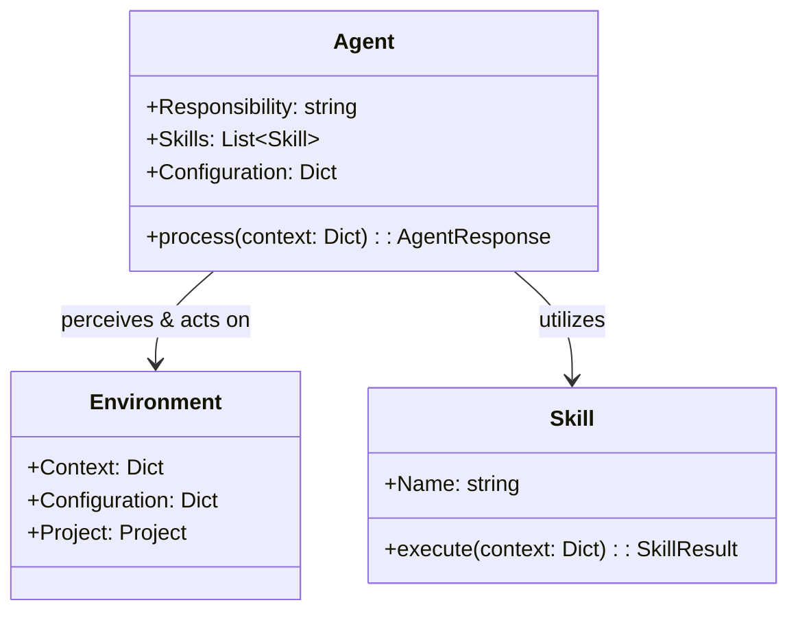
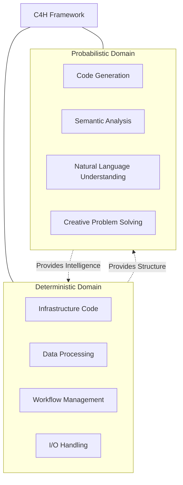
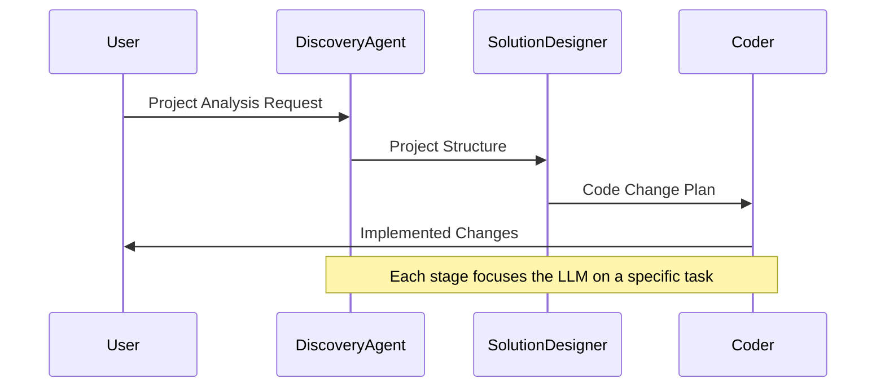
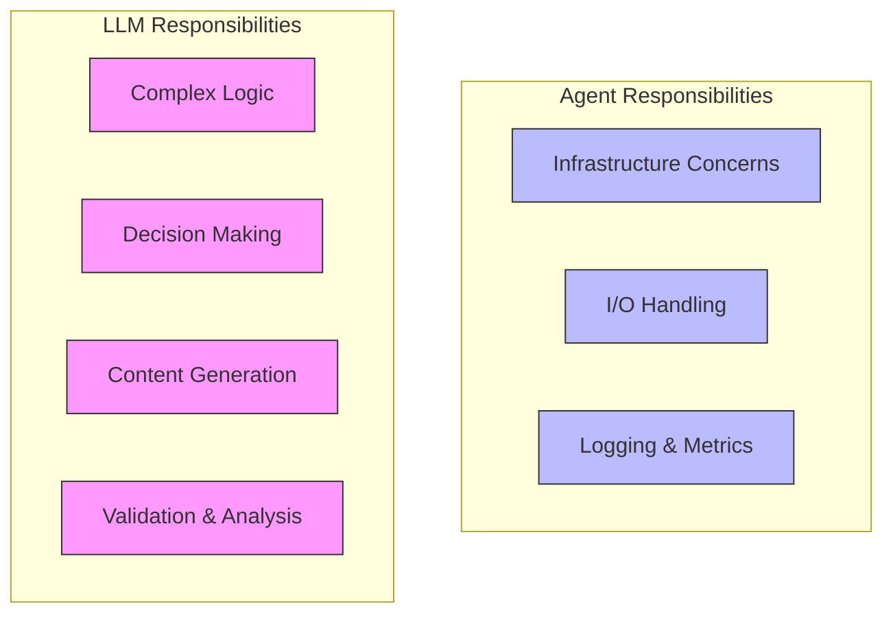
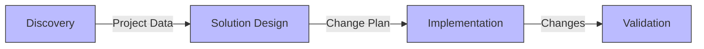
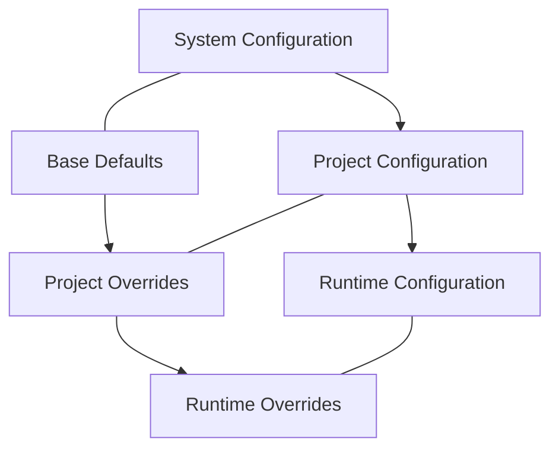

# C4H Domain Model - 2025 Edition

## Executive Summary

This document outlines the evolved design of the *c4h* (Coder For Hire) framework, which leverages Large Language Models (LLMs) and a sophisticated agent-based architecture to support code generation, analysis, and refactoring tasks. The framework has matured around several key organizing principles that ensure maintainability, extensibility, and reliable performance.

The C4H architecture is organized into five key sections:

1. **Key Concepts:** Explores the latest understanding of LLMs and Agents in software development contexts.
2. **Agent Framework:** Details the organization of agents, teams, roles, and skills within a hierarchical structure.
3. **Agent Design Principles:** Outlines the core principles that guide agent implementation and behavior.
4. **Configuration Management:** Describes how hierarchical configuration enables flexibility and maintainability.
5. **Integration Patterns:** Shows how the system works as a cohesive whole and can be deployed in different contexts.

This document serves as both a conceptual guide for architects and a practical reference for developers implementing or extending the C4H framework.

---

## Table of Contents

1. [Introduction](#introduction)
2. [Key Background Concepts](#key-background-concepts)
   - [LLMs in Software Development](#llms-in-software-development)
   - [Agent-Based Architectures](#agent-based-architectures)
   - [Complementary Computation Paradigms](#complementary-computation-paradigms)
3. [C4H Agent Framework](#c4h-agent-framework)
   - [Organizational Structure](#organizational-structure)
   - [Managing Complexity Through Composition](#managing-complexity-through-composition)
   - [Attention and Context Management](#attention-and-context-management)
4. [Agent Design Principles](#agent-design-principles)
   - [Overarching Principles](#overarching-principles)
   - [Implementation Principles](#implementation-principles)
   - [Code Examples](#code-examples)
5. [Configuration Design Principles](#configuration-design-principles)
   - [Hierarchical Configuration](#hierarchical-configuration)
   - [Smart Merging](#smart-merging)
   - [Configuration in Practice](#configuration-in-practice)
6. [Integration Patterns](#integration-patterns)
   - [Workflow Orchestration](#workflow-orchestration)
   - [Service Implementations](#service-implementations)
   - [Event Tracking and Lineage](#event-tracking-and-lineage)
7. [Implementation Reference](#implementation-reference)
   - [Core Components](#core-components)
   - [Agent Implementation](#agent-implementation)
   - [Skills Framework](#skills-framework)
   - [Configuration Management](#configuration-management)
8. [Best Practices](#best-practices)
   - [Development Guidelines](#development-guidelines)
   - [Testing Strategies](#testing-strategies)
   - [Deployment Considerations](#deployment-considerations)

---

## Introduction

The C4H framework has evolved significantly since its initial conception, moving from an experimental prototype to a production-ready system for LLM-powered software development. This document reflects the latest architecture, design principles, and implementation patterns that have emerged through extensive refinement and real-world usage.

The framework's design is guided by two complementary goals:
1. **Leveraging LLM Capabilities:** Maximizing the value of advanced language models for code generation and analysis.
2. **Maintaining Software Engineering Principles:** Ensuring the system remains maintainable, testable, and extensible despite the probabilistic nature of LLMs.

These goals are achieved through careful separation of concerns, clear boundaries between components, and a consistent approach to configuration and state management.

---

## Key Background Concepts

### LLMs in Software Development

Large Language Models have revolutionized approaches to code generation, analysis, and refactoring. C4H leverages these capabilities through a structured approach that combines deterministic control flow with probabilistic reasoning.

#### Evolution of LLM Prompting

Modern LLM usage has moved beyond simple prompt engineering to sophisticated prompt architecture:



*Figure: The evolution of LLM prompting techniques, with team-based orchestration representing C4H's current approach.*

#### Prompt Architecture in C4H

C4H implements a layered prompt architecture that separates concerns:

1. **System Prompts:** Define agent identity and core capabilities.
2. **Task Prompts:** Specify the particular task to be performed.
3. **Context Prompts:** Provide the specific information needed for the current operation.
4. **Format Prompts:** Control the structure of the output for downstream processing.

This architecture enables consistent agent behavior while allowing task-specific flexibility.

### Agent-Based Architectures

Agents in C4H are autonomous components designed around specific responsibilities. The architecture follows a modified PEAS (Performance measure, Environment, Actuators, Sensors) framework:



*Figure: The PEAS framework adapted for C4H agents, showing relationships between agents, skills, and environment.*

#### Key Characteristics of C4H Agents

- **Specialized Responsibility:** Each agent performs a specific task with clear boundaries.
- **Skill-Based Capabilities:** Functionality is broken down into composable skills.
- **Environment Awareness:** Agents operate within a well-defined context and project structure.
- **Configuration-Driven:** Behavior is controlled through hierarchical configuration.

### Complementary Computation Paradigms

C4H leverages two distinct computation paradigms to address different aspects of software development:

#### Deterministic Computation

- **Definition:** Traditional code execution with predictable outcomes for identical inputs.
- **Application in C4H:** All infrastructure concerns, I/O handling, state management, and workflow orchestration.
- **Benefits:** Reliability, testability, and maintainability for critical system components.

#### Probabilistic Computation

- **Definition:** Operations that produce outputs based on statistical models, introducing variability even with identical inputs.
- **Application in C4H:** Code generation, semantic analysis, natural language understanding, and creative problem-solving.
- **Benefits:** Flexibility to handle ambiguity, capability to generalize across diverse contexts.

#### Integration Strategy

C4H's architecture clearly delineates where each paradigm is applied:



*Figure: The complementary relationship between deterministic and probabilistic computation in C4H.*

This clear separation is embodied in the first agent design principle: "LLM-First Processing" - offloading decision-making complexity to the LLM while keeping infrastructure concerns in deterministic code.

---

## C4H Agent Framework

### Organizational Structure

The C4H framework organizes agents into a hierarchical structure inspired by corporate team organization:

```mermaid
graph TD
    Org[C4H Framework]
    
    Org --> DiscoveryTeam[Discovery Team]
    Org --> SolutionTeam[Solution Design Team]
    Org --> ImplementationTeam[Implementation Team]
    Org --> AssuranceTeam[Assurance Team]
    
    DiscoveryTeam --> FileAnalyst[Role: File Analyst]
    DiscoveryTeam --> StructureAnalyst[Role: Structure Analyst]
    
    SolutionTeam --> ArchDesigner[Role: Architecture Designer]
    SolutionTeam --> CodeDesigner[Role: Code Designer]
    
    ImplementationTeam --> CodeWriter[Role: Code Writer]
    ImplementationTeam --> Integrator[Role: Integrator]
    
    AssuranceTeam --> Validator[Role: Validator]
    AssuranceTeam --> Tester[Role: Tester]
    
    FileAnalyst --> FileIO[Skill: File I/O]
    FileAnalyst --> PathResolution[Skill: Path Resolution]
    
    StructureAnalyst --> DependencyAnalysis[Skill: Dependency Analysis]
    StructureAnalyst --> PatternRecognition[Skill: Pattern Recognition]
    
    CodeDesigner --> SemanticExtraction[Skill: Semantic Extraction]
    CodeDesigner --> CodeGeneration[Skill: Code Generation]
    
    CodeWriter --> SemanticMerge[Skill: Semantic Merge]
    CodeWriter --> BackupManagement[Skill: Backup Management]
    
    Validator --> ChangeValidation[Skill: Change Validation]
    Validator --> ErrorDetection[Skill: Error Detection]
    
    style Org fill:#f9f,stroke:#333,stroke-width:2px
    style FileIO fill:#bbf,stroke:#333
    style SemanticExtraction fill:#bbf,stroke:#333
    style SemanticMerge fill:#bbf,stroke:#333
    style BackupManagement fill:#bbf,stroke:#333
```



*Figure: C4H's organizational structure showing teams, roles, and skills.*

This structure provides several key benefits:

1. **Clear Responsibility Boundaries:** Each team and role has a defined area of concern.
2. **Skill Composition:** Complex capabilities are built by combining simpler skills.
3. **Independent Development:** Teams can be developed and tested independently.
4. **Flexible Deployment:** Teams can be reconfigured or replaced based on specific needs.

### Managing Complexity Through Composition

C4H manages complexity through composition at multiple levels:

#### 1. Component Composition

The framework uses a layered approach to building functionality:

```
Skills → Roles → Teams → Workflows
```

Each layer composes elements from the layer below, providing increasingly complex capabilities while maintaining manageable code units.

#### 2. Context Composition

Agents process context objects that are composed and enriched as they flow through the system:

```python
# Initial context creation
context = {
    "project_path": "/path/to/project",
    "intent": intent_description,
    "workflow_run_id": workflow_id
}

# Discovery agent enhances context
discovery_result = discovery_agent.process(context)
enhanced_context = {
    **context,
    "discovery_data": discovery_result.data
}

# Solution designer further enhances context
solution_result = solution_designer.process(enhanced_context)
final_context = {
    **enhanced_context,
    "solution_data": solution_result.data
}
```

This approach allows each agent to focus on its specific task while building on the work of previous agents.

#### 3. Configuration Composition

Configuration is composed through a hierarchical structure with smart merging:

```yaml
# Base configuration (system_config.yml)
llm_config:
  providers:
    anthropic:
      api_base: "https://api.anthropic.com"
      default_model: "claude-3-opus-20240229"
  
  agents:
    discovery:
      temperature: 0
      prompts:
        system: "You are a discovery agent..."

# Project-specific override (project_config.yml)
llm_config:
  providers:
    anthropic:
      default_model: "claude-3-5-sonnet-20241022"
  
  agents:
    discovery:
      prompts:
        system: "You are an enhanced discovery agent..."
```

When merged, the project configuration selectively overrides parts of the base configuration while preserving the overall structure.

### Attention and Context Management

Managing attention and context is critical when working with LLMs, which have finite context windows. C4H uses several strategies to optimize LLM performance:

#### 1. Focused Prompt Design

Each agent uses carefully designed prompts that focus the LLM's attention on the specific task at hand:

```yaml
prompts:
  system: |
    You are a specialized solution designer focused specifically on:
    1. Creating precise code modifications
    2. Maintaining existing code structure and style
    3. Implementing the requested changes with minimal disruption
    
    Your ONLY responsibility is to design code changes, not implement them.
```

#### 2. Context Pruning

Agents selectively include only relevant information in their LLM requests:

```python
def _format_request(self, context: Dict[str, Any]) -> str:
    """Format solution design request with only needed context"""
    # Extract only the necessary parts from discovery data
    discovery_data = context.get('discovery_data', {})
    relevant_files = self._filter_relevant_files(
        discovery_data.get('files', {}),
        context.get('intent', {})
    )
    
    return self._get_prompt('solution').format(
        relevant_files=relevant_files,
        intent=context.get('intent', {}).get('description', '')
    )
```

#### 3. Staged Processing

Complex tasks are broken down into stages to manage context effectively:



*Figure: The staged processing approach in C4H, breaking down complex tasks into manageable chunks.*

This approach mirrors how human teams handle complex projects, with each specialist focusing on their area of expertise while coordinating through well-defined interfaces.

---

## Agent Design Principles

### Overarching Principles

The C4H framework is built around two fundamental principles that guide all agent implementations:

#### 1. LLM-First Processing



*Figure: Clear separation of responsibilities between agent code and LLM.*

This principle entails:
- Offloading complex logic and decision-making to the LLM
- Keeping agent code focused on infrastructure concerns
- Using configuration-driven templates for prompt engineering
- Letting the LLM handle validation and analysis where possible

#### 2. Minimal Agent Logic

Agents maintain minimal processing logic, focusing instead on:
- Managing I/O and environment interactions
- Handling error conditions related to infrastructure
- Providing appropriate context to the LLM
- Processing LLM responses into standardized formats

This principle ensures agents remain simple, testable, and maintainable while leveraging the full power of LLMs.

### Implementation Principles

The implementation of C4H agents follows several key principles that ensure consistency and maintainability:

#### 1. Single Responsibility

Each agent has one clear, focused task and does not handle responsibilities that belong to other agents:

```python
class DiscoveryAgent(BaseAgent):
    """Responsible ONLY for analyzing project structure."""
    
    def process(self, context: Dict[str, Any]) -> AgentResponse:
        # Extract project path
        project_path = self._resolve_project_path(context)
        
        # Analyze project files
        files_result = self._run_tartxt(project_path)
        
        # Return structured discovery result
        return AgentResponse(
            success=files_result.success,
            data={"files": files_result.files, "project_path": str(project_path)},
            error=files_result.error
        )
```

#### 2. Clear Boundaries

Agents maintain clean interfaces and don't make assumptions about other agents:

```python
# SolutionDesigner doesn't need to know how DiscoveryAgent works
# It only needs to understand the structure of discovery_data
solution_result = solution_designer.process({
    "discovery_data": discovery_result.data,
    "intent": intent_description
})

# Coder doesn't need to know how SolutionDesigner works
# It only needs to understand the structure of solution_data
coder_result = coder.process({
    "solution_data": solution_result.data
})
```

#### 3. Stateless Operation

Agents don't maintain state between operations, making them easier to test and debug:

```python
# Each call to process() is self-contained
result1 = agent.process(context1)
result2 = agent.process(context2)  # Completely independent of result1

# State is passed explicitly through context objects
context3 = {**context2, "previous_result": result2.data}
result3 = agent.process(context3)
```

#### 4. Observable Behavior

Agents provide detailed logging and metrics to make their behavior observable:

```python
def process(self, context: Dict[str, Any]) -> AgentResponse:
    try:
        logger.info("agent.processing_start", 
                   agent_type=self._get_agent_name(),
                   context_keys=list(context.keys()))
        
        # Process the request
        result = self._process_internal(context)
        
        # Log the result
        logger.info("agent.processing_complete",
                   agent_type=self._get_agent_name(),
                   success=result.success,
                   result_keys=list(result.data.keys()) if result.data else None)
        
        return result
    except Exception as e:
        logger.error("agent.processing_failed",
                    agent_type=self._get_agent_name(),
                    error=str(e))
        return AgentResponse(success=False, data={}, error=str(e))
```

#### 5. Forward-Only Flow

Data flows forward through the agent chain without backward dependencies:



*Figure: Forward-only data flow in the C4H agent chain.*

### Code Examples

Here are practical examples of C4H's agent design principles in action:

#### Example 1: Template Configuration Over Code

Instead of hardcoding prompts:

```python
# BAD: Hardcoded prompt
def get_system_prompt(self):
    return """You are a discovery agent that analyzes project structure..."""
```

C4H uses configuration-driven templates:

```python
# GOOD: Configuration-driven approach
def _get_system_message(self) -> str:
    """Get system message from configuration"""
    return self.config.get("llm_config", {}).get("agents", {}).get(
        self._get_agent_name(), {}).get("prompts", {}).get("system", "")
```

This makes prompt engineering easier and separates it from code changes.

#### Example 2: Item-Agnostic Components

Rather than components with hardcoded knowledge of specific data structures:

```python
# BAD: Component with hardcoded knowledge
def extract_changes(self, content: str) -> List[Dict]:
    """Extract change objects with specific structure"""
    changes = []
    # Specialized code to extract file_path, type, content, etc.
    return changes
```

C4H uses generic extraction with caller-defined structure:

```python
# GOOD: Generic extraction with caller-defined structure
def extract(self, content: str, instruction: str, format_hint: str) -> ExtractResult:
    """Extract structured data based on caller's instructions"""
    return self._extract_with_llm(content, instruction, format_hint)
```

This approach allows the same components to be reused across different contexts.

#### Example 3: Explicit Over Implicit

Instead of hidden assumptions:

```python
# BAD: Implicit assumptions
def _format_request(self, context):
    # Assumes context has discovery_data with specific structure
    files = context["discovery_data"]["files"]
    return f"Analyze these files: {files}"
```

C4H uses explicit parameters and graceful fallbacks:

```python
# GOOD: Explicit parameters with fallbacks
def _format_request(self, context: Dict[str, Any]) -> str:
    """Format request with explicit access and fallbacks"""
    discovery_data = context.get('discovery_data', {})
    files = discovery_data.get('files', {})
    
    return self._get_prompt('solution').format(
        files=files,
        intent=context.get('intent', {}).get('description', '')
    )
```

This approach makes dependencies clear and avoids runtime errors.

---

## Configuration Design Principles

### Hierarchical Configuration

C4H uses a hierarchical configuration system that provides flexibility while maintaining structure:



*Figure: The configuration hierarchy in C4H, showing multiple levels of overrides.*

#### Key Configuration Principles

1. **Hierarchical Structure:** Configuration follows a strict hierarchy that maintains parent-child relationships.
2. **Smart Merging:** Overrides affect only specified nodes while preserving overall structure.
3. **Separation of Responsibilities:** Each agent accesses only its own configuration section.
4. **Path-Based Access:** Configuration is accessed using standardized path patterns.

### Smart Merging

C4H's configuration system uses smart merging to combine multiple configuration sources:

```python
def deep_merge(base: Dict[str, Any], override: Dict[str, Any]) -> Dict[str, Any]:
    """
    Deep merge dictionaries preserving hierarchical structure.
    
    Rules:
    1. Preserve hierarchy (like llm_config.agents)
    2. Override values take precedence
    3. Dictionaries merged recursively
    4. Lists from override replace lists from base
    5. None values in override delete keys from base
    """
    result = deepcopy(base)
    try:
        for key, value in override.items():
            if value is None:
                result.pop(key, None)
                continue
            if key not in result:
                result[key] = deepcopy(value)
                continue
            if isinstance(value, collections.abc.Mapping):
                result[key] = deep_merge(result[key], value)
            else:
                result[key] = deepcopy(value)
        return result
    except Exception as e:
        logger.error("config.merge.failed", error=str(e))
        raise
```

This approach allows precise control over configuration overrides while maintaining the overall structure.

### Configuration in Practice

Here's how C4H's configuration principles apply in practice:

#### 1. Agent Configuration Access

Agents access their configuration through standardized methods:

```python
def _get_agent_config(self) -> Dict[str, Any]:
    """Get this agent's configuration section"""
    agent_name = self._get_agent_name()
    agent_config = locate_config(self.config, agent_name)
    if not agent_config:
        raise ValueError(f"No configuration found for agent: {agent_name}")
    return agent_config
```

This ensures each agent only accesses its own configuration section.

#### 2. Hierarchical Path Queries

Configuration is accessed using path-based queries:

```python
def locate_config(config: Dict[str, Any], target_name: str) -> Dict[str, Any]:
    """Locate configuration using strict hierarchical path"""
    try:
        # Use the ConfigNode for more advanced lookup
        config_node = ConfigNode(config)
        standard_path = f"llm_config.agents.{target_name}"
        result = config_node.get_value(standard_path)
        
        if result is not None and isinstance(result, dict):
            logger.debug("config.located_in_hierarchy", 
                        target=target_name, 
                        path=standard_path)
            return result
            
        # Try wildcard search as fallback
        wildcard_path = f"*.agents.{target_name}"
        matches = config_node.find_all(wildcard_path)
        if matches:
            result_path, result_value = matches[0]
            logger.debug("config.located_with_wildcard", 
                        target=target_name, 
                        path=result_path)
            return result_value
            
        logger.warning("config.not_found_in_hierarchy", 
                      target=target_name)
        return {}
    except Exception as e:
        logger.error("config.locate_failed", error=str(e))
        return {}
```

This provides flexibility while maintaining a consistent approach to configuration access.

#### 3. Configuration Validation

C4H validates configuration to ensure required values are present:

```python
def validate_config(config: Dict[str, Any]) -> List[str]:
    """Validate configuration and return list of errors"""
    errors = []
    
    # Check for required top-level sections
    if "llm_config" not in config:
        errors.append("Missing required section: llm_config")
    
    # Check for required provider configuration
    providers = config.get("llm_config", {}).get("providers", {})
    if not providers:
        errors.append("No LLM providers configured")
    
    # Validate specific provider configurations
    for provider_name, provider_config in providers.items():
        if "default_model" not in provider_config:
            errors.append(f"Provider {provider_name} missing default_model")
    
    return errors
```

This helps catch configuration issues early before they cause runtime errors.

---

## Integration Patterns

### Workflow Orchestration

C4H supports flexible workflow orchestration through both team-based and prefect-based approaches:

#### Team-Based Orchestration

Teams are organized into a workflow that processes requests sequentially:

```python
class Orchestrator:
    """Manages execution of team-based workflows"""
    
    def execute_workflow(self, entry_team: str, context: Dict[str, Any]) -> Dict[str, Any]:
        """Execute a workflow starting from the specified team"""
        current_team_id = entry_team
        team_results = {}
        
        # Execute teams in sequence
        while current_team_id and team_count < max_teams:
            team = self.teams[current_team_id]
            
            # Execute the team
            team_result = team.execute(context)
            team_results[current_team_id] = team_result
            
            # Update context with team result
            context.update(team_result.get("data", {}))
            
            # Get next team
            current_team_id = team_result.get("next_team")
        
        return {
            "status": "success",
            "team_results": team_results,
            "data": context
        }
```

This approach provides a simple, sequential workflow with built-in context propagation.

#### Prefect-Based Orchestration

For more complex workflows, C4H integrates with Prefect for advanced orchestration:

```python
@flow(name="intent_refactoring")
def run_intent_workflow(
    project_path: Path,
    intent_desc: Dict[str, Any],
    config: Dict[str, Any]
) -> Dict[str, Any]:
    """Main workflow for intent-based refactoring"""
    
    # Configure tasks
    discovery_config = create_discovery_task(config)
    solution_config = create_solution_task(config)
    coder_config = create_coder_task(config)
    
    # Run discovery with state tracking
    discovery_result = run_agent_task(
        agent_config=discovery_config,
        context={"project_path": str(project_path)}
    )
    
    # Run solution design
    solution_result = run_agent_task(
        agent_config=solution_config,
        context={
            "input_data": {
                "discovery_data": discovery_result["result_data"],
                "intent": intent_desc
            }
        }
    )
    
    # Run coder
    coder_result = run_agent_task(
        agent_config=coder_config,
        context={
            "input_data": solution_result["result_data"]
        }
    )
    
    # Return final result
    return {
        "status": "success",
        "stages": {
            "discovery": discovery_result,
            "solution_design": solution_result,
            "coder": coder_result
        }
    }
```

This approach provides advanced features like retry handling, parallelization, and monitoring.

### Service Implementations

C4H can be deployed as a service using FastAPI:

```python
@app.post("/api/v1/workflow", response_model=WorkflowResponse)
async def run_workflow(request: WorkflowRequest):
    """Execute a team-based workflow"""
    try:
        # Merge configuration
        config = deep_merge(app.state.default_config, request.system_config or {})
        if request.app_config:
            config = deep_merge(config, request.app_config)
        
        # Generate workflow ID
        workflow_id = f"wf_{uuid.uuid4()}"
        config['workflow_run_id'] = workflow_id
        
        # Prepare context
        context = {
            "project_path": request.project_path,
            "intent": request.intent,
            "workflow_run_id": workflow_id,
            "config": config
        }
        
        # Execute workflow
        result = app.state.orchestrator.execute_workflow(
            entry_team="discovery",
            context=context
        )
        
        return WorkflowResponse(
            workflow_id=workflow_id,
            status=result.get("status", "error"),
            error=result.get("error") if result.get("status") == "error" else None
        )
    except Exception as e:
        logger.error("workflow.request_failed", error=str(e))
        raise HTTPException(status_code=500, detail=str(e))
```

This service-based approach enables integration with various client applications and workflows.

### Event Tracking and Lineage

C4H includes comprehensive lineage tracking to monitor workflow execution:

```python
class BaseLineage:
    """OpenLineage tracking implementation"""
    
    def track_llm_interaction(self,
                            context: Dict[str, Any],
                            messages: LLMMessages,
                            response: Any,
                            metrics: Optional[Dict] = None) -> None:
        """Track complete LLM interaction"""
        if not self.enabled:
            return
            
        try:
            # Extract lineage metadata
            event_id = context.get("agent_execution_id", str(uuid.uuid4()))
            parent_id = context.get("parent_id")
            
            # Create the lineage event
            event = LineageEvent(
                event_id=event_id,
                agent_name=self.agent_name,
                agent_type=self.agent_type,
                run_id=self.run_id,
                parent_id=parent_id,
                input_context=context,
                messages=messages,
                raw_output=response,
                metrics=metrics
            )
            
            # Track in appropriate backend
            self._write_file_event(event)
            
            logger.info("lineage.event_saved", 
                    agent=self.agent_name, 
                    event_id=event_id,
                    parent_id=parent_id)
                    
        except Exception as e:
            logger.error("lineage.track_failed", error=str(e))
```

This lineage tracking provides a complete audit trail of all LLM interactions, enabling:
- Debugging and troubleshooting
- Performance analysis
- Reproducibility
- Compliance and governance

Lineage events are stored in a structured format:

```json
{
  "event_id": "e12345",
  "timestamp": "2025-02-15T12:34:56Z",
  "agent": "solution_designer",
  "agent_type": "solution_designer",
  "input_context": {
    "discovery_data": {...},
    "intent": {...}
  },
  "messages": {
    "system": "You are a solution designer...",
    "user": "Design changes for...",
    "formatted_request": "..."
  },
  "metrics": {
    "token_usage": {
      "prompt_tokens": 1524,
      "completion_tokens": 837,
      "total_tokens": 2361
    }
  },
  "run_id": "wf_9876",
  "parent_id": "d4567",
  "execution_path": ["discovery:a1234", "solution_designer:e12345"]
}
```

---

## Implementation Reference

### Core Components

The C4H framework is built around several core components that provide foundational capabilities:

#### BaseAgent

The BaseAgent class serves as the foundation for all agents in the system:

```python
class BaseAgent(BaseConfig, BaseLLM):
    """Base agent implementation with lineage tracking"""
    
    def __init__(self, config: Dict[str, Any] = None, project: Optional[Project] = None):
        # Initialize with configuration
        super().__init__(config=config, project=project)
        
        # Create configuration node for hierarchical access
        self.config_node = create_config_node(self.config)
        
        # Set up LLM provider and model
        agent_name = self._get_agent_name()
        agent_path = f"llm_config.agents.{agent_name}"
        provider_name = self.config_node.get_value(f"{agent_path}.provider") 
          or self.config_node.get_value("llm_config.default_provider") 
          or "anthropic"
        self.provider = LLMProvider(provider_name)
        
        self.model = self.config_node.get_value(f"{agent_path}.model") 
          or self.config_node.get_value("llm_config.default_model") 
          or "claude-3-opus-20240229"
        
        # Initialize lineage tracking
        self.lineage = BaseLineage(
            namespace="c4h_agents",
            agent_name=agent_name,
            config=self.config
        )
        
        # Store lineage run ID for consistency
        self.run_id = self.lineage.run_id
    
    def process(self, context: Dict[str, Any]) -> AgentResponse:
        """Main process entry point"""
        return self._process(context)
    
    def _process(self, context: Dict[str, Any]) -> AgentResponse:
        try:
            # Prepare lineage tracking context
            lineage_context = self._prepare_lineage_context(context)
            
            # Extract data from context
            data = self._get_data(lineage_context)
            
            # Prepare system and user messages
            system_message = self._get_system_message()
            user_message = self._format_request(data)
            
            # Create messages object for LLM and lineage tracking
            messages = LLMMessages(
                system=system_message,
                user=user_message,
                formatted_request=user_message,
                raw_context=lineage_context
            )
            
            # Get LLM completion with continuation handling
            content, raw_response = self._get_completion_with_continuation([
                {"role": "system", "content": messages.system},
                {"role": "user", "content": messages.user}
            ])
            
            # Process response
            processed_data = self._process_response(content, raw_response)
            
            # Track lineage if enabled
            if self.lineage and getattr(self.lineage, 'enabled', False):
                self.lineage.track_llm_interaction(
                    context=lineage_context,
                    messages=messages,
                    response=raw_response,
                    metrics={"token_usage": getattr(raw_response, 'usage', {})}
                )
            
            # Return successful response
            return AgentResponse(
                success=True,
                data=processed_data,
                error=None,
                messages=messages,
                raw_output=raw_response
            )
        except Exception as e:
            logger.error("process.failed", error=str(e))
            return AgentResponse(success=False, data={}, error=str(e))
```

Key features of BaseAgent include:
- Hierarchical configuration access
- LLM interaction with continuation handling
- Lineage tracking
- Standardized error handling
- Consistent response formatting

#### Project Model

The Project model represents a code project being operated on:

```python
@dataclass
class ProjectPaths:
    """Standard project path definitions"""
    root: Path           # Project root directory
    workspace: Path      # Directory for working files/backups
    source: Path         # Source code directory
    output: Path         # Output directory for changes
    config: Path         # Configuration files location

@dataclass 
class ProjectMetadata:
    """Project metadata and settings"""
    name: str
    description: Optional[str] = None
    version: Optional[str] = None
    settings: Dict[str, Any] = field(default_factory=dict)
    created_at: datetime = field(default_factory=datetime.utcnow)
    updated_at: Optional[datetime] = None

@dataclass
class Project:
    """Core project domain model"""
    paths: ProjectPaths
    metadata: ProjectMetadata
    config: Dict[str, Any]    # Complete project configuration
    
    @classmethod
    def from_config(cls, config: Dict[str, Any]) -> 'Project':
        """Create project from configuration"""
        paths = ProjectPaths.from_config(config)
        metadata = ProjectMetadata(
            name=project_config.get('name', paths.root.name),
            description=project_config.get('description'),
            version=project_config.get('version')
        )
        return cls(paths=paths, metadata=metadata, config=config)
```

The Project model provides:
- Standardized path handling
- Project metadata management
- Configuration access

#### Configuration System

The configuration system provides hierarchical access to settings:

```python
class ConfigNode:
    """Node-based configuration access with hierarchical path support"""
    
    def __init__(self, data: Dict[str, Any], base_path: str = ""):
        """Initialize config node with data and optional base path"""
        self.data = data
        self.base_path = base_path

    def get_value(self, path: str) -> Any:
        """Get value at specified path relative to this node"""
        # Handle direct access
        if not path:
            return self.data
            
        # Handle path with wildcards
        if '*' in path:
            matches = list(self._find_wildcard_matches(path))
            if matches:
                return matches[0][1]  # Return the first matched value
            return None
            
        # Standard path access
        path_parts = path.split('.')
        return get_by_path(self.data, path_parts)

    def get_node(self, path: str) -> 'ConfigNode':
        """Get configuration node at specified path"""
        value = self.get_value(path)
        if isinstance(value, dict):
            full_path = f"{self.base_path}.{path}" if self.base_path else path
            return ConfigNode(value, full_path)
        return ConfigNode({}, path)
```

This system enables:
- Path-based configuration access
- Wildcard matching
- Hierarchical navigation
- Consistent error handling

### Agent Implementation

C4H includes several specialized agents for different tasks:

#### Discovery Agent

```python
class DiscoveryAgent(BaseAgent):
    """Agent responsible for project discovery using tartxt"""
    
    def _get_agent_name(self) -> str:
        """Get agent name for config lookup"""
        return "discovery"

    def _run_tartxt(self, project_path: str) -> DiscoveryResult:
        """Run tartxt discovery tool to analyze project files"""
        try:
            # Get tartxt script path from config
            script_path = self.tartxt_config.get('script_path')
            if not script_path:
                script_path = Path(self.tartxt_config.get('script_base_path', 
                               'c4h_agents/skills')) / 'tartxt.py'
            
            # Get input paths and exclusions
            input_paths = self._resolve_input_paths(Path(project_path))
            exclusions = self.tartxt_config.get('exclusions', [])
            
            # Run the tartxt script
            cmd = [sys.executable, str(script_path)]
            if exclusions:
                cmd.extend(['-x', ','.join(exclusions)])
            cmd.extend(input_paths)
            
            result = subprocess.run(
                cmd,
                capture_output=True,
                text=True,
                check=True,
                cwd=str(project_path)
            )
            
            # Parse the output
            files = self._parse_manifest(result.stdout)
            
            return DiscoveryResult(
                success=True,
                files=files,
                raw_output=result.stdout,
                project_path=str(project_path)
            )
        except Exception as e:
            logger.error("discovery.failed", error=str(e))
            return DiscoveryResult(
                success=False,
                files={},
                raw_output="",
                project_path=str(project_path),
                error=str(e)
            )
```

#### Solution Designer

```python
class SolutionDesigner(BaseAgent):
    """Designs code modifications based on intent and discovery analysis"""
    
    def _get_agent_name(self) -> str:
        """Get agent name for config lookup"""
        return "solution_designer"
    
    def _format_request(self, context: Dict[str, Any]) -> str:
        """Format solution design request"""
        try:
            # Get discovery data
            discovery_data = context.get('discovery_data', {})
            raw_output = discovery_data.get('raw_output', '')
            
            # Get intent from context
            intent = context.get('intent', {})
            intent_desc = intent.get('description', '') if isinstance(intent, dict) else str(intent)
            
            # Get solution template
            solution_template = self._get_prompt('solution')
            
            # Format request
            return solution_template.format(
                source_code=raw_output,
                intent=intent_desc
            )
        except Exception as e:
            logger.error("solution_designer.format_failed", error=str(e))
            raise
```

#### Coder Agent

```python
class Coder(BaseAgent):
    """Handles code modifications using semantic processing"""
    
    def __init__(self, config: Dict[str, Any] = None):
        """Initialize coder with configuration"""
        super().__init__(config=config)
        
        # Get coder-specific config 
        coder_config = self._get_agent_config()
        backup_path = Path(coder_config.get('backup', {}).get('path', 'workspaces/backups'))
        
        # Create semantic tools
        self.iterator = SemanticIterator(config=config)
        self.merger = SemanticMerge(config=config)
        self.asset_manager = AssetManager(
            backup_enabled=coder_config.get('backup_enabled', True),
            backup_dir=backup_path,
            merger=self.merger,
            config=config
        )
        
        # Initialize metrics
        self.operation_metrics = CoderMetrics()
    
    def process(self, context: Dict[str, Any]) -> AgentResponse:
        """Process code changes using semantic extraction"""
        try:
            # Get content from input
            data = self._get_data(context)
            content = self._get_llm_content(data.get('input_data', {}))
            
            # Get changes from iterator 
            iterator_result = self.iterator.process({
                'content': content,
                'input_data': data.get('input_data', {})
            })
            
            # Process each change
            results = []
            for change in self.iterator:
                result = self.asset_manager.process_action(change)
                results.append(result)
                
                if result.success:
                    self.operation_metrics.successful_changes += 1
                else:
                    self.operation_metrics.failed_changes += 1
                
                self.operation_metrics.total_changes += 1
            
            success = bool(results) and any(r.success for r in results)
            
            return AgentResponse(
                success=success,
                data={
                    "changes": [
                        {
                            "file": str(r.path),
                            "success": r.success,
                            "error": r.error,
                            "backup": str(r.backup_path) if r.backup_path else None
                        }
                        for r in results
                    ],
                    "metrics": vars(self.operation_metrics)
                },
                error=None if success else "No changes were successful"
            )
        except Exception as e:
            logger.error("coder.process_failed", error=str(e))
            return AgentResponse(success=False, data={}, error=str(e))
```

### Skills Framework

C4H includes reusable skills that can be shared across agents:

#### Semantic Extraction

```python
class SemanticExtract(BaseAgent):
    """Extracts structured information using LLM"""
    
    def _get_agent_name(self) -> str:
        return "semantic_extract"
    
    def extract(self,
                content: Any,
                instruction: str,
                format_hint: str = "default",
                **context: Any) -> ExtractResult:
        """Extract information using configured prompts"""
        try:
            request = {
                'content': content,
                'instruction': instruction,
                'format_hint': format_hint,
                **context
            }
            
            response = self.process(request)
            
            if not response.success:
                return ExtractResult(
                    success=False,
                    value=None,
                    raw_response=str(response.data),
                    error=response.error
                )
            
            # Process response based on format
            extracted_content = response.data.get("response")
            if extracted_content and is_code_block(extracted_content):
                code_block = extract_code_block(extracted_content)
                processed_content = code_block.content
            else:
                processed_content = extracted_content
            
            return ExtractResult(
                success=True,
                value=processed_content,
                raw_response=response.data.get("raw_content", "")
            )
        except Exception as e:
            logger.error("extraction.failed", error=str(e))
            return ExtractResult(
                success=False,
                value=None,
                raw_response="",
                error=str(e)
            )
```

#### Semantic Iterator

```python
class SemanticIterator(BaseAgent):
    """Iterator for semantic extraction with multiple modes"""
    
    def __init__(self, config: Dict[str, Any] = None):
        """Initialize iterator with configuration"""
        super().__init__(config=config)
        
        # Get iterator-specific config
        iterator_config = locate_config(self.config or {}, self._get_agent_name())
        extractor_config = iterator_config.get('extractor_config', {})
        
        # Initialize extraction state
        self._state = ExtractorState(
            mode=extractor_config.get('mode', 'fast'),
            position=0
        )
        
        # Configure extractors
        self._allow_fallback = extractor_config.get('allow_fallback', True)
        self._fast_extractor = FastExtractor(config=config)
        self._slow_extractor = SlowExtractor(config=config)
    
    def __iter__(self) -> Iterator[Any]:
        """Initialize iteration in configured mode"""
        if not self._state.content or not self._state.config:
            raise ValueError("Iterator not configured. Call process() first.")
        
        if self._state.mode == ExtractionMode.FAST:
            # Try fast extraction first
            self._state.iterator = self._fast_extractor.create_iterator(
                self._state.content,
                self._state.config
            )
            
            # Check if fast extraction succeeded
            if not self._state.iterator.has_items() and self._allow_fallback:
                self._state.mode = ExtractionMode.SLOW
                self._state.iterator = self._slow_extractor.create_iterator(
                    self._state.content,
                    self._state.config
                )
        else:
            # Start with slow extraction
            self._state.iterator = self._slow_extractor.create_iterator(
                self._state.content,
                self._state.config
            )
            
        return self
    
    def __next__(self) -> Any:
        """Get next item using the appropriate iterator"""
        if not self._state.iterator:
            raise StopIteration
        return next(self._state.iterator)
```

#### Semantic Merge

```python
class SemanticMerge(BaseAgent):
    """Handles merging of code modifications"""
    
    def _get_agent_name(self) -> str:
        """Get agent name for config lookup"""
        return "semantic_merge"
    
    def _format_request(self, context: Dict[str, Any]) -> str:
        """Format merge request using merge prompt template"""
        try:
            # Get merge prompt template
            merge_template = self._get_prompt('merge')
            
            # Extract key merge components
            original = context.get('original', '')
            diff = context.get('diff', '')
            
            return merge_template.format(
                original=original,
                diff=diff
            )
        except Exception as e:
            logger.error("merge.format_failed", error=str(e))
            raise
    
    def process(self, context: Dict[str, Any]) -> AgentResponse:
        """Process merge by passing entire context to LLM"""
        try:
            # Validate required inputs
            file_path = context.get('file_path')
            diff = context.get('diff')
            
            if not file_path or not diff:
                return AgentResponse(
                    success=False,
                    error="Missing required file_path or diff",
                    data=context
                )
            
            # Get original content if file exists
            original = self._get_original_content(file_path)
            if not original and context.get('type') != 'create':
                if not self.allow_partial:
                    return AgentResponse(
                        success=False,
                        error=f"Original file not found: {file_path}",
                        data=context
                    )
            
            # Prepare merge context
            merge_context = {
                **context,
                'original': original or '',  # Empty string for new files
                'file_path': str(file_path)
            }
            
            # Let LLM handle merge
            result = super().process(merge_context)
            
            return AgentResponse(
                success=True,
                data={
                    "response": result.data.get("response", ""),
                    "raw_output": result.data.get("raw_output")
                }
            )
        except Exception as e:
            logger.error("merge.failed", error=str(e))
            return AgentResponse(success=False, data={}, error=str(e))
```

#### Asset Manager

```python
class AssetManager(BaseAgent):
    """Manages file operations with backup support"""
    
    def __init__(self, config: Dict[str, Any] = None, **kwargs):
        """Initialize with basic config and backup settings"""
        super().__init__(config=config)
        
        # Configure backup directory
        self.project_path = self._get_project_path(config)
        self.backup_dir = self._get_backup_dir(config, kwargs)
        
        # Configure backup and create merger
        self.backup_enabled = kwargs.get('backup_enabled', True)
        if self.backup_enabled:
            self.backup_dir.mkdir(parents=True, exist_ok=True)
        
        # Get semantic merger
        self.merger = kwargs.get('merger')
        if not self.merger:
            self.merger = SemanticMerge(config=config)
    
    def process_action(self, action: Union[str, Dict[str, Any]]) -> AssetResult:
        """Process single file action with backup"""
        try:
            # Extract file path
            file_path = self._extract_file_path(action)
            
            # Resolve file path
            resolved_path = self._resolve_file_path(file_path)
            
            # Create backup if file exists
            backup_path = self._create_backup(resolved_path)
            
            # Prepare for merge
            action_copy = dict(action)
            if resolved_path.exists() and 'original' not in action_copy:
                action_copy['original'] = resolved_path.read_text()
            
            # Merge content
            merge_result = self.merger.process(action_copy)
            if not merge_result.success:
                return AssetResult(
                    success=False,
                    path=resolved_path,
                    backup_path=backup_path,
                    error=merge_result.error
                )
            
            # Get merged content
            content = merge_result.data.get('response')
            
            # Write final content
            resolved_path.parent.mkdir(parents=True, exist_ok=True)
            resolved_path.write_text(content)
            
            return AssetResult(
                success=True, 
                path=resolved_path, 
                backup_path=backup_path
            )
        except Exception as e:
            logger.error("asset.process_failed", error=str(e))
            return AssetResult(
                success=False,
                path=resolved_path if 'resolved_path' in locals() else Path('.'),
                backup_path=None,
                error=str(e)
            )
```

### Configuration Management

C4H's configuration management includes several key components:

#### Config Loading

```python
def load_config(path: Path) -> Dict[str, Any]:
    """Load configuration from YAML file with comprehensive logging"""
    try:
        logger.info("config.load.starting", path=str(path))
        if not path.exists():
            logger.error("config.load.file_not_found", path=str(path))
            return {}
        with open(path) as f:
            config = yaml.safe_load(f) or {}
        logger.info("config.load.success", 
                   path=str(path), 
                   keys=list(config.keys()), 
                   size=len(str(config)))
        return config
    except yaml.YAMLError as e:
        logger.error("config.load.yaml_error", 
                    path=str(path), 
                    error=str(e))
        return {}
    except Exception as e:
        logger.error("config.load.failed", 
                    path=str(path), 
                    error=str(e))
        return {}
```

#### Config Merging

```python
def deep_merge(base: Dict[str, Any], override: Dict[str, Any]) -> Dict[str, Any]:
    """Deep merge dictionaries preserving hierarchical structure"""
    result = deepcopy(base)
    try:
        # Handle special merging for runtime values into agent configs
        if 'llm_config' in result or 'llm_config' in override:
            system_keys = {'providers', 'llm_config', 'project', 'backup', 'logging', 'system'}
            runtime_keys = {k for k in override.keys() if k not in system_keys}
            if runtime_keys and 'llm_config' in result:
                agent_configs = result['llm_config'].get('agents', {})
                for agent_name, agent_config in agent_configs.items():
                    for key in runtime_keys:
                        if key not in agent_config:
                            agent_config[key] = deepcopy(override[key])
        
        # Standard deep merge
        for key, value in override.items():
            if value is None:
                result.pop(key, None)
                continue
            if key not in result:
                result[key] = deepcopy(value)
                continue
            if isinstance(value, collections.abc.Mapping):
                result[key] = deep_merge(result[key], value)
            else:
                result[key] = deepcopy(value)
        
        return result
    except Exception as e:
        logger.error("config.merge.failed", 
                    error=str(e), 
                    keys_processed=list(override.keys()))
        raise
```

#### Path-Based Configuration Access

```python
def get_by_path(data: Dict[str, Any], path: List[str]) -> Any:
    """Access dictionary data using a path list"""
    try:
        current = data
        for key in path:
            if isinstance(current, dict):
                if key not in current:
                    return None
                current = current[key]
            elif hasattr(current, key):
                try:
                    current = getattr(current, key)
                except (AttributeError, TypeError):
                    return None
            else:
                return None
        return current
    except Exception as e:
        logger.error("config.path_access_failed", 
                    path=path, 
                    error=str(e))
        return None
```

---

## Best Practices

### Development Guidelines

When working with the C4H framework, follow these guidelines for effective development:

#### 1. Agent Development

When creating or extending agents:
- Follow the Single Responsibility principle
- Keep agent code focused on infrastructure
- Delegate decision-making to the LLM
- Use configuration for prompt templates
- Implement proper error handling and logging

Example agent implementation:

```python
class CustomAgent(BaseAgent):
    """Custom agent with focused responsibility"""
    
    def __init__(self, config: Dict[str, Any] = None):
        super().__init__(config=config)
        # Initialize any custom components
    
    def _get_agent_name(self) -> str:
        """Return the agent name for configuration lookup"""
        return "custom_agent"
    
    def _format_request(self, context: Dict[str, Any]) -> str:
        """Format the LLM request using templates from configuration"""
        template = self._get_prompt('custom')
        return template.format(
            # Extract needed variables from context
            content=context.get('content', ''),
            instruction=context.get('instruction', '')
        )
    
    def process(self, context: Dict[str, Any]) -> AgentResponse:
        """Process the request following the standard pattern"""
        try:
            # Let the base agent handle the LLM interaction
            result = super().process(context)
            
            # Process the result if needed
            processed_result = self._process_custom_result(result.data)
            
            return AgentResponse(
                success=result.success,
                data=processed_result,
                error=result.error
            )
        except Exception as e:
            logger.error("custom_agent.process_failed", error=str(e))
            return AgentResponse(success=False, data={}, error=str(e))
```

#### 2. Skill Development

When creating or extending skills:
- Design skills to be reusable and composable
- Maintain clear interfaces
- Handle errors gracefully
- Document expected inputs and outputs

Example skill implementation:

```python
class CustomSkill:
    """Reusable skill for specific tasks"""
    
    def __init__(self, config: Dict[str, Any] = None):
        """Initialize with configuration"""
        self.config = config or {}
    
    def execute(self, input_data: Any) -> SkillResult:
        """Execute the skill on input data"""
        try:
            # Skill-specific logic
            result = self._process_input(input_data)
            
            return SkillResult(
                success=True,
                value=result,
                error=None
            )
        except Exception as e:
            logger.error("custom_skill.execution_failed", error=str(e))
            return SkillResult(
                success=False,
                value=None,
                error=str(e)
            )
```

#### 3. Configuration Management

When working with configuration:
- Use hierarchical paths for access
- Follow established patterns for section names
- Document configuration requirements
- Provide sensible defaults
- Validate critical configuration

Example configuration definition:

```yaml
# configuration.yaml
llm_config:
  agents:
    custom_agent:  # Agent-specific section
      provider: "anthropic"
      model: "claude-3-opus-20240229"
      temperature: 0
      prompts:
        system: |
          You are a specialized custom agent that:
          1. Handles specific task X
          2. Follows specific format Y
          3. Maintains specific constraint Z
        custom: |
          Process the following content:
          
          Content:
          {content}
          
          Instructions:
          {instruction}
          
          Return the result in the following format:
          ...
```

### Testing Strategies

Effective testing of C4H components follows these strategies:

#### 1. Agent Testing

Test agents by focusing on their infrastructure responsibilities:

```python
def test_custom_agent_process():
    """Test custom agent process method"""
    # Arrange
    config = {
        "llm_config": {
            "agents": {
                "custom_agent": {
                    "prompts": {
                        "system": "Test system prompt",
                        "custom": "Test custom prompt: {content}, {instruction}"
                    }
                }
            }
        }
    }
    agent = CustomAgent(config=config)
    
    # Mock LLM interaction
    agent._get_completion_with_continuation = Mock(return_value=("Test response", None))
    
    # Act
    result = agent.process({
        "content": "Test content",
        "instruction": "Test instruction"
    })
    
    # Assert
    assert result.success
    assert "Test response" in result.data.get("response")
    
    # Verify LLM was called with correct prompts
    agent._get_completion_with_continuation.assert_called_once()
    call_args = agent._get_completion_with_continuation.call_args[0][0]
    assert call_args[0]["content"] == "Test system prompt"
    assert "Test content" in call_args[1]["content"]
    assert "Test instruction" in call_args[1]["content"]
```

#### 2. Integration Testing

Test the integration of multiple components:

```python
def test_discovery_to_solution_flow():
    """Test integration between discovery and solution agents"""
    # Arrange
    config = {...}  # Combined configuration
    discovery_agent = DiscoveryAgent(config=config)
    solution_agent = SolutionDesigner(config=config)
    
    # Mock discovery output
    discovery_agent.process = Mock(return_value=AgentResponse(
        success=True,
        data={
            "files": {"file1.py": True, "file2.py": True},
            "raw_output": "Sample file content"
        },
        error=None
    ))
    
    # Mock solution LLM interaction
    solution_agent._get_completion_with_continuation = Mock(
        return_value=('{"changes": [{"file_path": "file1.py", "type": "modify"}]}', None)
    )
    
    # Act
    discovery_result = discovery_agent.process({"project_path": "/test/path"})
    solution_result = solution_agent.process({
        "discovery_data": discovery_result.data,
        "intent": {"description": "Test intent"}
    })
    
    # Assert
    assert discovery_result.success
    assert solution_result.success
    assert "changes" in solution_result.data
    
    # Verify interactions
    discovery_agent.process.assert_called_once()
    solution_agent._get_completion_with_continuation.assert_called_once()
```

#### 3. End-to-End Testing

Test complete workflows with controlled environments:

```python
def test_complete_workflow():
    """Test entire workflow from discovery to implementation"""
    # Arrange
    project_path = Path("./test_fixtures/sample_project")
    if not project_path.exists():
        project_path.mkdir(parents=True)
        (project_path / "sample_file.py").write_text("def sample_function():\n    return 42")
    
    config = load_test_config()
    orchestrator = Orchestrator(config)
    
    # Act
    result = orchestrator.execute_workflow(
        entry_team="discovery",
        context={
            "project_path": str(project_path),
            "intent": {"description": "Add docstring to sample_function"}
        }
    )
    
    # Assert
    assert result["status"] == "success"
    assert "changes" in result["data"]
    
    # Verify file changes
    modified_file = project_path / "sample_file.py"
    assert modified_file.exists()
    content = modified_file.read_text()
    assert "def sample_function():" in content
    assert "docstring" in content.lower()
    
    # Cleanup
    shutil.rmtree(project_path)
```

### Deployment Considerations

When deploying C4H in production environments, consider these guidelines:

#### 1. Configuration Management

- Store base configuration in version-controlled files
- Keep sensitive information (API keys) in environment variables
- Use runtime overrides for deployment-specific settings
- Validate configuration at startup

Example production configuration:

```python
# Load base configuration
system_config = load_config(Path("config/system_config.yml"))

# Load environment-specific overrides
env = os.getenv("DEPLOYMENT_ENV", "development")
env_config = load_config(Path(f"config/{env}_config.yml"))

# Apply environment variables for sensitive settings
provider_keys = {
    "anthropic": os.getenv("ANTHROPIC_API_KEY"),
    "openai": os.getenv("OPENAI_API_KEY")
}

# Merge configurations
config = deep_merge(system_config, env_config)

# Inject runtime values
runtime_values = {
    "provider_keys": provider_keys,
    "service_url": os.getenv("SERVICE_URL"),
    "logging": {
        "level": os.getenv("LOG_LEVEL", "info")
    }
}
config = deep_merge(config, runtime_values)

# Validate
missing_keys = validate_required_config(config)
if missing_keys:
    raise ValueError(f"Missing required configuration: {missing_keys}")
```

#### 2. Service Deployment

- Deploy as an API service using FastAPI
- Implement appropriate authentication and rate limiting
- Use Docker containers for consistent environments
- Configure logging and monitoring

Example Docker-based deployment:

```dockerfile
# Dockerfile
FROM python:3.12-slim

WORKDIR /app

# Install dependencies
COPY requirements.txt .
RUN pip install --no-cache-dir -r requirements.txt

# Copy application code
COPY c4h_agents/ c4h_agents/
COPY c4h_services/ c4h_services/
COPY config/ config/

# Set environment variables
ENV PYTHONPATH=/app
ENV DEPLOYMENT_ENV=production

# Run service
CMD ["uvicorn", "c4h_services.src.api.service:app", "--host", "0.0.0.0", "--port", "8000"]
```

#### 3. Workflow Orchestration

- For complex workflows, use Prefect for robust orchestration
- Configure retries and error handling
- Implement proper logging and monitoring
- Consider using separate services for different workflow stages

Example Prefect deployment:

```python
@flow(name="c4h_refactoring_flow")
def c4h_refactoring_flow(
    project_path: str,
    intent_desc: Dict[str, Any],
    config_path: Optional[str] = None
):
    """Primary C4H refactoring flow for Prefect deployment"""
    # Load configuration
    config = load_config(Path(config_path) if config_path else Path("config/system_config.yml"))
    
    # Generate workflow ID
    workflow_id = f"wf_{uuid.uuid4()}"
    config["workflow_run_id"] = workflow_id
    
    # Discovery stage
    discovery_result = run_discovery_task(
        project_path=project_path,
        config=config
    )
    
    # Solution design stage
    solution_result = run_solution_task(
        discovery_data=discovery_result,
        intent=intent_desc,
        config=config
    )
    
    # Implementation stage
    implementation_result = run_coder_task(
        solution_data=solution_result,
        config=config
    )
    
    # Return complete workflow result
    return {
        "status": "success" if implementation_result["success"] else "error",
        "workflow_id": workflow_id,
        "stages": {
            "discovery": discovery_result,
            "solution": solution_result,
            "implementation": implementation_result
        }
    }

# Deploy the flow
deployment = Deployment.build_from_flow(
    flow=c4h_refactoring_flow,
    name="production-c4h-deployment",
    work_queue_name="c4h-queue"
)
deployment.apply()
```

#### 4. Scaling Considerations

- Configure appropriate timeouts for LLM operations
- Implement request queue management
- Consider scaling horizontally for parallel processing
- Monitor resource usage and performance

Example scaling configuration:

```yaml
# scaling_config.yml
service:
  max_concurrent_requests: 10
  request_timeout_seconds: 300
  worker_processes: 4

llm_providers:
  anthropic:
    rate_limits:
      requests_per_minute: 60
      tokens_per_minute: 100000
    retry_config:
      max_retries: 5
      backoff_factor: 2
  
  openai:
    rate_limits:
      requests_per_minute: 100
      tokens_per_minute: 150000
    retry_config:
      max_retries: 3
      backoff_factor: 1.5

lineage:
  enabled: true
  storage:
    type: "s3"
    bucket: "c4h-lineage-prod"
    prefix: "events/"
```

---

## Conclusion

The C4H framework represents a sophisticated approach to leveraging LLMs for code generation, analysis, and refactoring. By combining the strengths of both deterministic and probabilistic computation models, it achieves a balance between reliability and flexibility that traditional code generation systems lack.

The key contributions of the C4H architecture include:

1. **LLM-First Processing:** Delegating complex decision-making to the LLM while maintaining infrastructure control in the code.

2. **Agent-Based Structure:** Organizing functionality into specialized agents with clear responsibilities and boundaries.

3. **Configuration-Driven Design:** Using hierarchical configuration to enable flexibility without code changes.

4. **Skill Composition:** Breaking down complex capabilities into reusable skills that can be combined as needed.

5. **Lineage Tracking:** Providing comprehensive auditing of all LLM interactions for debugging and reproducibility.

These architectural choices create a system that is both powerful and maintainable, capable of addressing complex code transformation tasks while remaining adaptable to evolving LLM capabilities and user requirements.

As the field of AI-assisted software development continues to evolve, the principles embodied in the C4H framework provide a solid foundation for building sophisticated systems that leverage the unique capabilities of large language models while maintaining software engineering best practices.

---

*End of Document*