# C4H Project Domain Model

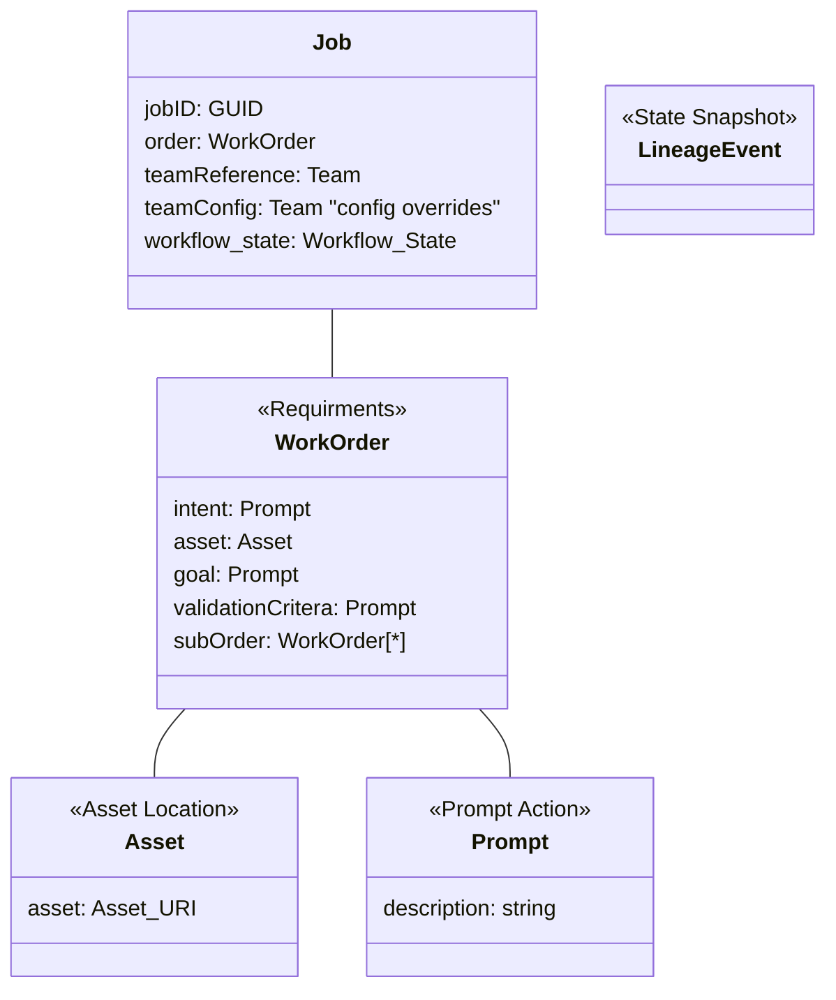

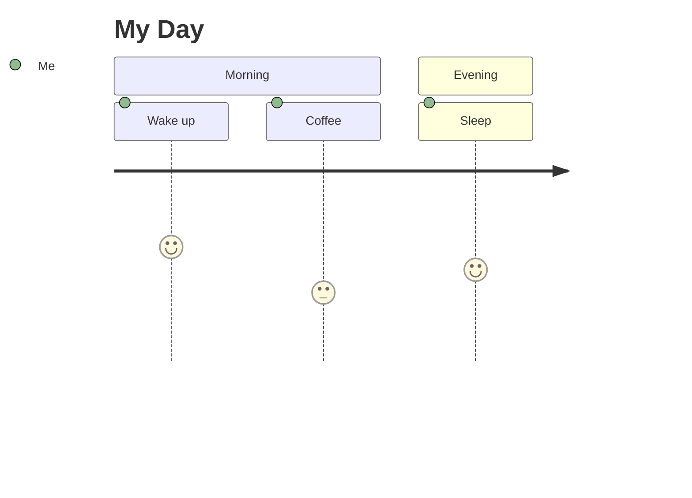

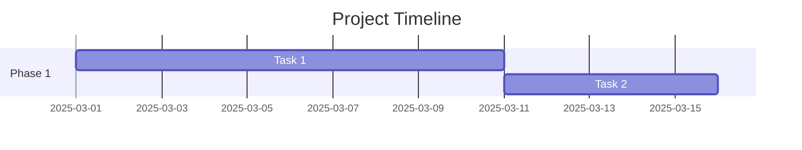
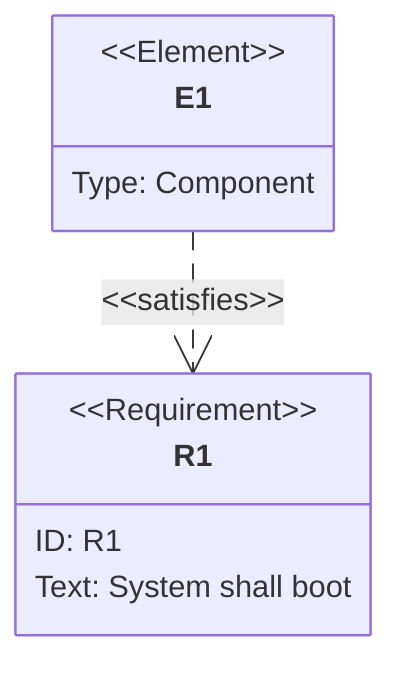

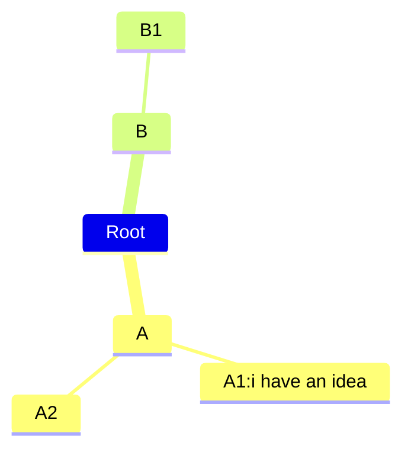

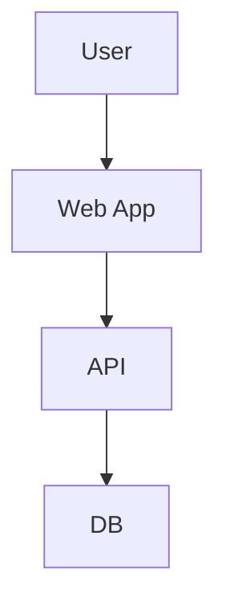

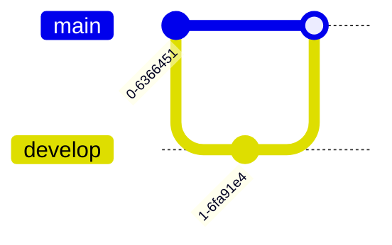

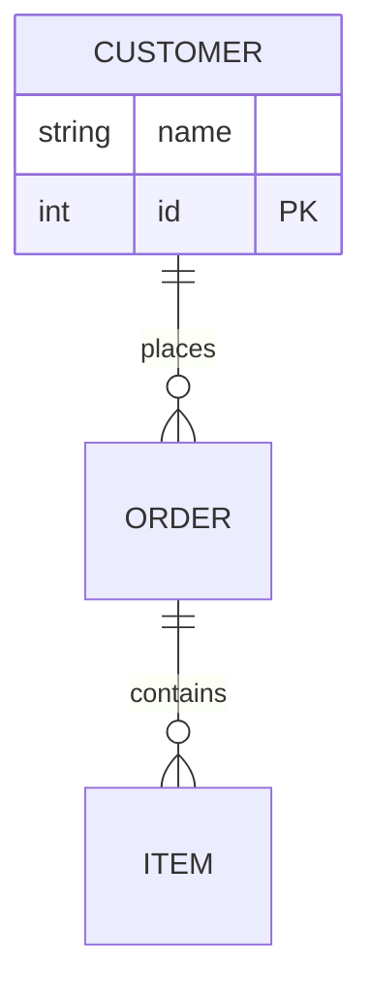

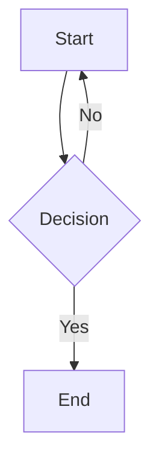

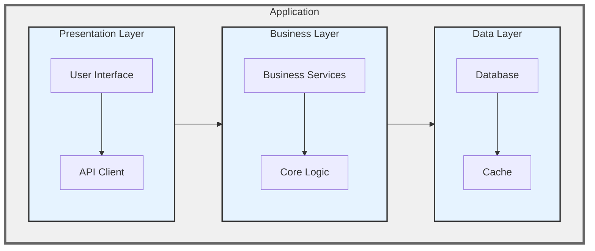

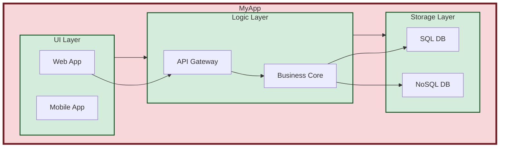

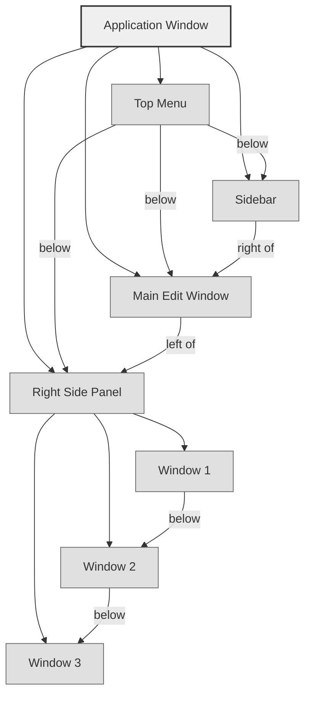

# UI Diagram for LLM Communication

This is a UI layout for an application window:
- "Top Menu" spans the top horizontally.
- Below it, the layout splits into three vertical sections:
  - "Sidebar" on the left.
  - "Main Edit Window" in the center.
  - "Right Side Panel" on the right, containing three stacked windows ("Window 1", "Window 2", "Window 3").
The Mermaid diagram below uses TB direction to stack elements vertically and arrows to show spatial relationships.

