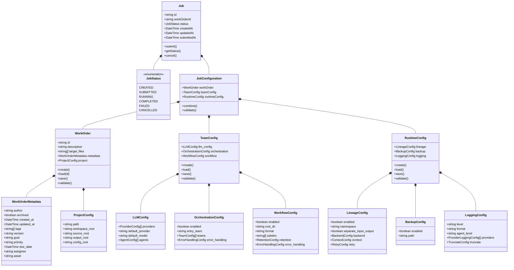
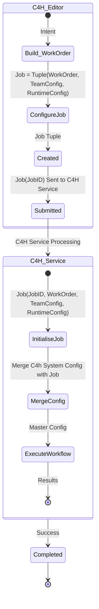

# C4H Editor Client-Side Domain Model Specification

## Overview

This specification defines the client-side domain model for the C4H Editor application. The editor is responsible for creating and managing the three primary configuration components that make up a Job submission to the C4H Service.

## Domain Model



## Configuration Lifecycle

The lifecycle of a configuration follows this flow:



## Component Descriptions

### Core Components

Each of the sub configs such as workOrder, TeamConfig, RuntimeConfig represent a node under Jobs, hence described as a tuple.
In the future there may be more nodes under job as we restructure the configs.
There is NO merging required of configs on the client side.
The client side only composes configs into a single Job Config.
The C4h server is soley responsible for merging configs, based upon its own internal default configuration and the overrides of the external config.

1. **WorkOrder**
   - Represents what needs to be done and against which asset
   - Contains intent description and project information
   - Includes metadata about the work (author, version, priority, etc.)
   - The ProjectConfig is part of the WorkOrder as it defines what asset to operate on

2. **TeamConfig**
   - Defines the agent teams and their capabilities
   - Specifies LLM providers, models, and agent configurations
   - Controls orchestration flow between teams
   - Includes workflow configuration related to team execution

3. **RuntimeConfig**
   - Manages operational aspects of the C4H Service
   - Configures lineage tracking, logging, and backup behaviors
   - Defines error handling and retention policies

4. **Job**
   - Container entity that bundles the three configuration components
   - Used for submission to the C4H Service
   - Tracks status and lifecycle of the work

### Serialization Format

All configuration components are serialized to/from YAML format. The editor must maintain the hierarchical structure of each component according to the design principles.

Example YAML structure:
```yaml
# WorkOrder
id: "wo_12345"
description: "Add comprehensive error handling to all service functions"
target_files:
  - "src/services/*.js"
metadata:
  author: "John Doe"
  archived: false
  created_at: "2025-03-18T10:00:00Z"
  tags: ["error-handling", "services"]
  version: "1.0.0"
  priority: "high"
project:
  path: "/path/to/project"
  workspace_root: "workspaces"
  source_root: "src"
  output_root: "output"

# TeamConfig would be in separate section
# RuntimeConfig would be in separate section
```

## Implementation Requirements

### YAML Editing

1. The editor must provide YAML editing capabilities for each configuration component
2. Changes to one component should not affect others
3. The editor must validate YAML structure against the expected schema
4. The editor should provide meaningful error messages for invalid YAML

### Version Management

1. WorkOrders must support versioning with proper tracking
2. Editor must maintain history of WorkOrder changes
3. TeamConfig and RuntimeConfig should support named presets/templates
4. Configuration templates should be exportable/importable

### Job Submission

1. Editor must validate all components before allowing job submission
2. Job status monitoring must support polling with appropriate intervals
3. Cancellation must be supported for running jobs
4. Results must be displayable in a structured format

## Design Principles

The implementation must adhere to these principles:

1. **Hierarchical Configuration**
   - All configuration follows a strict hierarchy
   - Base config provides defaults
   - Override config adds or updates leaf nodes
   - Structure must be preserved during merges

2. **Smart Merge Behavior**
   - Editor must support merging configurations
   - Base config provides foundation
   - Override config can add new nodes or update leaf values
   - Parent node structure must be preserved

3. **Separation of Responsibilities**
   - Each component owns its configuration section
   - No cross-component dependencies in the editor
   - Configuration handling isolated from business logic

## API Integration

The editor must integrate with the C4H Service API:

1. **Submit Job**
   ```
   POST /api/v1/workflow
   ```
   - Combines WorkOrder, TeamConfig, and RuntimeConfig
   - Returns job ID and initial status

2. **Check Job Status**
   ```
   GET /api/v1/workflow/{workflow_id}
   ```
   - Monitors job execution
   - Retrieves results upon completion

3. **Cancel Job**
   ```
   POST /api/v1/workflow/{workflow_id}/cancel
   ```
   - Cancels running job

## Implementation Considerations

1. **Validation**
   - Implement schema-based validation for each component
   - Provide immediate feedback on configuration errors
   - Support cross-component validation for dependencies

2. **User Experience**
   - Structure editor UI to reflect the component separation
   - Provide templates and examples for common configurations
   - Support both basic and advanced editing modes

3. **Performance**
   - Implement efficient YAML parsing and serialization
   - Cache configurations where appropriate
   - Handle large configurations gracefully

This domain model specification should be used as the foundation for implementing the C4H Editor client-side application.