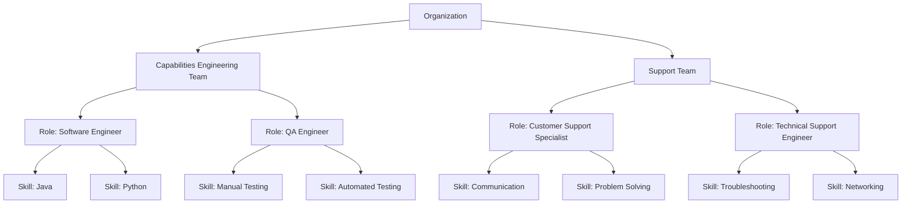

# C4H Domain Model

## Introduction

This document outlines the design of the *c4h* (coder for hire) framework.
Its broken down into the following sections.

1. Key Concepts - should cover the aspacts of large language models that have been used within the design
2. Agent Framework - gives an overview and goes into the design of the c4h framework
3. C4h Programming Team - A walk through and example implementation of the principles outlined previously
4. Roadmap - What's next

## Key Background Concepts

### What are LLMs

### What are Agents

### Different Types of Programming

#### Deterministc vs Probablisitic Computation

## Agent Framework

### Overview

This section is structured on the following concepts of an Agentic Framework:

1. **Organisation** - How do we structure and organise our agents for understanding, maintenance, and reuse  

2. **Orchestration** - How do we coordinate and manage interactions between agents

3. **Operations** - Once structured, how does it run? What are the operational considerations  

4. **Optimisation** - I just wanted another word starting with O, and also cover optimisation.

### Organisation

We will structure Agents around teams & roles in a coporations.

We are interested in the following aspects of an coporate style organisation
1. Hierachichy of *responsibility*.
2. Teams deliver *capabilities*.
3. The capabilities that a team delivers is made up by *roles*.
4. Each role has *skills* which enable it to do work.

To summarise:-
A Team has responsibility and capability.
A Team is composed of Roles, each Role having multiple Skills needed to fulfill its Role.

#### Managing Complexity

We use structure to manage the conceptual complexity.
1. Seperate teams around a singular capability.
2. Seperate agents around a specific set of skills.

This allows:-
1. Reusable teams across similar problem domains, e.g. Once we have an Engineering or Support team i can use it solve many similar kinds of problems.
1. We can reassemble teams around the roles I need.
1. We can build new roles from the skills we have implemented.

#### The Attention Mechanism

Why do we need to manage complexity with LLMs?

People have created coporate structures to manage complexity because they need to manage the set of *points* or *variables* required to think of and solve problems.

LLMs have similar constraints,
- the volume of data they can consider over
- the number of variables that will be incorporated into the solution

So we will use similar mechanisms for managing complexity with LLMs as with people.

This allows people to reason over and understand how they are configuring Agents and their capabilities.

Note though as LLMs evolve they will be able to reorganise themselves  far more efficiently than what people need to understand and will start to resemble highly efficient organic structures.

## c4h Programming Team

## What's Next?
