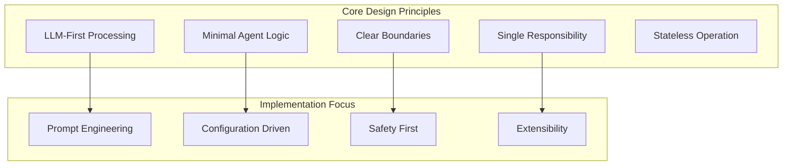
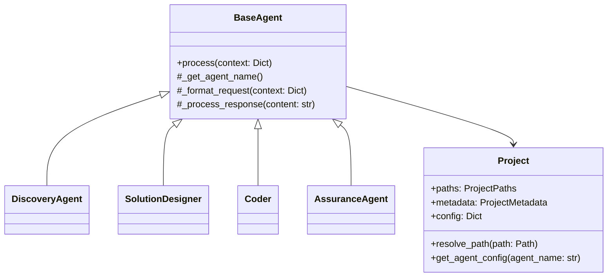
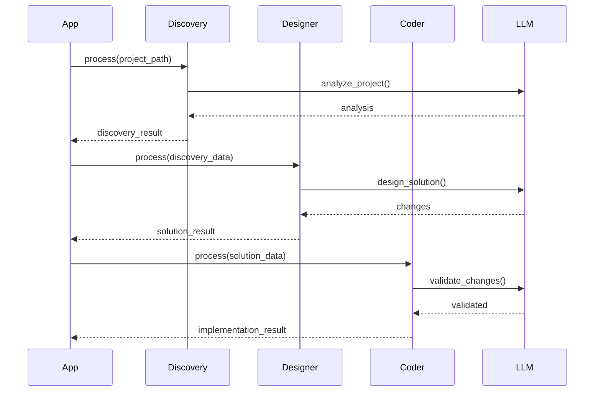
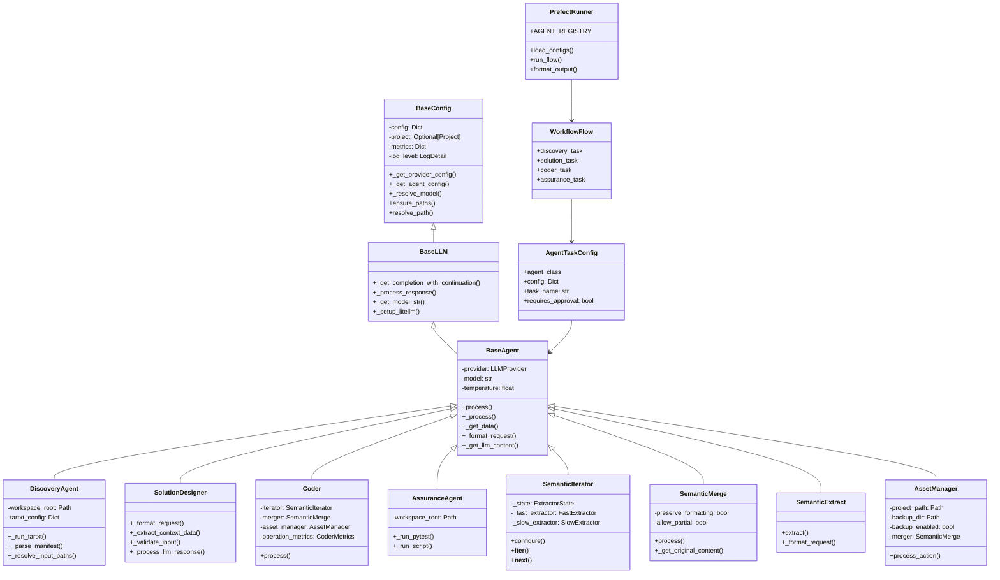
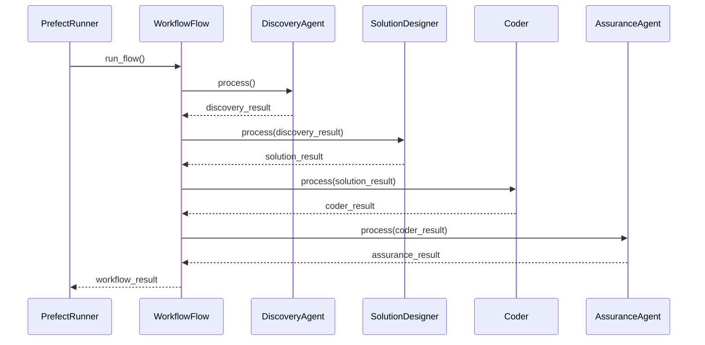
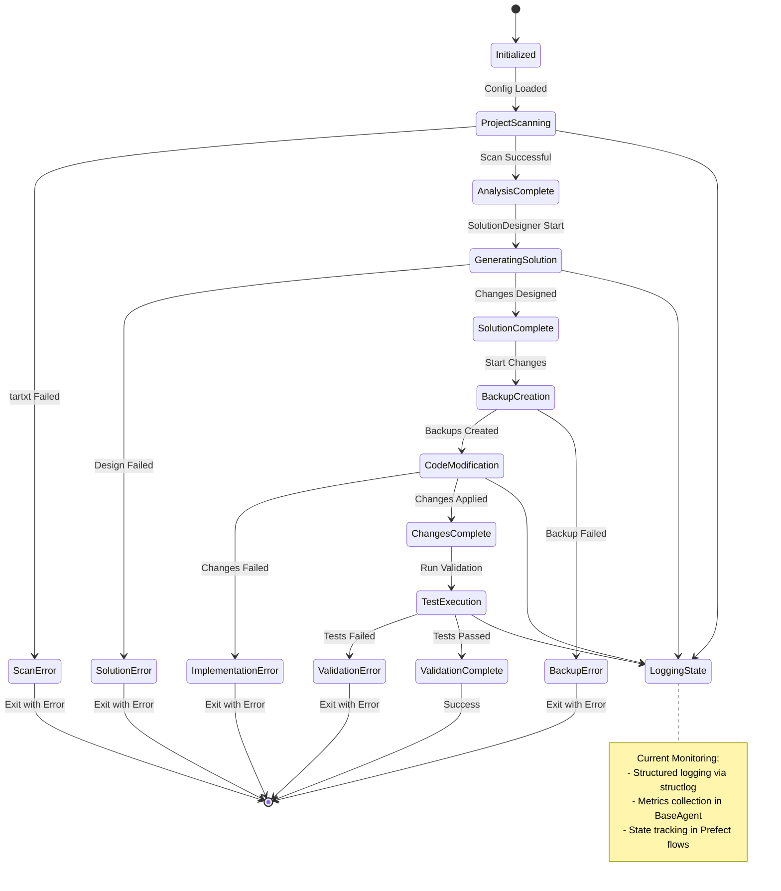

# C4H Agents Library Documentation

## Table of Contents

1. [Introduction](#introduction)
2. [Design Principles](#design-principles)
3. [Architecture Overview](#architecture-overview)
4. [Core Components](#core-components)
5. [Agents](#agents)
6. [Skills](#skills)
7. [Integration Patterns](#integration-patterns)
8. [Configuration Guide](#configuration-guide)
9. [Best Practices](#best-practices)

## Introduction

The C4H Agents Library provides a framework for LLM-powered code refactoring with a focus on minimal agent logic and LLM-first processing. Built with modularity and extensibility in mind, it supports both standalone usage and integration into larger systems.

Key Features:
- Modular agent architecture
- Standardized interfaces
- Rich configuration system
- Project-aware operations
- LLM provider abstraction
- Built-in backup and safety features

## Design Principles



1. **LLM-First Processing**
   - Leverage LLM capabilities for complex logic
   - Agent code focused on infrastructure
   - Trust LLM for decision-making

2. **Minimal Agent Logic**
   - Keep agent code infrastructure-focused
   - No business logic in agents
   - Configuration-driven behavior

3. **Clear Boundaries**
   - Each agent has focused responsibility
   - No cross-agent validation
   - Clean separation of concerns

## Architecture Overview



## Core Components

### BaseAgent
Core abstraction providing LLM interaction capabilities:

```python
from c4h_agents.agents.base import BaseAgent, AgentResponse

class CustomAgent(BaseAgent):
    def __init__(self, config: Dict[str, Any] = None):
        super().__init__(config=config)
    
    def _get_agent_name(self) -> str:
        return "custom_agent"
    
    def process(self, context: Dict[str, Any]) -> AgentResponse:
        # Agent-specific logic
        pass
```

Key Features:
- Automatic provider configuration
- Continuation handling
- Metrics tracking
- Standardized logging
- Project context awareness

### Project Model
Handles project structure and paths:

```python
from c4h_agents.core.project import Project, ProjectPaths

project = Project.from_config({
    "project": {
        "path": "/path/to/project",
        "workspace_root": "workspaces"
    }
})
```

Standard Paths:
- root: Project root directory
- workspace: Working files location
- source: Source code directory
- output: Output directory
- config: Configuration location

## Agents

### Discovery Agent
Analyzes project structure and files:

```python
from c4h_agents.agents.discovery import DiscoveryAgent

discovery = DiscoveryAgent(config={...})
result = discovery.process({
    "project_path": "/path/to/project"
})
```

Configuration:
```yaml
llm_config:
  agents:
    discovery:
      tartxt_config:
        script_path: "path/to/tartxt.py"
        input_paths: ["src", "tests"]
        exclusions: ["**/__pycache__/**"]
```

### Solution Designer
Creates refactoring solutions:

```python
from c4h_agents.agents.solution_designer import SolutionDesigner

designer = SolutionDesigner(config={...})
result = designer.process({
    "input_data": {
        "discovery_data": discovery_result.data,
        "intent": intent_description
    }
})
```

Response Format:
```python
{
    "success": bool,
    "data": {
        "changes": [
            {
                "file_path": str,
                "type": "create|modify|delete",
                "content": str,
                "description": str
            }
        ]
    }
}
```

### Coder Agent
Implements code changes with safety:

```python
from c4h_agents.agents.coder import Coder

coder = Coder(config={...})
result = coder.process({
    "input_data": solution_result.data
})
```

Features:
- Automatic backups
- Change validation
- Safe file handling
- Metrics tracking

## Skills

### Semantic Iterator
Extracts structured information:

```python
from c4h_agents.skills.semantic_iterator import SemanticIterator
from c4h_agents.skills.shared.types import ExtractConfig

iterator = SemanticIterator(config={...})
config = ExtractConfig(
    instruction="Extract instruction",
    format="json"
)

for item in iterator.configure(content, config):
    process_item(item)
```

Modes:
- Fast: Bulk extraction
- Slow: Sequential with validation
- Automatic fallback support

### Semantic Merge
Handles code merging:

```python
from c4h_agents.skills.semantic_merge import SemanticMerge

merger = SemanticMerge(config={...})
result = merger.process({
    "file_path": path,
    "original": original_content,
    "content": new_content
})
```

Features:
- Format preservation
- Safety checks
- Diff support
- Backup integration

## Integration Patterns

### Workflow Integration



### Prefect Integration

```python
from prefect import flow
from c4h_agents.agents.discovery import DiscoveryAgent
from c4h_agents.agents.solution_designer import SolutionDesigner
from c4h_agents.agents.coder import Coder

@flow
def refactor_workflow(project_path: Path, config: Dict[str, Any]):
    # Discovery
    discovery = DiscoveryAgent(config=config)
    discovery_result = discovery.process({
        "project_path": project_path
    })
    
    # Solution Design
    designer = SolutionDesigner(config=config)
    solution_result = designer.process({
        "input_data": {
            "discovery_data": discovery_result.data,
            "intent": config.get("intent")
        }
    })
    
    # Implementation
    coder = Coder(config=config)
    return coder.process({
        "input_data": solution_result.data
    })
```

## Configuration Guide

### Provider Configuration
```yaml
providers:
  anthropic:
    api_base: "https://api.anthropic.com"
    default_model: "claude-3-opus-20240229"
    litellm_params:
      retry: true
      max_retries: 3
```

### Agent Configuration
```yaml
llm_config:
  agents:
    agent_name:
      provider: "anthropic"
      model: "claude-3-opus-20240229"
      temperature: 0
      prompts:
        system: "System prompt"
        custom: "Custom prompt template"
```

### Project Configuration
```yaml
project:
  path: "/path/to/project"
  workspace_root: "workspaces"
  source_root: "src"
  output_root: "output"
```

## Best Practices

1. **Safety First**
   - Enable backups
   - Validate changes
   - Handle errors gracefully

2. **Configuration Management**
   - Use hierarchical config
   - Override selectively
   - Keep secrets in environment

3. **Error Handling**
   - Check response success
   - Log operations
   - Maintain context

4. **Project Context**
   - Use Project instance
   - Resolve paths properly
   - Maintain workspace structure

5. **LLM Integration**
   - Follow provider settings
   - Handle continuations
   - Use appropriate temperatures

6. **Agent Design**
   - Keep focused purpose
   - Minimal processing
   - Clear interfaces







