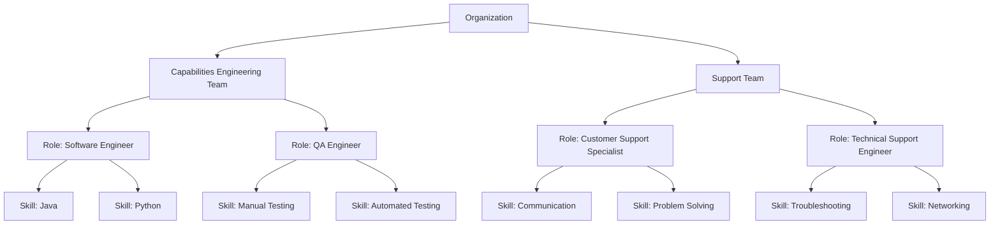
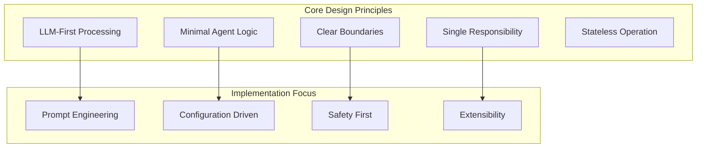
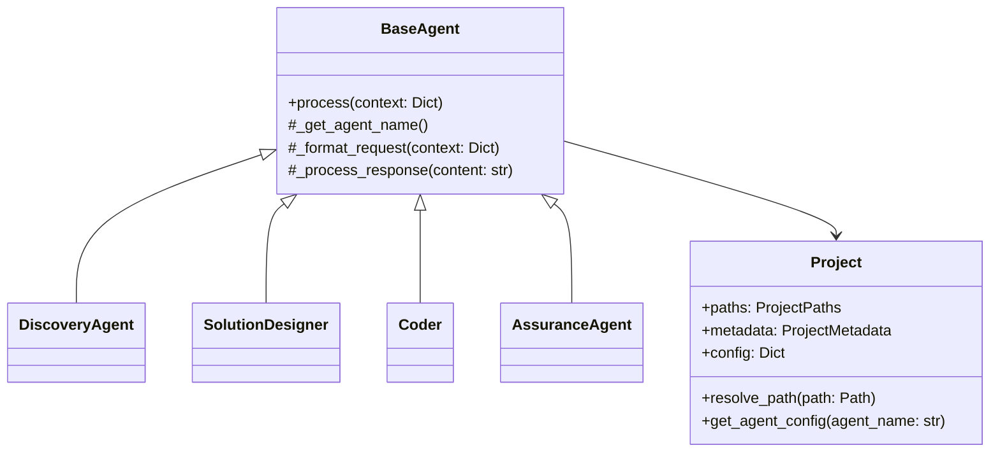
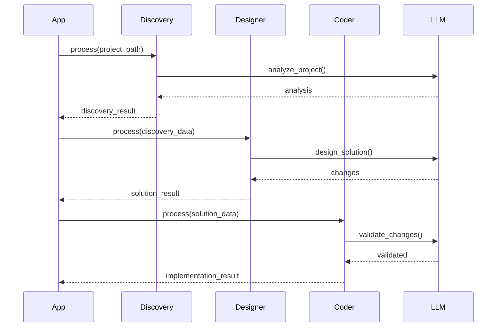

# C4H Domain Model

## Executive Summary

This document outlines the design of the *c4h* (Coder For Hire) framework, which leverages LLMs and agent-based architecture to support code generation, analysis, and refactoring tasks. The framework is organized into four key sections:
1. **Key Concepts:** Explains the background on LLMs and Agents.
2. **Agent Framework:** Describes the organization of agents, teams, roles, and skills.
3. **Agent Design Principles:** Details the design and implementation principles guiding agent behavior.
4. **Agents Library & Configuration:** Provides in-depth documentation on agent implementation, integration, and configuration management.

This document is intended to be a comprehensive guide for developers and architects, offering both conceptual background and practical code examples.

---

## Table of Contents

1. [Introduction](#introduction)
2. [Key Background Concepts](#key-background-concepts)
   - [What are LLMs](#what-are-llms)
   - [What are Agents](#what-are-agents)
   - [Two Types of Coding Paradigms](#two-types-of-coding-paradigms)
3. [C4H Agent Framework](#c4h-agent-framework)
   - [Organisation](#organisation)
   - [Managing Complexity](#managing-complexity)
   - [The Attention Mechanism](#the-attention-mechanism)
4. [Agent Design Principles](#agent-design-principles)
   - [Overarching Principles](#overarching-principles)
   - [Implementation Principles](#implementation-principles)
   - [Practical Examples](#practical-examples)
5. [C4H Agents Library Documentation](#c4h-agents-library-documentation)
   - [Introduction](#introduction-1)
   - [Summary Agent Design Principles](#summary-agent-design-principles)
   - [Architecture Overview](#architecture-overview)
   - [Core Components](#core-components)
   - [Agents](#agents)
   - [Skills](#skills)
   - [Integration Patterns](#integration-patterns)
   - [Configuration Guide](#configuration-guide)
   - [Best Practices](#best-practices)
6. [Configuration Design Principles](#configuration-design-principles)
   - [Overarching Principles](#overarching-principles-1)
   - [Implementation Principles](#implementation-principles-1)
   - [Practical Examples](#practical-examples-1)
   - [Benefits](#benefits)
   - [Application Guidelines](#application-guidelines)

---

## Introduction

This document outlines the design of the *c4h* (Coder For Hire) framework. The framework is divided into four sections:
1. **Key Concepts**
2. **Agent Framework**
3. **C4H Programming Team**
4. **Roadmap**

---

## Key Background Concepts

### What are LLMs

#### Definition 
Large Language Models (LLMs) are deep neural networks trained on extensive text corpora using transformer architectures.

#### Prompting
LLMs are driven by a 'prompt' and respond based on their extensive training data. They predict the most likely next token(s) to generate a response. Think of prompting as a query—each prompt adds more search criteria, narrowing down the set of possible responses. The more criteria you add, the higher the probability of finding the desired outcome.

- **Analogy (Venn Diagram):**  
  Each circle in the diagram represents a possible set of valid responses for a prompt. When compounded, the overlapping area represents the narrowed-down set of responses.

  <svg width="400" height="400" xmlns="http://www.w3.org/2000/svg">
    <style>
      .venn { fill-opacity: 0.2; stroke-width: 2; }
      text { font-family: sans-serif; }
    </style>
    <!-- Four circles arranged to maximize the central overlap -->
    <circle cx="170" cy="170" r="80" class="venn" fill="red" stroke="black" />
    <circle cx="230" cy="170" r="80" class="venn" fill="green" stroke="black" />
    <circle cx="230" cy="230" r="80" class="venn" fill="blue" stroke="black" />
    <circle cx="170" cy="230" r="80" class="venn" fill="orange" stroke="black" />
    
    <!-- Central label for the overlapping region -->
    <text x="200" y="205" text-anchor="middle" font-size="16" fill="black">
       90%
    </text>
  </svg>
  
  *Figure: Overlapping response sets illustrating how specific prompts reduce ambiguity.*

- **Core Mechanisms:**  
  - **Self-Attention:** Captures dependencies across long sequences to model context.
  - **Token Prediction:** Computes probabilities over a vocabulary to generate subsequent tokens.
  - **Contextual Embeddings:** Represents words in continuous vector spaces to capture semantic relationships.

- **Application in C4H:**  
  LLMs drive code generation, analysis, and natural language interfaces by translating contextual prompts into code snippets, debugging steps, or documentation.

### What are Agents

- **Definition:**  
  Agents are autonomous software modules designed to perform specific tasks based on inputs and internal rules. They leverage the LLM’s prompt-based processing to automate user intentionality by providing configured prompts that trigger actions and responses.

- **Characteristics:**  
  - **Autonomy:** Execute tasks independently without continuous human intervention.
  - **Interactivity:** Communicate with other agents or systems through predefined protocols.
  - **Adaptability:** Modify behavior in response to feedback and changing operational conditions.

- **Application in C4H:**  
  Agents are structured into teams that mirror corporate hierarchies. Each agent is assigned a role defined by specific skills, enabling the system to modularly generate, validate, and optimize code.

### Two Types of Coding Paradigms

Programming in *c4h* leverages two distinct computation paradigms to address different aspects of code processing.

#### Deterministic vs Probabilistic Computation

- **Deterministic Computation:**  
  - **Definition:** This is traditional code (e.g., Java or Python) that is fully disambiguated and runs in a predictable way. A downside is that it must be coded to handle every situation, meaning changes can cause breakages unless explicitly managed.
  - **Characteristics:**  
    - Predictable and reproducible outcomes.
    - Runs on traditional computer systems.
  - **Application in C4H:**  
    C4H is written in Python, including all Agents and Skills. According to the Agent design principles, the 'Reasoning' behavior is passed to the LLM, while everything else is coded in Python.

- **Probabilistic Computation:**  
  - **Definition:** Operations produce outputs based on statistical models, introducing variability even with identical inputs.
  - **Characteristics:**  
    - Outputs are derived from probability distributions.
    - Suitable for handling uncertainty and ambiguity.
  - **Application in C4H:**  
    Underpins LLM-based code generation and adaptive learning modules, enabling flexible handling of incomplete or noisy data. According to Agent design principles, all Agent reasoning is offloaded to the LLM.

##### Why the Distinction?
We want to be able to leverage both models through a consistent interface, that could allow the use of deterministic compute for a well defined problem or strongly typed problem (a reflex action, fast compute, amygdala compute?), and slower probablistic compute.

---

## C4H Agent Framework

### Organisation

We structure Agents around teams and roles in a corporate setting. The organization focuses on:

1. **Hierarchy of Responsibility:**  
   Establishing clear chains of command.
2. **Team Capabilities:**  
   Each team delivers specific capabilities.
3. **Roles within Teams:**  
   Teams are composed of roles, each with a set of skills.
4. **Skills:**  
   Each role has specific skills that enable it to do its work.

**Summary:**  
- A **Team** has both responsibility and capability.
- A Team is composed of **Roles**, each Role having multiple **Skills** needed to fulfill its function.



*Figure: Corporate organization structure mapping teams, roles, and skills.*

#### Managing Complexity

We use structure to manage conceptual complexity by:
1. Separating teams by specific capabilities.
2. Separating agents by a specific set of skills.

This approach allows:
- **Reusable Teams:** Once an Engineering or Support team is defined, it can solve many similar problems.
- **Reassembled Teams:** Teams can be reassembled around the roles needed.
- **New Role Construction:** New roles can be built from the existing skills.

#### The Attention Mechanism

Managing complexity with LLMs is similar to how corporate structures help people manage multiple variables when solving problems. LLMs have similar constraints in:
- The volume of data they can consider.
- The number of variables that can be incorporated into a solution.

Using similar mechanisms for managing complexity with LLMs (like breaking tasks into smaller components) allows both people and LLMs to better configure Agents and their capabilities. As LLMs evolve, they may reorganize themselves more efficiently, resembling highly efficient organic structures.

---

## Agent Design Principles

### Overarching Principles

1. **LLM-First Processing**
   - Offload most logic and decision-making to the LLM.
   - Use the LLM for verification and validation when possible.
   - **Template Configuration Over Code:**
     - Maintain all prompts in configuration files rather than hard-coding.
     - Simplifies prompt engineering and updates.
   - Agents focus on:
     - Managing intent prompts.
     - Processing responses.
     - Handling local environment side effects.

2. **Minimal Agent Logic**
   - Keep agent code focused on infrastructure.
   - Avoid embedding business logic in agents.
   - Let the LLM handle complex decision trees.
   - Only transform data if essential for the agent's infrastructure role.

### Implementation Principles



#### 1. Single Responsibility
- Each agent has one clear, focused task.
- No processing of tasks that belong to other agents.
- Pass data through without unnecessary interpretation.
- **Item-Agnostic Components:**
  - Avoid assumptions about item structure.
  - Let the caller define what to extract or transform.
- *Example:* A Discovery agent handles only file analysis, while a Solution Designer only creates prompts.

#### 2. Minimal Processing
- Default to passing data through to the LLM.
- Only transform data if it's core to the agent's role.
- Avoid duplicating validation or processing done by other agents.
- Let the LLM handle data interpretation where possible.

#### 3. Clear Boundaries
- The Discovery agent handles file analysis and scoping.
- The Solution Designer creates optimal prompts.
- The Semantic Iterator handles response parsing and iteration.
- **Configuration Inheritance Chain:**
  - System-level configuration flows downward to each agent.
  - Agents pass complete config to child components.
- Use placeholder variables and clear format requirements.
- Each agent trusts the output of other agents—no cross-agent validation.

#### 4. Logging Over Validation
- Focus on detailed logging for debugging.
- Let calling agents handle validation.
- **Structured Logging & Metrics:**
  - Include timestamps and correlation IDs.
  - Log key events, inputs, and outputs.
  - Provide enough detail to reconstruct actions.
- Make agent behavior observable.
- Reserve validation for infrastructure concerns only.

#### 5. Error Handling
- Handle only errors specific to infrastructure tasks.
- Pass through errors from external services (like the LLM).
- Provide clear error context in logs.
- Avoid swallowing or transforming errors unnecessarily.
- Let the LLM handle business logic errors.

#### 6. Stateless Operation
- Agents don’t maintain state between operations.
- Each request is self-contained.
- State management happens at the orchestration level.
- Simplifies testing and debugging.
- Enables clean sequential processing.

#### 7. Composability
- Agents can be chained together.
- Output format matches the input format of the next agent.
- No hidden dependencies between agents.
- Clean interfaces between agents.
- All assumptions about data structures are explicit in contracts.

#### 8. Observable Behavior
- Extensive structured logging.
- Clear input/output contracts.
- Traceable request/response flow.
- Debuggable operation.
- Include tracing info when needed.

#### 9. Focused Testing
- Test only the agent’s infrastructure responsibility.
- Avoid testing downstream agent behavior.
- Mock external services appropriately.
- Test logging and error handling.
- Do not test LLM decision logic.
- Keep agent tests lean and focused on I/O handling.

#### 10. Forward-Only Flow
- Data flows forward through the agent chain.
- No backward dependencies.
- Each agent adds its specific value.
- Clean sequential processing.
- Simplifies testing and debugging.


### Benefits

- Simpler codebase.
- Easier maintenance.
- More flexible and adaptable design.
- Better separation of concerns.
- Clearer responsibility boundaries.
- More testable infrastructure.
- Optimal leverage of LLM capabilities.

### Application Guidelines

1. When adding validation, ask: "Is this infrastructure or business logic?"
2. When adding processing, ask: "Could the LLM handle this?"
3. Keep agent code focused on:
   - Managing I/O.
   - Logging.
   - Infrastructure error handling.
   - Environment interactions.
4. Let the LLM handle:
   - Business validation.
   - Code analysis.
   - Decision making.
   - Content transformation.

---

## C4H Agents Library Documentation

### Introduction

The C4H Agents Library provides a framework for LLM-powered code refactoring with a focus on minimal agent logic and LLM-first processing. It is built with modularity and extensibility in mind and supports both standalone usage and integration into larger systems.

**Key Features:**
- Modular agent architecture.
- Standardized interfaces.
- Rich configuration system.
- Project-aware operations.
- LLM provider abstraction.
- Built-in backup and safety features.

### Summary Agent Design Principles

1. **LLM-First Processing**
   - Leverage LLM capabilities for complex logic.
   - Focus agent code on infrastructure.
   - Trust the LLM for decision-making.

2. **Minimal Agent Logic**
   - Keep agent code focused on infrastructure concerns.
   - Avoid embedding business logic in agents.
   - Enable configuration-driven behavior.

3. **Clear Boundaries**
   - Each agent has a focused responsibility.
   - No cross-agent validation.
   - Maintain a clean separation of concerns.

### Architecture Overview



*Figure: A class diagram showing the relationship between BaseAgent and other agents, as well as the Project model.*

### Core Components

#### BaseAgent

The BaseAgent is the core abstraction that provides LLM interaction capabilities:

```python
from c4h_agents.agents.base import BaseAgent, AgentResponse

class CustomAgent(BaseAgent):
    def __init__(self, config: Dict[str, Any] = None):
        super().__init__(config=config)
    
    def _get_agent_name(self) -> str:
        return "custom_agent"
    
    def process(self, context: Dict[str, Any]) -> AgentResponse:
        # Agent-specific logic goes here
        pass
```

**Key Features:**
- Automatic provider configuration.
- Continuation handling.
- Metrics tracking.
- Standardized logging.
- Project context awareness.

#### Project Model

Handles project structure and paths:

```python
from c4h_agents.core.project import Project, ProjectPaths

project = Project.from_config({
    "project": {
        "path": "/path/to/project",
        "workspace_root": "workspaces"
    }
})
```

**Standard Paths:**
- **root:** Project root directory.
- **workspace:** Working files location.
- **source:** Source code directory.
- **output:** Output directory.
- **config:** Configuration location.

### Agents

#### Discovery Agent

Analyzes project structure and files:

```python
from c4h_agents.agents.discovery import DiscoveryAgent

discovery = DiscoveryAgent(config={...})
result = discovery.process({
    "project_path": "/path/to/project"
})
```

**Configuration Example:**

```yaml
llm_config:
  agents:
    discovery:
      tartxt_config:
        script_path: "path/to/tartxt.py"
        input_paths: ["src", "tests"]
        exclusions: ["**/__pycache__/**"]
```

#### Solution Designer

Creates refactoring solutions:

```python
from c4h_agents.agents.solution_designer import SolutionDesigner

designer = SolutionDesigner(config={...})
result = designer.process({
    "input_data": {
        "discovery_data": discovery_result.data,
        "intent": intent_description
    }
})
```

**Response Format:**

```json
{
    "success": true,
    "data": {
        "changes": [
            {
                "file_path": "path/to/file",
                "type": "create|modify|delete",
                "content": "new file content",
                "description": "explanation of change"
            }
        ]
    }
}
```

#### Coder Agent

Implements code changes with safety:

```python
from c4h_agents.agents.coder import Coder

coder = Coder(config={...})
result = coder.process({
    "input_data": solution_result.data
})
```

**Features:**
- Automatic backups.
- Change validation.
- Safe file handling.
- Metrics tracking.

### Skills

#### Semantic Iterator

Extracts structured information:

```python
from c4h_agents.skills.semantic_iterator import SemanticIterator
from c4h_agents.skills.shared.types import ExtractConfig

iterator = SemanticIterator(config={...})
config = ExtractConfig(
    instruction="Extract instruction",
    format="json"
)

for item in iterator.configure(content, config):
    process_item(item)
```

**Modes:**
- **Fast:** Bulk extraction.
- **Slow:** Sequential with validation.
- **Automatic:** Fallback support.

#### Semantic Merge

Handles code merging:

```python
from c4h_agents.skills.semantic_merge import SemanticMerge

merger = SemanticMerge(config={...})
result = merger.process({
    "file_path": path,
    "original": original_content,
    "content": new_content
})
```

**Features:**
- Format preservation.
- Safety checks.
- Diff support.
- Backup integration.

### Integration Patterns

#### Workflow Integration



#### Prefect Integration

```python
from prefect import flow
from c4h_agents.agents.discovery import DiscoveryAgent
from c4h_agents.agents.solution_designer import SolutionDesigner
from c4h_agents.agents.coder import Coder

@flow
def refactor_workflow(project_path: Path, config: Dict[str, Any]):
    # Discovery phase
    discovery = DiscoveryAgent(config=config)
    discovery_result = discovery.process({
        "project_path": project_path
    })
    
    # Solution Design phase
    designer = SolutionDesigner(config=config)
    solution_result = designer.process({
        "input_data": {
            "discovery_data": discovery_result.data,
            "intent": config.get("intent")
        }
    })
    
    # Implementation phase
    coder = Coder(config=config)
    return coder.process({
        "input_data": solution_result.data
    })
```

### Configuration Guide

#### Provider Configuration

```yaml
providers:
  anthropic:
    api_base: "https://api.anthropic.com"
    default_model: "claude-3-opus-20240229"
    litellm_params:
      retry: true
      max_retries: 3
```

#### Agent Configuration

```yaml
llm_config:
  agents:
    agent_name:
      provider: "anthropic"
      model: "claude-3-opus-20240229"
      temperature: 0
      prompts:
        system: "System prompt"
        custom: "Custom prompt template"
```

#### Project Configuration

```yaml
project:
  path: "/path/to/project"
  workspace_root: "workspaces"
  source_root: "src"
  output_root: "output"
```

### Best Practices

1. **Safety First**
   - Enable backups.
   - Validate changes.
   - Handle errors gracefully.

2. **Configuration Management**
   - Use hierarchical configuration.
   - Override selectively.
   - Keep secrets in the environment.

3. **Error Handling**
   - Check response success.
   - Log operations.
   - Maintain context.

4. **Project Context**
   - Use the Project instance.
   - Resolve paths properly.
   - Maintain workspace structure.

5. **LLM Integration**
   - Follow provider settings.
   - Handle continuations.
   - Use appropriate temperature settings.

6. **Agent Design**
   - Keep a focused purpose.
   - Maintain minimal processing.
   - Use clear interfaces.

---

## Configuration Design Principles

### Overarching Principles

1. **Hierarchical Configuration**
   - All configuration follows a strict hierarchy.
   - Base config provides defaults and templates.
   - Override config adds or updates leaf nodes.
   - Preserve structure during merges.
   - Config paths follow consistent patterns (e.g., `llm_config.agents.[name]`).

2. **Smart Merge Behavior**
   - Base config provides the foundation.
   - Override config can add new nodes.
   - Override config can update leaf values.
   - Preserve parent node structure.
   - Avoid breaking existing config paths.

3. **Separation of Responsibilities**
   - `config.py` owns configuration management.
   - BaseAgent provides config access methods.
   - Each agent is responsible for its own config section.
   - No cross-agent config dependencies.
   - Config handling is isolated from business logic.

### Implementation Principles

#### 1. Config Location
- Clear hierarchical paths (e.g., `llm_config.agents.[name]`).
- Consistent lookup patterns.
- Fail gracefully with an empty dict if not found.
- Log lookup attempts and results.
- Support project-based config overrides.

#### 2. Config Access
- Agents access only their own config section.
- Use BaseAgent methods for config retrieval.
- Use the agent name for lookups.
- Handle missing config gracefully.
- Log config access patterns.

#### 3. Config Processing
- Process config at initialization.
- Cache needed values.
- Minimize runtime config lookups.
- Log config state changes.
- Handle config errors gracefully.

#### 4. Config Validation
- Validate the basic structure in `config.py`.
- Enforce type validation where critical.
- Log validation failures.
- Fail fast on missing critical configuration.
- Allow flexible extension.

#### 5. Config Resilience
- Treat missing config as a critical failure.
- Defaults come only from configuration via merging behavior.
- Log configuration issues.
- Support runtime updates.
- Maintain backward compatibility.

### Practical Examples

#### 1. Config Hierarchy

```yaml
llm_config:
  agents:
    solution_designer:  # Agent-specific section
      provider: "anthropic"
      model: "claude-3"
      prompts:
        system: "..."
        solution: "..."
      intent:
        description: "..."
```

#### 2. Agent Config Access

```python
def _get_agent_config(self) -> Dict[str, Any]:
    """Retrieve the agent's configuration; fails if not found."""
    agent_name = self._get_agent_name()
    agent_config = locate_config(self.config, agent_name)
    if not agent_config:
        raise ValueError(f"No configuration found for agent: {agent_name}")
    return agent_config
```

#### 3. Smart Config Location

```python
def locate_config(config: Dict[str, Any], target_name: str) -> Dict[str, Any]:
    """Locate agent config or return an empty dict."""
    try:
        path = ['llm_config', 'agents', target_name]
        result = get_by_path(config, path)
        return result if isinstance(result, dict) else {}
    except Exception as e:
        logger.error("config.locate_failed", error=str(e))
        return {}
```

### Benefits

- Clear configuration ownership.
- Predictable configuration behavior.
- Easy to extend and modify.
- Resilient to changes.
- Maintainable configuration structure.
- Clear debugging paths.
- Isolated responsibilities.
- Higher order components remain generic.
- No bleeding of business logic into higher order components.

### Application Guidelines

1. **Adding New Config:**
   - Follow the existing hierarchy.
   - Add to the appropriate section.
   - Maintain structure.
   - Document the addition.
   - Consider backward compatibility.

2. **Accessing Config:**
   - Use the agent name for lookup.
   - Access only the owned section.
   - Handle missing values gracefully.
   - Log access patterns.
   - Use BaseAgent methods.

3. **Merging Config:**
   - Preserve the configuration structure.
   - Override only leaf nodes.
   - Add new nodes as needed.
   - Log merge results.
   - Maintain the hierarchical integrity.

4. **Debugging Config:**
   - Check the hierarchy path.
   - Verify the config merge.
   - Look for log patterns.
   - Validate the overall structure.
   - Check the config access methods.

---

*End of Document*

