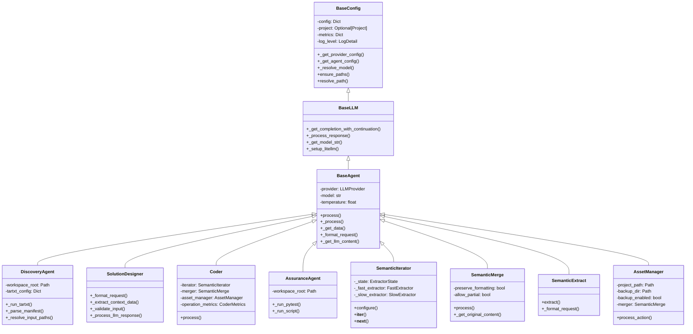
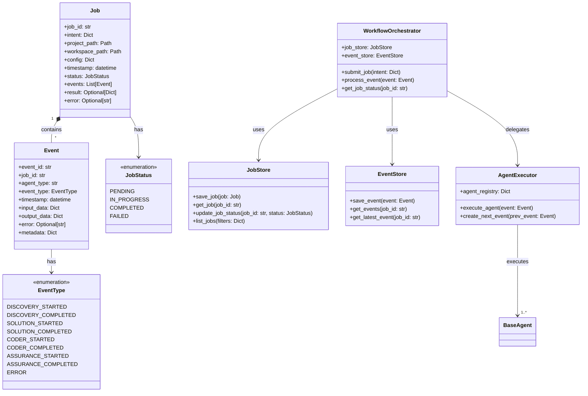
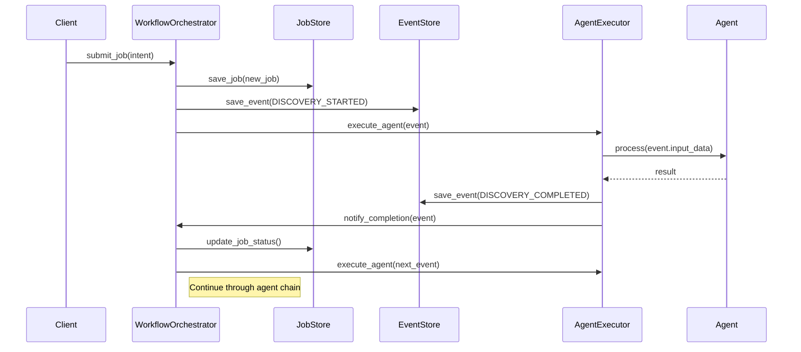
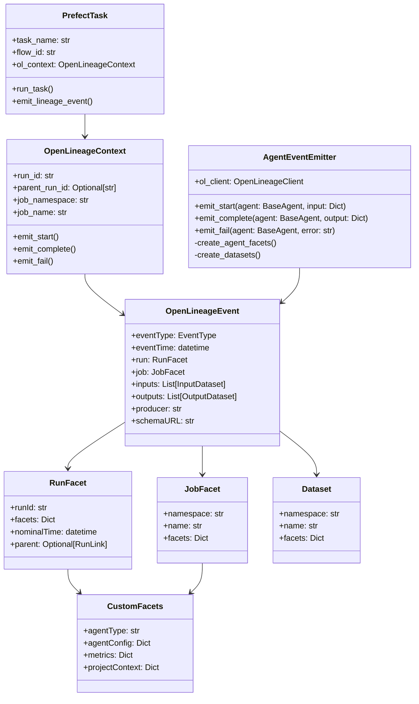
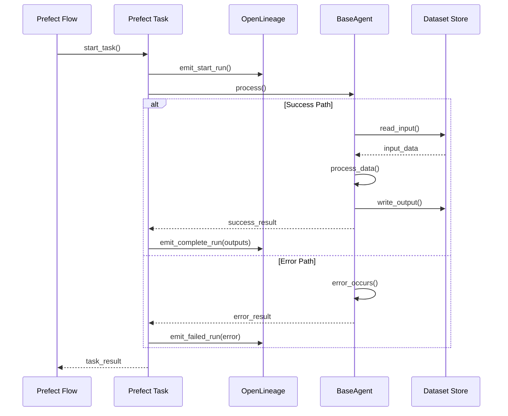
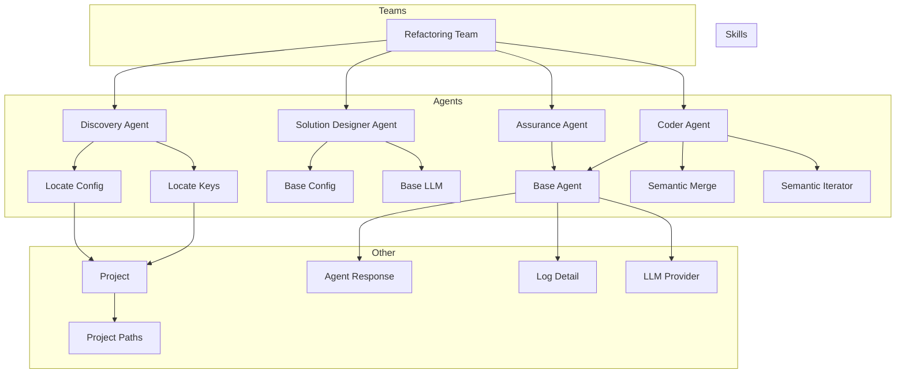
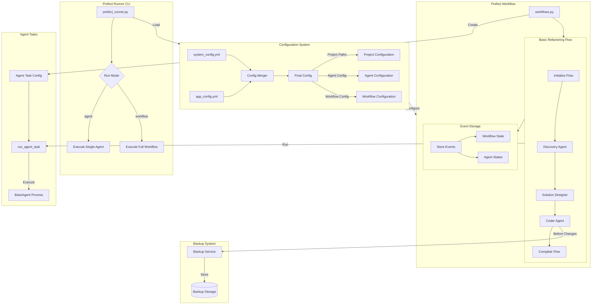

# C4H Architecture Diagrams

## Core Class Model

This diagram shows the main class relationships and inheritance hierarchy:



## Job and Event Model

This diagram shows the event-driven workflow model:



## Job Processing Sequence

This diagram shows how jobs flow through the system:



## Key Design Elements

1. Core Infrastructure
- BaseConfig provides configuration management
- BaseLLM handles LLM interactions
- BaseAgent combines both with standard processing

2. Agent Hierarchy
- Core agents (Discovery, Solution, Coder, Assurance)
- Semantic skills (Iterator, Merge, Extract)
- Asset management for file operations

3. Job Processing
- Jobs represent complete units of work
- Events track state transitions
- Storage components maintain history
- Orchestration manages workflow

4. Agent Design Principles Alignment
- Clear component boundaries
- Single responsibility per class
- Observable behavior through events
- Forward-only event flow
- Stateless agent operations


# OpenLineage Integration with Prefect Workflow

## OpenLineage Event Model



## Event Flow Sequence



## OpenLineage Custom Facets

These custom facets capture agent-specific metadata:

```json
{
    "agent": {
        "type": "agent_facet_v1",
        "agentType": "discovery",
        "provider": "anthropic",
        "model": "claude-3-opus-20240229",
        "metrics": {
            "total_requests": 1,
            "successful_requests": 1,
            "total_duration": 2.5
        }
    },
    "project": {
        "type": "project_facet_v1",
        "path": "/path/to/project",
        "workspace": "/path/to/workspace",
        "config": {}
    },
    "execution": {
        "type": "execution_facet_v1",
        "startTime": "2024-02-15T10:00:00Z",
        "endTime": "2024-02-15T10:01:00Z",
        "status": "COMPLETED"
    }
}
```

## Key Integration Points

1. Prefect Task Wrapper
```python
@task
def run_agent_task(agent_config: AgentTaskConfig, context: Dict[str, Any]):
    with OpenLineageContext() as ol:
        try:
            ol.emit_start(
                inputs=[create_input_dataset(context)],
                facets=create_agent_facets(agent_config)
            )
            
            result = agent_config.agent_class(config=agent_config.config).process(context)
            
            ol.emit_complete(
                outputs=[create_output_dataset(result)],
                metrics=result.metrics
            )
            return result
            
        except Exception as e:
            ol.emit_fail(error=str(e))
            raise
```

2. Dataset Management
```python
def create_input_dataset(context: Dict[str, Any]) -> Dataset:
    return Dataset(
        namespace="c4h",
        name=f"input_{context['job_id']}",
        facets={
            "schema": create_schema_facet(context),
            "dataSource": create_source_facet(context)
        }
    )
```

3. Agent Facets
```python
def create_agent_facets(agent: BaseAgent) -> Dict[str, Any]:
    return {
        "agent": {
            "type": "agent_facet_v1",
            "agentType": agent._get_agent_name(),
            "provider": str(agent.provider),
            "model": agent.model,
            "metrics": agent.metrics
        }
    }
```

## Benefits of OpenLineage Integration

1. Data Lineage Tracking
- Complete view of data flow through agents
- Input/output relationships
- Processing context and configuration

2. Observability
- Rich metadata via custom facets
- Agent performance metrics
- Error tracking and context

3. Debugging and Monitoring
- Full execution history
- Detailed failure context
- Agent performance patterns

4. Compliance and Auditing
- Complete processing history
- Configuration tracking
- Model usage tracking

## Gemini Attempted Model



### Claude model



This updated version retains all of your original content and vernacular while enhancing clarity, structure, and consistency.


<svg xmlns="http://www.w3.org/2000/svg" width="800" height="600">
  <!-- BaseAgent class -->
  <rect x="50" y="50" width="200" height="100" fill="white" stroke="black"/>
  <text x="150" y="70" text-anchor="middle" font-family="Arial" font-size="12" font-weight="bold">BaseAgent</text>
  <line x1="50" y1="80" x2="250" y2="80" stroke="black"/>
  <text x="55" y="95" font-family="Arial" font-size="10">+process(context: Dict)</text>
  <text x="55" y="110" font-family="Arial" font-size="10">#_get_agent_name()</text>
  <text x="55" y="125" font-family="Arial" font-size="10">#_format_request(context: Dict)</text>
  <text x="55" y="140" font-family="Arial" font-size="10">#_process_response(content: str)</text>

  <!-- Project class -->
  <rect x="300" y="50" width="200" height="100" fill="white" stroke="black"/>
  <text x="400" y="70" text-anchor="middle" font-family="Arial" font-size="12" font-weight="bold">Project</text>
  <line x1="300" y1="80" x2="500" y2="80" stroke="black"/>
  <text x="305" y="95" font-family="Arial" font-size="10">+paths: ProjectPaths</text>
  <text x="305" y="110" font-family="Arial" font-size="10">+metadata: ProjectMetadata</text>
  <text x="305" y="125" font-family="Arial" font-size="10">+config: Dict</text>
  <text x="305" y="140" font-family="Arial" font-size="10">+resolve_path(path: Path)</text>
  <text x="305" y="155" font-family="Arial" font-size="10">+get_agent_config(agent_name: str)</text>

  <!-- Subclasses -->
  <rect x="50" y="200" width="200" height="20" fill="white" stroke="black"/>
  <text x="150" y="215" text-anchor="middle" font-family="Arial" font-size="10">DiscoveryAgent</text>

  <rect x="50" y="230" width="200" height="20" fill="white" stroke="black"/>
  <text x="150" y="245" text-anchor="middle" font-family="Arial" font-size="10">SolutionDesigner</text>

  <rect x="50" y="260" width="200" height="20" fill="white" stroke="black"/>
  <text x="150" y="275" text-anchor="middle" font-family="Arial" font-size="10">Coder</text>

  <rect x="50" y="290" width="200" height="20" fill="white" stroke="black"/>
  <text x="150" y="305" text-anchor="middle" font-family="Arial" font-size="10">AssuranceAgent</text>

  <!-- Relationships -->
  <line x1="150" y1="150" x2="150" y2="200" stroke="black" marker-end="url(#arrowhead)"/>
  <line x1="150" y1="150" x2="150" y2="230" stroke="black" marker-end="url(#arrowhead)"/>
  <line x1="150" y1="150" x2="150" y2="260" stroke="black" marker-end="url(#arrowhead)"/>
  <line x1="150" y1="150" x2="150" y2="290" stroke="black" marker-end="url(#arrowhead)"/>

  <line x1="250" y1="100" x2="300" y2="100" stroke="black" marker-end="url(#diamond)"/>
  
  <defs>
    <marker id="arrowhead" markerWidth="10" markerHeight="7" refX="10" refY="3.5" orient="auto">
      <polygon points="0 0, 10 3.5, 0 7" fill="black"/>
    </marker>
    <marker id="diamond" markerWidth="10" markerHeight="10" refX="5" refY="5" orient="auto">
      <polygon points="5 0, 10 5, 5 10, 0 5" fill="black"/>
    </marker>
  </defs>
</svg>