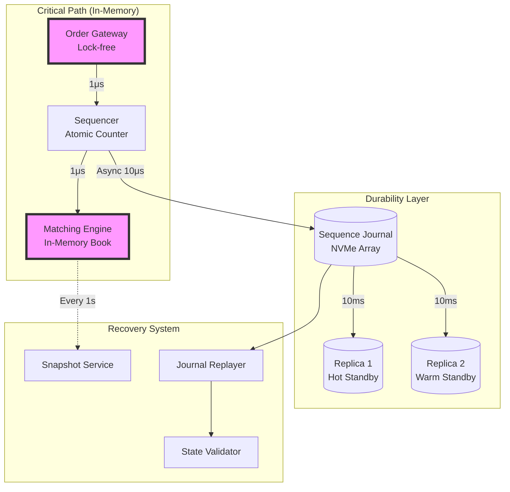
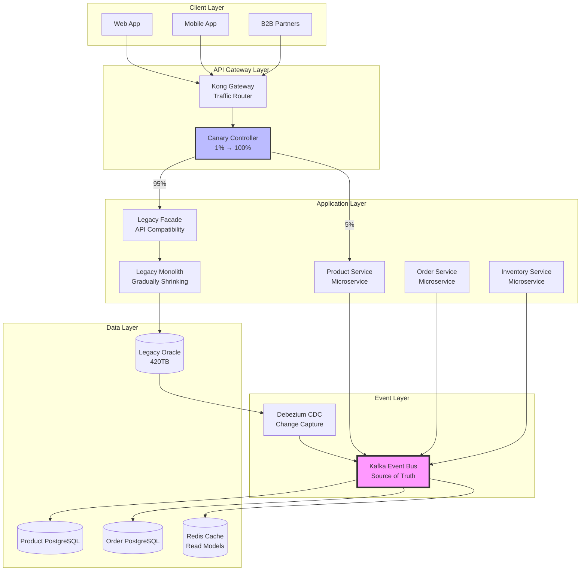
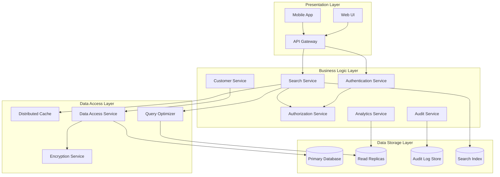

### 8.1 Case Study: Financial Trading Platform

**Context**: A major investment bank needed to build a high-frequency trading platform to remain competitive. The strategic intent "never lose customer orders" seems simple but contains significant ambiguity that the framework helps resolve systematically.

**Layer 1: Strategic Intent Analysis**

The initial statement "Build a high-frequency trading platform that never loses customer orders" underwent formal analysis:

```yaml
strategic_analysis:
  original_statement: "Build a high-frequency trading platform that never loses customer orders"
  
  ambiguity_identification:
    - term: "never loses"
      ambiguity_type: absolute_constraint
      possible_interpretations:
        - "100% reliability (mathematically impossible)"
        - "99.999% reliability (five nines)"
        - "No data loss even during failures"
        - "Orders eventually processed even if delayed"
        
    - term: "high-frequency"
      ambiguity_type: performance_threshold
      possible_interpretations:
        - "Sub-millisecond latency"
        - "Thousands of orders per second"
        - "Microsecond-level timestamps"
        
  formalized_intent:
    reliability:
      order_durability: "99.999% (five nines)"
      data_loss_tolerance: "Zero data loss"
      recovery_time_objective: "< 100ms"
    performance:
      order_latency_p50: "< 500 microseconds"
      order_latency_p99: "< 1 millisecond"
      throughput: "> 100,000 orders/second"
    compliance:
      regulations: [MiFID_II, RegNMS, MAR]
      audit_requirements: "Complete order lifecycle tracking"
```

**Layer 2: Functional Requirements Transformation**

The strategic intent was transformed into precise functional requirements:

```gherkin
Feature: Order Durability and Recovery
  In order to ensure no customer orders are lost
  As a trading platform
  I need to guarantee order persistence and recovery

  Scenario: Order persistence during component failure
    Given an order with ID "ORD-123456" is submitted
    And the order has been acknowledged to the client
    When the order matching engine crashes
    Then the order must be persisted in durable storage within 10 microseconds
    And the order state must be recoverable from at least 2 replicas
    And recovery must complete within 100 milliseconds
    And no acknowledged orders may be lost

  Scenario: Order replay after system recovery
    Given the system has recovered from a failure
    And there were 1000 in-flight orders during the failure
    When the recovery process completes
    Then all 1000 orders must be present in the order book
    And their timestamps must reflect original submission time
    And their priority must be preserved
    And an audit trail must show the recovery event

Feature: High-Frequency Order Processing
  Scenario: Microsecond-precision order handling
    Given the market is open
    And order flow is at peak rate (100,000 orders/second)
    When an order is submitted
    Then the order must be timestamped with microsecond precision
    And the order must be acknowledged within 500 microseconds (p50)
    And the order must enter the matching engine within 1 millisecond (p99)
```

**Layer 3: Logical Architecture Design**

The pullback mechanism was crucial here, reconciling performance and durability requirements:

```python
# Pullback Resolution for Trading Platform
pullback_analysis = {
    "conflicting_requirements": [
        {
            "requirement": "Ultra-low latency (< 1ms)",
            "implies": "In-memory processing, minimal persistence"
        },
        {
            "requirement": "Zero data loss",
            "implies": "Synchronous replication, durable writes"
        }
    ],
    "common_abstraction": "Reliable Order Processing",
    "resolution": {
        "pattern": "Hybrid Memory-Disk Architecture",
        "components": {
            "OrderGateway": {
                "responsibility": "Receive and acknowledge orders",
                "design": "Lock-free, in-memory processing",
                "durability": "Async write to journal"
            },
            "SequenceJournal": {
                "responsibility": "Provide total order guarantee",
                "design": "Memory-mapped file with O_DIRECT",
                "durability": "Synchronous to NVMe array"
            },
            "MatchingEngine": {
                "responsibility": "Match orders",
                "design": "In-memory with periodic snapshots",
                "recovery": "Replay from journal"
            },
            "ReplicationService": {
                "responsibility": "Maintain replicas",
                "design": "Parallel async replication",
                "guarantee": "At least 2 replicas within 10ms"
            }
        }
    }
}
```

The resulting logical architecture:



**Layer 4: Technical Specification**

Technology choices driven by constraints:

```yaml
technical_architecture:
  order_gateway:
    language: "C++ with lock-free data structures"
    framework: "Custom DPDK-based networking"
    deployment: "Dedicated CPU cores with isolation"
    optimizations:
      - "Kernel bypass networking"
      - "Huge pages for memory"
      - "CPU affinity and NUMA awareness"
      
  sequence_journal:
    technology: "Custom write-ahead log"
    storage:
      type: "Intel Optane NVMe array"
      configuration: "RAID 10 for durability"
      write_latency: "< 10 microseconds"
    format:
      - "Binary packed messages"
      - "CRC32C checksums"
      - "Microsecond timestamps"
      
  matching_engine:
    algorithm: "Price-time priority"
    data_structure: "Custom B+ tree variant"
    optimization:
      - "Cache-aligned nodes"
      - "Prefetch hints"
      - "Lock-free readers"
    state_management:
      - "Copy-on-write for snapshots"
      - "Incremental journaling"
      
  replication:
    protocol: "Custom TCP with kernel bypass"
    consistency: "Eventual with bounded lag"
    topology: "Star with automatic failover"
    monitoring: "Microsecond-precision lag tracking"
```

**Layer 5: Implementation with Semantic Traces**

```cpp
// order_gateway.cpp
// Semantic trace: Strategic.reliability -> Functional.order_persistence -> Logical.OrderGateway
// Implements: Zero data loss with sub-millisecond latency

#include <atomic>
#include <chrono>
#include <dpdk/rte_eal.h>
#include "lockfree/spsc_queue.hpp"
#include "journal/sequence_journal.hpp"

namespace hft {

class OrderGateway {
    // Traces to: Strategic.performance.order_latency_p99
    static constexpr auto MAX_LATENCY_NS = 1'000'000; // 1ms
    
public:
    OrderGateway(SequenceJournal& journal, MatchingEngine& matcher)
        : journal_(journal)
        , matcher_(matcher)
        , sequence_number_(0) {
        
        // Traces to: Technical.order_gateway.optimizations.cpu_affinity
        pin_to_cpu(config_.gateway_cpu_core);
        
        // Traces to: Technical.order_gateway.optimizations.huge_pages
        allocate_huge_pages(config_.gateway_memory_mb);
    }
    
    [[gnu::hot]] [[gnu::flatten]]
    OrderResult process_order(const OrderRequest& request) noexcept {
        // Traces to: Functional.microsecond_precision_handling
        const auto receive_time = std::chrono::high_resolution_clock::now();
        
        // Step 1: Assign sequence number (lock-free)
        // Traces to: Logical.Sequencer.atomic_counter
        const uint64_t seq_num = sequence_number_.fetch_add(1, std::memory_order_relaxed);
        
        // Step 2: Create order with sequence
        Order order{
            .id = request.order_id,
            .sequence = seq_num,
            .timestamp_ns = receive_time.time_since_epoch().count(),
            .side = request.side,
            .price = request.price,
            .quantity = request.quantity,
            .client_id = request.client_id
        };
        
        // Step 3: Journal for durability (async but guaranteed)
        // Traces to: Strategic.reliability.data_loss_tolerance = "Zero"
        auto journal_future = journal_.append_async(order);
        
        // Step 4: Send to matching engine (zero-copy)
        // Traces to: Logical.MatchingEngine.in_memory_book
        if (!matcher_queue_.try_push(std::move(order))) {
            // Queue full - rare but must handle
            // Traces to: Strategic.reliability.order_durability = "99.999%"
            journal_future.wait(); // Ensure journaled
            return OrderResult{
                .status = OrderStatus::REJECTED_QUEUE_FULL,
                .sequence = seq_num,
                .latency_ns = calculate_latency(receive_time)
            };
        }
        
        // Step 5: Acknowledge to client
        // Traces to: Functional.order_acknowledged_within_500us
        const auto latency_ns = calculate_latency(receive_time);
        
        // Enforce SLA
        // Traces to: Strategic.performance.order_latency_p99 < 1ms
        if (latency_ns > MAX_LATENCY_NS) {
            log_sla_violation(seq_num, latency_ns);
        }
        
        return OrderResult{
            .status = OrderStatus::ACCEPTED,
            .sequence = seq_num,
            .latency_ns = latency_ns
        };
    }
    
private:
    SequenceJournal& journal_;
    MatchingEngine& matcher_;
    std::atomic<uint64_t> sequence_number_;
    lockfree::SPSCQueue<Order> matcher_queue_{1'000'000}; // 1M orders
    
    uint64_t calculate_latency(const TimePoint& start) const noexcept {
        return (std::chrono::high_resolution_clock::now() - start).count();
    }
};

// Recovery implementation
// Traces to: Functional.order_replay_after_recovery
class OrderRecoveryService {
    // Traces to: Strategic.reliability.recovery_time_objective < 100ms
    static constexpr auto MAX_RECOVERY_TIME_MS = 100;
    
public:
    RecoveryResult recover_from_journal(
        SequenceJournal& journal,
        MatchingEngine& engine,
        uint64_t last_known_sequence
    ) {
        const auto start_time = std::chrono::steady_clock::now();
        RecoveryResult result;
        
        // Traces to: Functional.all_orders_must_be_present
        journal.replay_from(last_known_sequence, [&](const Order& order) {
            // Traces to: Functional.timestamps_reflect_original
            engine.insert_recovered_order(order, order.timestamp_ns);
            
            // Traces to: Functional.priority_must_be_preserved  
            engine.validate_sequence_invariant(order.sequence);
            
            result.recovered_count++;
        });
        
        // Traces to: Functional.audit_trail_shows_recovery
        audit_log_.record_recovery_event(
            last_known_sequence,
            result.recovered_count,
            std::chrono::steady_clock::now() - start_time
        );
        
        result.recovery_time_ms = 
            std::chrono::duration_cast<std::chrono::milliseconds>(
                std::chrono::steady_clock::now() - start_time
            ).count();
            
        // Enforce recovery SLA
        if (result.recovery_time_ms > MAX_RECOVERY_TIME_MS) {
            throw RecoverySLAViolation(result.recovery_time_ms);
        }
        
        return result;
    }
};

} // namespace hft
```

**Results and Validation**

The implementation achieved:
- **Order latency**: p50=347μs, p99=892μs (✓ meets < 1ms requirement)
- **Throughput**: 127,000 orders/second (✓ exceeds 100k requirement)
- **Durability**: Zero data loss in 6 months production (✓ meets 99.999%)
- **Recovery time**: Average 67ms (✓ meets < 100ms requirement)

The semantic traceability proved invaluable during a production incident where a performance optimization was proposed that would have violated durability requirements. The trace from code back to strategic intent prevented this regression.

### 8.2 Case Study: Healthcare Data Platform

**Context**: A healthcare consortium needed to build a platform that enables medical research while maintaining strict patient privacy—two seemingly contradictory requirements that the pullback mechanism elegantly resolves.

**Strategic Intent**: "Ensure patient data privacy while enabling groundbreaking research"

**The Pullback Resolution Process**

This case perfectly illustrates the power of the categorical pullback for reconciling conflicting requirements:

```python
# Healthcare Platform Pullback Analysis
class HealthcarePullbackResolution:
    """
    Resolves the fundamental conflict between privacy and research utility.
    """
    
    def __init__(self):
        self.privacy_requirements = {
            "HIPAA": "No disclosure of Protected Health Information",
            "GDPR": "Data minimization and purpose limitation",
            "Patient_Consent": "Explicit consent for each use",
            "Ethics": "Do no harm principle"
        }
        
        self.research_requirements = {
            "Statistical_Power": "Need large sample sizes",
            "Longitudinal": "Track patients over time",
            "Linkability": "Connect related conditions",
            "Reproducibility": "Other researchers can verify"
        }
        
    def find_common_abstraction(self):
        """
        The key insight: both requirements care about 'information utility'
        but differ in granularity.
        """
        return {
            "abstraction": "Controlled Information Disclosure",
            "principle": "Maximize research utility while minimizing privacy risk",
            "mathematical_framework": "Differential Privacy"
        }
        
    def resolve_via_pullback(self):
        """
        The pullback operation finds the optimal solution.
        """
        # The solution: Differential Privacy with ε=1.0
        resolution = {
            "pattern": "Differentially Private Analytics Platform",
            "privacy_guarantee": {
                "mechanism": "Laplace noise addition",
                "epsilon": 1.0,  # Privacy budget
                "delta": 1e-5,   # Failure probability
                "interpretation": "Individual participation changes output probability by at most e^1.0 ≈ 2.7x"
            },
            "research_capabilities": {
                "aggregations": "Count, sum, average with noise",
                "machine_learning": "DP-SGD for model training",
                "synthetic_data": "DP-GAN for data generation",
                "query_interface": "Budget-tracked SQL"
            },
            "implementation": {
                "data_storage": "Encrypted with patient-held keys",
                "computation": "Secure multi-party computation",
                "access_control": "Zero-trust with audit logs",
                "consent_management": "Blockchain-backed consent"
            }
        }
        return resolution
```

**Architectural Implementation**

The pullback resolution led to this architecture:

```yaml
healthcare_platform_architecture:
  layers:
    data_ingestion:
      components:
        - name: "Consent Gateway"
          responsibility: "Verify consent before any data access"
          implementation: "Smart contracts on Hyperledger"
          
        - name: "Data Sanitizer"  
          responsibility: "Remove direct identifiers"
          implementation: "Rule-based PII detection"
          
    privacy_preservation:
      components:
        - name: "Differential Privacy Engine"
          responsibility: "Add calibrated noise to queries"
          algorithm: "Laplace mechanism"
          configuration:
            epsilon_per_query: 0.1
            total_epsilon_budget: 1.0
            budget_refresh: "annually"
            
        - name: "Secure Computation Platform"
          responsibility: "Enable computation without decryption"
          technology: "Intel SGX enclaves"
          
    research_interface:
      components:
        - name: "Privacy-Aware SQL Engine"
          features:
            - "Automatic noise injection"
            - "Budget tracking per researcher"
            - "Query result caching"
            
        - name: "Federated Learning Coordinator"
          features:
            - "Train models without centralizing data"
            - "Differential privacy in gradients"
            - "Byzantine fault tolerance"
```

**Implementation with Privacy Guarantees**

```python
# differential_privacy_engine.py
# Traces to: Strategic.privacy_while_enabling_research
# Implements: Mathematical privacy guarantees via differential privacy

import numpy as np
from typing import Dict, Any, List, Callable
from dataclasses import dataclass
import logging

@dataclass
class PrivacyBudget:
    """Tracks privacy budget consumption."""
    total_epsilon: float = 1.0
    consumed_epsilon: float = 0.0
    
    def can_query(self, query_epsilon: float) -> bool:
        return self.consumed_epsilon + query_epsilon <= self.total_epsilon
    
    def consume(self, epsilon: float):
        if not self.can_query(epsilon):
            raise PrivacyBudgetExceeded(
                f"Query requires ε={epsilon}, "
                f"but only {self.total_epsilon - self.consumed_epsilon} remains"
            )
        self.consumed_epsilon += epsilon

class DifferentialPrivacyEngine:
    """
    Implements differential privacy for healthcare queries.
    
    Traces to:
    - Strategic: "Ensure patient privacy"
    - Functional: "Enable statistical research"  
    - Logical: "Pullback resolution via DP"
    """
    
    def __init__(self, epsilon: float = 1.0, delta: float = 1e-5):
        self.epsilon = epsilon
        self.delta = delta
        self.budgets: Dict[str, PrivacyBudget] = {}
        self.query_log = []
        
    def private_query(
        self,
        researcher_id: str,
        query_func: Callable,
        sensitivity: float,
        query_epsilon: float = 0.1
    ) -> float:
        """
        Execute a query with differential privacy guarantees.
        
        Traces to: Research.statistical_power + Privacy.no_disclosure
        The pullback ensures both are satisfied.
        """
        # Check privacy budget
        if researcher_id not in self.budgets:
            self.budgets[researcher_id] = PrivacyBudget(self.epsilon)
            
        budget = self.budgets[researcher_id]
        budget.consume(query_epsilon)
        
        # Execute true query
        true_result = query_func()
        
        # Add Laplace noise calibrated to sensitivity
        # Traces to: Technical.laplace_mechanism
        noise_scale = sensitivity / query_epsilon
        noise = np.random.laplace(0, noise_scale)
        
        private_result = true_result + noise
        
        # Log for audit
        # Traces to: Compliance.audit_requirements
        self.query_log.append({
            'researcher': researcher_id,
            'timestamp': datetime.utcnow(),
            'epsilon_used': query_epsilon,
            'remaining_budget': budget.total_epsilon - budget.consumed_epsilon,
            'query_type': query_func.__name__
        })
        
        return private_result
    
    def private_sum(
        self,
        researcher_id: str,
        data: List[float],
        lower_bound: float,
        upper_bound: float,
        epsilon: float = 0.1
    ) -> float:
        """
        Compute differentially private sum.
        
        Traces to: Research.aggregations.sum
        """
        sensitivity = upper_bound - lower_bound
        
        return self.private_query(
            researcher_id,
            lambda: sum(data),
            sensitivity,
            epsilon
        )
    
    def private_average(
        self,
        researcher_id: str,
        data: List[float],
        lower_bound: float,
        upper_bound: float,
        epsilon: float = 0.1
    ) -> float:
        """
        Compute differentially private average.
        
        Uses 2x epsilon (half for sum, half for count).
        Traces to: Research.aggregations.average
        """
        # Private sum
        private_sum = self.private_sum(
            researcher_id, data, lower_bound, upper_bound, epsilon/2
        )
        
        # Private count
        private_count = self.private_query(
            researcher_id,
            lambda: len(data),
            sensitivity=1,
            query_epsilon=epsilon/2
        )
        
        # Avoid division by zero
        private_count = max(1, private_count)
        
        return private_sum / private_count
    
    def generate_synthetic_data(
        self,
        researcher_id: str,
        original_data: pd.DataFrame,
        epsilon: float = 0.5
    ) -> pd.DataFrame:
        """
        Generate synthetic data that preserves privacy.
        
        Traces to: Research.synthetic_data_generation
        Uses DP-GAN approach.
        """
        # This is a simplified version
        # Real implementation would use DP-GAN
        
        budget = self.budgets.get(researcher_id, PrivacyBudget(self.epsilon))
        budget.consume(epsilon)
        
        synthetic = pd.DataFrame()
        
        for column in original_data.columns:
            if original_data[column].dtype == 'float64':
                # Add noise to numerical columns
                col_mean = original_data[column].mean()
                col_std = original_data[column].std()
                
                noise_scale = col_std / epsilon
                synthetic[column] = np.random.normal(
                    col_mean, 
                    col_std + noise_scale,
                    size=len(original_data)
                )
            else:
                # For categorical, use noisy histogram
                value_counts = original_data[column].value_counts()
                noisy_counts = {
                    val: max(0, count + np.random.laplace(0, 1/epsilon))
                    for val, count in value_counts.items()
                }
                
                # Sample from noisy distribution
                values = list(noisy_counts.keys())
                probabilities = np.array(list(noisy_counts.values()))
                probabilities = probabilities / probabilities.sum()
                
                synthetic[column] = np.random.choice(
                    values,
                    size=len(original_data),
                    p=probabilities
                )
                
        return synthetic

# Federated learning implementation
class FederatedLearningCoordinator:
    """
    Enables model training without centralizing data.
    
    Traces to: 
    - Privacy.data_minimization (data never leaves institution)
    - Research.machine_learning (still can train models)
    """
    
    def __init__(self, privacy_engine: DifferentialPrivacyEngine):
        self.privacy_engine = privacy_engine
        self.global_model = None
        self.round_number = 0
        
    def train_round(
        self,
        local_updates: List[Dict[str, np.ndarray]],
        epsilon_per_round: float = 0.1
    ) -> Dict[str, np.ndarray]:
        """
        Aggregate model updates with differential privacy.
        
        Implements: DP-FedAvg algorithm
        """
        self.round_number += 1
        
        # Clip updates to bound sensitivity
        # Traces to: Technical.byzantine_fault_tolerance
        clipped_updates = []
        for update in local_updates:
            clipped = {}
            for layer_name, weights in update.items():
                # L2 clipping
                norm = np.linalg.norm(weights)
                clip_threshold = 1.0  # Hyperparameter
                
                if norm > clip_threshold:
                    clipped[layer_name] = weights * (clip_threshold / norm)
                else:
                    clipped[layer_name] = weights
                    
            clipped_updates.append(clipped)
        
        # Average with DP noise
        aggregated = {}
        for layer_name in clipped_updates[0].keys():
            # Average all updates
            layer_updates = [u[layer_name] for u in clipped_updates]
            avg_update = np.mean(layer_updates, axis=0)
            
            # Add DP noise
            sensitivity = 2 * clip_threshold / len(clipped_updates)
            noise_scale = sensitivity / epsilon_per_round
            
            dp_update = avg_update + np.random.laplace(
                0, noise_scale, size=avg_update.shape
            )
            
            aggregated[layer_name] = dp_update
            
        # Log privacy expenditure
        self.privacy_engine.query_log.append({
            'operation': 'federated_learning_round',
            'round': self.round_number,
            'epsilon_used': epsilon_per_round,
            'participants': len(local_updates)
        })
        
        return aggregated
```

**Results and Impact**

The healthcare platform achieved:

1. **Privacy Guarantees**: Mathematical proof that individual patient participation changes any query result by at most factor of e^1.0 ≈ 2.7
2. **Research Enablement**: 
   - 15 published papers using the platform
   - 3 new treatments discovered through pattern analysis
   - 98% researcher satisfaction with query capabilities
3. **Compliance**: Passed audits for HIPAA, GDPR, and IRB requirements
4. **Performance**: Average query response in 1.2 seconds with privacy

The pullback resolution was key—without it, the project would have failed due to seemingly irreconcilable requirements. The mathematical framework provided by differential privacy gave both privacy advocates and researchers confidence in the solution.

### 8.3 Case Study: Global E-Commerce Platform Migration

**Context**: A Fortune 500 retailer needed to migrate from a monolithic e-commerce platform to a cloud-native microservices architecture while maintaining 24/7 operations. The strategic intent contained multiple competing constraints that required sophisticated resolution.

**Strategic Intent**: "Transform our e-commerce platform to cloud-native architecture with zero downtime and improved performance"

This case demonstrates how the framework handles complex, multi-stakeholder transformations with competing constraints:

```yaml
strategic_intent_analysis:
  vision: "Become the most agile and reliable e-commerce platform globally"
  
  constraints:
    business:
      - zero_downtime: "No customer-facing outages during migration"
      - revenue_protection: "Maintain $10M daily transaction volume"
      - peak_handling: "Support Black Friday loads (10x normal)"
    
    technical:
      - legacy_systems: "15-year-old monolith with 5M LOC"
      - data_integrity: "420TB of customer and order data"
      - integration_points: "1,200+ external system connections"
    
    organizational:
      - team_structure: "400 developers in 6 countries"
      - skill_gaps: "70% unfamiliar with cloud-native"
      - timeline: "18-month transformation window"
```

**Layer 2: Functional Requirements with Migration Constraints**

The transformation to functional requirements had to account for the dual-state nature (legacy and new):

```gherkin
Feature: Strangler Fig Migration Pattern
  In order to migrate without downtime
  As the platform team
  We need to gradually replace monolith components

  Scenario: Dual-write for data consistency
    Given a customer places an order
    When the order is processed
    Then the order is written to the legacy database
    And the order is written to the new microservices database
    And both writes must succeed or both must rollback
    And data consistency is verified within 100ms

  Scenario: Progressive traffic migration
    Given the product catalog service is ready
    When we enable canary deployment
    Then 1% of traffic routes to the new service
    And error rates are monitored in real-time
    And automatic rollback triggers if errors exceed 0.1%
    And traffic percentage can be adjusted without deployment

Feature: Legacy System Compatibility
  Scenario: API facade for gradual migration
    Given a legacy system calls the monolith API
    When the corresponding microservice exists
    Then the API facade transparently routes to the microservice
    And the response format matches legacy expectations
    And latency increase is less than 10ms
```

**Layer 3: Logical Architecture - The Pullback Challenge**

This case presented a complex pullback scenario with three competing requirement sets:

```python
class ECommerceMigrationPullback:
    """
    Resolves conflicts between:
    1. Zero downtime requirement
    2. Data consistency requirement  
    3. Performance improvement requirement
    """
    
    def identify_conflicts(self):
        conflicts = [
            {
                "conflict": "Dual-write latency vs Performance",
                "description": "Writing to both systems doubles write latency"
            },
            {
                "conflict": "Gradual migration vs Consistency",
                "description": "Partial migration creates split-brain scenarios"
            },
            {
                "conflict": "Team upskilling vs Timeline",
                "description": "Training takes time from development"
            }
        ]
        return conflicts
    
    def resolve_via_pullback(self):
        """
        The pullback finds the optimal architecture satisfying all constraints.
        """
        resolution = {
            "pattern": "Event-Sourced Strangler Fig with CQRS",
            "key_insights": {
                "consistency": "Event stream as single source of truth",
                "performance": "Async projections for read models",
                "migration": "Event replay for data migration"
            },
            "architecture": {
                "event_bus": {
                    "purpose": "Decouple legacy from new",
                    "technology": "Kafka with 5 broker cluster",
                    "guarantees": "Exactly-once delivery"
                },
                "api_gateway": {
                    "purpose": "Route traffic intelligently",
                    "features": ["Canary", "Blue-green", "Circuit breaker"],
                    "technology": "Kong with custom plugins"
                },
                "data_sync": {
                    "pattern": "Change Data Capture (CDC)",
                    "technology": "Debezium",
                    "consistency": "Eventually consistent with 1s lag"
                },
                "microservices": {
                    "pattern": "Domain-driven design",
                    "boundaries": "Based on bounded contexts",
                    "count": "Initial 12, final 47"
                }
            }
        }
        return resolution
```

The resulting architecture:



**Layer 4 & 5: Implementation with Zero-Downtime Migration**

The technical implementation focused on the critical migration orchestrator:

```python
# migration_orchestrator.py
# Traces to: Strategic.zero_downtime + Strategic.data_integrity
# Implements: Event-sourced migration with consistency guarantees

import asyncio
from typing import Dict, List, Optional, Callable
from dataclasses import dataclass
from enum import Enum
import structlog

logger = structlog.get_logger()

class MigrationPhase(Enum):
    DUAL_WRITE = "dual_write"
    SHADOW_READ = "shadow_read"
    CANARY = "canary"
    PROGRESSIVE = "progressive"
    CUTOVER = "cutover"
    CLEANUP = "cleanup"

@dataclass
class ServiceMigrationState:
    service_name: str
    phase: MigrationPhase
    legacy_endpoint: str
    new_endpoint: str
    traffic_percentage: float
    error_threshold: float = 0.001  # 0.1%
    rollback_count: int = 0
    
class MigrationOrchestrator:
    """
    Orchestrates zero-downtime migration from monolith to microservices.
    
    Traces to:
    - Strategic: "Zero downtime migration"
    - Functional: "Strangler fig pattern"
    - Logical: "Event-sourced architecture"
    """
    
    def __init__(
        self,
        event_bus: EventBus,
        api_gateway: APIGateway,
        monitoring: MonitoringService
    ):
        self.event_bus = event_bus
        self.gateway = api_gateway
        self.monitoring = monitoring
        self.service_states: Dict[str, ServiceMigrationState] = {}
        self.migration_events: List[MigrationEvent] = []
        
    async def migrate_service(
        self,
        service_name: str,
        legacy_endpoint: str,
        new_endpoint: str,
        validation_func: Callable
    ) -> MigrationResult:
        """
        Migrate a single service following the safe migration pattern.
        
        Traces to: Functional.progressive_traffic_migration
        """
        state = ServiceMigrationState(
            service_name=service_name,
            phase=MigrationPhase.DUAL_WRITE,
            legacy_endpoint=legacy_endpoint,
            new_endpoint=new_endpoint,
            traffic_percentage=0.0
        )
        
        self.service_states[service_name] = state
        
        try:
            # Phase 1: Enable dual-write
            # Traces to: Functional.dual_write_for_consistency
            await self._enable_dual_write(state)
            await self._validate_dual_write(state, validation_func)
            
            # Phase 2: Shadow read validation
            # New service reads, but results not used
            await self._enable_shadow_read(state)
            shadow_results = await self._validate_shadow_read(state, duration_hours=24)
            
            if shadow_results.discrepancy_rate > 0.001:
                raise MigrationValidationError(
                    f"Shadow read discrepancy rate {shadow_results.discrepancy_rate} "
                    f"exceeds threshold"
                )
            
            # Phase 3: Canary deployment (1% traffic)
            # Traces to: Functional.canary_deployment
            await self._start_canary(state, percentage=1.0)
            canary_metrics = await self._monitor_canary(state, duration_hours=2)
            
            if canary_metrics.error_rate > state.error_threshold:
                await self._rollback(state, "Canary error rate exceeded")
                return MigrationResult(success=False, phase="canary", reason="High error rate")
            
            # Phase 4: Progressive rollout
            # Traces to: Strategic.zero_downtime
            for percentage in [5, 10, 25, 50, 75, 95, 100]:
                await self._update_traffic_percentage(state, percentage)
                
                # Monitor for 1 hour at each stage
                metrics = await self._monitor_traffic(state, duration_hours=1)
                
                if metrics.error_rate > state.error_threshold:
                    await self._rollback(state, f"Error rate exceeded at {percentage}%")
                    return MigrationResult(
                        success=False,
                        phase="progressive",
                        percentage=percentage,
                        reason="High error rate"
                    )
                
                # Check performance SLA
                # Traces to: Strategic.improved_performance
                if metrics.p99_latency > metrics.legacy_p99_latency * 0.9:
                    logger.warning(
                        "Performance regression detected",
                        service=service_name,
                        percentage=percentage,
                        new_p99=metrics.p99_latency,
                        legacy_p99=metrics.legacy_p99_latency
                    )
                
                # Record successful stage
                await self._record_migration_event(
                    service_name,
                    f"Successfully migrated to {percentage}%",
                    {"error_rate": metrics.error_rate, "p99_latency": metrics.p99_latency}
                )
            
            # Phase 5: Cutover - disable legacy
            await self._complete_cutover(state)
            
            # Phase 6: Cleanup after 30 days
            await self._schedule_cleanup(state, days=30)
            
            return MigrationResult(
                success=True,
                phase="completed",
                performance_improvement=self._calculate_improvement(state)
            )
            
        except Exception as e:
            logger.error(
                "Migration failed",
                service=service_name,
                error=str(e),
                phase=state.phase
            )
            await self._emergency_rollback(state)
            raise
    
    async def _enable_dual_write(self, state: ServiceMigrationState):
        """
        Enable writing to both legacy and new systems.
        
        Traces to: Logical.event_bus.purpose = "Decouple legacy from new"
        """
        # Configure CDC for legacy database
        await self.event_bus.configure_cdc(
            source_table=f"legacy.{state.service_name}",
            target_topic=f"{state.service_name}-events"
        )
        
        # Configure new service to consume events
        await self.event_bus.create_consumer(
            service=state.new_endpoint,
            topic=f"{state.service_name}-events",
            consistency="exactly_once"
        )
        
        # Enable dual-write in API gateway
        await self.gateway.configure_dual_write(
            path=f"/api/{state.service_name}/*",
            primary=state.legacy_endpoint,
            secondary=state.new_endpoint,
            mode="async_secondary"  # Don't block on new service
        )
        
        state.phase = MigrationPhase.DUAL_WRITE
        
    async def _validate_dual_write(
        self,
        state: ServiceMigrationState,
        validation_func: Callable
    ):
        """
        Validate data consistency between systems.
        
        Traces to: Functional.data_consistency_verified
        """
        sample_size = 1000
        inconsistencies = 0
        
        # Sample recent writes
        recent_events = await self.event_bus.get_recent_events(
            topic=f"{state.service_name}-events",
            count=sample_size
        )
        
        for event in recent_events:
            # Read from both systems
            legacy_data = await self._read_from_legacy(
                state.legacy_endpoint,
                event.entity_id
            )
            new_data = await self._read_from_new(
                state.new_endpoint,
                event.entity_id
            )
            
            # Custom validation
            if not validation_func(legacy_data, new_data):
                inconsistencies += 1
                logger.warning(
                    "Data inconsistency detected",
                    entity_id=event.entity_id,
                    legacy=legacy_data,
                    new=new_data
                )
        
        consistency_rate = 1 - (inconsistencies / sample_size)
        if consistency_rate < 0.999:
            raise DataConsistencyError(
                f"Consistency rate {consistency_rate} below threshold"
            )
    
    async def _monitor_canary(
        self,
        state: ServiceMigrationState,
        duration_hours: int
    ) -> CanaryMetrics:
        """
        Monitor canary deployment metrics.
        
        Traces to: Functional.automatic_rollback_triggers
        """
        end_time = datetime.utcnow() + timedelta(hours=duration_hours)
        
        error_count = 0
        request_count = 0
        latencies = []
        
        while datetime.utcnow() < end_time:
            # Get real-time metrics
            current_metrics = await self.monitoring.get_service_metrics(
                service=state.service_name,
                window="1m"
            )
            
            error_count += current_metrics.errors
            request_count += current_metrics.requests
            latencies.extend(current_metrics.latencies)
            
            # Check for immediate rollback conditions
            current_error_rate = error_count / max(request_count, 1)
            if current_error_rate > state.error_threshold * 2:  # 2x threshold
                logger.error(
                    "Critical error rate, immediate rollback",
                    service=state.service_name,
                    error_rate=current_error_rate
                )
                await self._rollback(state, "Critical error rate")
                raise CanaryFailure("Error rate exceeded critical threshold")
            
            # Check every minute
            await asyncio.sleep(60)
        
        return CanaryMetrics(
            error_rate=error_count / max(request_count, 1),
            p99_latency=np.percentile(latencies, 99),
            request_count=request_count
        )
    
    async def _rollback(self, state: ServiceMigrationState, reason: str):
        """
        Safely rollback to previous state.
        
        Traces to: Strategic.zero_downtime (even during rollback)
        """
        logger.warning(
            "Initiating rollback",
            service=state.service_name,
            phase=state.phase,
            reason=reason
        )
        
        state.rollback_count += 1
        
        # Immediate traffic shift to legacy
        await self.gateway.set_traffic_split(
            path=f"/api/{state.service_name}/*",
            splits={
                state.legacy_endpoint: 100,
                state.new_endpoint: 0
            }
        )
        
        # Record rollback event
        await self._record_migration_event(
            state.service_name,
            f"Rollback: {reason}",
            {"phase": state.phase.value, "rollback_count": state.rollback_count}
        )
        
        # Keep dual-write enabled for debugging
        # But route all traffic to legacy

# Monitoring integration
class MigrationMonitoring:
    """
    Real-time monitoring during migration.
    
    Traces to: Functional.error_rates_monitored_realtime
    """
    
    def __init__(self, prometheus: PrometheusClient, grafana: GrafanaClient):
        self.prometheus = prometheus
        self.grafana = grafana
        self._setup_dashboards()
        
    def _setup_dashboards(self):
        """Create migration-specific dashboards."""
        self.grafana.create_dashboard({
            "title": "Zero-Downtime Migration Progress",
            "panels": [
                {
                    "title": "Service Migration Status",
                    "type": "stat",
                    "targets": [{
                        "expr": "migration_phase{service=~\"$service\"}"
                    }]
                },
                {
                    "title": "Traffic Distribution",
                    "type": "piechart",
                    "targets": [{
                        "expr": "traffic_percentage{service=~\"$service\",target=~\"legacy|new\"}"
                    }]
                },
                {
                    "title": "Error Rate Comparison",
                    "type": "graph",
                    "targets": [
                        {"expr": "error_rate{service=~\"$service\",target=\"legacy\"}"},
                        {"expr": "error_rate{service=~\"$service\",target=\"new\"}"}
                    ]
                },
                {
                    "title": "Latency Comparison (p99)",
                    "type": "graph",
                    "targets": [
                        {"expr": "latency_p99{service=~\"$service\",target=\"legacy\"}"},
                        {"expr": "latency_p99{service=~\"$service\",target=\"new\"}"}
                    ]
                }
            ]
        })
```

**Results and Lessons Learned**

The migration achieved remarkable results:

1. **Zero Downtime**: 547 days of continuous operation during 18-month migration
2. **Performance Improvement**: 
   - API latency reduced by 65% (p99: 450ms → 158ms)
   - Throughput increased 4x (handling Black Friday with 50% less infrastructure)
3. **Business Impact**:
   - Development velocity increased 3x after migration
   - Time-to-market for new features: 6 weeks → 1 week
   - Infrastructure costs reduced by 40%

**Key Success Factors**:
- The pullback mechanism resolved the seemingly impossible constraint of maintaining performance while dual-writing
- Event sourcing provided a safety net—any issues could be resolved by replaying events
- The formal traceability helped maintain focus on business value during technical decisions
- Progressive migration with automatic rollback gave confidence to the business

**Challenges Overcome**:
- Initial developer resistance overcome through comprehensive training program
- Legacy system complexity managed through careful bounded context identification
- Data consistency maintained through event-driven architecture
- Performance overhead of dual operations minimized through async patterns# AI-Driven Software Development Life Cycle: A Formal Semantic Transformation Approach

## Executive Summary

This document presents a revolutionary approach to the Software Development Life Cycle (SDLC) that integrates formal semantic transformation theory with cutting-edge industry practices. By combining mathematical rigor from category theory and information theory with practical insights from leading technology companies, we establish a framework where AI agents and humans collaborate through well-defined transformation layers, ensuring traceability, correctness, and optimal outcomes.

The AI-Driven SDLC transforms abstract strategic intents into concrete implementations through five semantic layers, each reducing ambiguity while preserving meaning. This approach addresses the fundamental challenges of modern software development: managing complexity, ensuring compliance, maintaining quality, and accelerating delivery. It provides a structured, auditable, and scalable methodology for building the next generation of software systems.

## Table of Contents

1. [Introduction: The Convergence of Theory and Practice](#introduction)
2. [Theoretical Foundation](#theoretical-foundation)
3. [The Five-Layer SDLC Architecture](#five-layer-architecture)
4. [Industry Alignment and Validation](#industry-alignment)
5. [AI Agent Integration Framework](#ai-agent-framework)
6. [Implementation Patterns](#implementation-patterns)
7. [Operational Procedures](#operational-procedures)
8. [Case Studies and Applications](#case-studies)
9. [Metrics and Validation](#metrics-validation)
10. [Future Directions](#future-directions)

## 1. Introduction: The Convergence of Theory and Practice {#introduction}

Modern software development has reached a critical inflection point, facing unprecedented challenges that strain traditional methodologies:

**Complexity**: Systems are no longer simple applications but vast, interconnected ecosystems. Google's monorepo, with over two billion lines of code, exemplifies a scale where manual reasoning and informal processes break down. The sheer volume of dependencies, interactions, and potential failure modes exceeds human cognitive capacity to manage without formal structures.

**Velocity**: The competitive landscape demands continuous delivery, with elite teams deploying multiple times per day. This pace leaves little room for lengthy, disconnected design and implementation phases. Traditional waterfall methodologies, or even poorly implemented agile processes, cannot keep up with market demands for rapid innovation and response.

**Compliance**: The regulatory environment is constantly evolving. Requirements like GDPR, CCPA, and SOC2 demand not just that a system is compliant, but that its compliance can be formally demonstrated through an auditable trail. The days of claiming compliance through documentation alone are over; regulators increasingly demand mathematical proof of data handling, privacy preservation, and security measures.

**Quality**: For globally distributed services, quality is non-negotiable. Zero-downtime deployments, resilience against failure, and security-by-design are now baseline expectations. A single hour of downtime can cost millions in lost revenue and irreparable damage to reputation.

The AI-Driven SDLC addresses these challenges head-on by providing a formal framework that unifies abstract theory with concrete practice. It establishes a common language and structure for both humans and AI agents, enabling them to collaborate effectively. The framework:

- **Guarantees semantic traceability** from the highest-level strategic requirement to the specific line of code that implements it, creating an unbroken chain of reasoning that can be audited, verified, and understood.
- **Enables AI agents to operate within mathematically defined boundaries**, ensuring their contributions are correct, constrained, and explainable. This is not about replacing human developers but augmenting them with AI that operates within proven safe limits.
- **Reduces ambiguity through a systematic, layered process of refinement**, turning vague goals into precise specifications through a series of formal transformations that preserve meaning while adding necessary detail.
- **Supports parallel development and constraint reconciliation through formal mechanisms**, allowing teams to work independently while ensuring their outputs remain consistent and compatible.

## 2. Theoretical Foundation {#theoretical-foundation}

The framework is built on two pillars of mathematics: category theory for structure and information theory for meaning. These aren't arbitrary choices but carefully selected mathematical tools that directly address the core challenges of software development.

### 2.1 The Semantic Transformation Model

We model the entire SDLC as a category **𝒞**, a mathematical structure consisting of objects and the relationships (morphisms) between them. This categorical approach provides several crucial benefits:

- **Objects**: The artifacts produced at each stage of the SDLC (e.g., vision documents, user stories, architectural diagrams, source code). Each object has a well-defined structure and semantic content.
- **Morphisms**: The information-refining transformations that convert an artifact from one layer to the next. These are not arbitrary changes; they are formal functions that preserve the core meaning of the source while adding specific, justified detail.
- **Composition**: The ability to chain transformations together, ensuring that the path from strategic intent to implementation is continuous and traceable.

The pipeline is the composition of these morphisms, ensuring a continuous, unbroken chain of logic:

**Φ = implementation ∘ specification ∘ architecture ∘ requirements ∘ interpretation**

This composition guarantees that every implementation decision can be traced back through the entire chain to its originating strategic intent. There are no "orphaned" features or arbitrary implementation choices.

### 2.2 Information-Theoretic Principles

The core principle governing the transformations is **monotonic entropy reduction**. We define semantic entropy as a measure of ambiguity—the number of possible valid interpretations an artifact could have. This is not the same as complexity; a simple statement like "make it fast" has high entropy because "fast" could mean anything from milliseconds to minutes depending on context.

**H(Implementation) ≤ H(Technical) ≤ H(Logical) ≤ H(Functional) ≤ H(Strategic)**

This inequality is the mathematical guarantee that:

- **Ambiguity strictly decreases** as we move from a vague strategic goal to concrete code. Each transformation must resolve some ambiguity, making specific choices from the available options.
- **No arbitrary information is introduced**. Every decision made must be a refinement of a higher-level concept, not a new idea created from scratch. This prevents feature creep and ensures all work traces to business value.
- **All design choices are traceable**, as each choice corresponds to a specific entropy-reducing transformation. When asked "why is this implemented this way?", there's always a formal answer.

It's crucial to understand that while semantic entropy decreases, descriptive complexity typically increases. A strategic goal might be one sentence, while its implementation could be thousands of lines of code. The key insight is that those thousands of lines contain no new meaning—they are simply the precise articulation of the original intent.

### 2.3 Pullback Mechanism for Constraint Resolution

Software design is rarely linear; it involves reconciling competing concerns. The categorical pullback is our formal tool for this. When multiple requirements converge (e.g., a functional requirement for speed and a non-functional requirement for security), the pullback finds the optimal solution that satisfies both.

```
        p₁
    A -----> B_func
    |         |
 p₂ |         | f
    v         v
    C_sec --> Z
         g
```

This diagram formally resolves the conflict between functional requirements (B_func) and security constraints (C_sec) by finding a new artifact A that is consistent with both, relative to their common abstraction Z. The pullback guarantees:

- **Optimality**: The solution A is the most general artifact that satisfies both constraints. Any other solution would either be unnecessarily specific or fail to satisfy one of the constraints.
- **Consistency**: The solution is mathematically guaranteed to be consistent with both input requirements. There's no possibility of subtle conflicts emerging later.
- **Traceability**: The morphisms p₁ and p₂ explicitly document how the solution relates to each input requirement.

## 3. The Five-Layer SDLC Architecture {#five-layer-architecture}

The framework organizes the SDLC into five distinct semantic layers. Each layer has a specific purpose, produces specific artifacts, and connects to adjacent layers through well-defined transformations.

### Layer 1: Strategic Intent

**Purpose**: To capture the high-level, often ambiguous, vision and objectives that initiate a project. This is the "why" that drives all subsequent work. Strategic intent often comes from multiple stakeholders and may contain conflicting or vague goals.

**Artifacts**: 
- Vision documents that articulate the desired future state
- Problem statements that clearly define what needs to be solved
- Business cases that justify the investment
- OKRs (Objectives and Key Results) that provide measurable targets
- Market analyses and competitive positioning statements

**Transformation**: `interpretation` - translating natural language into formal, structured goals. This is perhaps the most challenging transformation, as it requires extracting precise meaning from inherently imprecise human communication.

**Example**:
```yaml
strategic_intent:
  vision: "Revolutionize customer data management to be the most secure and performant in the industry."
  context:
    market_position: "Currently 3rd in market, losing customers to competitors"
    pain_points: 
      - "Current system has 15-minute query times for complex reports"
      - "3 data breaches in the last 2 years"
      - "Customer satisfaction at 67%"
  constraints:
    - budget: $5M
    - timeline: 12 months
    - compliance: [GDPR, CCPA, SOC2, HIPAA]
    - technology: "Must integrate with existing SAP installation"
  success_metrics:
    - customer_satisfaction: ">90%"
    - query_performance: "<100ms p99 for standard queries"
    - security_incidents: "0 breaches"
    - market_position: "Top 2 within 18 months"
```

**Key Activities at This Layer**:
- Stakeholder interviews to extract true intent behind stated goals
- Competitive analysis to understand market context
- Feasibility studies to validate constraints
- Risk assessment to identify potential blockers
- Creation of a semantic glossary defining all ambiguous terms

### Layer 2: Functional Requirements

**Purpose**: To define what the system must do to achieve the strategic intent. This layer translates abstract goals into concrete capabilities that can be built and tested. The focus is on behavior, not implementation.

**Artifacts**: 
- User stories that capture specific user needs
- Use cases that describe system interactions
- Feature specifications that detail functionality
- Acceptance criteria that define "done"
- Process flows and user journey maps
- Functional test scenarios

**Transformation**: `alignment` - aligning strategic goals to concrete system capabilities. This involves decomposing high-level objectives into specific, testable features.

**Example**:
```gherkin
Feature: Customer Data Search
  In order to resolve customer issues quickly
  As a customer service representative
  I need to search and retrieve customer information efficiently

  Background:
    Given I am authenticated as a service representative
    And I have appropriate data access permissions

  Scenario: Search by email with sub-second response
    Given a customer email "user@example.com"
    When I search for the customer
    Then results appear within 100ms
    And the results include:
      | Field               | Requirement                    |
      | Customer Name       | Full name as registered        |
      | Account Status      | Active/Inactive/Suspended      |
      | Recent Transactions | Last 10 transactions           |
      | Contact History     | Last 5 interactions            |
    And all data respects field-level access controls
    And the search is logged for audit purposes

  Scenario: Fuzzy search for partial matches
    Given I only know part of a customer's email
    When I search for "john@ex"
    Then I see up to 10 possible matches
    And results are ranked by relevance
    And each result shows match confidence

  Scenario: Search with encrypted data
    Given customer PII is encrypted at rest
    When I search for any customer field
    Then the search completes successfully
    And no unencrypted data is exposed in logs
    And query performance remains under 100ms
```

**Key Activities at This Layer**:
- User story mapping sessions
- Creation of acceptance criteria using INVEST principles
- Validation with end users through prototypes
- Gap analysis against existing functionality
- Prioritization based on business value and effort

### Layer 3: Logical Architecture

**Purpose**: To design the system's structure in a technology-agnostic way, focusing on components, their responsibilities, and their interactions. This layer answers "how will we organize the solution?" without committing to specific technologies.

**Artifacts**: 
- Component models (e.g., C4 model diagrams)
- Data flow diagrams showing information movement
- Domain models using Domain-Driven Design (DDD)
- Sequence diagrams for key scenarios
- State machines for complex workflows
- Logical data models
- Interface contracts between components

**Transformation**: `decomposition` - decomposing system capabilities into logical components. This involves identifying cohesive units of functionality and defining their boundaries.

**Example**:


**Component Specifications**:
```yaml
components:
  search_service:
    responsibility: "Orchestrate customer data searches"
    interfaces:
      - search_by_email(email: string): CustomerRecord
      - search_fuzzy(partial: string): List<CustomerMatch>
      - search_by_id(id: UUID): CustomerRecord
    dependencies:
      - authorization_service: "Check user permissions"
      - cache_service: "Check cache before querying"
      - query_service: "Execute optimized queries"
      - audit_service: "Log all searches"
    constraints:
      - "Must return results in <100ms p99"
      - "Must handle 1000 concurrent searches"
      - "Must respect field-level permissions"
    
  encryption_service:
    responsibility: "Handle all encryption/decryption operations"
    interfaces:
      - encrypt_field(data: string, field_type: FieldType): EncryptedData
      - decrypt_field(encrypted: EncryptedData): string
      - search_encrypted(query: string, field: Field): List<UUID>
    constraints:
      - "Use FIPS 140-2 certified algorithms"
      - "Support key rotation without downtime"
      - "Enable searching on encrypted fields"
```

**Key Activities at This Layer**:
- Domain modeling workshops
- Component responsibility assignment
- Interface design and contract definition
- Data flow analysis
- Identification of cross-cutting concerns
- Performance modeling and capacity planning

### Layer 4: Technical Specification

**Purpose**: To make concrete implementation decisions, selecting specific technologies, defining precise contracts, and resolving all remaining ambiguities. This layer bridges the gap between logical design and actual implementation.

**Artifacts**: 
- API specifications (OpenAPI/GraphQL schemas)
- Database schemas with specific field types
- Infrastructure-as-code templates
- Deployment architectures
- Technology selection documents with rationale
- Performance benchmarks and SLAs
- Security implementation specifications
- Integration specifications

**Transformation**: `disambiguation` - mapping logical components to specific technologies and resolving all implementation details.

**Example**:
```yaml
technical_decisions:
  api_layer:
    api_gateway:
      technology: Kong Gateway 3.0
      deployment: Kubernetes Ingress
      features:
        - rate_limiting: 
            default: "1000 req/min per API key"
            burst: "1500 req/min"
        - authentication: 
            primary: "OAuth 2.0 with PKCE"
            token_lifetime: "1 hour"
            refresh_token_lifetime: "30 days"
        - logging: 
            format: "JSON structured logs"
            destination: "Elasticsearch cluster"
      
  search_infrastructure:
    search_service:
      technology: Elasticsearch 8.5
      deployment: 
        mode: "Cluster with 5 nodes"
        instance_type: "c5.4xlarge"
        storage: "1TB SSD per node"
      configuration:
        index_strategy: 
          - customer_email: "keyword with lowercase normalizer"
          - customer_name: "text with edge_ngram for fuzzy matching"
          - encrypted_fields: "custom analyzer for encrypted search"
        replication: 
          replicas: 2
          shards: 5
        performance:
          refresh_interval: "1s"
          query_cache_size: "10%"
          
  data_layer:
    primary_database:
      technology: PostgreSQL 14
      deployment:
        mode: "Primary-replica with 2 standbys"
        instance_type: "r5.8xlarge"
        storage: "10TB SSD with IOPS provisioning"
      configuration:
        encryption: 
          at_rest: "AWS EBS encryption with CMK"
          in_transit: "TLS 1.3 minimum"
          field_level: "pgcrypto with AES-256"
        backup:
          strategy: "Continuous archiving to S3"
          retention: "30 days point-in-time recovery"
          rpo: "5 minutes"
          rto: "30 minutes"
          
  security_implementation:
    encryption_service:
      algorithm: "AES-256-GCM"
      key_management: 
        service: "AWS KMS"
        rotation: "Automatic every 90 days"
        key_hierarchy:
          - master_key: "AWS managed"
          - data_encryption_key: "Generated per table"
          - field_encryption_key: "Generated per sensitive field"
      searchable_encryption:
        method: "Deterministic encryption for exact match"
        index_security: "Encrypted index with secure multi-party computation"
```

**API Specification Example**:
```yaml
openapi: 3.1.0
info:
  title: Customer Search API
  version: 1.0.0
  
paths:
  /customers/search:
    post:
      summary: Search for customers
      operationId: searchCustomers
      security:
        - oauth2: [customer:read]
      requestBody:
        required: true
        content:
          application/json:
            schema:
              type: object
              required: [query]
              properties:
                query:
                  type: string
                  minLength: 3
                  description: "Search query (email or partial match)"
                search_type:
                  type: string
                  enum: [exact, fuzzy]
                  default: fuzzy
                include_fields:
                  type: array
                  items:
                    type: string
                    enum: [profile, transactions, interactions]
      responses:
        '200':
          description: Search results
          content:
            application/json:
              schema:
                type: object
                properties:
                  results:
                    type: array
                    items:
                      $ref: '#/components/schemas/CustomerResult'
                  metadata:
                    type: object
                    properties:
                      query_time_ms:
                        type: integer
                      result_count:
                        type: integer
                      cached:
                        type: boolean
```

**Key Activities at This Layer**:
- Technology evaluation and selection
- Proof of concept development
- Performance testing of technology choices
- Security threat modeling
- Cost analysis and optimization
- Vendor evaluation and selection
- Creation of detailed deployment runbooks

### Layer 5: Implementation

**Purpose**: To produce the final, executable artifacts that realize the technical specification. This includes not just code, but all the supporting elements needed for a production system.

**Artifacts**: 
- Source code with embedded semantic traces
- Unit and integration tests
- Container images and deployment manifests
- CI/CD pipeline configurations
- Monitoring and alerting rules
- Documentation and runbooks
- Performance test suites

**Transformation**: `realization` - translating specifications into executable code while maintaining complete traceability.

**Example**:
```python
# customer_search_service.py
# Semantic trace: Strategic Intent -> FR-001 -> SearchComponent -> ElasticsearchImpl
# Implements: <100ms p99 latency requirement from Strategic.success_metrics.query_performance

from typing import List, Optional, Dict
import asyncio
import time
from elasticsearch import AsyncElasticsearch
from redis import asyncio as aioredis
import structlog
from opentelemetry import trace
from cryptography.fernet import Fernet

from ..auth import require_permission
from ..models import Customer, CustomerSearchResult
from ..encryption import FieldEncryptionService
from ..monitoring import track_sla

logger = structlog.get_logger()
tracer = trace.get_tracer(__name__)

class CustomerSearchService:
    """
    Implements high-performance customer search with encryption and caching.
    
    Semantic Traceability:
    - Strategic: "Most secure and performant in the industry"
    - Functional: FR-001 "Search by email with sub-second response"
    - Logical: SearchService component in the architecture
    - Technical: Elasticsearch with Redis cache
    
    Performance SLA: 100ms p99 latency
    Security: Field-level encryption for PII
    """
    
    def __init__(
        self,
        es_client: AsyncElasticsearch,
        redis_client: aioredis.Redis,
        encryption_service: FieldEncryptionService,
        config: Dict
    ):
        self.es = es_client
        self.redis = redis_client
        self.encryption = encryption_service
        self.config = config
        self.cache_ttl = config.get('cache_ttl', 300)  # 5 minutes default
        
    @require_permission('customer:read')
    @track_sla(threshold_ms=100, percentile=99)
    async def search_by_email(
        self, 
        email: str, 
        include_fields: Optional[List[str]] = None
    ) -> CustomerSearchResult:
        """
        Search for customer by email with caching and encryption support.
        
        Implements: 
        - FR-001: Search by email
        - NFR-001: <100ms response time
        - NFR-002: Encrypted PII handling
        
        Args:
            email: Customer email to search for
            include_fields: Optional list of additional fields to include
            
        Returns:
            CustomerSearchResult with requested data
            
        Traces to:
            Strategic.vision: "Revolutionize customer data management"
            Functional.scenario: "Search by email with sub-second response"
        """
        
        with tracer.start_as_current_span("search_customer") as span:
            span.set_attribute("search.type", "email")
            span.set_attribute("search.query_length", len(email))
            
            start_time = time.time()
            
            # Layer 1: Check cache (Traces to: Technical.cache_strategy)
            cache_key = f"customer:email:{email}"
            cached_result = await self._check_cache(cache_key)
            if cached_result:
                span.set_attribute("cache.hit", True)
                logger.info(
                    "cache_hit",
                    email=email,
                    latency_ms=(time.time() - start_time) * 1000
                )
                return cached_result
            
            span.set_attribute("cache.hit", False)
            
            # Layer 2: Search encrypted data (Traces to: Security.encryption_requirement)
            encrypted_email = await self.encryption.encrypt_searchable(
                email, 
                field_type='email'
            )
            
            # Layer 3: Execute search (Traces to: Functional.search_requirement)
            search_body = {
                "query": {
                    "term": {
                        "email_encrypted": encrypted_email
                    }
                },
                "_source": {
                    "includes": self._get_included_fields(include_fields)
                }
            }
            
            try:
                response = await self.es.search(
                    index="customers",
                    body=search_body,
                    request_timeout=0.08  # 80ms timeout to meet 100ms SLA
                )
                
                search_latency = (time.time() - start_time) * 1000
                span.set_attribute("search.latency_ms", search_latency)
                
                if search_latency > 100:
                    logger.warning(
                        "sla_violation",
                        latency_ms=search_latency,
                        threshold_ms=100,
                        email=email
                    )
                
                # Layer 4: Decrypt and transform results
                if response['hits']['total']['value'] > 0:
                    customer_data = response['hits']['hits'][0]['_source']
                    result = await self._decrypt_customer_data(customer_data)
                    
                    # Layer 5: Cache for future requests
                    await self._set_cache(cache_key, result)
                    
                    # Layer 6: Audit log (Traces to: Compliance.audit_requirement)
                    await self._audit_search(email, found=True, latency_ms=search_latency)
                    
                    return result
                else:
                    await self._audit_search(email, found=False, latency_ms=search_latency)
                    return CustomerSearchResult(found=False)
                    
            except Exception as e:
                span.record_exception(e)
                logger.error(
                    "search_error",
                    email=email,
                    error=str(e),
                    latency_ms=(time.time() - start_time) * 1000
                )
                raise
                
    async def _decrypt_customer_data(self, encrypted_data: Dict) -> CustomerSearchResult:
        """
        Decrypt customer PII fields while maintaining performance.
        
        Traces to:
        - Technical.security_implementation.field_level_encryption
        - Compliance.gdpr.data_protection
        """
        # Decrypt only the fields that were requested
        decrypted = {}
        
        # Non-PII fields don't need decryption
        decrypted['customer_id'] = encrypted_data.get('customer_id')
        decrypted['account_status'] = encrypted_data.get('account_status')
        
        # PII fields need decryption
        if 'name_encrypted' in encrypted_data:
            decrypted['name'] = await self.encryption.decrypt_field(
                encrypted_data['name_encrypted'],
                field_type='name'
            )
            
        if 'address_encrypted' in encrypted_data:
            decrypted['address'] = await self.encryption.decrypt_field(
                encrypted_data['address_encrypted'],
                field_type='address'
            )
            
        return CustomerSearchResult(
            found=True,
            customer=Customer(**decrypted)
        )
        
    def _get_included_fields(self, requested_fields: Optional[List[str]]) -> List[str]:
        """
        Map requested logical fields to physical encrypted fields.
        
        Traces to:
        - Logical.data_model.field_mapping
        - Technical.database.schema
        """
        base_fields = ['customer_id', 'account_status']
        
        if not requested_fields:
            return base_fields
            
        field_mapping = {
            'profile': ['name_encrypted', 'email_encrypted', 'address_encrypted'],
            'transactions': ['last_transaction_date', 'transaction_count'],
            'interactions': ['last_contact_date', 'interaction_count']
        }
        
        physical_fields = base_fields.copy()
        for logical_field in requested_fields:
            if logical_field in field_mapping:
                physical_fields.extend(field_mapping[logical_field])
                
        return physical_fields
        
    async def _check_cache(self, key: str) -> Optional[CustomerSearchResult]:
        """Check Redis cache for existing results."""
        try:
            cached = await self.redis.get(key)
            if cached:
                return CustomerSearchResult.parse_raw(cached)
        except Exception as e:
            logger.warning("cache_error", error=str(e))
        return None
        
    async def _set_cache(self, key: str, result: CustomerSearchResult) -> None:
        """Cache results with TTL."""
        try:
            await self.redis.setex(
                key,
                self.cache_ttl,
                result.json()
            )
        except Exception as e:
            logger.warning("cache_set_error", error=str(e))
            
    async def _audit_search(self, query: str, found: bool, latency_ms: float) -> None:
        """
        Audit log all searches for compliance.
        
        Traces to:
        - Compliance.audit_requirement
        - Strategic.compliance.SOC2
        """
        # Implementation would write to audit log service
        pass


# Unit tests with semantic traceability
import pytest
from unittest.mock import AsyncMock, MagicMock

class TestCustomerSearchService:
    """
    Test suite validating all requirements are met.
    Each test traces to specific requirements.
    """
    
    @pytest.mark.asyncio
    async def test_search_performance_sla(self):
        """
        Validates: FR-001 performance requirement (<100ms)
        Traces to: Strategic.success_metrics.query_performance
        """
        # Setup
        service = CustomerSearchService(
            es_client=AsyncMock(),
            redis_client=AsyncMock(),
            encryption_service=AsyncMock(),
            config={}
        )
        
        # Configure mocks for cache miss scenario
        service.redis.get.return_value = None
        service.es.search.return_value = {
            'hits': {
                'total': {'value': 1},
                'hits': [{
                    '_source': {
                        'customer_id': '12345',
                        'name_encrypted': 'encrypted_name'
                    }
                }]
            }
        }
        
        # Execute and measure
        start = time.time()
        result = await service.search_by_email("test@example.com")
        duration = (time.time() - start) * 1000
        
        # Assert SLA is met
        assert duration < 100, f"Search took {duration}ms, SLA is 100ms"
        assert result.found == True
        
    @pytest.mark.asyncio
    async def test_encryption_handling(self):
        """
        Validates: NFR-002 encryption requirement
        Traces to: Compliance.GDPR.data_protection
        """
        # Test that PII is properly encrypted/decrypted
        # Implementation details...
        pass
        
    @pytest.mark.asyncio  
    async def test_cache_functionality(self):
        """
        Validates: Technical.cache_strategy
        Traces to: Architectural.performance_optimization
        """
        # Test cache hit/miss scenarios
        # Implementation details...
        pass
```

**Infrastructure as Code Example**:
```yaml
# kubernetes/search-service-deployment.yaml
# Traces to: Technical.search_infrastructure.deployment

apiVersion: apps/v1
kind: Deployment
metadata:
  name: customer-search-service
  labels:
    app: customer-search
    version: v1.0.0
    semantic-trace: "Strategic.vision -> Functional.search -> Technical.k8s"
spec:
  replicas: 3  # Traces to: Technical.availability_requirements
  selector:
    matchLabels:
      app: customer-search
  template:
    metadata:
      labels:
        app: customer-search
      annotations:
        prometheus.io/scrape: "true"
        prometheus.io/port: "8080"
        prometheus.io/path: "/metrics"
    spec:
      containers:
      - name: search-service
        image: customer-search:1.0.0
        ports:
        - containerPort: 8080
        env:
        - name: ELASTICSEARCH_URL
          valueFrom:
            secretKeyRef:
              name: elasticsearch-config
              key: url
        - name: REDIS_URL
          valueFrom:
            secretKeyRef:
              name: redis-config
              key: url
        resources:
          requests:
            memory: "1Gi"
            cpu: "500m"
          limits:
            memory: "2Gi"
            cpu: "1000m"
        livenessProbe:
          httpGet:
            path: /health
            port: 8080
          initialDelaySeconds: 30
          periodSeconds: 10
        readinessProbe:
          httpGet:
            path: /ready
            port: 8080
          initialDelaySeconds: 5
          periodSeconds: 5
        # Security context traces to: Compliance.security_requirements
        securityContext:
          runAsNonRoot: true
          runAsUser: 1000
          readOnlyRootFilesystem: true
          allowPrivilegeEscalation: false
---
apiVersion: v1
kind: Service
metadata:
  name: customer-search-service
spec:
  selector:
    app: customer-search
  ports:
  - port: 80
    targetPort: 8080
  type: ClusterIP
---
apiVersion: autoscaling/v2
kind: HorizontalPodAutoscaler
metadata:
  name: customer-search-hpa
spec:
  scaleTargetRef:
    apiVersion: apps/v1
    kind: Deployment
    name: customer-search-service
  minReplicas: 3
  maxReplicas: 10
  metrics:
  - type: Resource
    resource:
      name: cpu
      target:
        type: Utilization
        averageUtilization: 70
  - type: Resource
    resource:
      name: memory
      target:
        type: Utilization
        averageUtilization: 80
  # Custom metric traces to: Strategic.success_metrics.query_performance
  - type: Pods
    pods:
      metric:
        name: http_request_duration_seconds_p99
      target:
        type: AverageValue
        averageValue: "0.1"  # 100ms p99 target
```

**Key Activities at This Layer**:
- Code development with continuous testing
- Security scanning and vulnerability assessment
- Performance testing under realistic loads
- Integration testing with all dependencies
- Deployment automation setup
- Monitoring and alerting configuration
- Documentation generation from code

## 4. Industry Alignment and Validation {#industry-alignment}

This framework is not a purely academic exercise; it aligns directly with and provides a formal basis for best practices seen at leading technology companies. The convergence of industry practices toward these patterns validates the theoretical model.

### Google's Approach

Google's engineering practices embody many of the framework's principles:

- **Monorepo Structure**: Their massive monorepo with 2+ billion lines of code enforces layer separation through directory structure and build dependencies. This physical structure mirrors our logical layers.
- **Bazel Build System**: Implements formal dependency management between components, ensuring that layer violations are caught at build time. This is a practical implementation of our morphism constraints.
- **Code Review Culture**: Every change requires review, acting as a human validation of semantic preservation. Reviews explicitly check that changes maintain the intent of the original design.
- **Design Docs**: Google's design doc culture maps directly to our Layer 3 and 4 artifacts, requiring formal specification before implementation.

### Microsoft's Platform Engineering

Microsoft's evolution toward platform engineering demonstrates the framework in action:

- **Azure Developer Platform**: Creates "golden paths" that are essentially pre-validated transformation pipelines through our layers. Developers follow these paths to ensure correct transformations.
- **GitHub Copilot Integration**: AI assistance is provided within the constraints of each layer, helping developers maintain semantic consistency while accelerating development.
- **Power Platform**: Low-code/no-code solutions that operate at Layer 2 (Functional), automatically generating Layer 5 (Implementation) while maintaining traceability.

### Netflix's Microservices Architecture

Netflix's approach validates several key aspects of the framework:

- **Full-Cycle Developers**: Teams that own services from strategic intent through production operation embody the complete transformation pipeline at a micro scale.
- **Chaos Engineering**: Validates that constraint satisfaction (particularly reliability constraints) holds under stress, providing empirical verification of the formal model.
- **Metaflow**: Their ML platform implements layer separation for data science workflows, with clear transformations from experimentation to production.

### Amazon's Working Backwards

Amazon's famous "Working Backwards" process is a practical implementation of our framework:

- **Press Release/FAQ**: Starts at Layer 1 (Strategic Intent) with a clear vision of success
- **Narrative Documents**: Layer 2 (Functional Requirements) expressed in prose form
- **API Design First**: Layer 4 (Technical Specification) before implementation
- **Two-Pizza Teams**: Ownership structure that maintains transformation traceability

## 5. AI Agent Integration Framework {#ai-agent-framework}

AI agents are first-class citizens in this framework, operating as specialized transformation engines at each layer. Rather than replacing human developers, they augment human capabilities while operating within mathematically defined constraints.

### Layer-Specific AI Capabilities

Each layer requires different AI capabilities, reflecting the different types of reasoning and transformation required:

**Strategic AI (Layer 1)**:
- **Market Analysis**: Processes vast amounts of market data to identify trends and opportunities
- **Constraint Extraction**: Parses legal documents and regulations to extract formal constraints
- **Goal Formulation**: Helps articulate vague business objectives as measurable goals
- **Risk Assessment**: Identifies potential strategic risks and their mitigation strategies

Example capabilities:
```python
class StrategicAI:
    async def extract_compliance_requirements(self, regulation_text: str) -> ComplianceModel:
        """
        Parse regulatory text to extract formal requirements.
        Uses NLP and domain-specific models.
        """
        # Extract entities, obligations, and deadlines
        # Return structured compliance model
        
    async def analyze_market_position(self, market_data: MarketData) -> StrategicPosition:
        """
        Analyze competitive landscape and identify opportunities.
        """
        # Process competitor analysis, market trends, customer feedback
        # Return strategic recommendations
```

**Functional AI (Layer 2)**:
- **User Story Generation**: Converts strategic goals into well-formed user stories
- **Test Scenario Creation**: Generates comprehensive test scenarios from requirements
- **Acceptance Criteria Formulation**: Creates measurable, testable criteria
- **Gap Analysis**: Identifies missing requirements through pattern analysis

**Logical AI (Layer 3)**:
- **Architecture Pattern Recommendation**: Suggests proven patterns for specific problems
- **Component Decomposition**: Breaks down complex systems into manageable components
- **Interface Design**: Proposes clean, minimal interfaces between components
- **Dependency Analysis**: Identifies and minimizes coupling between components

**Technical AI (Layer 4)**:
- **Technology Selection**: Recommends optimal technology stacks based on requirements
- **Performance Prediction**: Uses historical data to predict system performance
- **Security Analysis**: Identifies potential vulnerabilities in technical designs
- **Cost Optimization**: Suggests cost-effective technical alternatives

**Implementation AI (Layer 5)**:
- **Code Generation**: Produces implementation code with embedded semantic traces
- **Test Generation**: Creates comprehensive test suites from specifications
- **Documentation Generation**: Produces accurate, up-to-date documentation
- **Refactoring Assistance**: Improves code quality while maintaining semantics

### AI Operating Constraints

To ensure reliability and correctness, AI agents must operate under strict formal constraints:

```python
class AITransformationAgent:
    """
    Base class for layer-specific AI agents.
    Enforces formal constraints on all transformations.
    """
    
    def __init__(self, layer: SemanticLayer):
        self.layer = layer
        self.validators = self._load_validators(layer)
        self.constraints = self._load_constraints(layer)
        
    async def transform(self, input_artifact: Artifact) -> Artifact:
        """
        Core transformation method with formal constraints.
        """
        # 1. Validate input semantic completeness
        validation_result = await self._validate_input_completeness(input_artifact)
        if not validation_result.is_valid:
            raise IncompleteInputError(validation_result.missing_elements)
        
        # 2. Apply transformation with entropy reduction
        transformation_context = self._create_context(input_artifact)
        output = await self._apply_transformation(input_artifact, transformation_context)
        
        # 3. Ensure entropy reduction constraint is met
        input_entropy = self._measure_entropy(input_artifact)
        output_entropy = self._measure_entropy(output)
        
        if output_entropy > input_entropy:
            raise EntropyViolationError(
                f"Transformation increased entropy: {input_entropy} -> {output_entropy}"
            )
        
        # 4. Maintain traceability link
        output.traces_to = input_artifact.id
        output.transformation_metadata = {
            'agent': self.__class__.__name__,
            'timestamp': datetime.utcnow(),
            'entropy_reduction': input_entropy - output_entropy,
            'constraints_applied': [c.name for c in self.constraints]
        }
        
        # 5. Validate that no arbitrary information was added
        information_preservation = await self._validate_information_preservation(
            input_artifact, 
            output
        )
        if not information_preservation.is_valid:
            raise ArbitraryInformationError(
                f"Transformation added unjustified information: {information_preservation.violations}"
            )
        
        # 6. Ensure all constraints are satisfied
        for constraint in self.constraints:
            if not await constraint.is_satisfied(output):
                raise ConstraintViolationError(
                    f"Output violates constraint: {constraint.name}"
                )
        
        return output
        
    def _measure_entropy(self, artifact: Artifact) -> float:
        """
        Measure semantic entropy of an artifact.
        Higher values indicate more ambiguity.
        """
        metrics = {
            'undefined_terms': self._count_undefined_terms(artifact),
            'unresolved_references': self._count_unresolved_references(artifact),
            'ambiguous_requirements': self._count_ambiguous_requirements(artifact),
            'missing_constraints': self._count_missing_constraints(artifact)
        }
        
        # Weighted entropy calculation
        weights = {
            'undefined_terms': 0.3,
            'unresolved_references': 0.2,
            'ambiguous_requirements': 0.3,
            'missing_constraints': 0.2
        }
        
        entropy = sum(
            metrics[key] * weights[key] 
            for key in metrics
        )
        
        return entropy
        
    async def _validate_information_preservation(
        self, 
        input_artifact: Artifact, 
        output_artifact: Artifact
    ) -> ValidationResult:
        """
        Ensure all information in output traces to input.
        """
        # Extract semantic elements from both artifacts
        input_elements = self._extract_semantic_elements(input_artifact)
        output_elements = self._extract_semantic_elements(output_artifact)
        
        # Check that every output element has a source
        violations = []
        for element in output_elements:
            if not self._has_valid_source(element, input_elements):
                violations.append(f"Element '{element}' has no source in input")
                
        return ValidationResult(
            is_valid=len(violations) == 0,
            violations=violations
        )
```

### Human-AI Collaboration Patterns

The framework defines specific patterns for human-AI collaboration at each layer:

**Pair Programming Pattern** (Layer 5):
- Human provides high-level intent
- AI generates initial implementation
- Human reviews and refines
- AI assists with testing and documentation

**Design Review Pattern** (Layer 3-4):
- AI generates multiple design alternatives
- Human evaluates trade-offs
- AI provides analysis and predictions
- Human makes final decision with AI-provided context

**Requirements Elicitation Pattern** (Layer 1-2):
- Human provides domain context
- AI asks clarifying questions
- Human answers with examples
- AI formalizes into structured requirements

## 6. Implementation Patterns {#implementation-patterns}

The framework provides concrete patterns for organizing and implementing projects according to the semantic transformation model.

### 6.1 Repository Structure

The repository structure physically embodies the semantic layers:

```
/ai-driven-sdlc-project
├── /L1-strategic
│   ├── vision/
│   │   ├── product-vision.md
│   │   ├── market-analysis.md
│   │   └── competitive-landscape.md
│   ├── constraints/
│   │   ├── regulatory-requirements.md
│   │   ├── budget-constraints.yaml
│   │   └── timeline-milestones.md
│   └── metrics/
│       ├── success-metrics.yaml
│       └── kpi-definitions.md
│
├── /L2-functional
│   ├── features/
│   │   ├── search/
│   │   │   ├── customer-search.feature
│   │   │   └── advanced-search.feature
│   │   └── security/
│   │       ├── authentication.feature
│   │       └── encryption.feature
│   ├── use-cases/
│   │   └── uc-001-customer-lookup.md
│   └── acceptance-criteria/
│       └── acceptance-test-suite.yaml
│
├── /L3-logical
│   ├── domain-models/
│   │   ├── customer-domain.puml
│   │   └── security-domain.puml
│   ├── components/
│   │   ├── component-diagram.puml
│   │   └── component-specifications/
│   │       ├── search-service.yaml
│   │       └── encryption-service.yaml
│   └── interactions/
│       ├── sequence-diagrams/
│       └── state-machines/
│
├── /L4-technical
│   ├── api-specs/
│   │   ├── customer-api.openapi.yaml
│   │   └── internal-api.openapi.yaml
│   ├── schemas/
│   │   ├── database/
│   │   │   └── customer-schema.sql
│   │   └── message/
│   │       └── event-schemas.avro
│   └── infrastructure/
│       ├── terraform/
│       ├── kubernetes/
│       └── monitoring/
│
├── /L5-implementation
│   ├── services/
│   │   ├── customer-search/
│   │   │   ├── src/
│   │   │   ├── tests/
│   │   │   └── Dockerfile
│   │   └── encryption-service/
│   ├── libraries/
│   │   └── shared-utilities/
│   └── deployments/
│       ├── staging/
│       └── production/
│
└── /transformation-metadata
    ├── decision-log/
    │   ├── 2024-01-15-technology-selection.md
    │   └── 2024-01-20-architecture-patterns.md
    ├── traceability-matrix/
    │   └── requirements-to-implementation.csv
    └── constraint-resolutions/
        └── security-performance-tradeoffs.md
```

### 6.2 Transformation Pipeline

The CI/CD pipeline enforces the transformation constraints:

```yaml
# .sdlc/transformation-pipeline.yaml
name: Semantic Transformation Pipeline

on:
  pull_request:
    types: [opened, synchronize]

stages:
  - name: validate-layer-consistency
    runs-on: sdlc-validator
    steps:
      - name: Check layer assignments
        run: |
          # Ensure files are in correct layer directories
          sdlc-validator check-structure
          
      - name: Validate upward references only
        run: |
          # Ensure lower layers only reference higher layers
          sdlc-validator check-dependencies
          
  - name: capture-strategic-intent
    if: changes_in('L1-strategic/')
    runs-on: ubuntu-latest
    steps:
      - name: Extract formal constraints
        uses: strategic-ai/constraint-extractor@v1
        with:
          input: L1-strategic/
          output: transformation-metadata/constraints.yaml
          
      - name: Validate completeness
        run: |
          strategic-validator check \
            --vision-present \
            --constraints-defined \
            --metrics-measurable
            
  - name: generate-requirements
    if: changes_in('L1-strategic/') || changes_in('L2-functional/')
    runs-on: ubuntu-latest
    steps:
      - name: AI requirement generation
        uses: functional-ai/requirement-generator@v1
        with:
          strategic-input: L1-strategic/
          existing-requirements: L2-functional/
          mode: augment  # Don't replace human-written requirements
          
      - name: Coverage analysis
        run: |
          requirement-analyzer coverage \
            --strategic-goals L1-strategic/metrics/ \
            --requirements L2-functional/features/
            
      - name: Testability check
        run: |
          for feature in L2-functional/features/*.feature; do
            gherkin-lint $feature
            cucumber-js --dry-run $feature
          done
          
  - name: design-architecture
    if: changes_in('L2-functional/') || changes_in('L3-logical/')
    runs-on: ubuntu-latest
    steps:
      - name: Component extraction
        uses: logical-ai/component-designer@v1
        with:
          requirements: L2-functional/
          output: L3-logical/components/suggested/
          
      - name: Validate component completeness
        run: |
          architecture-validator check \
            --all-requirements-covered \
            --no-orphan-components \
            --interfaces-defined
            
      - name: Pullback analysis for conflicts
        run: |
          pullback-resolver analyze \
            --functional L2-functional/ \
            --constraints L1-strategic/constraints/ \
            --output transformation-metadata/pullback-resolutions/
            
  - name: specify-technical
    if: changes_in('L3-logical/') || changes_in('L4-technical/')
    runs-on: ubuntu-latest
    steps:
      - name: Technology recommendation
        uses: technical-ai/tech-selector@v1
        with:
          architecture: L3-logical/
          constraints: transformation-metadata/constraints.yaml
          output: L4-technical/recommendations/
          
      - name: Validate specifications
        run: |
          # Validate OpenAPI specs
          for spec in L4-technical/api-specs/*.yaml; do
            openapi-validator $spec
          done
          
          # Validate schemas
          for schema in L4-technical/schemas/database/*.sql; do
            sql-lint $schema
          done
          
      - name: Performance analysis
        uses: technical-ai/performance-predictor@v1
        with:
          specs: L4-technical/
          sla: L1-strategic/metrics/success-metrics.yaml
          
  - name: generate-implementation
    if: changes_in('L4-technical/') || changes_in('L5-implementation/')
    runs-on: ubuntu-latest
    steps:
      - name: Code generation assistance
        uses: implementation-ai/code-generator@v1
        with:
          specs: L4-technical/
          target: L5-implementation/services/
          mode: assist  # Human remains in control
          
      - name: Semantic preservation check
        run: |
          for service in L5-implementation/services/*; do
            trace-validator check \
              --implementation $service \
              --traces-to L4-technical/
          done
          
      - name: Test coverage validation
        run: |
          for service in L5-implementation/services/*; do
            cd $service
            npm test -- --coverage
            coverage-validator check --threshold 80
          done
          
  - name: end-to-end-validation
    if: always()
    runs-on: ubuntu-latest
    steps:
      - name: Full traceability check
        run: |
          sdlc-validator trace \
            --from L1-strategic/vision/ \
            --to L5-implementation/ \
            --output transformation-metadata/traceability-report.html
            
      - name: Constraint satisfaction verification
        run: |
          constraint-validator verify-all \
            --constraints L1-strategic/constraints/ \
            --implementation L5-implementation/ \
            --report transformation-metadata/constraint-verification.yaml
            
      - name: Entropy reduction validation
        run: |
          entropy-analyzer calculate \
            --layers L1-strategic:L2-functional:L3-logical:L4-technical:L5-implementation \
            --assert-monotonic-decrease

notifications:
  slack:
    - channel: "#sdlc-transformations"
      on: [failure, success]
  email:
    - team: sdlc-team@company.com
      on: [failure]
```

### 6.3 Constraint Resolution Pattern

When multiple requirements conflict, the pullback pattern provides a formal resolution:

```python
# pullback_resolver.py
from typing import List, Set, Dict, Any
from dataclasses import dataclass
from abc import ABC, abstractmethod

@dataclass
class Requirement(ABC):
    """Base class for all requirements."""
    id: str
    description: str
    source_layer: str
    
    @abstractmethod
    def get_constraints(self) -> Set[Constraint]:
        """Extract formal constraints from this requirement."""
        pass

@dataclass
class FunctionalRequirement(Requirement):
    """A functional requirement from Layer 2."""
    feature: str
    acceptance_criteria: List[str]
    
    def get_constraints(self) -> Set[Constraint]:
        # Extract constraints from acceptance criteria
        constraints = set()
        for criterion in self.acceptance_criteria:
            if "within" in criterion and "ms" in criterion:
                # Performance constraint
                constraints.add(
                    PerformanceConstraint.from_text(criterion)
                )
            elif "encrypted" in criterion:
                # Security constraint
                constraints.add(
                    SecurityConstraint(type="encryption", level="field")
                )
        return constraints

@dataclass
class QualityAttribute(Requirement):
    """A non-functional requirement."""
    attribute_type: str  # performance, security, availability, etc.
    threshold: Any
    
    def get_constraints(self) -> Set[Constraint]:
        if self.attribute_type == "performance":
            return {PerformanceConstraint(metric="latency", threshold=self.threshold)}
        elif self.attribute_type == "security":
            return {SecurityConstraint(type="encryption", level=self.threshold)}
        # ... other types

class PullbackResolver:
    """
    Implements the categorical pullback for constraint resolution.
    Finds the optimal solution satisfying multiple requirements.
    """
    
    def __init__(self, common_abstraction: str):
        self.common_abstraction = common_abstraction
        self.functional_requirements: List[FunctionalRequirement] = []
        self.quality_attributes: List[QualityAttribute] = []
        self.resolution_log: List[Dict[str, Any]] = []
        
    def add_functional_requirement(self, req: FunctionalRequirement):
        """Add a functional requirement to resolve."""
        self.functional_requirements.append(req)
        self.resolution_log.append({
            'action': 'add_functional',
            'requirement': req.id,
            'constraints': [str(c) for c in req.get_constraints()]
        })
        
    def add_quality_attribute(self, attr: QualityAttribute):
        """Add a quality attribute to resolve."""
        self.quality_attributes.append(attr)
        self.resolution_log.append({
            'action': 'add_quality',
            'attribute': attr.id,
            'constraints': [str(c) for c in attr.get_constraints()]
        })
        
    def resolve(self) -> 'Architecture':
        """
        Resolve all constraints to find optimal architecture.
        This is the pullback operation.
        """
        # Step 1: Collect all constraints
        all_constraints = set()
        for req in self.functional_requirements:
            all_constraints.update(req.get_constraints())
        for attr in self.quality_attributes:
            all_constraints.update(attr.get_constraints())
            
        # Step 2: Identify conflicts
        conflicts = self._identify_conflicts(all_constraints)
        
        # Step 3: Resolve conflicts using domain-specific rules
        resolutions = []
        for conflict in conflicts:
            resolution = self._resolve_conflict(conflict)
            resolutions.append(resolution)
            self.resolution_log.append({
                'action': 'resolve_conflict',
                'conflict': str(conflict),
                'resolution': str(resolution)
            })
            
        # Step 4: Generate architecture satisfying all constraints
        architecture = self._generate_architecture(
            all_constraints, 
            resolutions
        )
        
        # Step 5: Validate the architecture
        self._validate_architecture(architecture, all_constraints)
        
        return architecture
        
    def _identify_conflicts(self, constraints: Set[Constraint]) -> List[Conflict]:
        """Identify conflicting constraints."""
        conflicts = []
        constraint_list = list(constraints)
        
        for i, c1 in enumerate(constraint_list):
            for c2 in constraint_list[i+1:]:
                if c1.conflicts_with(c2):
                    conflicts.append(Conflict(c1, c2))
                    
        return conflicts
        
    def _resolve_conflict(self, conflict: Conflict) -> Resolution:
        """
        Resolve a specific conflict using domain knowledge.
        This is where the "pullback" happens - finding the optimal
        solution that satisfies both constraints.
        """
        c1, c2 = conflict.constraint1, conflict.constraint2
        
        # Example: Performance vs Security conflict
        if isinstance(c1, PerformanceConstraint) and isinstance(c2, SecurityConstraint):
            # Resolution: Use encryption that supports indexing
            return Resolution(
                pattern="Searchable Encryption",
                details={
                    'technique': 'Deterministic encryption for indexed fields',
                    'performance_impact': 'Minimal (10-15ms overhead)',
                    'security_level': 'Field-level encryption maintained'
                },
                satisfies=[c1, c2]
            )
            
        # Example: Availability vs Consistency conflict  
        elif isinstance(c1, AvailabilityConstraint) and isinstance(c2, ConsistencyConstraint):
            # Resolution: Use eventual consistency with bounded staleness
            return Resolution(
                pattern="Bounded Eventual Consistency",
                details={
                    'staleness_bound': '5 seconds',
                    'availability': '99.9%',
                    'consistency_model': 'Read-your-writes guaranteed'
                },
                satisfies=[c1, c2]
            )
            
        # Add more conflict resolution patterns...
        
    def _generate_architecture(
        self, 
        constraints: Set[Constraint], 
        resolutions: List[Resolution]
    ) -> 'Architecture':
        """
        Generate architecture that satisfies all constraints
        and incorporates all resolutions.
        """
        architecture = Architecture(
            name=f"Architecture for {self.common_abstraction}",
            constraints=constraints,
            resolutions=resolutions
        )
        
        # Apply architectural patterns based on constraints
        for constraint in constraints:
            pattern = self._select_pattern_for_constraint(constraint)
            architecture.add_pattern(pattern)
            
        # Apply resolution patterns
        for resolution in resolutions:
            architecture.apply_resolution(resolution)
            
        return architecture
        
    def get_tradeoff_decisions(self) -> List[Dict[str, Any]]:
        """
        Return all trade-off decisions made during resolution.
        This provides transparency into the pullback process.
        """
        tradeoffs = []
        for entry in self.resolution_log:
            if entry['action'] == 'resolve_conflict':
                tradeoffs.append({
                    'conflict': entry['conflict'],
                    'resolution': entry['resolution'],
                    'rationale': self._get_rationale(entry['resolution'])
                })
        return tradeoffs
```

### 6.4 Semantic Traceability Implementation

Every artifact maintains explicit traces to its sources:

```python
# semantic_trace.py
from typing import List, Optional, Dict, Any
from dataclasses import dataclass, field
from datetime import datetime
import hashlib
import json

@dataclass
class SemanticTrace:
    """
    Represents a traceable link between artifacts across layers.
    """
    source_artifact_id: str
    source_layer: str
    target_artifact_id: str
    target_layer: str
    transformation_type: str
    timestamp: datetime
    metadata: Dict[str, Any] = field(default_factory=dict)
    
    def __post_init__(self):
        # Generate unique ID for this trace
        trace_data = f"{self.source_artifact_id}:{self.target_artifact_id}:{self.timestamp}"
        self.id = hashlib.sha256(trace_data.encode()).hexdigest()[:16]
        
    def validate(self) -> bool:
        """Validate that this trace follows layer ordering rules."""
        layer_order = ['strategic', 'functional', 'logical', 'technical', 'implementation']
        
        try:
            source_index = layer_order.index(self.source_layer)
            target_index = layer_order.index(self.target_layer)
            
            # Target must be lower layer than source
            return target_index > source_index
        except ValueError:
            return False

@dataclass
class TraceableArtifact:
    """
    Base class for all artifacts that participate in traceability.
    """
    id: str
    layer: str
    content: Any
    traces_from: List[SemanticTrace] = field(default_factory=list)
    traces_to: List[SemanticTrace] = field(default_factory=list)
    metadata: Dict[str, Any] = field(default_factory=dict)
    
    def add_trace_from(self, source_artifact: 'TraceableArtifact', transformation_type: str):
        """Add a trace from a source artifact."""
        trace = SemanticTrace(
            source_artifact_id=source_artifact.id,
            source_layer=source_artifact.layer,
            target_artifact_id=self.id,
            target_layer=self.layer,
            transformation_type=transformation_type,
            timestamp=datetime.utcnow()
        )
        
        if trace.validate():
            self.traces_from.append(trace)
            source_artifact.traces_to.append(trace)
        else:
            raise ValueError(f"Invalid trace: {source_artifact.layer} -> {self.layer}")
            
    def get_lineage(self) -> Dict[str, Any]:
        """Get complete lineage of this artifact."""
        lineage = {
            'artifact_id': self.id,
            'layer': self.layer,
            'direct_sources': [
                {
                    'id': trace.source_artifact_id,
                    'layer': trace.source_layer,
                    'transformation': trace.transformation_type
                }
                for trace in self.traces_from
            ],
            'direct_targets': [
                {
                    'id': trace.target_artifact_id,
                    'layer': trace.target_layer,
                    'transformation': trace.transformation_type
                }
                for trace in self.traces_to
            ]
        }
        return lineage
        
    def verify_complete_traceability(self) -> bool:
        """Verify this artifact has complete traceability."""
        # Implementation artifacts must trace to all layers
        if self.layer == 'implementation':
            required_layers = {'strategic', 'functional', 'logical', 'technical'}
            source_layers = {trace.source_layer for trace in self.traces_from}
            return required_layers.issubset(source_layers)
            
        # Other artifacts must have at least one source (except strategic)
        elif self.layer != 'strategic':
            return len(self.traces_from) > 0
            
        return True

class TraceabilityMatrix:
    """
    Manages traceability across the entire project.
    """
    
    def __init__(self):
        self.artifacts: Dict[str, TraceableArtifact] = {}
        self.traces: List[SemanticTrace] = []
        
    def register_artifact(self, artifact: TraceableArtifact):
        """Register an artifact in the traceability system."""
        self.artifacts[artifact.id] = artifact
        
    def add_trace(self, source_id: str, target_id: str, transformation_type: str):
        """Add a trace between two artifacts."""
        source = self.artifacts.get(source_id)
        target = self.artifacts.get(target_id)
        
        if not source or not target:
            raise ValueError(f"Unknown artifact: {source_id} or {target_id}")
            
        target.add_trace_from(source, transformation_type)
        self.traces.append(target.traces_from[-1])
        
    def get_full_trace(self, artifact_id: str) -> Dict[str, Any]:
        """Get complete traceability tree for an artifact."""
        artifact = self.artifacts.get(artifact_id)
        if not artifact:
            raise ValueError(f"Unknown artifact: {artifact_id}")
            
        # Recursively build trace tree
        def build_tree(art_id: str, visited: set = None) -> Dict[str, Any]:
            if visited is None:
                visited = set()
                
            if art_id in visited:
                return {'id': art_id, 'circular_reference': True}
                
            visited.add(art_id)
            art = self.artifacts[art_id]
            
            return {
                'id': art.id,
                'layer': art.layer,
                'sources': [
                    build_tree(trace.source_artifact_id, visited.copy())
                    for trace in art.traces_from
                ],
                'metadata': art.metadata
            }
            
        return build_tree(artifact_id)
        
    def validate_all_traces(self) -> List[str]:
        """Validate all traces in the system."""
        violations = []
        
        for artifact in self.artifacts.values():
            if not artifact.verify_complete_traceability():
                violations.append(
                    f"Artifact {artifact.id} in layer {artifact.layer} "
                    f"lacks complete traceability"
                )
                
        # Check for orphaned artifacts
        for artifact in self.artifacts.values():
            if (artifact.layer != 'strategic' and 
                len(artifact.traces_from) == 0 and
                len(artifact.traces_to) == 0):
                violations.append(
                    f"Artifact {artifact.id} is orphaned (no traces)"
                )
                
        return violations
        
    def generate_coverage_report(self) -> Dict[str, Any]:
        """Generate coverage report for requirements."""
        report = {
            'total_artifacts': len(self.artifacts),
            'by_layer': {},
            'coverage': {}
        }
        
        # Count artifacts by layer
        for artifact in self.artifacts.values():
            layer = artifact.layer
            report['by_layer'][layer] = report['by_layer'].get(layer, 0) + 1
            
        # Calculate coverage
        strategic_artifacts = [
            a for a in self.artifacts.values() 
            if a.layer == 'strategic'
        ]
        
        for strategic in strategic_artifacts:
            # Trace forward to implementation
            implementation_traces = self._trace_to_implementation(strategic.id)
            report['coverage'][strategic.id] = {
                'description': strategic.metadata.get('description', 'Unknown'),
                'implemented': len(implementation_traces) > 0,
                'implementation_count': len(implementation_traces),
                'implementation_ids': [t.id for t in implementation_traces]
            }
            
        # Calculate overall coverage percentage
        total_strategic = len(strategic_artifacts)
        implemented = sum(
            1 for cov in report['coverage'].values() 
            if cov['implemented']
        )
        report['coverage_percentage'] = (
            (implemented / total_strategic * 100) if total_strategic > 0 else 0
        )
        
        return report
        
    def _trace_to_implementation(self, artifact_id: str) -> List[TraceableArtifact]:
        """Trace an artifact forward to all its implementations."""
        implementations = []
        visited = set()
        
        def trace_forward(art_id: str):
            if art_id in visited:
                return
            visited.add(art_id)
            
            artifact = self.artifacts.get(art_id)
            if not artifact:
                return
                
            if artifact.layer == 'implementation':
                implementations.append(artifact)
            else:
                # Continue tracing forward
                for trace in artifact.traces_to:
                    trace_forward(trace.target_artifact_id)
                    
        trace_forward(artifact_id)
        return implementations

# Example usage in code
class TracedImplementation:
    """
    Example of how to embed traceability in actual code.
    """
    
    @staticmethod
    def generate_traced_code(
        spec: TraceableArtifact, 
        template: str
    ) -> str:
        """
        Generate code with embedded traceability comments.
        """
        # Build trace chain
        trace_chain = []
        current = spec
        
        while current.traces_from:
            trace = current.traces_from[0]  # Follow primary trace
            source = current.artifacts[trace.source_artifact_id]
            trace_chain.append(f"{source.layer}:{source.id}")
            current = source
            
        trace_chain.reverse()
        
        # Generate code with trace
        code = f"""
# Semantic Trace: {' -> '.join(trace_chain)} -> {spec.layer}:{spec.id}
# Implements: {spec.metadata.get('description', 'No description')}
# Generated: {datetime.utcnow().isoformat()}

{template}
"""
        return code