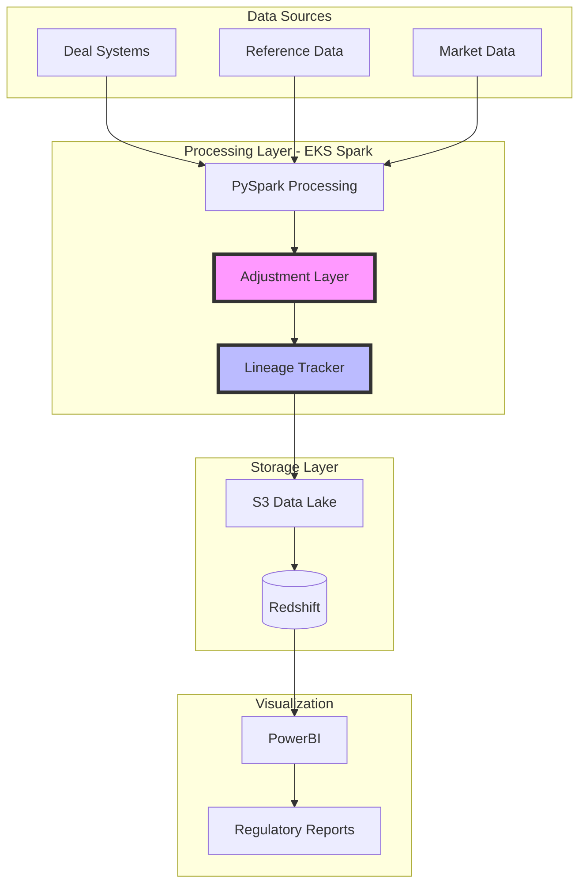
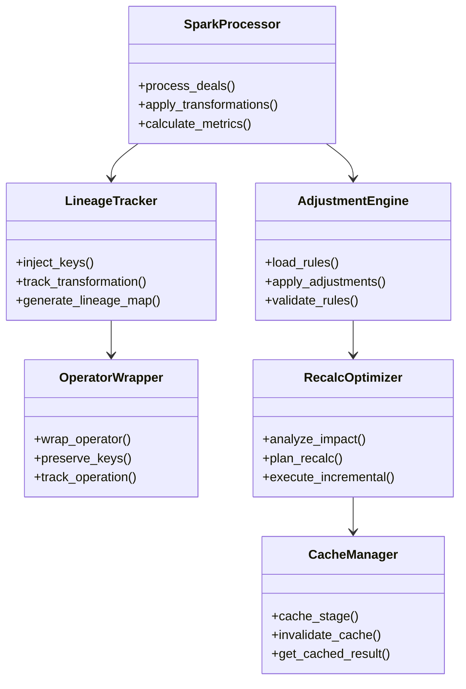
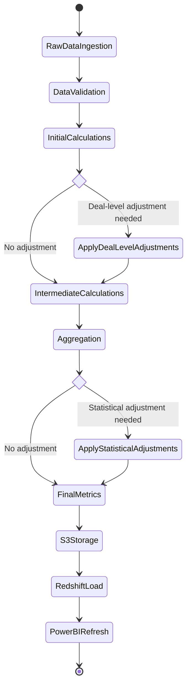
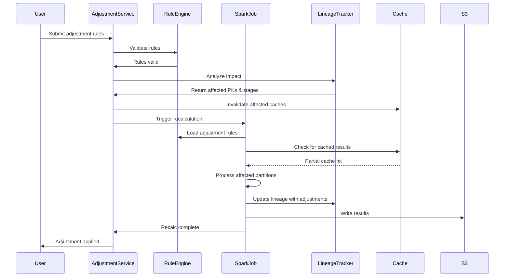
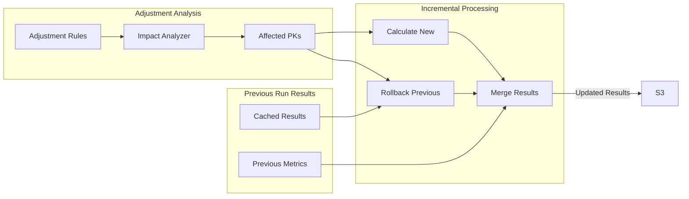
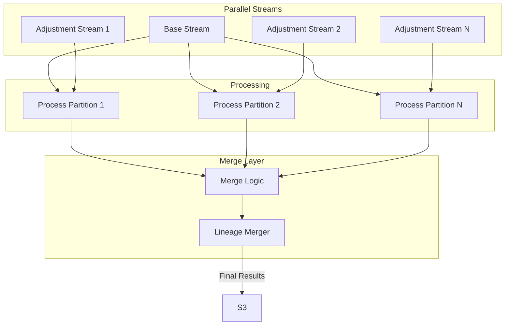
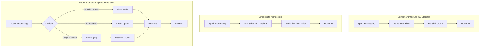
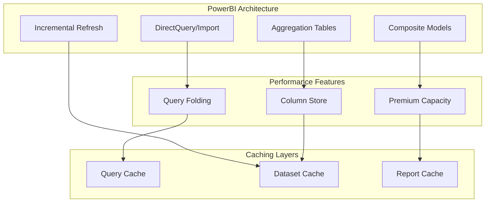
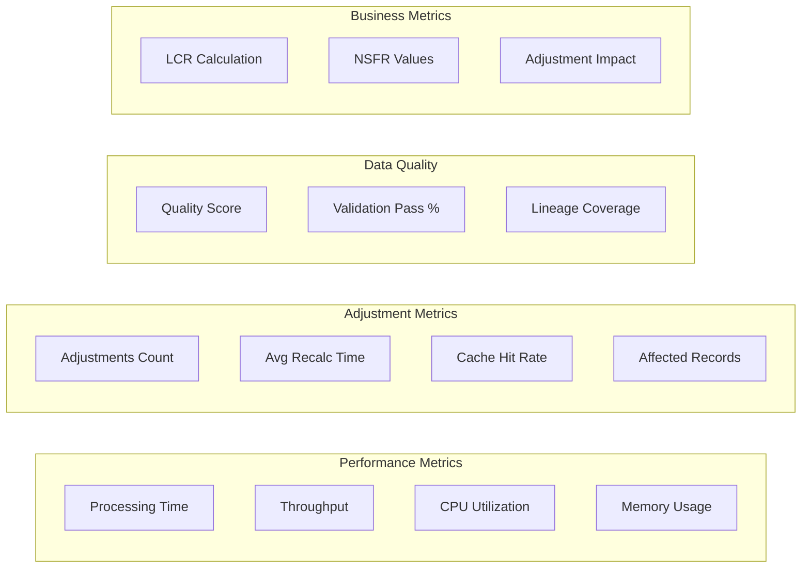

# Enhanced Regulatory Calculation Pipeline Architecture

## Executive Summary

This document outlines the architecture for a high-performance regulatory calculation pipeline that processes large-scale financial data for liquidity calculations. The system features a sophisticated adjustment mechanism that allows rule-based modifications at any stage while maintaining complete data lineage and traceability.

## Table of Contents

1. [Current Architecture Overview](#current-architecture-overview)
2. [Core Components](#core-components)
3. [Adjustment System Design](#adjustment-system-design)
4. [Incremental Recalculation Strategy](#incremental-recalculation-strategy)
5. [Performance Optimization](#performance-optimization)
6. [S3 to Redshift to PowerBI Optimization](#s3-to-redshift-to-powerbi-optimization)
7. [Implementation Patterns](#implementation-patterns)
8. [Monitoring and Observability](#monitoring-and-observability)

## Current Architecture Overview

### High-Level Data Flow



### Key Architectural Principles

1. **Lineage Preservation**: Every transformation preserves primary keys through custom PySpark wrappers
2. **Flexible Adjustments**: Rule-based adjustments can be injected at any processing stage
3. **Performance**: Distributed processing on EKS for scalability
4. **Auditability**: Complete traceability from source to final metrics

## Core Components

### Component Architecture



### Processing Stage Flow



## Adjustment System Design

### Adjustment Rule Structure

```python
adjustment_rule = {
    "rule_id": "ADJ_2024_001",
    "stage": "deal_enrichment",  # or "aggregation", "final_calc"
    "conditions": [
        {"field": "product_type", "operator": "in", "value": ["BOND", "LOAN"]},
        {"field": "maturity_date", "operator": ">", "value": "2025-01-01"}
    ],
    "adjustments": [
        {"field": "liquidity_factor", "operation": "multiply", "value": 0.95},
        {"field": "haircut", "operation": "add", "value": 0.05}
    ],
    "effective_date": "2024-01-15",
    "expiry_date": "2024-12-31",
    "approval": {"user": "risk_admin", "timestamp": "2024-01-14T10:00:00Z"}
}
```

### Adjustment Application Flow



## Incremental Recalculation Strategy

### Dependency Graph Management

```python
class DependencyGraph:
    def __init__(self):
        self.graph = nx.DiGraph()
        self.stage_cache = {}
        
    def add_stage_dependency(self, source_stage, target_stage, pk_mapping):
        self.graph.add_edge(source_stage, target_stage, 
                           pk_mapping=pk_mapping)
    
    def find_minimal_recalc_path(self, adjustment_rule):
        affected_stage = adjustment_rule['stage']
        affected_pks = self.get_affected_pks(adjustment_rule)
        
        # Find all downstream stages
        downstream_stages = nx.descendants(self.graph, affected_stage)
        
        # Build minimal recalc plan
        recalc_plan = RecalcPlan()
        for stage in nx.topological_sort(self.graph):
            if stage in downstream_stages or stage == affected_stage:
                stage_pks = self.propagate_pks(affected_pks, 
                                              affected_stage, stage)
                recalc_plan.add_stage(stage, stage_pks)
        
        return recalc_plan
```

### Incremental Processing Pattern



## Performance Optimization

### Multi-Layer Caching Strategy

```python
class CacheManager:
    def __init__(self, s3_bucket, redis_cluster):
        self.s3_cache = S3Cache(s3_bucket)
        self.memory_cache = SparkCacheManager()
        self.redis_cache = RedisCache(redis_cluster)
        
    def get_or_compute(self, stage_id, partition_key, compute_func):
        # L1: In-memory Spark cache
        cached = self.memory_cache.get(stage_id, partition_key)
        if cached:
            return cached
            
        # L2: Redis cache for hot data
        cached = self.redis_cache.get(stage_id, partition_key)
        if cached:
            df = self.deserialize_from_redis(cached)
            self.memory_cache.put(stage_id, partition_key, df)
            return df
            
        # L3: S3 cache for cold data
        cached = self.s3_cache.get(stage_id, partition_key)
        if cached:
            df = spark.read.parquet(cached)
            self.memory_cache.put(stage_id, partition_key, df)
            return df
            
        # Compute and cache at all levels
        result = compute_func()
        self.cache_result(stage_id, partition_key, result)
        return result
```

### Parallel Execution Strategy



## S3 to Redshift to PowerBI Optimization

### Direct Write vs. S3 Staging Approach

#### Architecture Comparison



### Direct Write Implementation

### Direct Write Implementation

```python
# Direct Redshift Writer with Star Schema Transformation
class RedshiftStarSchemaWriter:
    def __init__(self, spark_session, jdbc_url, temp_s3_path):
        self.spark = spark_session
        self.jdbc_url = jdbc_url
        self.temp_s3_path = temp_s3_path
        self.redshift_props = {
            "user": "admin",
            "password": "password",
            "driver": "com.amazon.redshift.jdbc42.Driver",
            "tempdir": temp_s3_path,
            "aws_iam_role": "arn:aws:iam::account:role/RedshiftRole"
        }
    
    def transform_to_star_schema(self, raw_df):
        """Transform raw data into star schema format"""
        
        # Create dimension tables
        dim_entity = self.create_entity_dimension(raw_df)
        dim_date = self.create_date_dimension(raw_df)
        dim_product = self.create_product_dimension(raw_df)
        dim_adjustment = self.create_adjustment_dimension(raw_df)
        
        # Create fact table with foreign keys
        fact_liquidity = self.create_fact_table(
            raw_df, dim_entity, dim_date, dim_product, dim_adjustment
        )
        
        return {
            "dim_entity": dim_entity,
            "dim_date": dim_date,
            "dim_product": dim_product,
            "dim_adjustment": dim_adjustment,
            "fact_liquidity": fact_liquidity
        }
    
    def write_with_performance_optimization(self, tables_dict):
        """Write to Redshift with various optimization strategies"""
        
        for table_name, df in tables_dict.items():
            if table_name.startswith("dim_"):
                # Dimension tables - use UPSERT pattern
                self.upsert_dimension(table_name, df)
            else:
                # Fact tables - use batch insert or COPY based on size
                if df.count() < 100000:  # Threshold for direct write
                    self.direct_write(table_name, df)
                else:
                    self.staged_write(table_name, df)
    
    def direct_write(self, table_name, df):
        """Direct JDBC write for smaller datasets"""
        
        # Optimize for direct write
        optimized_df = (df
            .coalesce(10)  # Reduce parallelism for small data
            .sortWithinPartitions("entity_key", "date_key")
        )
        
        # Write with batch optimization
        (optimized_df.write
            .mode("append")
            .option("batchsize", 10000)
            .option("truncate", "false")
            .jdbc(self.jdbc_url, table_name, properties=self.redshift_props)
        )
    
    def staged_write(self, table_name, df):
        """S3-staged write for larger datasets"""
        
        # Write to S3 first
        temp_path = f"{self.temp_s3_path}/{table_name}/{uuid.uuid4()}"
        
        (df.repartition(self.calculate_optimal_partitions(df))
           .write
           .mode("overwrite")
           .parquet(temp_path))
        
        # Use COPY command
        copy_command = f"""
        COPY {table_name}
        FROM '{temp_path}'
        IAM_ROLE '{self.redshift_props["aws_iam_role"]}'
        FORMAT AS PARQUET
        COMPUPDATE PRESET
        STATUPDATE ON;
        """
        
        self.execute_redshift_command(copy_command)
        
        # Clean up S3
        self.cleanup_s3(temp_path)
    
    def upsert_dimension(self, table_name, df):
        """Upsert pattern for dimension tables"""
        
        # Write to staging table first
        staging_table = f"{table_name}_staging"
        
        (df.write
            .mode("overwrite")
            .jdbc(self.jdbc_url, staging_table, properties=self.redshift_props)
        )
        
        # Perform MERGE operation
        merge_sql = f"""
        BEGIN TRANSACTION;
        
        -- Update existing records
        UPDATE {table_name}
        SET 
            last_updated = s.last_updated,
            is_active = s.is_active,
            attributes = s.attributes
        FROM {staging_table} s
        WHERE {table_name}.natural_key = s.natural_key;
        
        -- Insert new records
        INSERT INTO {table_name}
        SELECT s.* FROM {staging_table} s
        LEFT JOIN {table_name} t ON s.natural_key = t.natural_key
        WHERE t.natural_key IS NULL;
        
        DROP TABLE {staging_table};
        
        COMMIT;
        """
        
        self.execute_redshift_command(merge_sql)
```

### Performance Comparison & Trade-offs

| Approach | Pros | Cons | Best Use Case |
|----------|------|------|---------------|
| **S3 Staging (Current)** | • Highly scalable<br>• Fault tolerant<br>• Best for large batches<br>• S3 provides backup | • Higher latency<br>• Two-step process<br>• S3 costs | Regular batch loads >1M records |
| **Direct Write** | • Lower latency<br>• Real-time updates<br>• No S3 costs<br>• Immediate availability | • Connection overhead<br>• Less fault tolerant<br>• Poor for large batches<br>• Redshift load impact | Small updates, adjustments <100K records |
| **Hybrid (Recommended)** | • Optimal performance<br>• Flexible approach<br>• Cost effective<br>• Handles all scenarios | • More complex logic<br>• Requires monitoring<br>• Multiple code paths | Production systems with mixed workloads |

### Optimized Hybrid Architecture Implementation

```python
class HybridRedshiftWriter:
    def __init__(self, spark_session, config):
        self.spark = spark_session
        self.config = config
        self.metrics = MetricsCollector()
        
    def write_to_redshift(self, df, table_name, write_mode="auto"):
        """Intelligent routing based on data characteristics"""
        
        # Analyze data characteristics
        row_count = df.count()
        is_adjustment = "adjustment_id" in df.columns
        partition_count = df.rdd.getNumPartitions()
        
        # Decision logic
        if write_mode == "auto":
            if is_adjustment and row_count < 50000:
                # Adjustments need immediate visibility
                return self.direct_upsert(df, table_name)
            elif row_count < 100000:
                # Small batches - direct write
                return self.optimized_direct_write(df, table_name)
            else:
                # Large batches - S3 staging
                return self.staged_copy_write(df, table_name)
        
    def optimized_direct_write(self, df, table_name):
        """Direct write with connection pooling and batching"""
        
        start_time = time.time()
        
        try:
            # Transform to star schema if needed
            if self.requires_transformation(table_name):
                df = self.transform_to_star_schema(df)
            
            # Optimize DataFrame for direct write
            optimized_df = self.optimize_for_direct_write(df)
            
            # Use connection pooling
            with self.get_connection_pool() as conn_pool:
                (optimized_df.write
                    .mode("append")
                    .option("batchsize", 25000)
                    .option("numPartitions", 4)  # Limit concurrent connections
                    .option("isolationLevel", "READ_UNCOMMITTED")
                    .jdbc(self.config.jdbc_url, table_name, 
                          connection_properties=conn_pool.properties))
            
            self.metrics.record_write(
                method="direct",
                table=table_name,
                records=df.count(),
                duration=time.time() - start_time
            )
            
        except Exception as e:
            # Fallback to S3 staging on failure
            self.logger.warning(f"Direct write failed, falling back to S3: {e}")
            return self.staged_copy_write(df, table_name)
    
    def optimize_for_direct_write(self, df):
        """Optimize DataFrame for JDBC write performance"""
        
        return (df
            # Reduce partitions to limit connections
            .coalesce(min(df.rdd.getNumPartitions(), 10))
            # Sort for better compression
            .sortWithinPartitions("date_key", "entity_key")
            # Cache if we'll read multiple times
            .cache()
        )
```

### Star Schema Transformation in Spark

```python
class StarSchemaTransformer:
    def __init__(self, spark_session):
        self.spark = spark_session
        
    def create_date_dimension(self, df):
        """Create date dimension with proper attributes"""
        
        dates_df = df.select("calculation_date").distinct()
        
        return dates_df.select(
            F.monotonically_increasing_id().alias("date_key"),
            F.col("calculation_date"),
            F.year("calculation_date").alias("year"),
            F.quarter("calculation_date").alias("quarter"),
            F.month("calculation_date").alias("month"),
            F.dayofmonth("calculation_date").alias("day"),
            F.dayofweek("calculation_date").alias("day_of_week"),
            F.weekofyear("calculation_date").alias("week_of_year"),
            F.when(F.dayofweek("calculation_date").isin([1,7]), True)
             .otherwise(False).alias("is_weekend"),
            F.last_day("calculation_date").alias("month_end_date")
        ).distinct()
    
    def create_fact_table(self, raw_df, dim_entity, dim_date, dim_product):
        """Create fact table with foreign keys"""
        
        # Join with dimensions to get surrogate keys
        fact_df = (raw_df
            .join(dim_entity, raw_df.entity_id == dim_entity.natural_key)
            .join(dim_date, raw_df.calculation_date == dim_date.calculation_date)
            .join(dim_product, raw_df.product_type == dim_product.product_type)
            .select(
                F.col("dim_entity.entity_key"),
                F.col("dim_date.date_key"),
                F.col("dim_product.product_key"),
                F.col("raw_df.liquidity_value"),
                F.col("raw_df.haircut_value"),
                F.col("raw_df.adjustment_flag"),
                F.col("raw_df.lineage_key"),
                F.current_timestamp().alias("load_timestamp")
            )
        )
        
        return fact_df
```

### Redshift Table Design for Direct Write

```sql
-- Optimized fact table for direct writes
CREATE TABLE fact_liquidity (
    entity_key INTEGER NOT NULL ENCODE az64,
    date_key INTEGER NOT NULL ENCODE az64,
    product_key INTEGER NOT NULL ENCODE az64,
    liquidity_value DECIMAL(18,4) ENCODE az64,
    haircut_value DECIMAL(18,4) ENCODE az64,
    adjustment_flag BOOLEAN ENCODE raw,
    lineage_key VARCHAR(100) ENCODE zstd,
    load_timestamp TIMESTAMP ENCODE az64,
    PRIMARY KEY (entity_key, date_key, product_key)
)
DISTSTYLE KEY
DISTKEY (entity_key)
SORTKEY (date_key, entity_key)
-- Optimize for concurrent writes
ALTER TABLE fact_liquidity SET (
    append_only = true,
    backup = yes
);

-- Create staging table for efficient merges
CREATE TABLE fact_liquidity_staging (LIKE fact_liquidity);

-- Optimize for PowerBI queries
CREATE MATERIALIZED VIEW mv_liquidity_current AS
SELECT 
    e.entity_name,
    d.calculation_date,
    p.product_category,
    SUM(f.liquidity_value) as total_liquidity,
    SUM(CASE WHEN f.adjustment_flag THEN f.liquidity_value ELSE 0 END) as adjusted_amount
FROM fact_liquidity f
JOIN dim_entity e ON f.entity_key = e.entity_key
JOIN dim_date d ON f.date_key = d.date_key
JOIN dim_product p ON f.product_key = p.product_key
WHERE d.calculation_date >= DATEADD(day, -90, CURRENT_DATE)
GROUP BY 1,2,3;
```

### Performance Monitoring for Direct Writes

```python
class DirectWriteMonitor:
    def __init__(self):
        self.metrics = {}
        
    def monitor_write_performance(self, write_func):
        def monitored_write(df, table_name):
            metrics = {
                "start_time": time.time(),
                "row_count": df.count(),
                "partition_count": df.rdd.getNumPartitions(),
                "table_name": table_name
            }
            
            # Monitor Redshift during write
            with self.monitor_redshift_load():
                result = write_func(df, table_name)
            
            metrics["duration"] = time.time() - metrics["start_time"]
            metrics["throughput"] = metrics["row_count"] / metrics["duration"]
            
            # Alert if performance degrades
            if metrics["throughput"] < self.config.min_throughput:
                self.alert_performance_degradation(metrics)
            
            return result
        
        return monitored_write
```

```python
# Optimal S3 file structure
s3_optimization_config = {
    "file_format": "parquet",
    "compression": "zstd",
    "target_file_size": "128MB",
    "partition_strategy": "date_entity_type",
    "sort_keys": ["calculation_date", "entity_id", "metric_type"]
}

# Write optimization
def write_to_s3_optimized(df, path):
    (df.repartition(calculate_optimal_partitions(df))
       .sortWithinPartitions("calculation_date", "entity_id")
       .write
       .mode("overwrite")
       .option("compression", "zstd")
       .option("maxRecordsPerFile", 1000000)
       .parquet(path))
```

### Redshift Optimization

```sql
-- Create optimized table structure
CREATE TABLE liquidity_metrics (
    calculation_date DATE ENCODE az64,
    entity_id VARCHAR(50) ENCODE zstd,
    metric_type VARCHAR(30) ENCODE bytedict,
    metric_value DECIMAL(18,4) ENCODE az64,
    adjustment_flag BOOLEAN ENCODE raw,
    lineage_key VARCHAR(100) ENCODE zstd
)
DISTSTYLE KEY
DISTKEY (entity_id)
SORTKEY (calculation_date, entity_id);

-- Materialized view for PowerBI
CREATE MATERIALIZED VIEW mv_liquidity_summary AS
SELECT 
    calculation_date,
    entity_id,
    metric_type,
    SUM(metric_value) as total_value,
    MAX(CASE WHEN adjustment_flag THEN 1 ELSE 0 END) as has_adjustments,
    COUNT(DISTINCT lineage_key) as calculation_paths
FROM liquidity_metrics
GROUP BY 1, 2, 3;

-- Auto-refresh strategy
ALTER MATERIALIZED VIEW mv_liquidity_summary 
SET (AUTO REFRESH = YES);
```

### PowerBI Optimization Strategies



#### PowerBI Implementation Guidelines

1. **Dataset Design**
```dax
-- Create calculation groups for adjustments
CALCULATION GROUP 'Adjustment Scenarios'
    CALCULATION ITEM "Base" = SELECTEDMEASURE()
    CALCULATION ITEM "With Adjustments" = 
        CALCULATE(
            SELECTEDMEASURE(),
            'Metrics'[adjustment_flag] = TRUE
        )
    CALCULATION ITEM "Variance" = 
        [With Adjustments] - [Base]
```

2. **Incremental Refresh Policy**
```json
{
    "incrementalRefresh": {
        "enabled": true,
        "rangeStart": "3 months",
        "rangeEnd": "0 days",
        "incrementalGranularity": "day",
        "detectDataChanges": "lastModified"
    }
}
```

3. **Aggregation Strategy**
```dax
-- Pre-aggregate in Redshift for common queries
CREATE TABLE agg_daily_liquidity AS
SELECT 
    DATE_TRUNC('day', calculation_date) as day,
    entity_type,
    COUNT(DISTINCT entity_id) as entity_count,
    SUM(metric_value) as total_liquidity,
    AVG(metric_value) as avg_liquidity
FROM liquidity_metrics
GROUP BY 1, 2;
```

## Implementation Patterns

### Adjustment Service Implementation

```python
class AdjustmentService:
    def __init__(self, spark_session, dependency_graph, cache_manager):
        self.spark = spark_session
        self.dep_graph = dependency_graph
        self.cache = cache_manager
        
    def apply_adjustment(self, adjustment_rule):
        # Phase 1: Impact Analysis
        impact_analysis = self.analyze_impact(adjustment_rule)
        
        # Phase 2: Create execution plan
        exec_plan = self.create_execution_plan(impact_analysis)
        
        # Phase 3: Execute incremental updates
        results = self.execute_incremental_updates(exec_plan)
        
        # Phase 4: Update downstream systems
        self.propagate_changes(results)
        
        return AdjustmentResult(
            rule_id=adjustment_rule['rule_id'],
            affected_records=impact_analysis.affected_count,
            processing_time=results.duration,
            stages_updated=len(exec_plan.stages)
        )
    
    def execute_incremental_updates(self, exec_plan):
        results = []
        
        for stage in exec_plan.stages:
            if stage.can_use_incremental:
                result = self.incremental_update(stage)
            else:
                result = self.full_recalculation(stage)
            
            results.append(result)
            
            # Update cache
            self.cache.update_stage(stage.id, result.data)
            
        return ExecutionResults(results)
```

### Lineage Tracking Implementation

```python
class LineageTracker:
    def __init__(self):
        self.lineage_store = LineageStore()
        
    def wrap_transformation(self, transformation_func):
        def wrapped(df):
            # Extract input PKs
            input_pks = df.select("pk").distinct().collect()
            
            # Apply transformation
            result_df = transformation_func(df)
            
            # Extract output PKs
            output_pks = result_df.select("pk").distinct().collect()
            
            # Store lineage
            self.lineage_store.add_transformation(
                input_pks=input_pks,
                output_pks=output_pks,
                transformation_id=transformation_func.__name__,
                timestamp=datetime.now()
            )
            
            return result_df
        
        return wrapped
```

## Monitoring and Observability

### Key Metrics Dashboard



### Monitoring Implementation

```python
class PipelineMonitor:
    def __init__(self):
        self.metrics = MetricsCollector()
        
    def track_stage_execution(self, stage_name, func):
        def monitored_func(*args, **kwargs):
            start_time = time.time()
            
            try:
                result = func(*args, **kwargs)
                
                self.metrics.record({
                    'stage': stage_name,
                    'duration': time.time() - start_time,
                    'records_processed': result.count(),
                    'status': 'success'
                })
                
                return result
                
            except Exception as e:
                self.metrics.record({
                    'stage': stage_name,
                    'duration': time.time() - start_time,
                    'status': 'failed',
                    'error': str(e)
                })
                raise
        
        return monitored_func
```

## Best Practices and Recommendations

### 1. Adjustment Governance
- All adjustments must be approved through workflow
- Maintain audit trail of all adjustments
- Regular review of active adjustment rules
- Automated testing of adjustment impacts

### 2. Performance Optimization
- **For S3 Staging**: Target file sizes of 128MB, use partition pruning
- **For Direct Writes**: Limit to <100K records, use connection pooling
- **For Hybrid Approach**: Monitor thresholds and adjust dynamically
- Implement bloom filters for join optimization
- Monitor and tune Spark resource allocation

### 3. Data Quality
- Validate adjustments before application
- Implement circuit breakers for large impacts
- Regular reconciliation with source systems
- Automated data quality checks at each stage

### 4. Operational Excellence
- Automated deployment pipelines
- Blue-green deployments for Spark jobs
- Comprehensive logging and monitoring
- Regular disaster recovery testing

### 5. Direct Write Specific Best Practices
- **Connection Management**: Use connection pooling, limit concurrent connections to 10
- **Batch Sizing**: Optimal batch size is 10K-25K records for JDBC writes
- **Transaction Management**: Use explicit transactions for consistency
- **Monitoring**: Track write throughput and Redshift load metrics
- **Fallback Strategy**: Always have S3 staging as fallback for direct write failures

## Performance Benchmarks

| Write Method | Records | Time | Throughput | Cost |
|--------------|---------|------|------------|------|
| Direct Write (JDBC) | 50K | 45s | 1.1K/s | Low |
| Direct Write (JDBC) | 500K | 12m | 694/s | Medium |
| S3 Staging (COPY) | 500K | 2m | 4.2K/s | Medium |
| S3 Staging (COPY) | 50M | 15m | 55K/s | High |
| Hybrid (Auto) | Mixed | Varies | Optimal | Optimal |

## Conclusion

This enhanced architecture provides a robust, performant, and auditable system for regulatory calculations with flexible adjustment capabilities. The combination of incremental processing, intelligent caching, and optimized data flow from S3 through Redshift to PowerBI ensures both performance and accuracy while maintaining complete visibility into all calculations and adjustments.

## Appendix A: Generic Star Schema Operator

### Overview

A reusable PySpark operator that automatically generates a star schema from a set of input tables and their relationships. This operator analyzes the table relationships, identifies facts and dimensions, and creates the appropriate star schema structure.

### Core Implementation

```python
from pyspark.sql import SparkSession, DataFrame
import pyspark.sql.functions as F
from typing import Dict, List, Tuple, Set, Optional
from dataclasses import dataclass
from collections import defaultdict
import networkx as nx

@dataclass
class TableRelationship:
    """Defines a relationship between two tables"""
    from_table: str
    from_column: str
    to_table: str
    to_column: str
    relationship_type: str  # "1:1", "1:n", "n:1", "n:n"
    
@dataclass
class ColumnMetadata:
    """Metadata about a column for schema generation"""
    column_name: str
    data_type: str
    is_measure: bool
    is_dimension: bool
    aggregation_func: Optional[str] = None  # sum, avg, count, etc.

class StarSchemaOperator:
    """
    Generic Star Schema Generator for PySpark
    
    This operator takes a set of tables and their relationships and automatically
    generates a star schema by:
    1. Analyzing relationships to identify fact and dimension tables
    2. Creating surrogate keys for dimensions
    3. Building the fact table with proper foreign keys
    4. Handling slowly changing dimensions (SCD Type 2)
    """
    
    def __init__(self, spark: SparkSession):
        self.spark = spark
        self.dimension_tables = {}
        self.fact_tables = {}
        self.surrogate_key_mappings = {}
        
    def generate_star_schema(
        self,
        tables: Dict[str, DataFrame],
        relationships: List[TableRelationship],
        column_metadata: Dict[str, List[ColumnMetadata]],
        target_fact_table: Optional[str] = None
    ) -> Dict[str, DataFrame]:
        """
        Main method to generate star schema
        
        Args:
            tables: Dictionary of table_name -> DataFrame
            relationships: List of relationships between tables
            column_metadata: Metadata about columns (measures vs dimensions)
            target_fact_table: Optional hint for main fact table
            
        Returns:
            Dictionary with generated star schema tables
        """
        
        # Step 1: Build relationship graph
        rel_graph = self._build_relationship_graph(relationships)
        
        # Step 2: Identify fact and dimension tables
        fact_tables, dim_tables = self._classify_tables(
            tables, rel_graph, column_metadata, target_fact_table
        )
        
        # Step 3: Generate dimension tables with surrogate keys
        dimension_dfs = self._generate_dimensions(tables, dim_tables, column_metadata)
        
        # Step 4: Generate fact tables
        fact_dfs = self._generate_facts(
            tables, fact_tables, dimension_dfs, relationships, column_metadata
        )
        
        # Step 5: Create any necessary bridge tables for many-to-many relationships
        bridge_dfs = self._generate_bridge_tables(relationships, dimension_dfs)
        
        # Combine all results
        result = {}
        result.update({f"dim_{name}": df for name, df in dimension_dfs.items()})
        result.update({f"fact_{name}": df for name, df in fact_dfs.items()})
        result.update({f"bridge_{name}": df for name, df in bridge_dfs.items()})
        
        return result
    
    def _build_relationship_graph(self, relationships: List[TableRelationship]) -> nx.DiGraph:
        """Build a directed graph of table relationships"""
        
        G = nx.DiGraph()
        
        for rel in relationships:
            G.add_edge(
                rel.from_table,
                rel.to_table,
                from_column=rel.from_column,
                to_column=rel.to_column,
                rel_type=rel.relationship_type
            )
            
        return G
    
    def _classify_tables(
        self,
        tables: Dict[str, DataFrame],
        rel_graph: nx.DiGraph,
        column_metadata: Dict[str, List[ColumnMetadata]],
        target_fact_table: Optional[str]
    ) -> Tuple[Set[str], Set[str]]:
        """Classify tables as facts or dimensions based on relationships and metadata"""
        
        fact_tables = set()
        dim_tables = set()
        
        # If target fact table is specified, use it
        if target_fact_table and target_fact_table in tables:
            fact_tables.add(target_fact_table)
        
        # Analyze each table
        for table_name, df in tables.items():
            # Count measures vs dimensions
            measures = sum(
                1 for col in column_metadata.get(table_name, [])
                if col.is_measure
            )
            dimensions = sum(
                1 for col in column_metadata.get(table_name, [])
                if col.is_dimension
            )
            
            # Tables with many measures are likely facts
            if measures > dimensions:
                fact_tables.add(table_name)
            # Tables with mostly dimensions are dimension tables
            elif dimensions > measures:
                dim_tables.add(table_name)
            else:
                # Use graph analysis - tables with many incoming edges are facts
                in_degree = rel_graph.in_degree(table_name)
                out_degree = rel_graph.out_degree(table_name)
                
                if in_degree > out_degree:
                    fact_tables.add(table_name)
                else:
                    dim_tables.add(table_name)
        
        return fact_tables, dim_tables
    
    def _generate_dimensions(
        self,
        tables: Dict[str, DataFrame],
        dim_tables: Set[str],
        column_metadata: Dict[str, List[ColumnMetadata]]
    ) -> Dict[str, DataFrame]:
        """Generate dimension tables with surrogate keys"""
        
        dimension_dfs = {}
        
        for dim_name in dim_tables:
            if dim_name not in tables:
                continue
                
            df = tables[dim_name]
            
            # Add surrogate key
            df_with_sk = df.withColumn(
                f"{dim_name}_key",
                F.monotonically_increasing_id()
            )
            
            # Add SCD Type 2 columns
            df_with_scd = df_with_sk.withColumn(
                "valid_from",
                F.current_timestamp()
            ).withColumn(
                "valid_to",
                F.lit("9999-12-31").cast("timestamp")
            ).withColumn(
                "is_current",
                F.lit(True)
            )
            
            # Select only dimension columns
            dim_columns = [
                col.column_name for col in column_metadata.get(dim_name, [])
                if col.is_dimension
            ]
            
            # Always include the surrogate key and natural key
            columns_to_select = [f"{dim_name}_key"] + dim_columns + [
                "valid_from", "valid_to", "is_current"
            ]
            
            # Filter columns that exist in the dataframe
            existing_columns = df_with_scd.columns
            final_columns = [col for col in columns_to_select if col in existing_columns]
            
            dimension_dfs[dim_name] = df_with_scd.select(*final_columns)
            
        return dimension_dfs
    
    def _generate_facts(
        self,
        tables: Dict[str, DataFrame],
        fact_tables: Set[str],
        dimension_dfs: Dict[str, DataFrame],
        relationships: List[TableRelationship],
        column_metadata: Dict[str, List[ColumnMetadata]]
    ) -> Dict[str, DataFrame]:
        """Generate fact tables with foreign keys to dimensions"""
        
        fact_dfs = {}
        
        for fact_name in fact_tables:
            if fact_name not in tables:
                continue
                
            fact_df = tables[fact_name]
            
            # Join with each related dimension to get surrogate keys
            for rel in relationships:
                if rel.from_table == fact_name and rel.to_table in dimension_dfs:
                    dim_df = dimension_dfs[rel.to_table]
                    
                    # Join to get surrogate key
                    fact_df = fact_df.join(
                        dim_df.filter(F.col("is_current") == True).select(
                            F.col(rel.to_column),
                            F.col(f"{rel.to_table}_key")
                        ),
                        fact_df[rel.from_column] == dim_df[rel.to_column],
                        "left"
                    )
            
            # Select measures and foreign keys
            measure_columns = [
                col.column_name for col in column_metadata.get(fact_name, [])
                if col.is_measure
            ]
            
            # Get all foreign keys
            foreign_keys = [
                f"{dim_name}_key" for dim_name in dimension_dfs.keys()
                if f"{dim_name}_key" in fact_df.columns
            ]
            
            # Add fact metadata
            fact_df = fact_df.withColumn(
                "load_timestamp",
                F.current_timestamp()
            )
            
            # Select final columns
            final_columns = foreign_keys + measure_columns + ["load_timestamp"]
            existing_columns = fact_df.columns
            columns_to_select = [col for col in final_columns if col in existing_columns]
            
            fact_dfs[fact_name] = fact_df.select(*columns_to_select)
            
        return fact_dfs
    
    def _generate_bridge_tables(
        self,
        relationships: List[TableRelationship],
        dimension_dfs: Dict[str, DataFrame]
    ) -> Dict[str, DataFrame]:
        """Generate bridge tables for many-to-many relationships"""
        
        bridge_dfs = {}
        
        # Find many-to-many relationships
        for rel in relationships:
            if rel.relationship_type == "n:n":
                bridge_name = f"{rel.from_table}_{rel.to_table}"
                
                if rel.from_table in dimension_dfs and rel.to_table in dimension_dfs:
                    # Create bridge table with both surrogate keys
                    from_df = dimension_dfs[rel.from_table].select(
                        F.col(f"{rel.from_table}_key"),
                        F.col(rel.from_column)
                    )
                    to_df = dimension_dfs[rel.to_table].select(
                        F.col(f"{rel.to_table}_key"),
                        F.col(rel.to_column)
                    )
                    
                    # This is a simplified bridge - in reality would need the actual
                    # many-to-many relationship data
                    bridge_df = from_df.crossJoin(to_df).select(
                        F.col(f"{rel.from_table}_key"),
                        F.col(f"{rel.to_table}_key"),
                        F.current_timestamp().alias("created_timestamp")
                    )
                    
                    bridge_dfs[bridge_name] = bridge_df
                    
        return bridge_dfs

# Usage Example
def example_usage(spark: SparkSession):
    """Example of using the Star Schema Operator"""
    
    # Create sample data
    deals_df = spark.createDataFrame([
        ("D001", "P001", "E001", 1000000, 0.05, "2024-01-15"),
        ("D002", "P002", "E001", 2000000, 0.03, "2024-01-15"),
        ("D003", "P001", "E002", 1500000, 0.04, "2024-01-16"),
    ], ["deal_id", "product_id", "entity_id", "amount", "rate", "date"])
    
    entities_df = spark.createDataFrame([
        ("E001", "Entity One", "Banking", "US"),
        ("E002", "Entity Two", "Insurance", "UK"),
    ], ["entity_id", "entity_name", "sector", "country"])
    
    products_df = spark.createDataFrame([
        ("P001", "Bond", "Fixed Income", "Low"),
        ("P002", "Loan", "Credit", "Medium"),
    ], ["product_id", "product_name", "product_type", "risk_level"])
    
    # Define tables
    tables = {
        "deals": deals_df,
        "entities": entities_df,
        "products": products_df
    }
    
    # Define relationships
    relationships = [
        TableRelationship("deals", "entity_id", "entities", "entity_id", "n:1"),
        TableRelationship("deals", "product_id", "products", "product_id", "n:1"),
    ]
    
    # Define column metadata
    column_metadata = {
        "deals": [
            ColumnMetadata("deal_id", "string", False, True),
            ColumnMetadata("amount", "double", True, False, "sum"),
            ColumnMetadata("rate", "double", True, False, "avg"),
            ColumnMetadata("date", "string", False, True),
        ],
        "entities": [
            ColumnMetadata("entity_id", "string", False, True),
            ColumnMetadata("entity_name", "string", False, True),
            ColumnMetadata("sector", "string", False, True),
            ColumnMetadata("country", "string", False, True),
        ],
        "products": [
            ColumnMetadata("product_id", "string", False, True),
            ColumnMetadata("product_name", "string", False, True),
            ColumnMetadata("product_type", "string", False, True),
            ColumnMetadata("risk_level", "string", False, True),
        ]
    }
    
    # Generate star schema
    operator = StarSchemaOperator(spark)
    star_schema = operator.generate_star_schema(
        tables,
        relationships,
        column_metadata,
        target_fact_table="deals"
    )
    
    # Display results
    for table_name, df in star_schema.items():
        print(f"\n{table_name}:")
        df.show()
    
    return star_schema

# Advanced Features Extension
class AdvancedStarSchemaOperator(StarSchemaOperator):
    """Extended version with additional features"""
    
    def __init__(self, spark: SparkSession):
        super().__init__(spark)
        self.optimization_rules = {}
        
    def add_date_dimension(self, start_date: str, end_date: str) -> DataFrame:
        """Generate a complete date dimension"""
        
        return (self.spark.sql(f"""
            WITH date_range AS (
                SELECT explode(sequence(
                    to_date('{start_date}'), 
                    to_date('{end_date}'), 
                    interval 1 day
                )) as date
            )
            SELECT 
                row_number() OVER (ORDER BY date) as date_key,
                date as calendar_date,
                year(date) as year,
                quarter(date) as quarter,
                month(date) as month,
                day(date) as day,
                date_format(date, 'EEEE') as day_name,
                date_format(date, 'MMMM') as month_name,
                weekofyear(date) as week_of_year,
                CASE 
                    WHEN date_format(date, 'E') IN ('Sat', 'Sun') 
                    THEN true ELSE false 
                END as is_weekend,
                CASE 
                    WHEN date = last_day(date) 
                    THEN true ELSE false 
                END as is_month_end
            FROM date_range
        """))
    
    def optimize_for_redshift(self, star_schema: Dict[str, DataFrame]) -> Dict[str, DataFrame]:
        """Apply Redshift-specific optimizations"""
        
        optimized = {}
        
        for table_name, df in star_schema.items():
            if table_name.startswith("dim_"):
                # Small dimensions - prepare for DISTSTYLE ALL
                optimized[table_name] = df.coalesce(1)
            elif table_name.startswith("fact_"):
                # Facts - sort by common query patterns
                key_columns = [col for col in df.columns if col.endswith("_key")]
                if key_columns:
                    optimized[table_name] = df.sortWithinPartitions(*key_columns)
                else:
                    optimized[table_name] = df
            else:
                optimized[table_name] = df
                
        return optimized
    
    def generate_aggregation_tables(
        self, 
        fact_df: DataFrame, 
        aggregation_levels: List[List[str]]
    ) -> Dict[str, DataFrame]:
        """Generate pre-aggregated tables for PowerBI performance"""
        
        agg_tables = {}
        
        for level in aggregation_levels:
            agg_name = "_".join(level)
            
            # Identify measure columns
            measure_cols = [
                col for col in fact_df.columns 
                if fact_df.schema[col].dataType.simpleString() in ['double', 'float', 'decimal']
            ]
            
            # Create aggregation
            agg_df = fact_df.groupBy(*level).agg(
                *[F.sum(col).alias(f"sum_{col}") for col in measure_cols],
                *[F.avg(col).alias(f"avg_{col}") for col in measure_cols],
                F.count("*").alias("record_count")
            )
            
            agg_tables[f"agg_{agg_name}"] = agg_df
            
        return agg_tables
```

### Integration with Your Pipeline

```python
class LiquidityStarSchemaGenerator:
    """Specific implementation for liquidity calculations pipeline"""
    
    def __init__(self, spark: SparkSession):
        self.spark = spark
        self.operator = AdvancedStarSchemaOperator(spark)
        
    def generate_liquidity_star_schema(self, s3_paths: Dict[str, str]) -> None:
        """Generate star schema from S3 data layers"""
        
        # Load final adjusted data from S3
        adjusted_df = self.spark.read.parquet(s3_paths["adjusted"])
        entities_df = self.spark.read.parquet(s3_paths["reference_entities"])
        products_df = self.spark.read.parquet(s3_paths["reference_products"])
        
        # Define the schema structure
        tables = {
            "liquidity_calculations": adjusted_df,
            "entities": entities_df,
            "products": products_df
        }
        
        relationships = [
            TableRelationship(
                "liquidity_calculations", "entity_id",
                "entities", "entity_id", "n:1"
            ),
            TableRelationship(
                "liquidity_calculations", "product_id",
                "products", "product_id", "n:1"
            ),
        ]
        
        column_metadata = {
            "liquidity_calculations": [
                ColumnMetadata("calculation_id", "string", False, True),
                ColumnMetadata("entity_id", "string", False, True),
                ColumnMetadata("product_id", "string", False, True),
                ColumnMetadata("liquidity_value", "double", True, False, "sum"),
                ColumnMetadata("haircut_value", "double", True, False, "sum"),
                ColumnMetadata("adjusted_value", "double", True, False, "sum"),
                ColumnMetadata("calculation_date", "date", False, True),
            ],
            # ... additional metadata
        }
        
        # Generate star schema
        star_schema = self.operator.generate_star_schema(
            tables, relationships, column_metadata,
            target_fact_table="liquidity_calculations"
        )
        
        # Add date dimension
        star_schema["dim_date"] = self.operator.add_date_dimension(
            "2020-01-01", "2025-12-31"
        )
        
        # Optimize for Redshift
        optimized_schema = self.operator.optimize_for_redshift(star_schema)
        
        # Generate aggregation tables for PowerBI
        agg_tables = self.operator.generate_aggregation_tables(
            star_schema["fact_liquidity_calculations"],
            [
                ["date_key", "entity_key"],
                ["date_key", "product_key"],
                ["date_key"],
            ]
        )
        optimized_schema.update(agg_tables)
        
        # Write to Redshift
        self._write_to_redshift(optimized_schema)
        
    def _write_to_redshift(self, schema_dict: Dict[str, DataFrame]):
        """Write star schema to Redshift with appropriate distribution"""
        
        for table_name, df in schema_dict.items():
            if table_name.startswith("dim_"):
                # Dimensions use DISTSTYLE ALL
                dist_style = "ALL"
            elif table_name.startswith("fact_"):
                # Facts use DISTSTYLE KEY
                dist_style = "KEY"
            else:
                # Aggregations use AUTO
                dist_style = "AUTO"
                
            # Write with appropriate settings
            self._optimized_redshift_write(df, table_name, dist_style)
```

### Key Features of the Star Schema Operator

1. **Automatic Classification**: Analyzes tables to identify facts vs dimensions
2. **Surrogate Key Generation**: Creates monotonically increasing IDs
3. **SCD Type 2 Support**: Includes validity dates and current flags
4. **Bridge Table Generation**: Handles many-to-many relationships
5. **Optimization Options**: Redshift-specific and PowerBI-specific optimizations
6. **Flexible Metadata**: Configurable column classification and aggregation rules

This operator can be used throughout your pipeline to automatically generate appropriate star schemas at any stage, making it easy to create different analytical views of your data.