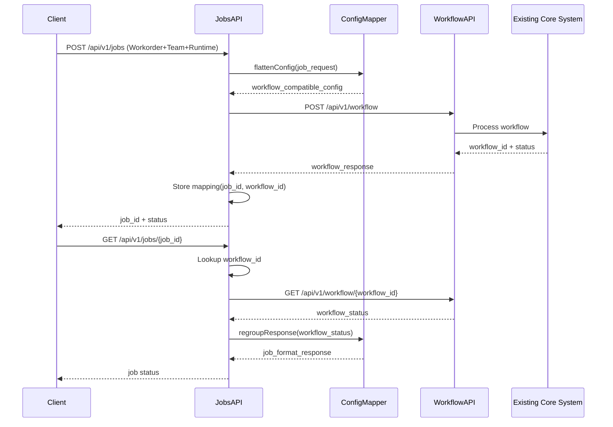

# C4H Jobs API Specification

## 1. Introduction

### 1.1 Purpose

This specification document outlines the design and implementation of the new C4H Jobs API, which will provide a more logically structured interface for submitting code refactoring tasks to the C4H system. The Jobs API will initially serve as a proxy layer over the existing Workflow API, eventually becoming the primary interface as the legacy API is deprecated.

### 1.2 Background

The current C4H Workflow API has served the system well, but its configuration structure does not align with how users conceptualize refactoring jobs. The existing flat configuration structure makes it difficult for users to understand the relationship between different configuration sections and how they influence the refactoring process.

### 1.3 Scope

This document covers:
- The rationale for creating the Jobs API
- The logical restructuring of configuration
- The design of the proxy mechanism
- The OpenAPI specification
- The refactoring approach and timeline

## 2. Rationale

### 2.1 Problems with Current Workflow API

1. **Configuration Sprawl**: The current API accepts a flat configuration structure that doesn't reflect the logical groupings of settings.
2. **Cognitive Complexity**: Users must understand the entire configuration hierarchy to make simple changes.
3. **Poor Discoverability**: Related settings are scattered across different sections of the configuration.
4. **Inconsistent Access Patterns**: Some settings are accessed at the top level, while others are nested within configuration sections.

### 2.2 Benefits of the Jobs API

1. **Logical Organization**: Groups related settings into meaningful units (Workorder, Team, Runtime).
2. **Improved Developer Experience**: Clearer structure for API clients and users.
3. **Better Documentation**: Can document related settings together.
4. **Simplified Evolution**: Easier to add new capabilities within logical boundaries.
5. **Consistent Interface**: Provides a unified model for all job-related operations.

## 3. Design

### 3.1 Logical Configuration Groupings

The Jobs API restructures configuration into three logical groups:

1. **Workorder (project, intent)**
   - Defines what work to do and where
   - Controls file scope and modification goals
   - Used primarily by Discovery and Solution agents

2. **Team (llm_config, orchestration)**
   - Defines who does the work and how they coordinate
   - Controls model selection, capabilities, and workflow routing
   - Used by Orchestrator and agent factories

3. **Runtime (runtime, logging, system, backup)**
   - Defines operational infrastructure
   - Controls lineage, storage, observability, and recovery
   - Used across all components

### 3.2 Architecture



### 3.3 Key Components

#### 3.3.1 JobController

- Handles `/api/v1/jobs` endpoints
- Translates requests to existing workflow format
- Maps responses back to job format
- Maintains job ID to workflow ID mapping

#### 3.3.2 ConfigurationMapper

- Transforms grouped configuration to flat configuration
- Groups flat configuration into logical divisions
- Preserves all configuration values
- Provides bidirectional mapping

#### 3.3.3 JobWorkflowBridge

- Proxies job requests to workflow endpoints
- Maintains workflow IDs to job ID mapping
- Handles state synchronization
- Ensures no data loss during translation

### 3.4 Configuration Transformation

#### From Jobs API to Workflow API

```
# Input: Jobs API Structure
{
  "workorder": {
    "project": { "path": "/path/to/project" },
    "intent": { "description": "Add logging" }
  },
  "team": {
    "llm_config": { ... },
    "orchestration": { ... }
  },
  "runtime": {
    "runtime": { ... },
    "logging": { ... },
    "backup": { ... }
  }
}

# Output: Workflow API Structure
{
  "project_path": "/path/to/project",
  "intent": { "description": "Add logging" },
  "app_config": {
    "project": { ... },
    "llm_config": { ... },
    "orchestration": { ... },
    "runtime": { ... },
    "logging": { ... },
    "backup": { ... }
  }
}
```

## 4. Refactoring Approach

### 4.1 Implementation Strategy

1. **Phase 1: Proxy Implementation**
   - Build the Jobs API as a layer on top of the existing Workflow API
   - Implement configuration transformation
   - Deploy alongside existing API

2. **Phase 2: Client Migration**
   - Document the new API
   - Support client migration
   - Monitor usage patterns

3. **Phase 3: Core Integration**
   - Refactor core system to natively use the new structure
   - Maintain backward compatibility through a legacy adapter
   - Gradually phase out the workflow API

### 4.2 Development Roadmap

1. **Initial Development (2 weeks)**
   - Implement API endpoints
   - Develop configuration mapper
   - Create job-workflow bridge

2. **Testing and Validation (1 week)**
   - Verify functional equivalence
   - Benchmark performance
   - Address edge cases

3. **Documentation and Rollout (1 week)**
   - Update API documentation
   - Create migration guides
   - Implement telemetry

4. **Support and Monitoring (ongoing)**
   - Track API usage
   - Assist client migration
   - Gather feedback for improvements

### 4.3 Backward Compatibility

- Both APIs will run in parallel during the migration period
- The Workflow API will be marked as deprecated but fully functional
- No changes to the core processing will be made initially

## 5. OpenAPI Specification

```yaml
openapi: 3.1.0
info:
  title: C4H LLM API
  description: API for submitting code refactoring jobs with structured configuration
  version: 1.0.0

paths:
  /api/v1/jobs:
    post:
      summary: Submit a new code refactoring job
      description: Submit a job with workorder, team, and runtime configurations
      operationId: submitJob
      requestBody:
        required: true
        content:
          application/json:
            schema:
              $ref: '#/components/schemas/JobRequest'
      responses:
        '200':
          description: Job submitted successfully
          content:
            application/json:
              schema:
                $ref: '#/components/schemas/JobResponse'
        '400':
          description: Invalid request payload
        '500':
          description: Server error
  
  /api/v1/jobs/{jobId}:
    get:
      summary: Get job status
      description: Retrieve the status and results of a submitted job
      operationId: getJobStatus
      parameters:
        - name: jobId
          in: path
          required: true
          schema:
            type: string
      responses:
        '200':
          description: Job status retrieved
          content:
            application/json:
              schema:
                $ref: '#/components/schemas/JobStatus'
        '404':
          description: Job not found

components:
  schemas:
    JobRequest:
      type: object
      required:
        - workorder
      properties:
        workorder:
          type: object
          required:
            - project
            - intent
          properties:
            project:
              type: object
              required:
                - path
              properties:
                path:
                  type: string
                  description: Path to the project directory
                workspace_root:
                  type: string
                  description: Directory for working files
                source_root:
                  type: string
                  description: Base directory for source code
                output_root:
                  type: string
                  description: Base directory for output files
            intent:
              type: object
              required:
                - description
              properties:
                description:
                  type: string
                  description: Description of the refactoring intent
                target_files:
                  type: array
                  items:
                    type: string
                  description: Optional list of specific files to target
        team:
          type: object
          properties:
            llm_config:
              type: object
              properties:
                default_provider:
                  type: string
                  enum: [anthropic, openai, gemini]
                default_model:
                  type: string
                providers:
                  type: object
                  additionalProperties: true
                agents:
                  type: object
                  additionalProperties: true
            orchestration:
              type: object
              properties:
                enabled:
                  type: boolean
                  default: true
                entry_team:
                  type: string
                  default: discovery
                teams:
                  type: object
                  additionalProperties: true
        runtime:
          type: object
          properties:
            runtime:
              type: object
              properties:
                workflow:
                  type: object
                  properties:
                    storage:
                      type: object
                      additionalProperties: true
                lineage:
                  type: object
                  additionalProperties: true
            logging:
              type: object
              properties:
                level:
                  type: string
                  enum: [DEBUG, INFO, WARNING, ERROR]
                format:
                  type: string
                  enum: [structured, plain]
                agent_level:
                  type: string
                  enum: [DEBUG, INFO, WARNING, ERROR]
            backup:
              type: object
              properties:
                enabled:
                  type: boolean
                path:
                  type: string

    JobResponse:
      type: object
      required:
        - job_id
        - status
      properties:
        job_id:
          type: string
          description: Unique identifier for the job
        status:
          type: string
          enum: [pending, running, success, error]
        storage_path:
          type: string
          description: Path where job results are stored
        error:
          type: string
          nullable: true
          description: Error message if status is error

    JobStatus:
      type: object
      required:
        - job_id
        - status
      properties:
        job_id:
          type: string
        status:
          type: string
          enum: [pending, running, success, error]
        storage_path:
          type: string
        error:
          type: string
          nullable: true
        changes:
          type: array
          items:
            type: object
            properties:
              file:
                type: string
              success:
                type: boolean
              error:
                type: string
                nullable: true
              backup:
                type: string
                nullable: true
```

## 6. Conclusion

The Jobs API represents an important evolution in the C4H system interface. By restructuring the configuration into logical groupings (Workorder, Team, Runtime), we improve usability while maintaining compatibility with the existing system. The proxy implementation approach ensures a smooth transition for clients while allowing the system to evolve toward a more intuitive and maintainable API design.

## 7. References

1. C4H Agent Design Principles
2. C4H Configuration Design Principles
3. C4H Services API Documentation
4. Workflow API Implementation Details