I'll provide exhaustive Mermaid UML diagrams for the data domain models of WorkOrders and Jobs in the C4H Editor system. These diagrams will show all the attributes and relationships based on the codebase.

## WorkOrder Domain Model

Here's a comprehensive class diagram for the WorkOrder domain model:

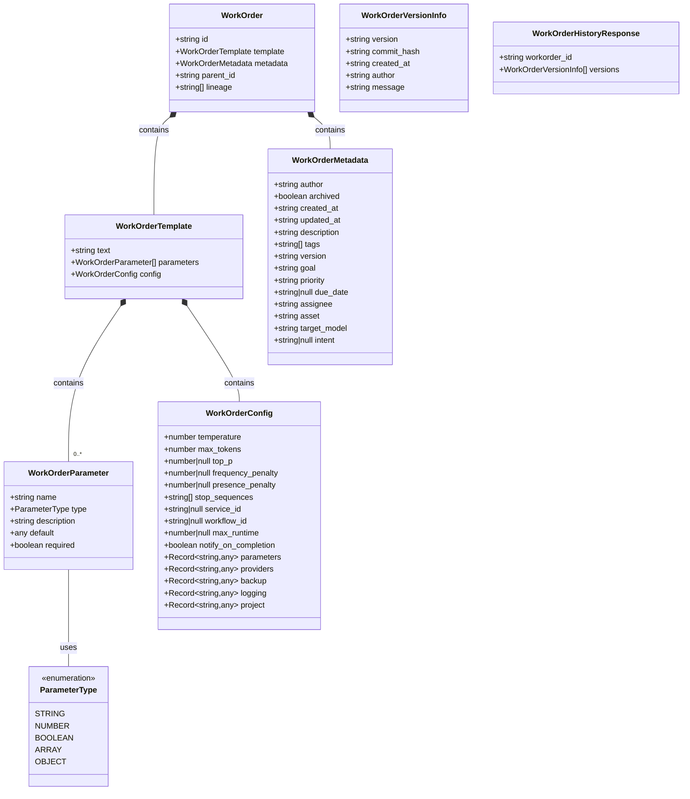

## Job Domain Model

Here's a comprehensive class diagram for the Job domain model:

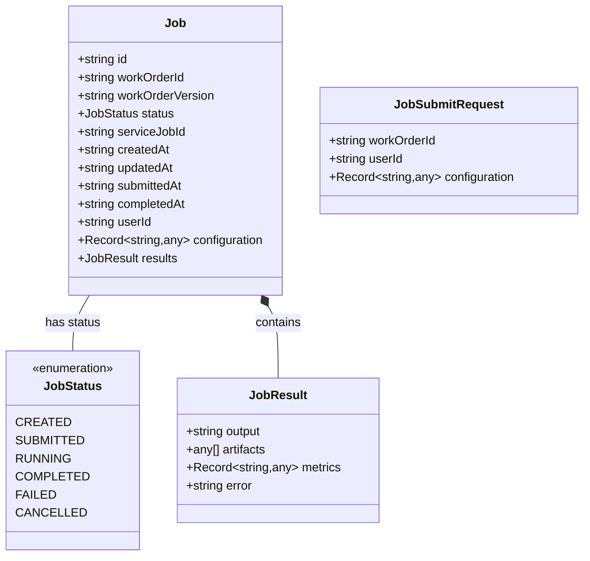

## Entity Relationships

Here's a diagram showing the relationships between WorkOrders and Jobs:

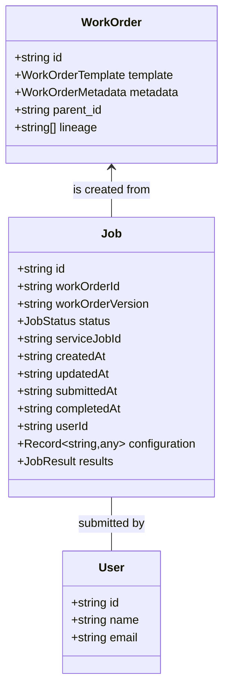

## API and State Interfaces

Here are the key interfaces related to WorkOrder and Job operations:

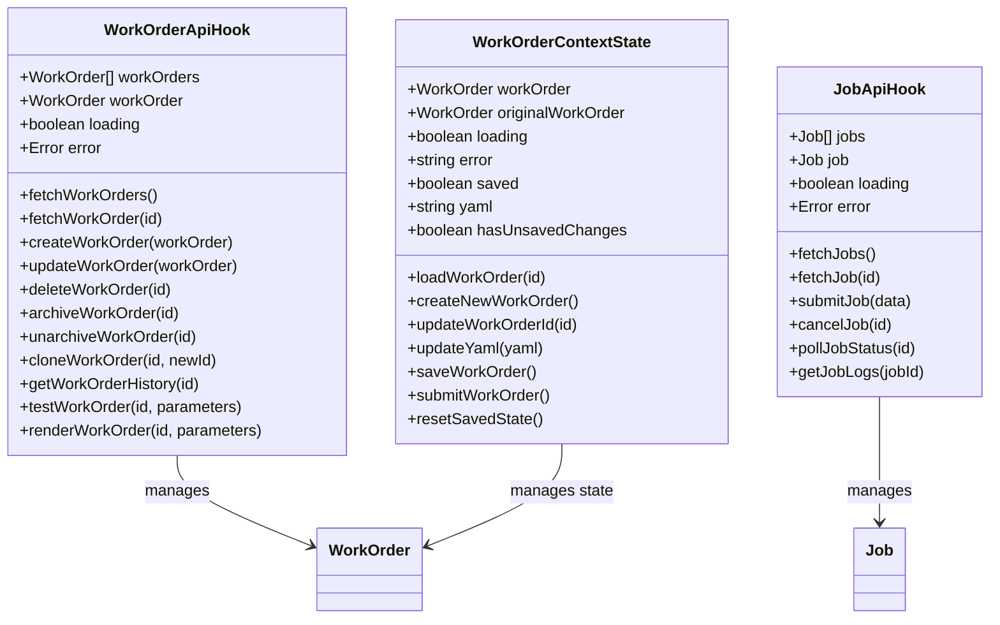

## API Endpoints and Data Flow

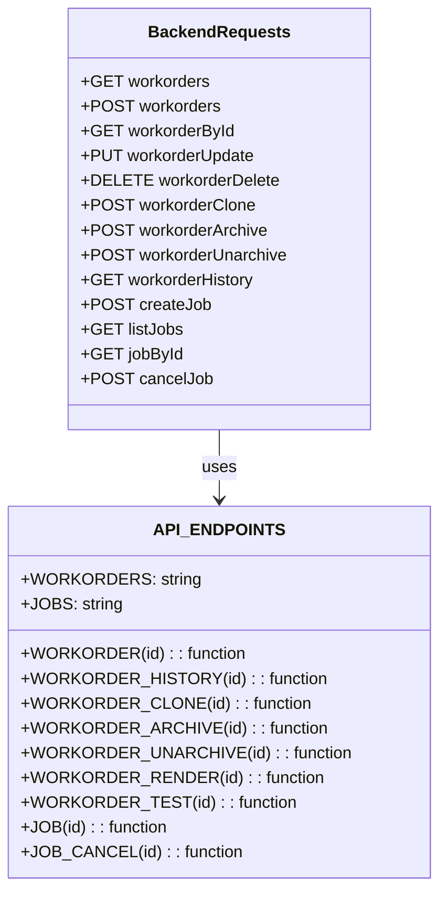

For more clarity, here's a table representation of the API endpoints:

| API Endpoint | HTTP Method | Path |
|--------------|-------------|------|
| List WorkOrders | GET | `/api/v1/workorders` |
| Create WorkOrder | POST | `/api/v1/workorders` |
| Get WorkOrder | GET | `/api/v1/workorders/{id}` |
| Update WorkOrder | PUT | `/api/v1/workorders/{id}` |
| Delete WorkOrder | DELETE | `/api/v1/workorders/{id}` |
| Clone WorkOrder | POST | `/api/v1/workorders/{id}/clone` |
| Archive WorkOrder | POST | `/api/v1/workorders/{id}/archive` |
| Unarchive WorkOrder | POST | `/api/v1/workorders/{id}/unarchive` |
| Get WorkOrder History | GET | `/api/v1/workorders/{id}/history` |
| Test WorkOrder | POST | `/api/v1/workorders/{id}/test` |
| Render WorkOrder | POST | `/api/v1/workorders/{id}/render` |
| List Jobs | GET | `/api/v1/jobs` |
| Create Job | POST | `/api/v1/jobs` |
| Get Job | GET | `/api/v1/jobs/{id}` |
| Cancel Job | POST | `/api/v1/jobs/{id}/cancel` |

These endpoints form the API interface that the frontend uses to communicate with the backend for managing WorkOrders and Jobs in the C4H Editor system.

## Config Design Hierarchical Structure

Based on the design principles, here's how the configuration hierarchy should be structured:

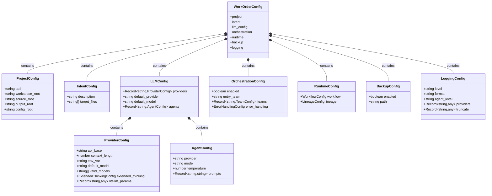

These diagrams provide a comprehensive view of the data models in the C4H Editor system. Let me know if you'd like me to focus on any particular aspect in more detail.

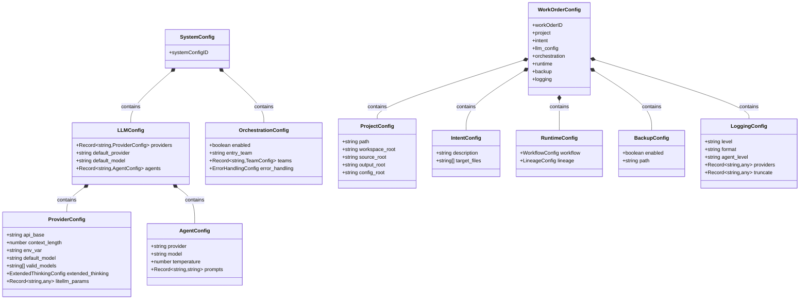

I'll create detailed UML sequence and state diagrams to illustrate the complete workflow from listing work orders to job status monitoring in the C4H Editor system.

## Sequence Diagram: Complete WorkOrder and Job Workflow

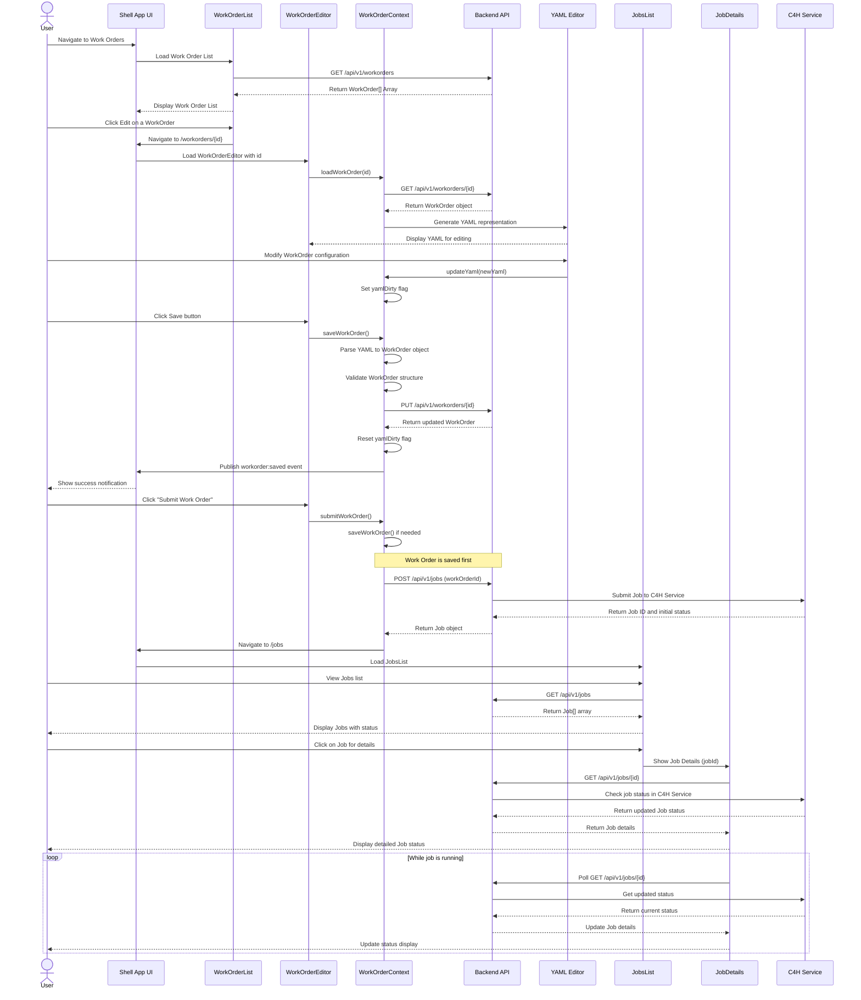

## State Diagram: WorkOrder Lifecycle

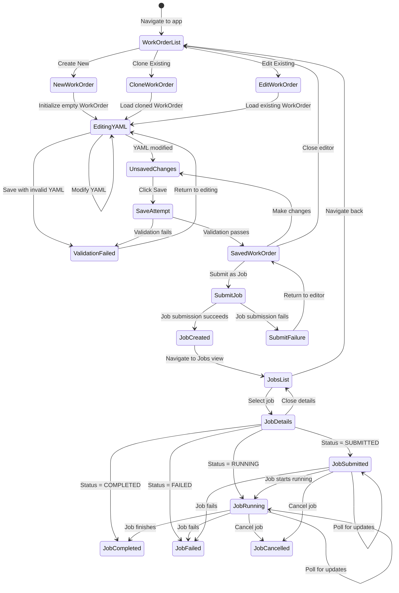

## State Diagram: Job Lifecycle

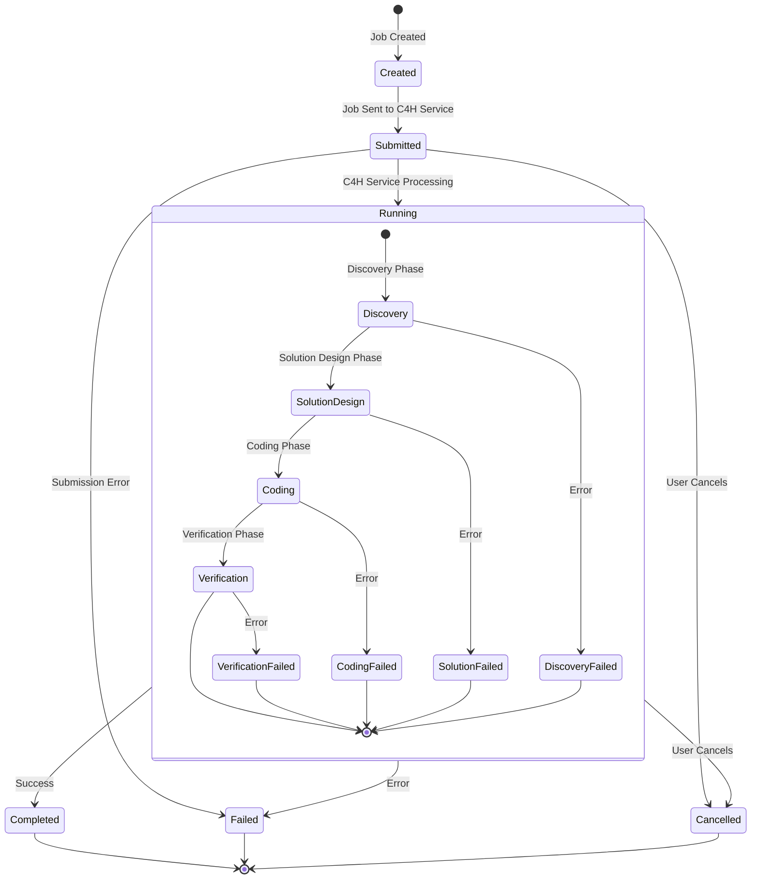

## Data Flow State Diagram: WorkOrder Editing

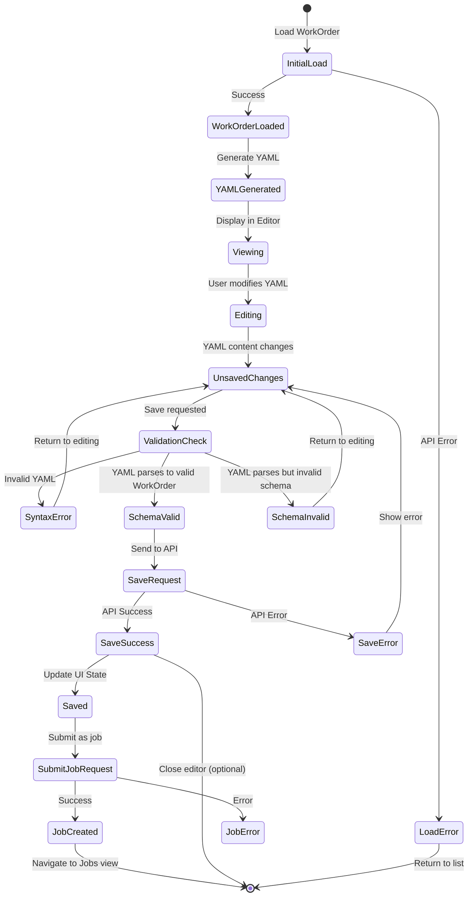

These diagrams provide a comprehensive view of the workflow and states involved in the C4H Editor system from listing work orders to monitoring job execution. The sequence diagram shows the interactions between components, while the state diagrams illustrate the various states and transitions that occur during the WorkOrder editing and Job execution processes.

The diagrams capture the complete lifecycle including:
1. Loading the list of work orders
2. Editing a work order in the YAML editor
3. Saving changes back to the server
4. Submitting a work order as a job
5. Monitoring job status through various phases

## Data Flow State Diagram: Coniguration Life cycle
The life cycle of a configuration from the editor through to the C4H services

The C4h service configuration can be broken down into three major sections

1. Work order - This carries the main Intent of a work order describing what it wants done, it may include details on how
2. System Config
3. Run Time Config

Finally there is a single container called the Job, that captures all these details

Sunnyday path through the service.

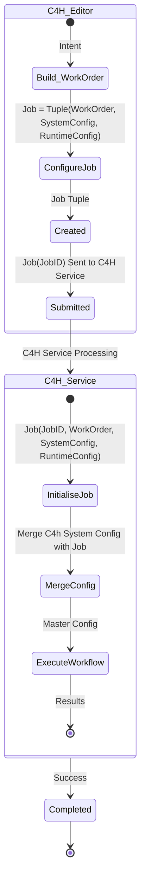

This diagram illustrates the flow from the editor side to the service side and the important configuration merging process. It shows how:

In the C4H Editor:

The process starts with an intent
A WorkOrder is built based on that intent
A job is configured as a tuple of (WorkOrder, SystemConfig, RuntimeConfig)
The job is created and then submitted to the C4H Service

In the C4H Service:

The job is initialized with its ID, WorkOrder, SystemConfig, and RuntimeConfig
The C4H system config is merged with the job config to create a master config
The workflow is executed based on this master config
Results are produced

Upon successful completion, the job is marked as completed

This accurately represents the configuration hierarchy and merging behavior described in the design principles document, where the system configuration provides the foundation, and the job-specific configurations provide overrides that are merged according to specific rules.

Based on the Configuration Lifecycle diagram and description, I'll create a comprehensive target domain model for the C4H editor that properly represents the distinct components and their relationships.

Based on your requirements, I'll focus solely on the client-side domain model for the C4H Editor, which is responsible for creating the three configurations that make up a Job. Let me create a clean, focused domain model for just the client side.

# C4H Editor Client-Side Domain Model

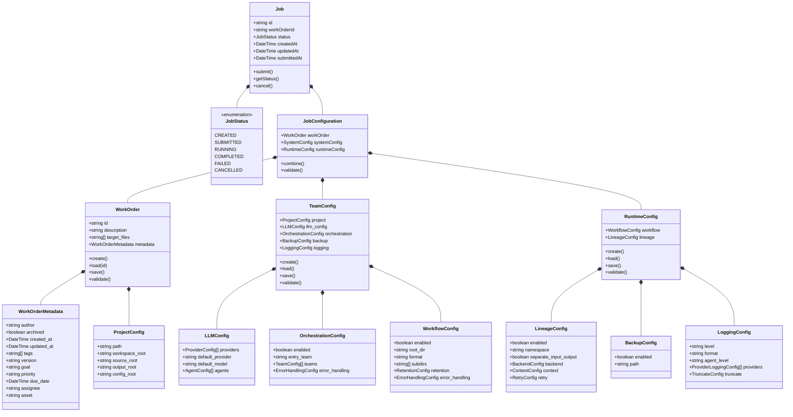

## Client-Side Domain Model Explanation

### Core Components

1. **WorkOrder**
   - Contains the intent description and details about what needs to be done
   - Has metadata about the work (author, version, priority, etc.)
   - Focused on capturing the "what" of the refactoring task

2. **TeamConfig was System Config**
   - Controls the infrastructure and capabilities of the agent system
   - Includes project settings, LLM configuration, orchestration settings, backup, and logging
   - Defines "how" the system operates at a strategic level

3. **RuntimeConfig**
   - Manages execution behavior and artifact storage
   - Includes workflow and lineage configuration
   - Controls "how" the system operates at a tactical level

4. **Job**
   - Serves as the container for submitting work to the C4H Service
   - Bundles WorkOrder, SystemConfig, and RuntimeConfig together
   - Tracks status of submitted work

5. **JobConfiguration**
   - Helper class that combines the three config components
   - Validates that the combined configuration is valid
   - Prepares the payload for job submission

### Responsibilities of the C4H Editor

The C4H Editor is responsible for:

1. **Creating and Editing Configurations**
   - Providing UI for editing WorkOrder (intent, target files)
   - Offering structured editors for SystemConfig settings
   - Managing RuntimeConfig options

2. **Configuration Management**
   - Loading/saving configurations
   - Version tracking
   - Validating each configuration type

3. **Job Management**
   - Submitting jobs to the C4H Service
   - Monitoring job status
   - Displaying results

4. **Configuration Serialization**
   - Converting between object model and YAML representation
   - Handling imports/exports of configurations

This domain model focuses purely on the client-side responsibilities, excluding the C4H Service implementation details. The editor's primary job is to create, manage, and combine the three configuration types (WorkOrder, SystemConfig, RuntimeConfig) into a complete Job that can be submitted to the C4H Service.