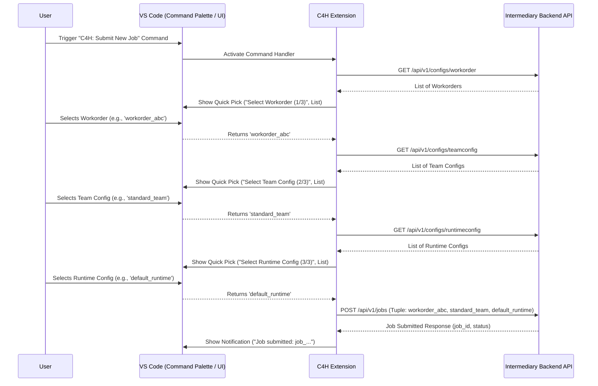

```mermaid
sequenceDiagram
    participant User
    participant VSCodeUI as VS Code (Command Palette / UI)
    participant Extension as C4H Extension
    participant BackendAPI as Intermediary Backend API

    User->>VSCodeUI: Trigger "C4H: Submit New Job" Command
    VSCodeUI->>Extension: Activate Command Handler
    Extension->>BackendAPI: GET /api/v1/configs/workorder
    BackendAPI-->>Extension: List of Workorders
    Extension->>VSCodeUI: Show Quick Pick ("Select Workorder (1/3)", List)
    User->>VSCodeUI: Selects Workorder (e.g., 'workorder_abc')
    VSCodeUI-->>Extension: Returns 'workorder_abc'

    Extension->>BackendAPI: GET /api/v1/configs/teamconfig
    BackendAPI-->>Extension: List of Team Configs
    Extension->>VSCodeUI: Show Quick Pick ("Select Team Config (2/3)", List)
    User->>VSCodeUI: Selects Team Config (e.g., 'standard_team')
    VSCodeUI-->>Extension: Returns 'standard_team'

    Extension->>BackendAPI: GET /api/v1/configs/runtimeconfig
    BackendAPI-->>Extension: List of Runtime Configs
    Extension->>VSCodeUI: Show Quick Pick ("Select Runtime Config (3/3)", List)
    User->>VSCodeUI: Selects Runtime Config (e.g., 'default_runtime')
    VSCodeUI-->>Extension: Returns 'default_runtime'

    Extension->>BackendAPI: POST /api/v1/jobs (Tuple: workorder_abc, standard_team, default_runtime)
    BackendAPI-->>Extension: Job Submitted Response (job_id, status)
    Extension->>VSCodeUI: Show Notification ("Job submitted: job_...")
```