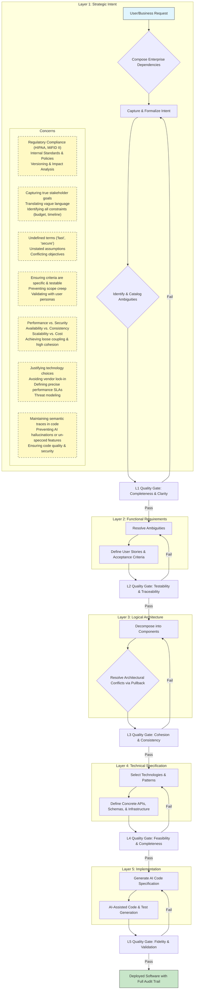

```mermaid
graph TD
    subgraph "Layer 1: Strategic Intent"
        direction LR
        A[User/Business Request] --> B{Compose Enterprise Dependencies};
        subgraph "Concerns"
            B_Concern["Regulatory Compliance (HIPAA, MiFID II)<br/>Internal Standards & Policies<br/>Versioning & Impact Analysis"]
        end
        B --> C[Capture & Formalize Intent];
        subgraph "Concerns"
            C_Concern["Capturing true stakeholder goals<br/>Translating vague language<br/>Identifying all constraints (budget, timeline)"]
        end
        C --> D{Identify & Catalog Ambiguities};
        subgraph "Concerns"
            D_Concern["Undefined terms ('fast', 'secure')<br/>Unstated assumptions<br/>Conflicting objectives"]
        end
    end

    D --> Q1[L1 Quality Gate: Completeness & Clarity];
    Q1 -- Pass --> E;
    Q1 -- Fail --> C;

    subgraph "Layer 2: Functional Requirements"
        direction LR
        E[Resolve Ambiguities] --> F[Define User Stories & Acceptance Criteria];
        subgraph "Concerns"
            F_Concern["Ensuring criteria are specific & testable<br/>Preventing scope creep<br/>Validating with user personas"]
        end
    end

    F --> Q2[L2 Quality Gate: Testability & Traceability];
    Q2 -- Pass --> G;
    Q2 -- Fail --> E;

    subgraph "Layer 3: Logical Architecture"
        direction LR
        G[Decompose into Components] --> H{Resolve Architectural Conflicts via Pullback};
        subgraph "Concerns"
            H_Concern["Performance vs. Security<br/>Availability vs. Consistency<br/>Scalability vs. Cost<br/>Achieving loose coupling & high cohesion"]
        end
    end

    H --> Q3[L3 Quality Gate: Cohesion & Consistency];
    Q3 -- Pass --> I;
    Q3 -- Fail --> G;

    subgraph "Layer 4: Technical Specification"
        direction LR
        I[Select Technologies & Patterns] --> J[Define Concrete APIs, Schemas, & Infrastructure];
        subgraph "Concerns"
            J_Concern["Justifying technology choices<br/>Avoiding vendor lock-in<br/>Defining precise performance SLAs<br/>Threat modeling"]
        end
    end

    J --> Q4[L4 Quality Gate: Feasibility & Completeness];
    Q4 -- Pass --> K;
    Q4 -- Fail --> I;

    subgraph "Layer 5: Implementation"
        direction LR
        K[Generate AI Code Specification] --> L[AI-Assisted Code & Test Generation];
        subgraph "Concerns"
            L_Concern["Maintaining semantic traces in code<br/>Preventing AI hallucinations or un-specced features<br/>Ensuring code quality & security"]
        end
    end

    L --> Q5[L5 Quality Gate: Fidelity & Validation];
    Q5 -- Pass --> M[Deployed Software with Full Audit Trail];
    Q5 -- Fail --> K;

    style A fill:#e1f5fe,stroke:#333
    style M fill:#c8e6c9,stroke:#333
    style B_Concern fill:#fff9c4,stroke:#333,stroke-dasharray: 5 5
    style C_Concern fill:#fff9c4,stroke:#333,stroke-dasharray: 5 5
    style D_Concern fill:#fff9c4,stroke:#333,stroke-dasharray: 5 5
    style F_Concern fill:#fff9c4,stroke:#333,stroke-dasharray: 5 5
    style H_Concern fill:#fff9c4,stroke:#333,stroke-dasharray: 5 5
    style J_Concern fill:#fff9c4,stroke:#333,stroke-dasharray: 5 5
    style L_Concern fill:#fff9c4,stroke:#333,stroke-dasharray: 5 5

```
