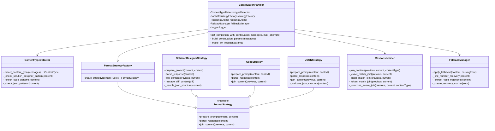
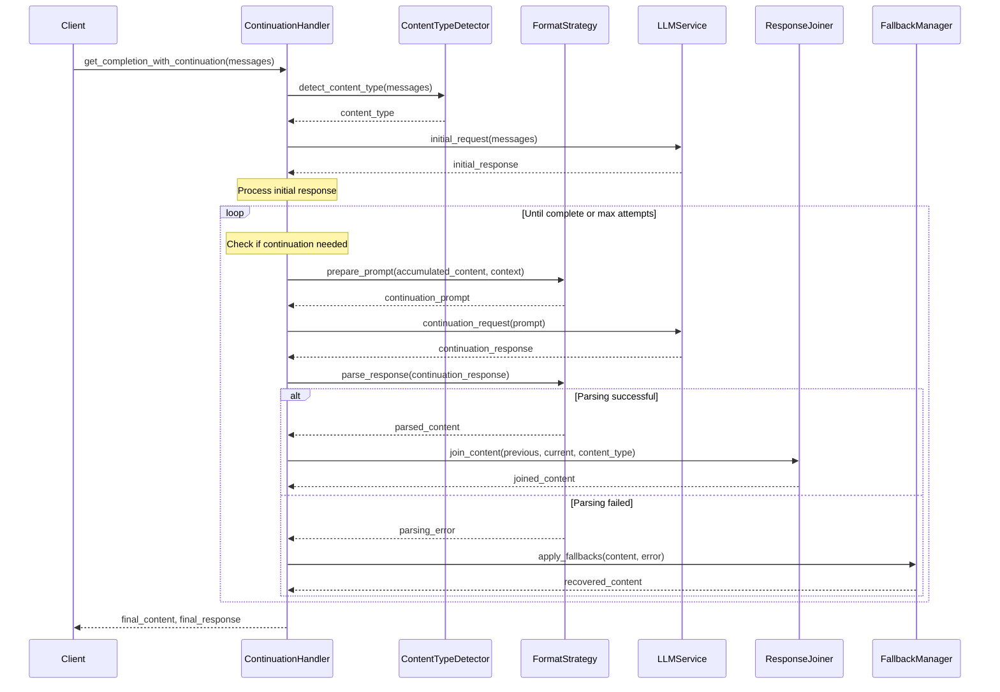
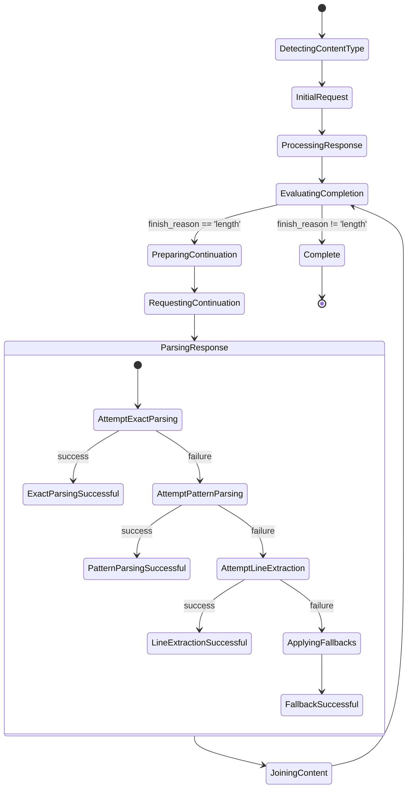

# LLM Continuation Handler Design

## 1. Problem Statement

The current LLM continuation system fails to handle complex structured content consistently, particularly when:
- Content format switches between JSON and raw text mid-response
- Diff content requires special escaping for JSON embedding
- Line numbering is inconsistent across continuations
- The LLM loses structural context in complex JSON (solution_designer format)
- Fallback mechanisms don't preserve document integrity

## 2. Proposed Solution

A multi-strategy continuation handler with content-type awareness, specialized formatters, and robust fallback mechanisms.

### Key Design Features:
- **Content-Type Specialization**: Different handling for each content type
- **Multi-level Parsing**: Cascading strategies from exact to fuzzy matching
- **Format Correction**: Proactive escaping and correction for problematic content
- **Structural Prompting**: Content-type specific prompts that reinforce format
- **Graceful Recovery**: Tiered fallbacks that maintain document integrity

## 3. System Architecture

### Class Diagram



### Sequence Diagram



### State Diagram



## 4. Core Algorithms

### Content Type Detection Algorithm

```
FUNCTION detect_content_type(messages):
    content = extract_user_content(messages)
    
    IF contains_solution_designer_patterns(content) THEN
        RETURN "solution_designer"
    ELSE IF contains_code_patterns(content) AND contains_json_patterns(content) THEN
        RETURN "json_code"
    ELSE IF contains_code_patterns(content) THEN
        RETURN "code"
    ELSE IF contains_json_patterns(content) THEN
        RETURN "json"
    ELSE IF contains_diff_patterns(content) THEN
        RETURN "diff"
    ELSE
        RETURN "text"
    END IF
END FUNCTION
```

### Multi-strategy Parsing Algorithm

```
FUNCTION parse_response(content, content_type, expected_line):
    # Try exact JSON parsing first
    TRY
        parsed_data = parse_json(content)
        numbered_lines = extract_numbered_lines(parsed_data)
        IF numbered_lines THEN
            RETURN numbered_lines
        END IF
    CATCH JsonParseError:
        # Continue to next strategy
    END TRY
    
    # Try extracting JSON sections with regex
    IF content_contains_json_line_pattern(content) THEN
        json_sections = extract_json_sections(content)
        TRY
            FOR each section IN json_sections:
                parsed = parse_json(section)
                numbered_lines = extract_numbered_lines(parsed)
                IF numbered_lines THEN
                    RETURN numbered_lines
                END IF
            END FOR
        CATCH JsonParseError:
            # Continue to next strategy
        END TRY
    END IF
    
    # Try content-specific parsing based on content_type
    IF content_type == "solution_designer" THEN
        RETURN parse_solution_designer(content, expected_line)
    ELSE IF content_type == "diff" THEN
        RETURN parse_diff_content(content, expected_line)
    END IF
    
    # Last resort: line-by-line parsing
    RETURN parse_raw_lines(content, expected_line)
END FUNCTION
```

### Response Joining Algorithm

```
FUNCTION join_content(previous, current, content_type):
    # Try exact overlap detection
    IF current starts with exact_overlap_from_end(previous) THEN
        RETURN previous + current[length_of_overlap:]
    END IF
    
    # Try hash-based overlap detection
    overlap_hash = hash_of_end(previous, 300)
    FOR i = 0 TO min(500, length(current)):
        window = current[i:i+300]
        IF hash(window) == overlap_hash THEN
            RETURN previous + current[i+300:]
        END IF
    END FOR
    
    # Try token-level matching
    best_match = find_token_level_match(previous, current)
    IF best_match.confidence > 0.7 THEN
        RETURN previous + current[best_match.position:]
    END IF
    
    # Content-specific joining
    IF content_type == "solution_designer" THEN
        RETURN join_solution_designer(previous, current)
    ELSE IF content_type == "json" THEN
        RETURN join_json(previous, current)
    END IF
    
    # Last resort: basic concatenation with structural awareness
    RETURN structural_join(previous, current, content_type)
END FUNCTION
```

## 5. Implementation Details

### Enhanced Prompt Engineering

For solution_designer content:

```
CRITICAL: When continuing solution_designer content containing diffs:
1. NEVER output raw diff content directly (+/- prefixed lines)
2. ALWAYS wrap ALL content in the JSON lines format with line numbers
3. Each line of diff content must be inside a {"line": X, "indent": Y, "content": "..."} structure
4. Maintain proper escaping of special characters in the content field
5. IMPORTANT: Do not break JSON structure - remember you are inside a "diff" field of a changes array
```

### Diff Content Handling

Special handling for diff content:
1. Double-escape backslashes (`\` → `\\`)
2. Escape quotes (`"` → `\"`)  
3. Normalize newlines (`\n` → `\\n`)
4. Preserve indentation in the "indent" field

### Line Number Recovery

When line numbers are inconsistent:
1. Detect the actual start line in the continuation
2. Calculate offset between expected and actual 
3. Adjust all line numbers by the offset
4. Merge with correct sequence

### Smart Fallback Strategy

Progressive fallbacks:
1. Try exact JSON parsing
2. Try JSON pattern extraction
3. Try line-by-line extraction
4. Add error marker and continue
5. Preserve as much structure as possible

## 6. Testing Strategy

1. **Unit Tests**:
   - Content type detection across all formats
   - Parsing strategies for each format
   - Join algorithms with various overlaps
   - Fallback mechanisms with malformed input

2. **Integration Tests**:
   - End-to-end continuation with clean responses
   - Recovery from malformed responses
   - Content type transitions
   - Mixed format handling

3. **Golden Path Tests**:
   - Solution designer workflows
   - Complex JSON with nested structures
   - Code with proper indentation
   - Diffs with proper escaping