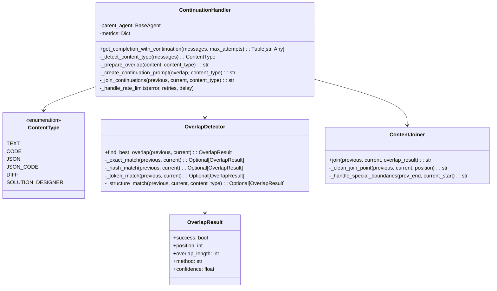

# Sliding Window Continuation Handler Design

## 1. System Overview

A robust continuation handler using overlap detection to seamlessly join LLM responses without requiring rigid formatting rules.

### Core Principles
- Content-type awareness with specialized strategies
- Multi-level overlap detection (exact, fuzzy, structural)
- Graceful fallbacks with recovery mechanisms
- Preservation of structural integrity

## 2. Architecture



## 3. Core Algorithms

### 3.1 Overlap Detection Algorithm

```
FUNCTION find_best_overlap(previous, current):
    # Try multiple strategies in order of reliability
    
    # 1. Try exact match with decreasing window sizes
    FOR window_size IN range(min(300, len(previous)), 20, -20):
        overlap_text = last N characters of previous
        position = find overlap_text in current
        IF found THEN
            RETURN OverlapResult(success=true, position=position, method="exact")
        END IF
    END FOR
    
    # 2. Try fuzzy matching with hash-based approach
    FOR window_size IN range(min(200, len(previous)), 30, -10):
        prev_chunks = get_chunks(previous, window_size)
        FOR chunk IN prev_chunks:
            chunk_hash = hash(normalize(chunk))
            FOR position IN range(min(200, len(current))):
                current_chunk = current[position:position+window_size]
                IF hash(normalize(current_chunk)) == chunk_hash THEN
                    RETURN OverlapResult(success=true, position=position+window_size, method="hash")
                END IF
            END FOR
        END FOR
    END FOR
    
    # 3. Try token-level matching
    tokens_previous = tokenize(last 500 chars of previous)
    tokens_current = tokenize(first 500 chars of current)
    best_match = find_longest_common_subsequence(tokens_previous, tokens_current)
    IF best_match.length > 5 THEN
        RETURN OverlapResult(success=true, position=best_match.end_position, method="token")
    END IF
    
    # 4. Content-specific structural matching
    IF content_type == SOLUTION_DESIGNER OR content_type == JSON THEN
        position = find_structure_boundary(current)
        IF position > 0 THEN
            RETURN OverlapResult(success=true, position=position, method="structure")
        END IF
    END IF
    
    # No good overlap found
    RETURN OverlapResult(success=false, method="none")
END FUNCTION
```

### 3.2 Continuation Prompting Strategy

```
FUNCTION create_continuation_prompt(overlap_text, content_type):
    base_prompt = "Continue exactly from where you left off. Start by repeating these exact lines:\n\n"
    base_prompt += "---BEGIN_OVERLAP---\n"
    base_prompt += overlap_text
    base_prompt += "\n---END_OVERLAP---\n\n"
    
    # Add content-specific instructions
    IF content_type == SOLUTION_DESIGNER THEN
        base_prompt += "You are continuing a solution designer JSON response with file changes.\n"
        base_prompt += "Remember to properly escape quotes and newlines in diff content.\n"
        base_prompt += "Maintain proper JSON structure and nesting throughout your continuation.\n"
    ELSE IF content_type == JSON OR content_type == JSON_CODE THEN
        base_prompt += "You are continuing a JSON structure. Maintain proper nesting and escaping.\n"
        base_prompt += "Ensure all brackets and braces are properly balanced.\n"
    ELSE IF content_type == CODE THEN
        base_prompt += "You are continuing code. Maintain consistent indentation and structure.\n"
    ELSE IF content_type == DIFF THEN
        base_prompt += "You are continuing a diff. Preserve the exact format with +/- line prefixes.\n"
    END IF
    
    base_prompt += "After repeating these exact lines, continue where you left off.\n"
    base_prompt += "Do not add any explanatory text, comments, or markers.\n"
    
    RETURN base_prompt
END FUNCTION
```

### 3.3 Continuation Joining Algorithm

```
FUNCTION join_continuations(previous, current, overlap_result):
    # If no overlap found, use simple concatenation with safeguards
    IF NOT overlap_result.success THEN
        return structural_safe_join(previous, current, content_type)
    END IF
    
    # Use the detected overlap to join the content
    position = overlap_result.position
    overlap_method = overlap_result.method
    
    # Join based on the overlap method
    IF overlap_method == "exact" THEN
        # Clean join by removing the exact overlapping text
        return previous + current[position:]
    ELSE IF overlap_method == "hash" OR overlap_method == "token" THEN
        # Fuzzy join that might include some repeated content
        # Add a small buffer to avoid cutting off content
        return previous + current[position:]
    ELSE IF overlap_method == "structure" THEN
        # Join at a natural structure boundary
        return content_aware_join(previous, current, position, content_type)
    END IF
    
    # Fallback to safe join
    return structural_safe_join(previous, current, content_type)
END FUNCTION
```

## 4. Implementation Details

### 4.1 Content Type Detection

```python
def _detect_content_type(self, messages: List[Dict[str, str]]) -> ContentType:
    """Detect content type for specialized handling."""
    content = ""
    for msg in messages:
        if msg.get("role") == "user":
            content = msg.get("content", "")
            break
            
    # Solution designer detection
    if ('"changes":' in content and 
        '"file_path":' in content and 
        '"diff":' in content):
        return ContentType.SOLUTION_DESIGNER
        
    # Code detection
    is_code = ("```" in content or 
              "def " in content or 
              "class " in content)
              
    # JSON detection
    is_json = (content.strip().startswith("{") or
              content.strip().startswith("[") or
              "json" in content.lower())
              
    # Diff detection
    is_diff = "--- " in content and "+++ " in content
    
    # Determine type with prioritization
    if is_code and is_json:
        return ContentType.JSON_CODE
    elif is_json:
        return ContentType.JSON
    elif is_code:
        return ContentType.CODE
    elif is_diff:
        return ContentType.DIFF
        
    return ContentType.TEXT
```

### 4.2 Overlap Preparation

```python
def _prepare_overlap(self, content: str, content_type: ContentType) -> str:
    """Prepare appropriate overlap text based on content type."""
    # Determine appropriate overlap size
    if content_type == ContentType.SOLUTION_DESIGNER:
        # Solution designer needs structural context
        overlap_size = min(max(10, min(len(content) // 4, 30)), len(content))
    elif content_type in [ContentType.JSON, ContentType.JSON_CODE]:
        # JSON needs enough context to maintain structure
        overlap_size = min(max(8, min(len(content) // 3, 25)), len(content))
    elif content_type == ContentType.CODE:
        # Code needs indentation context
        overlap_size = min(max(5, min(len(content) // 4, 20)), len(content))
    else:
        # Default for text
        overlap_size = min(max(3, min(len(content) // 5, 15)), len(content))
    
    # Get overlap lines
    lines = content.splitlines()
    if not lines:
        return content[-min(300, len(content)):]
        
    # Take appropriate number of lines, focusing on boundaries
    overlap_lines = lines[-min(overlap_size, len(lines)):]
    
    # For structured content, ensure we're not breaking in the middle of a structure
    if content_type in [ContentType.JSON, ContentType.JSON_CODE, ContentType.SOLUTION_DESIGNER]:
        # Additional structural checks
        overlap_text = "\n".join(overlap_lines)
        # Ensure balanced brackets and structure
        if self._is_structure_incomplete(overlap_text):
            # Add more lines to try to complete the structure
            additional_lines = min(5, len(lines) - len(overlap_lines))
            if additional_lines > 0:
                overlap_lines = lines[-(len(overlap_lines) + additional_lines):]
    
    return "\n".join(overlap_lines)
```

### 4.3 Specialized Handling for Solution Designer

```python
def _create_solution_designer_continuation(self, previous: str) -> str:
    """Create specialized prompt for solution designer content."""
    # Extract overlap
    overlap_text = self._prepare_overlap(previous, ContentType.SOLUTION_DESIGNER)
    
    prompt = f"""
Continue the solution designer JSON exactly from where you left off.

Start by repeating these exact lines:

---BEGIN_OVERLAP---
{overlap_text}
---END_OVERLAP---

CRITICAL REQUIREMENTS:
1. Maintain proper JSON structure throughout
2. Properly escape quotes (\") and newlines (\\n) in diff content
3. Remember you are inside a larger JSON structure with changes array
4. Pay close attention to properly balanced braces and brackets
5. Do not modify or repeat any content before the overlap section
6. Do not add explanatory text, comments, or markers

After repeating the overlap section exactly, continue with the next part of the JSON.
"""
    return prompt
```

## 5. Error Handling and Fallbacks

```python
def _handle_continuation_failure(self, previous: str, current: str, content_type: ContentType) -> str:
    """Handle continuation failures with multiple fallback strategies."""
    # First try to find any valid overlap
    overlap_result = self._find_any_overlap(previous, current)
    if overlap_result.success:
        return self._join_continuations(previous, current, overlap_result)
    
    # Content-specific fallbacks
    if content_type == ContentType.SOLUTION_DESIGNER:
        # Try to find JSON structure boundaries
        return self._find_solution_designer_boundary(previous, current)
    elif content_type in [ContentType.JSON, ContentType.JSON_CODE]:
        # Try to find valid JSON boundaries
        return self._find_json_boundary(previous, current)
    
    # Last resort: structured safe join
    return self._safe_structural_join(previous, current, content_type)
```

## 6. Testing Strategy

### 6.1 Unit Tests

- Test overlap detection with various content types
- Test joining algorithms with different overlap patterns
- Test content type detection with mixed content
- Test fallback mechanisms with problematic inputs

### 6.2 Integration Tests

- End-to-end tests with real LLM responses
- Verify handling of solution designer content with diffs
- Test rate limit handling and recovery
- Test multi-continuation scenarios

### 6.3 Performance Tests

- Benchmark token usage efficiency
- Test response time for different content types
- Measure success rate across different models