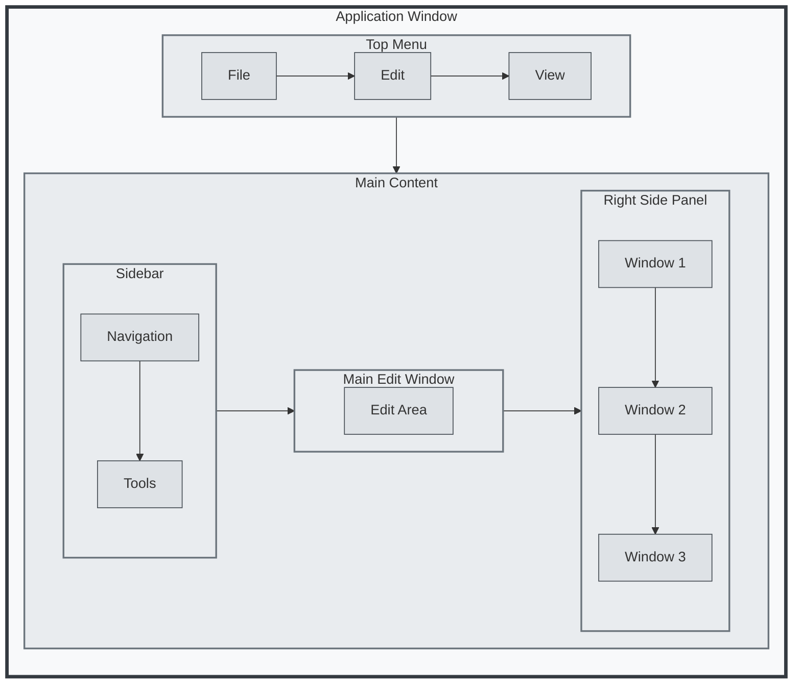

# Mermaid Flowchart Layout Controls Reference

This document outlines all layout controls available in Mermaid's **Flowchart** diagram type (`graph` or `flowchart`) as of March 13, 2025. These controls help you shape diagrams, such as layered architectures or UI layouts, using direction, subgraphs, connections, and styling.

## 1. Graph Direction
Defines the primary flow of nodes and edges. Set immediately after `graph`.

- **Options**:
  - `TB` (Top to Bottom)
  - `BT` (Bottom to Top)
  - `LR` (Left to Right)
  - `RL` (Right to Left)
  - `TD` (Top Down, same as `TB`)

- **Examples**:
  - **TB**:
    ```mermaid
    graph TB
        A[Start] --> B[Process]
        B --> C[End]
    ```
    *Result*: Vertical stack, downward flow.

  - **LR**:
    ```mermaid
    graph LR
        A[Start] --> B[Process]
        B --> C[End]
    ```
    *Result*: Horizontal flow, rightward.

  - **BT**:
    ```mermaid
    graph BT
        A[Start] --> B[Process]
        B --> C[End]
    ```
    *Result*: Vertical stack, upward flow.

  - **RL**:
    ```mermaid
    graph RL
        A[Start] --> B[Process]
        B --> C[End]
    ```
    *Result*: Horizontal flow, leftward.

## 2. Subgraphs
Groups nodes into clusters for logical separation or layered layouts.

- **Syntax**: `subgraph ID["Label"] ... end`
- **Control**: Inherits parent direction unless overridden with `direction`.

- **Examples**:
  - **Basic Subgraph**:
    ```mermaid
    graph TB
        subgraph Layer1["Layer 1"]
            A --> B
        end
        subgraph Layer2["Layer 2"]
            C --> D
        end
        Layer1 --> Layer2
    ```
    *Result*: Two vertical stacks connected top-to-bottom.

  - **Override Direction**:
    ```mermaid
    graph TB
        subgraph Layer1["Layer 1"]
            direction LR
            A --> B
        end
        subgraph Layer2["Layer 2"]
            C --> D
        end
        Layer1 --> Layer2
    ```
    *Result*: Layer 1 is left-to-right, Layer 2 is top-to-bottom.

## 3. Node Placement (Implicit via Connections)
Positioning is automatic, influenced by connection structure.

- **Controls**:
  - Sequential: Chain nodes (`A --> B --> C`).
  - Parallel: Multiple arrows from one node (`A --> B; A --> C`).
  - Longer Paths: Add intermediate nodes (`A --> X --> B`).

- **Examples**:
  - **Sequential**:
    ```mermaid
    graph TB
        A --> B --> C --> D
    ```
    *Result*: Single vertical column.

  - **Parallel**:
    ```mermaid
    graph TB
        A --> B
        A --> C
        B --> D
        C --> D
    ```
    *Result*: Branches from A, converges at D.

  - **Longer Path**:
    ```mermaid
    graph TB
        A --> X --> Y --> B
        A --> C
        C --> B
    ```
    *Result*: Extended path via X and Y spreads layout.

## 4. Edge Types and Length
Edges affect spacing and visual flow.

- **Options**:
  - `-->` (Standard arrow)
  - `-->|` (Labeled arrow, e.g., `A -->|step| B`)
  - `---` (No arrowhead)
  - `-.-` (Dotted line)
  - `==>` (Thick arrow)
  - `-..-` (Dotted thick line)

- **Examples**:
  - **Labeled Edge**:
    ```mermaid
    graph TB
        A -->|Process| B
        B -->|Finish| C
    ```
    *Result*: Labels adjust spacing slightly.

  - **Dotted Line**:
    ```mermaid
    graph TB
        A -.- B
        B --> C
    ```
    *Result*: Looser connection from A to B.

  - **Thick Arrow**:
    ```mermaid
    graph TB
        A ==> B
        B --> C
    ```
    *Result*: Emphasized A to B connection.

## 5. Node Shapes
Shapes influence visual size and spacing indirectly.

- **Options**:
  - `[Text]` (Rectangle)
  - `(Text)` (Circle)
  - `((Text))` (Double Circle)
  - `{Text}` (Diamond)
  - `>Text]` (Asymmetric Triangle)
  - `[/Text/]` (Trapezoid)
  - `[\Text\]` (Inverse Trapezoid)
  - `[Text\]` (Lean Right)
  - `[/Text\]` (Lean Left)

- **Examples**:
  - **Mixed Shapes**:
    ```mermaid
    graph TB
        A[Rectangle] --> B(Circle)
        B --> C{Diamond}
    ```
    *Result*: Shapes adjust spacing.

  - **Trapezoid**:
    ```mermaid
    graph TB
        A[/Presentation/] --> B[/Business/]
        B --> C[/Data/]
    ```
    *Result*: Trapezoids stack vertically.

## 6. Styling Directives
Enhances visual separation and perception of layout.

- **Options**:
  - `classDef` (Define style class)
  - `class` (Apply class to nodes/subgraphs)
  - `style` (Inline styling)
  - `%%{init: ...}%%` (Global settings)

- **Examples**:
  - **Class Styling**:
    ```mermaid
    graph TB
        subgraph L1["Layer 1"]
            A --> B
        end
        subgraph L2["Layer 2"]
            C --> D
        end
        L1 --> L2
        classDef layer fill:#d1e7dd,stroke:#0f5132
        class L1,L2 layer
    ```
    *Result*: Green-tinted layers.

  - **Inline Style**:
    ```mermaid
    graph TB
        A --> B
        style A fill:#ffcccc,stroke:#cc0000
    ```
    *Result*: Red A node.

  - **Global Theme**:
    ```mermaid
    %%{init: {"flowchart": {"nodeSpacing": 50, "rankSpacing": 70}}}%%
    graph TB
        A --> B --> C
    ```
    *Result*: Increased spacing.

## 7. Configuration Directives
Fine-tune layout via Dagre engine settings.

- **Options**:
  - `"nodeSpacing"`: Horizontal spacing (default: 40)
  - `"rankSpacing"`: Vertical spacing (default: 50)
  - `"curve"`: Edge style (e.g., `basis`, `linear`, `cardinal`)
  - `"rankDir"`: Direction override (e.g., `TB`, `LR`)

- **Examples**:
  - **Custom Spacing**:
    ```mermaid
    %%{init: {"flowchart": {"nodeSpacing": 20, "rankSpacing": 100}}}%%
    graph TB
        A --> B
        A --> C
        B --> D
        C --> D
    ```
    *Result*: Tight horizontal, tall vertical gaps.

  - **Curve Style**:
    ```mermaid
    %%{init: {"flowchart": {"curve": "basis"}}}%%
    graph TB
        A --> B --> C
    ```
    *Result*: Smooth, curved arrows.

---

# Advanced Example: UI Layout Simulation
This example simulates a UI layout with a **sidebar**, **top menu**, **main edit window**, and **three right-side windows**, using `graph TB` for a stacked, layered feel.



## Explanation of UI Layout Example
#### Structure:
App is the outer window.

TopMenu stacks horizontally (LR) at the top.

MainContent splits into three vertical sections (TB):
Sidebar (left, vertical stack).

Editor (center, main area).

RightPanel (right, three stacked windows).

Direction:
TB for overall stacking.

LR in TopMenu and MainContent for horizontal flow where needed.

#### Styling:
Distinct fills and borders differentiate the app, sections, and components.

Result: A top-down layout with a menu bar, sidebar, main editor, and three right-side windows, mimicking a UI.
